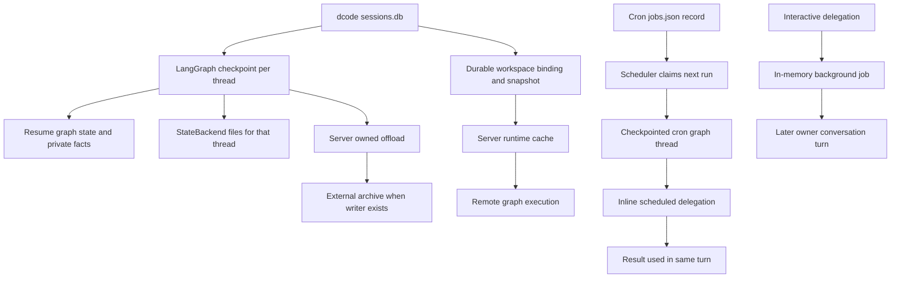
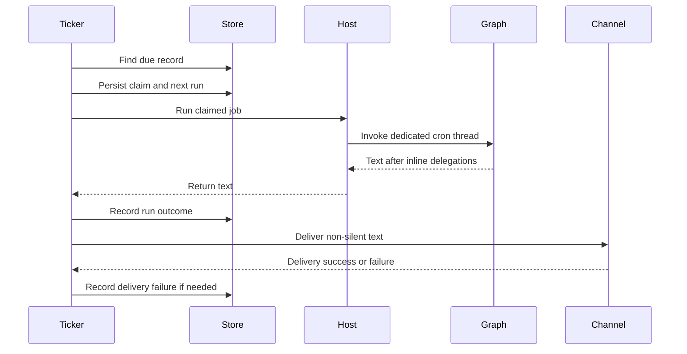

# State Persistence

Persistence is not a single system-wide guarantee. A LangGraph checkpointer versions one graph thread; a Deep Agents backend owns filesystem or memory data; dcode adds durable session and workspace-authority records; and Talon adds archives and cron records. A durable record is not necessarily a transaction spanning those systems, and a runtime cache or an in-memory background job is not restart-safe.

## Persistence boundaries at a glance

*Checkpoints, bindings, sessions, archives, and cron records have different durable owners. Server runtime caches and background delegation records are in memory; scheduled inline delegation ends with its current turn.*

## Checkpoints are not backend persistence

LangGraph checkpoints preserve graph state, message history, interrupts, and resumability for a thread. Deep Agents backend routing separately determines the scope and durability of filesystem and memory data. A checkpointer passed to `create_deep_agent` is forwarded to `create_agent`; a `store` is separately required for a store-backed backend.

`DeepAgentState` extends LangChain's `AgentState` only by replacing `messages` with `DeltaChannel(_messages_delta_reducer, snapshot_frequency=50)`. It is the default state schema when `create_deep_agent` receives no custom schema. The channel writes deltas and periodically writes a full snapshot, reducing persisted message growth over a long thread while requiring readers to tolerate a checkpoint that does not contain the full inline message list. The filesystem middleware applies the same snapshot-frequency pattern to its `files` state.

A custom graph schema should extend `DeepAgentState` so it keeps that reducer; this is a type-level `TypedDict` requirement rather than a runtime `issubclass` check. Prefer middleware-owned private fields for feature-local state, particularly when callers must not see or set those fields.

The default `StateBackend` is explicitly thread-scoped: it reads and writes the `files` channel through LangGraph `CONFIG_KEY_READ` and `CONFIG_KEY_SEND`, therefore is checkpointed with the graph, survives within that conversation when its checkpointer is durable, and cannot be used outside graph execution. It does not share files between threads. Use an external or store-backed route for data that must cross the checkpoint/thread boundary.

## dcode session checkpoints and resume state

For local CLI sessions, `get_checkpointer` opens the hardened global `sessions.db` as an `AsyncSqliteSaver`; startup calls `setup` before it constructs CLI agent graphs. dcode lists threads from checkpoint metadata rather than reading every state blob: thread identity, agent name, timestamps, Git branch, cwd, and latest checkpoint ID are metadata-derived, with prompt and message-count fields loaded only when requested. A covering index lets the metadata list query avoid blob I/O; if creation fails, the list remains correct but may use a slow table scan.

Because `DeltaChannel` checkpoints often omit a full `messages` snapshot, dcode reconstructs a visible count from root-namespace `messages` writes. It replays them in checkpoint, task, and write-index order, applies message reducer semantics, and excludes subgraph writes even when they share the thread ID. The count is display data: decoding or reduction errors are logged and can leave a count absent or inaccurate rather than fail the whole thread listing.

`ResumeState` defines `PrivateStateAttr` checkpoint channels for facts dcode needs when it resumes a specific checkpoint without replaying or re-tokenizing history. Successful model turns graph-write token usage and effective model/cache facts into the same checkpoint as the model response. Accepted goal and rubric choices are client-written through `aupdate_state`, while pending goal proposals and agent-driven status updates are graph-written. Private annotations keep these channels out of public graph input/output schemas; they remain versioned checkpoint state, not thread-level mutable globals.

At command startup, dcode migrates legacy internal state from `~/.deepagents/` into `~/.deepagents/.state/` after parsing arguments. The migration is best-effort and idempotent, does not overwrite destination collisions, and moves the `sessions.db` WAL and shared-memory sidecars with the database.

## Remote workspace binding is durable authority

A remote dcode thread must have a workspace binding in addition to graph checkpoints. The binding is server-authoritative and stored in the server database, not accepted as client-owned graph state. Its public runtime payload contains canonical workspace identity; policy and runtime fingerprints remain server-side. The persisted workspace policy is intentionally non-secret: it does not store model credentials or prompt material.

Current bindings use schema version 4. They separate a durable **policy fingerprint**—workspace identity plus access policy—from a full **runtime fingerprint** that also covers model and other runtime settings. The resource key is based on identity and policy, so a model-only change can rebuild the runtime without rebinding the thread or losing its checkpoint/history. A policy or workspace identity change is refused. The runtime cache is likewise keyed with the full runtime identity, is bounded to 32 workspace runtimes, and is explicitly in-memory: it is not a persistence mechanism.

Binding and its comparison snapshot are created under `BEGIN IMMEDIATE`. The initial bind writes an allowlisted workspace-policy snapshot with `INSERT OR IGNORE`; a later rejected or compatible bind cannot overwrite the snapshot that explains a future refusal. Conflicts carry allowlisted diagnostics when available, while paths, prompts, model parameters, and credentials are not exposed. Current bindings may refresh their runtime fingerprint when policy is unchanged. Legacy rows are migrated only when the recorded evidence can prove compatibility: version-3 rows require exact old full-fingerprint equality, whereas older rows use their recorded session-control checks. Conversation checkpoints live in separate tables and are not rewritten by this binding migration.

Before remote graph execution, `make_graph` requires both a thread ID and workspace context, verifies the context against the durable binding, re-resolves the workspace identity, and obtains a runtime only after that succeeds. Runtime construction re-resolves policy on each request. Project/access-policy drift and a revoked extension-trust grant fail closed; a runtime-only change is logged and rebuilds the cache entry instead of refusing the thread. A process-wide sandbox can also prevent a second workspace from obtaining a runtime.

The `POST /dcode/threads/{thread_id}/workspace` endpoint resolves workspace policy on the server. Client policy claims must match the permitted session claim and cannot claim project workspace policy. Its `validate_only` mode preflights hostability without binding or mirroring a thread. A normal call binds before it builds the runtime and mirrors metadata into the LangGraph thread service, so a runtime conflict can be reported before thread creation, while metadata mirror failure can still return 503 after the binding is durable.

## Server-owned offload and checkpoint commit

`POST /dcode/threads/{thread_id}/offload` is a checkpoint operation, not a client-provided state update. The route serializes an operation per `(thread_id, operation_id)`, requires an idle registered thread with no pending graph work, reads and hydrates the persisted state, and captures the checkpoint ID. It then validates the workspace binding and runs compaction using a server runtime. If a hook interrupts it, the next request re-executes the operation with accumulated responses rather than restoring a suspended server coroutine.

The boundary does not allow the operation to write `messages`: it commits only the `OffloadStateUpdate` channels and settled cost update after confirming that the thread did not advance while compaction ran. Client model endpoint and transport parameters are stripped, and the operation replaces client model selection with the checkpointed model specification and parameters where available. This preserves the trusted model used by the thread rather than allowing the request to redirect credentialed provider traffic.

When no archive writer is supplied, offload commits only checkpoint state. With an archive writer, it first commits the summary reservation, then appends the external archive under its archive-session lock, then performs a follow-up checkpoint update that links the archive path. A failed link with confirmed absence rolls back the append; an unreadable confirmation is indeterminate rather than reported as a durable archive. Likewise, a failed checkpoint update is classified by reading the thread back: unchanged state rolls back drained cost records, whereas an advanced or unreadable thread keeps them claimed to avoid double charging and can produce an indeterminate result.

The HTTP contract makes the persistence outcome explicit: 422 means malformed input and nothing ran; 409 means a thread/workspace conflict and nothing committed; 503 means the runtime could not be built; and 500 includes indeterminate commit outcomes as well as unexpected faults. Cancellation waits for checkpoint/archive settlement before it becomes terminal.

## Talon conversation and scheduled work

Talon's normal modeled host initializes an `AsyncSqliteSaver` at its assistant-scoped `checkpoints.sqlite`, wraps it in `ConversationSaver`, and opens a separate history archive. `DeepAgentRuntime` instead defaults to `InMemorySaver` when no checkpointer is supplied. `ConversationSaver` checkpoints before it appends committed revisions to the archive and acknowledges after archive success; this is not a cross-store transaction, but idempotent archive writes allow repair retry. The trusted channel/chat-scoped archive uses a bounded redo journal recovered before access, requires one active writer per namespace and read-after-write consistency, and provides no distributed lock. Deletion removes vector data before transcript records and retains retryable state; the checkpoint thread is removed before archive session registration.

Cron job records are assistant-scoped `cron/jobs.json` data written with atomic replace, fsync, and restrictive permissions. The scheduler durably advances or disables a due record before invoking the job, then records execution and delivery outcomes. That is at-most-once **claiming**, not exactly-once execution or delivery: a crash after the claim can consume a fire without a completed or delivered result. Completed cron records are retained for 30 days by default; inbound media defaults to 24 hours.

*The scheduler advances a durable claim before execution and records execution and delivery outcomes separately.*

Each claimed cron job runs on `{job.id}:talon-cron`, a reusable dedicated graph thread. The host applies its 1,800-second scheduled-run timeout and attempts `recover_interrupted` after a timed-out incomplete tool-call sequence. For `trigger: "cron"`, `BackgroundSubagents` delegates `task` and `start_async_task` inline, waits in the scheduled turn, and stores no in-memory background-job entry. Inline work has a separate four-slot semaphore, a 600-second delegation timeout, 64,000-character result cap, and sanitized tool errors. In contrast, interactive delegation uses an in-memory job and a later owner turn; it disappears on runtime restart.

## Operations and focused tests

- Back up checkpoint, workspace-binding, archive, and cron stores as separate resources. Do not infer archive durability from a checkpoint unless its archive-path link is confirmed.
- Treat dcode's binding as an authority and compatibility record, not a convenience cache. Rebinding after policy drift is an explicit security/lifecycle decision; runtime-only model changes do not need a new thread.
- Do not run multiple Talon processes against the same cron directory. Atomic JSON replacement provides crash-safe single-writer storage, not coordination or exactly-once delivery.
- Preserve offload's checkpoint-ID validation, write allowlist, and archive link confirmation when changing compaction. Removing them can clobber messages, double-charge or lose cost accounting, or claim an unlinked archive as durable.

`libs/code/tests/unit_tests/test_workspace.py` covers idempotent and racing binds, policy and context conflicts, schema migration, secret exclusion, and model-only rebinding. `libs/code/tests/unit_tests/test_offload_api.py` covers policy ownership, validation-only behavior, runtime preflight, checkpoint-only writes, trusted model restoration, archive linking/rollback, and cancellation settlement. `libs/code/tests/unit_tests/test_resume_state.py` covers checkpointed token extraction and defensive coercion of persisted values. Talon's scheduler and background tests cover claim-before-run and non-durable scheduled delegation.

See [Runtime behavior](/openwiki/architecture/runtime-behavior.md), [Configuration layering](/openwiki/concepts/config-layering.md), [Context management](/openwiki/concepts/context-management.md), [Cost and sessions](/openwiki/operations/cost-and-sessions.md), and [Security](/openwiki/operations/security.md).
