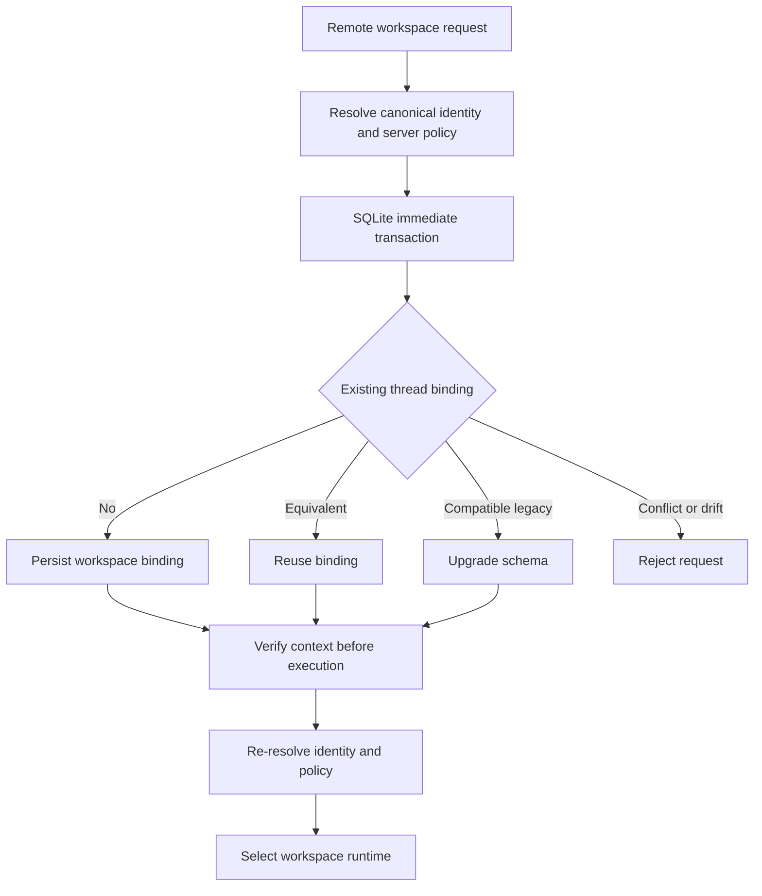

# State, Sessions, and Workspace Persistence

Persistence is not one database or one lifecycle. The system has four distinct owners:

1. **LangGraph checkpoints** version agent graph state for a `thread_id`, including messages, interrupts, middleware channels, and resume points.
2. **Deep Agents backends** own filesystem and memory data; the selected backend route determines its durability and sharing scope.
3. **dcode session SQLite** provides the local LangGraph checkpointer and the local thread catalogue derived from checkpoint data.
4. **Remote workspace bindings** are separate, server-authoritative records that pin a remote thread to a canonical workspace and its resource policy.

A checkpoint does not make a backend's data global, and a thread ID does not authorize remote execution in an arbitrary directory. See [Backends](/openwiki/concepts/backends.md), [Context management](/openwiki/concepts/context-management.md), [Runtime behavior](/openwiki/architecture/runtime-behavior.md), and [ACP](/openwiki/integrations/acp.md).

## Checkpointed graph state and backend state

Deep Agents deliberately separates graph resumability from backend persistence. A checkpointer preserves conversation state, message history, interrupts, and the point from which a thread resumes. The backend separately determines where files and memory live. `create_deep_agent` forwards its optional `checkpointer` and `store` to LangChain's `create_agent`; a backend on a store route requires the separate store. Select both based on the intended lifetime: a durable saver for restart-safe threads and a backend appropriate for thread-local, cross-thread, or external data.

The default `StateBackend` is thread-scoped. It accesses the `files` channel through LangGraph's `CONFIG_KEY_READ` and `CONFIG_KEY_SEND`, so its files are checkpointed with graph state after agent steps and persist within a conversation thread, not across threads. It requires a graph execution context. Its reads use `fresh=True`, which applies pending writes and gives a tool read-your-writes behavior within one superstep.

### Delta channels and schema contract

`DeepAgentState` is the default graph `state_schema`. It subclasses LangChain's `AgentState` and changes only `messages`, applying `DeltaChannel(_messages_delta_reducer, snapshot_frequency=50)`. The channel stores message deltas and snapshots periodically, reducing long-thread checkpoint volume from quadratic to linear while bounding reconstruction depth. `FilesystemState.files` applies the same 50-step delta/snapshot pattern.

The message reducer accepts message-like inputs, deduplicates by message ID, honors `RemoveMessage` and `REMOVE_ALL_MESSAGES`, and expects LangGraph to assign stable IDs before serialization. A custom schema should be a `TypedDict` extension of `DeepAgentState` to retain this message-channel contract. That subclass constraint is static only: `TypedDict` cannot be used with `issubclass`, so there is no runtime validation.

Middleware schemas are merged with the base schema. Fields marked `PrivateStateAttr` are collected before declarative subagents are configured, so private fields are not projected into subagent state. A schema whose annotations cannot be resolved at runtime is skipped with a warning; its supposed private fields are then not protected from that projection.

## dcode local sessions and resume facts

The CLI opens an `AsyncSqliteSaver` through `sessions.get_checkpointer()`, calls `setup()`, and passes it to CLI agent graphs. The database is the hardened global `DEFAULT_STATE_DIR / "sessions.db"`. Thus dcode does not maintain a second local transcript table: its checkpoint and write rows are the source of truth for local listing and resume.

`list_threads` derives a thread row from checkpoint metadata: agent name, creation and update timestamps, Git branch, working directory, and the latest checkpoint ID. It can enrich rows with checkpoint-derived initial-prompt and visible-message-count data. It filters by agent, branch, and exact stored `cwd`; path normalization, symlink resolution, and prefix matching are deliberately not performed. A covering index is created opportunistically so the listing query can avoid large checkpoint blobs. Failure to create that index is logged and retains correct, slower table-scan results.

Between delta snapshots, the latest checkpoint may omit inline `messages`. In that case dcode reconstructs visible count from root-namespace message writes, ordered by checkpoint ID, task ID, and write index; subgraph writes under the same thread are excluded. It folds all writes because normal dcode usage appends at the head and displays pending writes through `aget_state`. External forked or abandoned branches, which dcode does not create, can therefore over-count.

### Checkpoint-versioned UI state

`ResumeStateMiddleware` defines `PrivateStateAttr` checkpoint channels that let dcode rehydrate session facts without replaying or re-tokenizing history. After successful model calls, graph middleware records context-token and effective model/request/cache facts in the response checkpoint. The TUI may write accepted goal and rubric selections with `aupdate_state`; pending goal proposals and agent-driven goal status changes are graph-written. These values are checkpoint-versioned: selecting an earlier checkpoint restores the facts at that point, not a thread-wide aggregate. The model-turn path is shared by local and remote HTTP graphs.

## Local state migration

After argument parsing and the bare-help fast path, command startup makes a best-effort migration from `~/.deepagents/` to `~/.deepagents/.state/`. The fixed migration set includes `sessions.db`, its `-wal` and `-shm` SQLite sidecars, MCP tokens, history, update state, and onboarding data. Moving database sidecars with the database avoids separating a WAL-mode database.

Migration is idempotent and fail-soft. Missing sources do nothing; an existing destination is preserved and warned about; state-directory creation and individual rename failures are logged without blocking startup or other entries. When both legacy and destination copies exist, inspect them before manual cleanup.

## Remote workspace authority and drift rejection

Remote execution adds a durable authorization and resource-selection boundary separate from graph checkpoint state. A workspace binding records the canonical workspace identity (`cwd` and project root), schema version, generation, resource key, configuration fingerprint, and JSON resource policy for one thread. The supplied `cwd` is untrusted: it must be a non-empty absolute existing directory with no traversal and is resolved canonically. Policy is resolved on the server; persisted workspace policy intentionally excludes credentials and prompt text.

This diagram shows the persistence boundary: binding occurs before execution, while every execution verifies the durable authority again.

`bind_thread_workspace` uses `BEGIN IMMEDIATE` and `INSERT OR IGNORE`, then compares the proposed and stored binding. Equivalent claims are idempotent. A concurrent first claim has one winner, while a different workspace or protected policy raises `WorkspaceConflictError`. The resource key combines workspace identity and configuration fingerprint for runtime selection; a process-wide sandbox can additionally refuse a second workspace in the same sandbox process.

Schema version 3 supports a controlled upgrade path for compatible older rows. Because version-2 fingerprints could reflect launch-project policy rather than resolved workspace policy, migration first verifies identity and recorded session controls, then atomically replaces schema version, resource key, fingerprint, and policy. It rejects a session-control change. Current bindings reject identity or configuration drift instead of silently changing thread authority.

Before remote graph execution, `make_graph` requires a nonempty LangGraph `thread_id` and workspace context. `require_thread_workspace` compares every public context field to the durable binding, rejects an unsupported schema or claimed-policy mismatch, and re-resolves the stored path to detect changed workspace identity. Runtime construction resolves current server configuration for the bound workspace and rejects project-policy or server-configuration fingerprint drift. A transient extension-trust read problem can therefore be reported as policy drift rather than weakening the policy.

The workspace endpoint resolves policy on the server, rejects client claims to project policy, binds before mirroring thread metadata, and maps conflicts to HTTP 409. The runtime is built after binding but before the metadata mirror. If the mirror fails, the binding remains durable and the endpoint returns HTTP 503; callers must handle that split outcome.

## Operational guidance

- Treat a checkpoint as graph resume authority; use a durable checkpointer before promising restart-safe resume.
- Use `StateBackend` only for thread-local checkpointed files. Choose a store or an external/filesystem backend when data must outlive or cross threads.
- Preserve `DeepAgentState.messages` delta semantics in custom state schemas and make history-inspection tooling tolerate omitted inline message snapshots.
- Back up or move `sessions.db`, `sessions.db-wal`, and `sessions.db-shm` together. Resolve migration collisions explicitly.
- Do not use checkpoint metadata such as `cwd` as remote authorization. Bind a remote thread and provide the exact binding payload for execution.
- Treat workspace conflicts and policy drift as safety controls. Use a new thread for a different workspace or resource policy, and resolve drift explicitly rather than mutating an existing binding.
