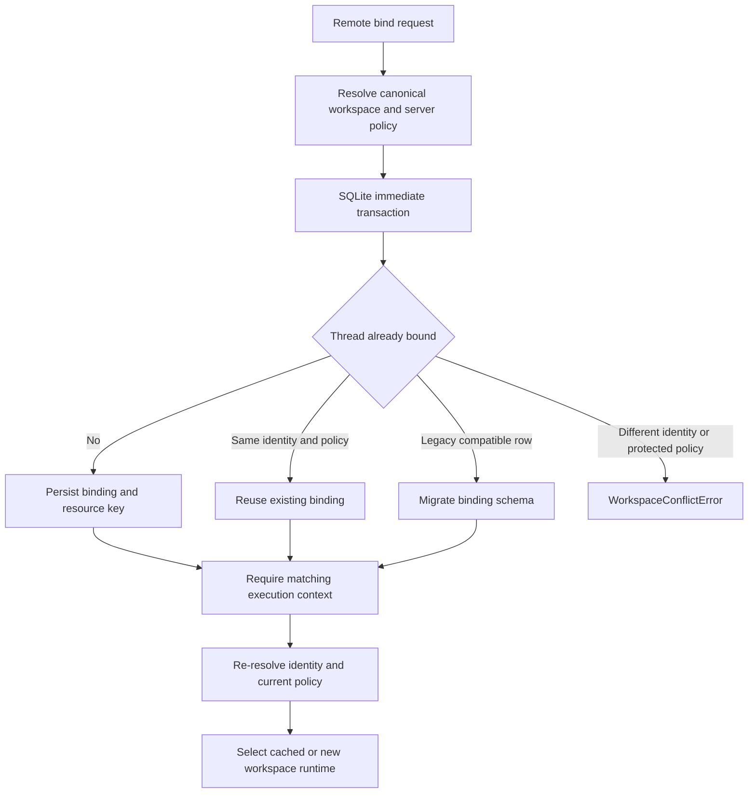

# State, Sessions, and Workspace Persistence

Persistence is not one database or one lifecycle. In this stack, distinguish four owners:

1. **LangGraph checkpoints** version agent graph state for a `thread_id`: messages, interrupts, middleware channels, and resume points.
2. **Deep Agents backends** own file and memory data. Their route determines whether that data lives in checkpointed state, a store, or an external filesystem/service.
3. **dcode session SQLite** is the local implementation of the LangGraph checkpointer and the source for the local thread catalog.
4. **Remote dcode workspace bindings** are a separate server-authoritative SQLite record that pins a thread to a workspace identity and resource policy.

A durable checkpoint alone therefore does not make filesystem data global, and a thread ID alone does not authorize remote execution in an arbitrary directory. See [Configuration layering](/openwiki/concepts/config-layering.md), [Context management](/openwiki/concepts/context-management.md), [Runtime behavior](/openwiki/architecture/runtime-behavior.md), and [Run a dcode session](/openwiki/workflows/run-dcode-session.md).

## Graph state is the resume authority

Persistence in Deep Agents has two separate axes: LangGraph checkpoints preserve conversation state, message history, interrupts, and resumability per thread, while Deep Agents backends handle filesystem and memory persistence whose durability depends on the backend route.

`create_deep_agent` passes its optional `checkpointer` and `store` to LangChain's `create_agent`. A checkpointer persists graph state between runs; a backend using a store route separately requires `store`. Select these independently: use a restart-durable saver when a thread must resume after process loss, and select a backend whose route has the required lifetime and sharing semantics.

The default `StateBackend` is deliberately thread-scoped. It reads and queues `files` updates through LangGraph's `CONFIG_KEY_READ` and `CONFIG_KEY_SEND`, so files are checkpointed with graph state and survive within that conversation thread, not across threads. It must be called inside graph execution; direct use without the LangGraph configuration fails. Reads use `fresh=True`, so a tool can read its own pending file write in the same superstep.

### Delta checkpoints and schema extensions

`DeepAgentState` is the default `state_schema` and replaces only `messages` from LangChain's `AgentState` with `DeltaChannel(_messages_delta_reducer, snapshot_frequency=50)`. Rather than repeating the full message list on each checkpoint, the channel persists deltas and periodically snapshots it, making long-thread persisted message volume linear rather than quadratic while bounding reconstruction work. `FilesystemState.files` uses the same 50-step delta/snapshot pattern.

A custom `state_schema` should be a `TypedDict` extension of `DeepAgentState` so it retains the message-channel contract. This is a static typing requirement, not an `issubclass` runtime validation. The graph merges schemas supplied by assembled middleware with the base schema, allowing middleware to own typed channels. Middleware can mark fields with `PrivateStateAttr`; the task middleware filters those fields in both parent-to-child and child-to-parent projection, preventing private checkpoint facts from becoming subagent inputs or merged results.

## dcode local sessions: checkpoint database, not a second transcript store

The local CLI obtains an `AsyncSqliteSaver` from `sessions.get_checkpointer()`, calls `setup()`, and passes it to each CLI graph. The global database path is `DEFAULT_STATE_DIR / "sessions.db"`, after the state directory is hardened. Consequently, the checkpoint and write rows owned by LangGraph are also dcode's local source of truth for thread listing and resume; they are not duplicated into a dcode-specific conversation table.

`list_threads` derives its rows from checkpoint metadata: agent name, created and updated timestamps, Git branch, working directory, and latest checkpoint ID. It optionally obtains the initial prompt and visible message count from checkpoint data. Filters for agent, branch, and `cwd` operate on checkpoint metadata; the `cwd` comparison is an exact string match, so it does not normalize paths or follow symlinks. A covering SQLite index is created opportunistically to avoid scanning large checkpoint blobs; inability to create it preserves correct results but can make listing slow.

When a latest delta checkpoint does not inline `messages`, dcode reconstructs its visible message count from root-namespace `messages` writes. It replays rows ordered by checkpoint ID, task ID, and write index, and excludes subgraph writes under the same thread ID. The full-history fold matches dcode's normal append-only, head-of-thread usage (including pending writes visible through `aget_state`); externally created forked or abandoned branches can make that estimate over-count.

### Checkpoint-versioned resume facts

`ResumeStateMiddleware` adds private checkpoint channels for the facts needed to rehydrate a dcode session without replaying or re-tokenizing history. After a successful model call, graph middleware records the latest context-token count and effective model/request/cache facts in the same checkpoint as the response. Accepted goal and rubric choices may instead be written by the TUI through `aupdate_state`, while pending criteria proposals and agent-driven status changes are graph-written. These are versioned state values: resuming a selected checkpoint restores the facts from that point, not a thread-wide aggregate. The model-turn write path works with local and remote HTTP graphs.

### Local state-directory migration

On normal command startup—after argument parsing and the bare-help fast path—dcode attempts a best-effort migration of legacy state from `~/.deepagents/` to `~/.deepagents/.state/`. It moves a fixed set of internal entries, including `sessions.db` and its `-wal` and `-shm` sidecars, MCP tokens, history, update state, and onboarding data. Keeping the SQLite sidecars with the main database avoids splitting a WAL-mode database.

The migration is idempotent and fail-soft: missing sources do nothing; a destination that already exists is preserved and reported; directory creation or an individual rename failure is logged while startup and other entries continue. If both legacy and destination files exist, resolve that collision manually rather than assuming either copy is disposable.

## Remote execution: immutable workspace binding

Remote dcode adds an authorization and resource-selection record that is separate from checkpoint state. A binding stores the canonical resolved `cwd` and project root, a workspace fingerprint, schema version, generation, resource key, configuration fingerprint, and a JSON resource policy. The `cwd` supplied for initial resolution is untrusted: it must be a non-empty absolute existing directory without traversal and is resolved canonically. The persisted policy is server-resolved rather than client-provided and excludes secrets such as model credentials and prompt text.

This lifecycle shows that a thread obtains one durable workspace authority before its graph is selected, and every execution rechecks that authority.

`bind_thread_workspace` uses `BEGIN IMMEDIATE` plus `INSERT OR IGNORE` and then compares the stored and proposed binding. Concurrent first claims cannot mix two workspaces: one wins and a different workspace or protected policy produces `WorkspaceConflictError`; an equivalent claim is idempotent. The resource key combines workspace identity and configuration fingerprint and selects a cached per-workspace runtime. A process-wide sandbox imposes a further constraint: a process already hosting another workspace in such a sandbox rejects the new workspace.

Current schema version 3 deliberately migrates compatible older binding rows. Version 2 fingerprints could reflect launch-project policy rather than the resolved workspace policy. The upgrade first verifies workspace identity and session-scoped controls, then atomically replaces the schema, resource key, fingerprint, and policy; it refuses a migration that would change recorded session controls. New-schema bindings reject identity and configuration drift rather than silently changing a thread's authority.

Before remote graph execution, `make_graph` requires both a nonempty LangGraph `thread_id` and workspace context. `require_thread_workspace` confirms that every public context field exactly matches the durable binding, rejects an unsupported binding schema or claimed policy mismatch, and re-resolves the bound path to detect changed workspace identity. Runtime construction then resolves current server configuration for the bound workspace and rejects project-policy or server-configuration fingerprint drift. A transient failure while reading extension trust can therefore surface as policy drift rather than silently relaxing policy.

The workspace-binding endpoint resolves policy on the server, rejects client attempts to claim project policy, binds before creating or updating remote thread metadata, and maps conflicts to HTTP 409. If the later metadata mirror fails, the binding remains durable but the endpoint returns 503: callers must handle that split outcome rather than assuming no workspace was bound.

## Operational guidance

- Treat a checkpoint as the only resume authority for graph state; configure a durable saver before promising restart-safe resume.
- Use `StateBackend` only for thread-local checkpointed files. Choose a store or filesystem-backed backend when the data must outlive or cross threads.
- Preserve `DeepAgentState.messages` delta semantics in custom schemas, and ensure dcode tools that inspect history tolerate a checkpoint with no inline message list.
- Back up or move `sessions.db`, `sessions.db-wal`, and `sessions.db-shm` together. When the automatic state migration reports a collision, inspect both copies before manual cleanup.
- Do not substitute checkpoint metadata such as `cwd` for remote authorization. Bind a remote thread first and send the exact binding payload on execution.
- Treat a workspace conflict as intentional safety behavior. Start a new thread for a different workspace or resource policy; resolve configuration/policy drift explicitly instead of mutating the existing thread binding.
