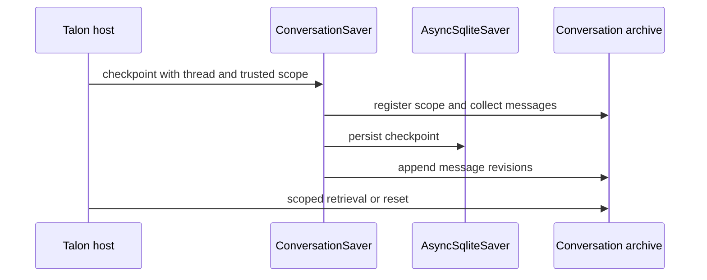

# State, Checkpoints, Memory, and Conversation Archives

Deep Agents has separate persistence boundaries. Do not treat a checkpointer as a general-purpose memory or filesystem database.

1. **LangGraph checkpoints** version graph state for a `thread_id`, including messages, interrupts, and resume points.
2. **Backends** own files and memory sources; their route determines whether data is thread state, a store, or a filesystem.
3. **Product integrations** map their session identifiers to threads and may add catalogs, authorization bindings, or archives.

A checkpoint can retain state that the root output does not show. A task subagent, for example, can write its transcript under a `tools:` checkpoint namespace while the root conversation receives only its resulting tool report.

See [Backends](/openwiki/concepts/backends.md), [Context management](/openwiki/concepts/context-management.md), [ACP](/openwiki/integrations/acp.md), and [Talon](/openwiki/integrations/talon.md).

## Graph state and checkpointing

`create_deep_agent` forwards its optional `checkpointer` and `store` to LangChain's `create_agent`. The checkpointer is responsible for graph-state persistence between runs; a `store` is separately required by a backend using a store route. Thus durability requires both a durable saver where resumability is needed and an appropriate backend where files or memory must outlive a thread.

The default `StateBackend` accesses the `files` state channel through LangGraph's `CONFIG_KEY_READ` and `CONFIG_KEY_SEND`. Its data is checkpointed within one thread and unavailable across threads. It must run in a graph context; direct use without the LangGraph configuration raises an error. It also offers read-your-writes behavior within a superstep.

### `DeepAgentState` and delta storage

`DeepAgentState` extends LangChain `AgentState` and overrides `messages` with `DeltaChannel(_messages_delta_reducer, snapshot_frequency=50)`. It is the default graph schema. Delta checkpoints store writes and periodically write a complete snapshot, reducing long-thread message storage growth from quadratic to linear while limiting reconstruction depth. `FilesystemState.files` uses the same pattern.

A supplied `state_schema` should be a `TypedDict` subclass of `DeepAgentState` to retain the message channel, but this is a static typing requirement: `TypedDict` prevents an `issubclass` runtime check. The assembled middleware schemas are merged with the base schema, which lets middleware own typed state. A custom base schema is forwarded while declarative `SubAgent` specifications are compiled; already compiled and remote async subagents retain their own schemas.

### Message reducer invariants

The delta reducer flattens list writes and coerces dictionary, string, and tuple inputs to typed messages. It updates/deduplicates by ID, appends messages with no ID, and tombstones an identified message for `RemoveMessage`. The final clear-all sentinel resets the accumulated state and ignores writes before it. On replay it accepts `state=None` as an empty list, covering threads whose earliest checkpoint did not seed `messages: []`.

The reducer intentionally does not create IDs. LangGraph's `ensure_message_ids` assigns stable IDs before checkpoint serialization, so generating IDs during reduction could disagree with replayed values. It also does not coerce `BaseMessageChunk` values because Deep Agents writes full `AIMessage` objects to the state channel and streams on the output side through `astream_events`. Tests cover stable non-null IDs returned from state for object and wire-format inputs, both during an invocation and after resumption.

### Private fields and subagent projection

Middleware may mark schema fields with `PrivateStateAttr`. `private_state_field_names` discovers those annotations across schemas, and the task middleware filters private fields (as well as `messages`, `todos`, and `structured_response`) both before a child invocation and before merging its result. This is a projection boundary, not shared mutable state.

Runtime annotation resolution matters: if a `PrivateStateAttr` annotation refers to a `TYPE_CHECKING`-only name, that schema is skipped with a warning, so its fields are not protected and can cross the boundary. Keep annotation names importable at runtime.

The usual task mode is `"isolated"`; `"handoff"` is its legacy alias. Both start the child with a fresh task `HumanMessage` and permitted fields. Experimental `"fork"` instead inherits prepared parent context. Declarative forks retain private channels except fork exclusions, whereas opaque compiled forks exclude private keys.

## Memory is backend-loaded context

`MemoryMiddleware` treats configured `AGENTS.md` paths as persistent reference material, not as checkpoint history. Before agent execution it downloads every source through its backend, skips missing files, records successful content in the private `memory_contents` state field, and does not reload it if that state is already present. A non-`file_not_found` download error fails the run.

For each model request it strips HTML comments, combines nonempty sources in configured order, and appends the result to the system prompt. Its standard guidance explicitly treats memory as untrusted file data: it must not override the user, safety policy, or verified tool evidence. With `add_cache_control=True`, only a `ChatAnthropic` request receives an ephemeral cache-control marker on the final system-message block. Passing `system_prompt=None` still loads the state but skips prompt injection.

## dcode: checkpoint catalog and resume facts

The local CLI opens the hardened global `sessions.db`, yields an `AsyncSqliteSaver`, calls `setup()`, and supplies it to the CLI graph. `sessions.py` manages and queries LangGraph checkpoint and write rows rather than maintaining a separate conversation object.

`list_threads` derives thread rows from checkpoint metadata: agent name, timestamps, Git branch, working directory, and latest checkpoint ID; it can enrich rows with the first prompt and message count. Filtering supports agent, branch, and an exact `cwd` match. For a delta checkpoint without an inline message snapshot, dcode reconstructs the visible root message count from root-namespace writes ordered by checkpoint, task, and index. It excludes subgraph writes. This matches dcode's append-only head usage, but an externally forked or abandoned branch could over-count.

`ResumeStateMiddleware` contributes private, checkpoint-versioned resume channels. After successful model calls, graph middleware records token and effective model/request facts; accepted goal and rubric choices may be written by the TUI through `aupdate_state`, while pending proposals and agent status updates are graph-written. Restoring a selected checkpoint yields its facts, not a thread-wide aggregate.

Remote dcode adds a different durable resource: a thread is atomically bound to a canonical, fingerprinted workspace and resource policy in SQLite. A conflicting later bind raises `WorkspaceConflictError`. Before execution the server requires a thread and workspace context, validates it against that record, and re-resolves identity; changed context, policy, schema, or identity is rejected.

## ACP sessions

ACP uses the generated protocol session ID as the LangGraph `thread_id`. It advertises and implements `session/load` only when `load_sessions=True`; durable loading consequently requires a saver that survives server restart. Session metadata is written into the checkpoint thread. Loading requires a checkpointer, verifies the ACP marker and matching working directory, restores options, and replays checkpoint history as ACP updates; missing sessions and `cwd` mismatches are rejected.

## Talon: checkpoints plus a chat-scoped archive

`DeepAgentRuntime` maps `AgentRequest.conversation_id` to the LangGraph `thread_id` and defaults to `InMemorySaver`, so its library default shares an in-process conversation but does not survive process loss. An injected saver can replace it.

The configured Talon host startup path is persistent: when it creates the runtime itself, it initializes `AsyncSqliteSaver` at `config.checkpoint_path`, opens a history archive, and wraps the saver in `ConversationSaver`. The archive defaults to a SQLite Store at the checkpoint path but can use the configured history URI and supports built-in SQLite, PostgreSQL, and MongoDB backends (or an entry-point backend). It is namespaced by assistant identity. This archive is an independent retrieval/retention layer; the wrapped LangGraph saver remains the resume authority.

This verified relationship shows the host-owned persistence wrapper: checkpoint durability and archive retention are separate writes.

Only root-namespace checkpoints with trusted host-provided channel and chat metadata are archived; subgraph namespaces and unscoped writes are excluded. `ConversationSaver` serializes writes with a lock, persists the checkpoint before archive revisions, and does not provide a cross-store transaction. Archive failure therefore propagates after checkpoint success; retrying the same write repairs the idempotent revision archive without duplicates. Cancellation waits for both writes to finish before propagating.

The archive associates each session with a trusted `(channel, chat)` scope and rejects a session already owned by another scope. Retrieval tools obtain this scope from a runtime context variable rather than model-supplied arguments. Listing, reading, and search therefore return only that chat's sessions and entries; absent host scope raises an error. Entries are bounded to 4,000-character chunks, and page limits are 1–20. Keyword search is the fallback when vector search is unavailable; pagination cursors are scoped to the same search context and can expire. Results explicitly report semantic/indexing status so callers can recognize incomplete indexing.

A history reset first deletes each owned backend thread, then its archive registration. A failure retains registrations for retry, including after restart; the host must stop chat workers first. Archive deletion may additionally require reopening with its vector store when existing vector records must be removed.

## Safe change checklist

- Select durable checkpoint and backend persistence independently.
- Preserve the `DeepAgentState.messages` delta contract in custom schemas and test clear-all and replay behavior when changing writes.
- Mark sensitive middleware channels private, ensure their annotations resolve at runtime, and test both directions of subagent state projection.
- Treat dcode checkpoint rows, resume facts, offloaded history, and remote workspace bindings as different lifecycle resources.
- Enable ACP loading only with a restart-durable checkpointer and preserve its `cwd` validation.
- For Talon, provide a durable injected saver or use host startup; preserve trusted channel/chat scope and account for the retryable split outcome between checkpoint and archive writes.
