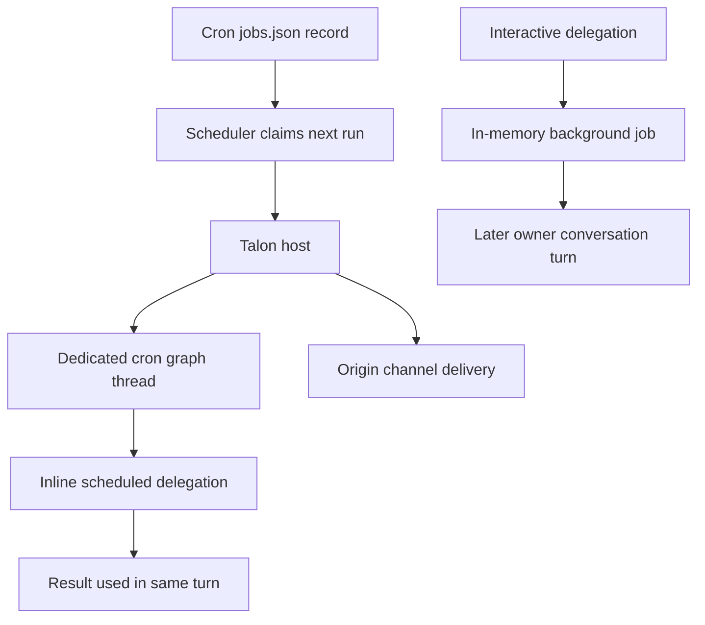
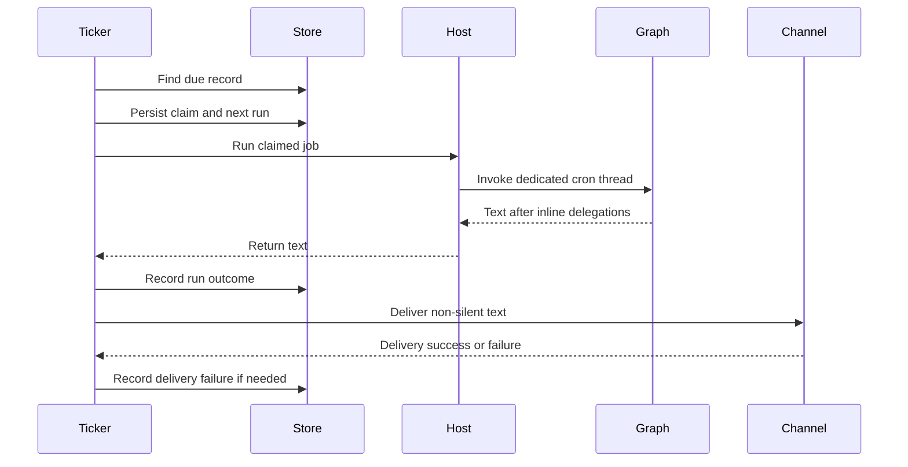

# State Persistence

Persistence is not one system-wide guarantee. A LangGraph checkpointer versions one graph thread; a backend owns files or memory; dcode adds session and workspace-authority records; Talon adds a conversation archive and a cron-job store. In particular, a Talon cron record and its dedicated graph thread can survive process restart when the normal persistent host is used, but a delegation *inside* a scheduled run is deliberately synchronous and in-memory: it creates no background-job record and has no deferred-result channel.

## Boundaries at a glance

*Cron state and checkpointed graph state have durable owners; scheduled inline delegation ends with the current turn, unlike interactive background delegation.*

## Checkpointed graph state and backend data

Persistence in Deep Agents has two separate axes: LangGraph checkpoints preserve conversation state, message history, interrupts, and resumability per thread, while Deep Agents backends handle filesystem and memory persistence whose durability depends on the backend route. A checkpointer passed to `create_deep_agent` is forwarded to `create_agent` and persists graph state between runs; a store is separately required when a backend uses a store route.

`DeepAgentState` subclasses LangChain's `AgentState` and its only override is the `messages` field, which is annotated with `DeltaChannel(_messages_delta_reducer, snapshot_frequency=50)` to reduce checkpoint growth from O(N squared) to O(N) across long threads. It is the default `state_schema` that `create_deep_agent` forwards to `langchain.agents.create_agent` when no custom schema is supplied. A custom schema should extend it, but because it is a `TypedDict`, that requirement is type-checker-only and is not enforced through runtime `issubclass`.

`DeltaChannel` persists deltas and writes a full snapshot only every snapshot_frequency (50) pregel steps, so persisted message volume grows linearly with thread length while bounding replay/read depth; the same `DeltaChannel(..., snapshot_frequency=50)` pattern is applied to the `files` key on `FilesystemState`. Readers must therefore tolerate a checkpoint without an inline complete message list.

The default `StateBackend` stores files inside agent state via LangGraph's `CONFIG_KEY_READ` / `CONFIG_KEY_SEND`, so files are checkpointed with the thread and persist within a conversation thread but not across threads, and it can only be used inside a graph execution. Use a namespaced store route or another external backend when data must cross threads or outlive the checkpointed conversation.

## dcode durable records

dcode's local `get_checkpointer` opens the hardened global `sessions.db` and yields an `AsyncSqliteSaver`; startup calls `setup` before constructing CLI agent graphs with that checkpointer. It derives thread listings from LangGraph checkpoint metadata, including agent, timestamps, Git branch, working directory, latest checkpoint ID, and optionally checkpoint-derived prompt and message-count data; `list_threads` can filter by agent, branch, and exact cwd. A covering index makes that list query avoid large checkpoint blobs, while index-creation failure falls back to a slower correct table scan.

When a `DeltaChannel` checkpoint omits an inline messages snapshot, dcode reconstructs a thread's visible message count by replaying root-namespace messages writes in checkpoint/task/index order, deliberately excluding subgraph writes under the same thread ID. `ResumeState` middleware likewise uses private checkpoint channels: successful model calls graph-write model-turn facts; accepted goal/rubric choices may be client-written with `aupdate_state`; and pending proposals or agent status are graph-written.

At command startup, dcode migrates legacy internal state entries from `~/.deepagents/` to `~/.deepagents/.state/` after argument parsing. The migration is idempotent and best-effort, preserves destination collisions, and moves the `sessions.db` WAL and shared-memory sidecars with the database.

Remote dcode maintains a separate workspace binding rather than treating workspace identity as ordinary thread state. It atomically persists a version-3 binding per thread containing canonical workspace identity and a server-resolved resource-policy fingerprint. Equivalent binds are idempotent, but a changed workspace or protected policy raises `WorkspaceConflictError`; compatible pre-version-3 bindings are upgraded only after identity and recorded session-policy checks. Before remote execution the server requires a thread ID and workspace context, re-resolves identity, and rejects changed context, policy, schema, or identity. The workspace endpoint binds before mirroring thread metadata, so metadata failure can return 503 after the durable bind.

Remote offload only persists an external archive when its execution provides an archive writer: it commits the checkpoint update, appends the archive, then links its path through a follow-up checkpoint update. A failed or unreadable link confirmation is rollback or an indeterminate outcome, not an assumed durable archive.

## Talon conversation and archive stores

Talon's normal modeled host initializes an `AsyncSqliteSaver` at the assistant-scoped `checkpoints.sqlite` path and wraps it with `ConversationSaver` plus a separately opened history archive, whereas `DeepAgentRuntime` defaults to `InMemorySaver` when no checkpointer is supplied. Thus a direct runtime has no restart guarantee, while the normal modeled host retains graph state, including a cron job's reusable dedicated thread.

`ConversationSaver` persists a checkpoint before appending its committed message revisions to the independent archive and acknowledges the checkpoint only after archive success; archive failure propagates without a cross-store transaction, while idempotent archive writes make retry repair possible. `StoreConversationArchive` scopes transcripts to a trusted channel/chat and uses an idempotent, bounded redo journal that is recovered before access; it requires one active writer per namespace and Store read-after-write consistency, and does not provide a distributed lock.

Talon archive deletion removes vector data before transcript records and retains retryable deletion state; `ConversationSaver` deletes the corresponding checkpoint thread before removing its archive session registration. Scheduled runs are not normal chat-history turns: their dedicated cron thread is checkpointed, but the host does not give it the origin chat's history scope, so its work is not archived into that chat transcript.

## Cron records, claims, and recovery

`CronJobStore` holds assistant-scoped records in `cron/jobs.json`. Each record includes a stable ID, prompt, schedule and repeat state, enabled and next-run state, outcome fields, and the origin conversation used for delivery. Cron tools create, list, edit, and remove jobs only within the current origin scope. The store uses atomic replacement, file and directory fsync, directory mode `0700`, and file mode `0600`; it is a single-writer design and does not provide cross-process coordination.

*The scheduler durably advances a due job before execution, then records execution and delivery outcomes separately.*

The scheduler calls `advance_next_run` before `run_job`. For a one-shot or exhausted repeat this disables the job and clears `next_run_at`; for a recurring schedule it advances the phase-locked next run and increments the claimed repeat count. This is an at-most-once **claim**, not an exactly-once execution or delivery protocol: a process crash or timeout after the claim can leave an attempt unrecorded or undelivered while its next fire has already advanced. A run exception records `error`; successful silent output records `ok` without channel delivery; and a delivery exception changes the outcome to `error`. The ticker logs and retries a failed scan on its normal interval, but it does not replay an already claimed invocation.

`TalonHost.run_scheduled_job` uses `{job.id}:talon-cron` as a dedicated conversation ID and holds its conversation lock across the run. The normal persistent checkpointer makes this a reusable checkpointed graph thread across fires and restart. The host bounds the whole run at 1,800 seconds; when cancellation leaves an incomplete tool-call sequence, it calls `recover_interrupted` before re-raising so later fires can use the thread. Due jobs run serially in a tick, so this bound protects other schedules, but a claimed fire that times out is still consumed.

## Scheduled delegation is intentionally non-durable

The runtime marks an invocation as scheduled only when its metadata has `trigger: "cron"`. `BackgroundSubagents` then replaces the usual task-ID workflow with `_inline`: it waits for the local or remote subagent result in the calling tool invocation, returns that result to the model in the same scheduled turn, and never inserts an entry in `_jobs`. `start_async_task` likewise streams the configured remote graph instead of starting an SDK task that would return an unpollable ID.

Consequently, a scheduled delegation has **no** durable job state, no `list_subagents` or `cancel_subagent` handle, no background-worker capacity accounting, and no later owner turn in which to inject a result. The scheduled prompt hides those tools and explicitly tells the model to act on delegation results immediately. Nested delegation remains blocked. This boundary is deliberate: a scheduled turn has no user to continue talking to and no deferred delivery turn. The durable objects are the cron record and checkpointed cron graph thread—not a child delegation.

Inline work has its own semaphore of four slots and queues rather than refusing excess fan-out; it can fan out concurrently but each delegation has a 600-second timeout. Its output is capped at 64,000 characters because the cron graph thread is reused on later fires. Failure and timeout are converted to sanitized tool-error messages rather than escaping and causing the graph to retry sibling delegations. A scheduled run also has no interactive authorization or approval handler, so protected actions are denied rather than left pending.

In contrast, interactive delegation creates an in-memory `_Job` owned by the conversation thread, runs with a separate worker thread ID, and later injects a completed result into a main-agent turn. Those jobs and results disappear on runtime restart. They are not a mechanism for recovering scheduled work; a scheduled run must complete its delegation, absorb its sanitized failure, or itself fail before the scheduler can record the outcome.

## Operations and focused tests

- Back up and operate checkpoint, archive, and cron storage as separate resources. `DEEPAGENTS_TALON_CRON_RETENTION_DAYS` removes completed cron records after 30 days by default; inbound media is removed after 24 hours by default.
- Do not run multiple Talon processes that write the same cron directory. Treat the JSON store's atomic writes as crash-safety for one writer, not coordination or exactly-once delivery.
- Design scheduled prompts so all required delegation results are consumed in the same turn. A restart can resume the graph thread only at a valid persisted checkpoint; it cannot resurrect an inline subagent or a lost deferred result.
- Preserve the claim-before-run order when changing the scheduler. Reordering it changes duplicate/loss behavior; adding durable execution leases or idempotency keys would be a distinct delivery protocol.

`libs/talon/tests/cron/test_scheduler.py` verifies persisted claim-before-run, outcome recording, delivery errors, silent results, ticker recovery, and how a bounded stalled run lets later due jobs proceed. `libs/talon/tests/unit_tests/test_background.py` verifies that scheduled delegation creates no `_jobs` entry, returns inline results, queues bounded fan-out, sanitizes failure and timeout, streams remote work rather than creating an SDK task, truncates results, and resets the scheduled context after a turn.

See [Subagents and Skills](/openwiki/concepts/subagents-skills.md), [Talon](/openwiki/integrations/talon.md), [Cost and sessions](/openwiki/operations/cost-and-sessions.md), and [Testing guide](/openwiki/testing/testing-guide.md).
