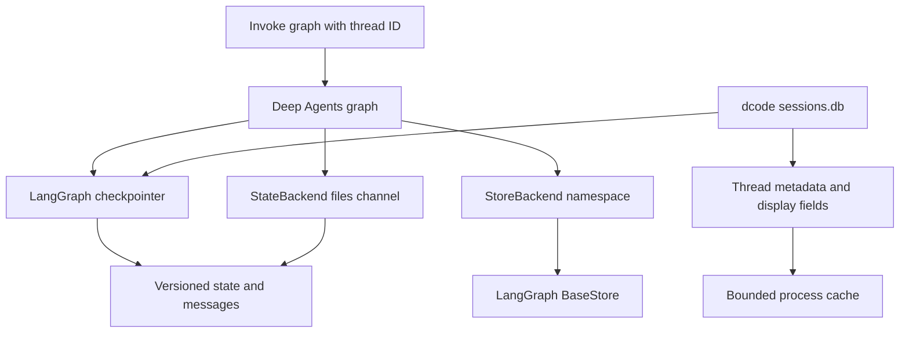
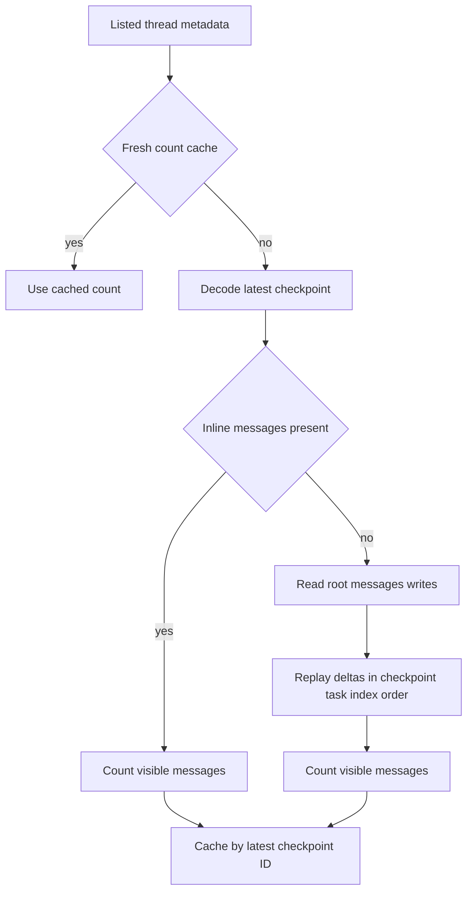

# State and Persistence

Persistence has distinct owners and scopes. A LangGraph **checkpointer** versions the state of a graph thread, including messages and interrupts. A Deep Agents **backend** owns files or memory and chooses whether those data are thread-local or shared. dcode's `sessions.db` is a local SQLite implementation of the checkpoint store plus a query surface for session selection. None of these implies that an in-process cache is durable.

*Checkpoint state and `StateBackend` files are thread-scoped; a `StoreBackend` delegates cross-thread durability to its configured `BaseStore`; selector caches are process-local.*

## Checkpoints, state schema, and thread identity

LangGraph checkpoints and backend persistence answer different questions:

- A checkpointer preserves graph state, conversation messages, interrupts, and the data needed to resume a particular `thread_id`.
- A backend implements filesystem-like data and determines whether it remains only in state, is stored under a shared namespace, or is provided by another backend route.
- `create_deep_agent()` accepts `checkpointer`, `store`, and `cache` independently and forwards them to LangChain's `create_agent`. A cache is an execution optimization, not a checkpoint or a backend persistence guarantee.

`DeepAgentState` is the default schema unless a caller supplies `state_schema`. It replaces `AgentState.messages` with a `DeltaChannel` using `_messages_delta_reducer` and a snapshot every 50 writes. Consequently, long message histories are stored as deltas between periodic snapshots instead of repeatedly embedding the whole history. Custom graph state that needs the same message behavior should extend `DeepAgentState` rather than replacing it with an unrelated schema.

A checkpoint may therefore omit an inline full `messages` list. Consumers that inspect checkpoint rows directly must either use the state loader or replay the stored message deltas with compatible reducer semantics; treating a missing inline value as an empty conversation is incorrect.

## Files: thread state versus shared store

`StateBackend` stores its `files` map in graph state. Within a graph node or tool it reads through `CONFIG_KEY_READ` with `fresh=True`, so queued writes are visible within the same superstep, and queues changed paths through `CONFIG_KEY_SEND`. The `files` channel merges partial updates and commits them at the node boundary. This gives backend users normal file operations without manually constructing graph state updates.

That convenience is deliberately constrained: `StateBackend` requires a LangGraph execution context and is thread-scoped. With a durable checkpointer, its files survive and resume in that conversation thread; they are not a cross-thread filesystem. To seed files, provide `files` in the graph invocation rather than calling the backend outside the graph.

`StoreBackend` instead uses a LangGraph `BaseStore`. It obtains an explicitly supplied store or the current graph's store, then maps every operation through a caller-provided namespace factory. Files under the same namespace can be shared across threads, while different namespaces isolate tenants or workspaces. The backend validates that namespace components are nonempty strings from a conservative character set, rejecting wildcards and other glob-like syntax before a store lookup. This is an isolation boundary, not merely a naming convention.

The store route preserves the backend's filesystem contract: writes and edits put file data under the namespace, and deleting a directory searches all pages then batches deletion of the exact key and its nested-key prefix. Durability and transactional properties remain those of the selected `BaseStore`, not of `StoreBackend` itself.

## dcode SQLite sessions

The local dcode CLI constructs an `AsyncSqliteSaver` over its global `sessions.db`, calls `setup()` before it builds CLI agent graphs, and passes that saver as the agent checkpointer. The session database is consequently the durable source for local graph-thread state; a thread ID is the stable handle used to list, resume, or delete that checkpoint history. The implementation accepts both old short hexadecimal and newer UUID7-shaped IDs already present in the database rather than inferring validity from an ID format.

Thread listing avoids deserializing every checkpoint blob. It aggregates root checkpoint metadata to return thread ID, agent name, update and creation times, latest checkpoint ID, Git branch, and working directory; optional `agent_name`, branch, and exact `cwd` filters apply to that metadata. It attempts to install a covering SQLite index so this common path can avoid reading large blobs. Failure to create the index—for example because the database is read-only or locked—does not change results, but can make listing slower.

The UI-facing recent-thread, initial-prompt, and message-count caches are bounded in-memory conveniences. Count and prompt entries are valid only when their saved freshness token (normally the latest checkpoint ID) matches the listing row; recent-list entries are copied before return. They must never be treated as an authority for resume or deletion. A count can temporarily lag during an active superstep because it is intentionally checkpoint-granular.

### Delta message counts

A normal session listing uses an inline `messages` snapshot if the latest checkpoint contains one. If it does not, dcode reads `writes` and reconstructs the visible count. It processes only root-namespace writes for the thread, ordered by checkpoint, task, and write index; this intentionally excludes subgraph writes that reuse the parent thread ID. The fold honors overwrite and all-message removal semantics and uses an exact incremental reducer fallback for a targeted removal or a failed fast-path reduction. Decoding or reducing one bad thread is logged and omitted rather than preventing the entire thread selector from loading.

*The reconstruction path is a display-time interpretation of durable checkpoint data, not a replacement checkpoint format.*

## Cancellation-safe SQLite lifecycle and migration

Every dcode session database connection goes through a centralized connection factory. It applies a compatibility patch needed by the LangGraph checkpoint dependency, creates `aiosqlite` connections with a timeout, and guards the opening sequence. The guard records the raw SQLite handle on the worker thread and queues an explicit close if cancellation lands while `aiosqlite` is opening it. On exit, dcode also joins the worker after close. Together these steps avoid an unreachable database handle and a worker attempting to schedule work on an already closed event loop during teardown.

`get_checkpointer()` follows the same lifecycle rather than using `AsyncSqliteSaver.from_conn_string`: it owns the guarded connection, yields the saver only while it is open, and drains the worker in `finally`. Callers should retain the async context for the graph's lifetime and should not reuse the saver after it closes.

At startup, `migrate_legacy_state()` moves selected internal files from `~/.deepagents/` to `~/.deepagents/.state/`, including `sessions.db` and SQLite's optional `-wal` and `-shm` sidecars. The migration is best-effort and idempotent: it skips a missing source or existing destination, hardens the destination directory before moving files, and logs individual failures without blocking startup. When both copies exist, it does not overwrite either; an operator must inspect and resolve the conflict to avoid losing a session history.

Deleting a dcode thread deletes its `checkpoints` and `writes` rows, commits that transaction, and evicts relevant in-memory listing entries. It then attempts to remove the separate local offloaded-history artifact. That cleanup is best-effort: its failure is logged and does not change the successful checkpoint-deletion result. Backups and retention procedures should consequently account for checkpoint SQLite data and any external conversation archive independently.

## Change and operations guidance

- Choose the persistence boundary first: use a checkpointer for resumable graph state, `StateBackend` for thread-local scratch files, and a correctly namespaced durable `BaseStore` for cross-thread files.
- Do not bypass `CONFIG_KEY_READ`/`CONFIG_KEY_SEND` for `StateBackend`; it depends on LangGraph's channel timing and reducer to provide read-your-writes behavior.
- Keep `DeepAgentState`'s message channel when extending state, and preserve the dcode write-replay ordering if changing session display code.
- Treat thread metadata and caches as indexes into checkpoint authority. Deleting or migrating them does not itself establish a complete cross-resource transaction.
- Preserve the guarded connection and worker-drain lifecycle in shutdown or cancellation changes. It exists to prevent leaked SQLite handles and closed-event-loop worker failures, not to alter query behavior.

Focused coverage includes `test_sessions.py` for ID compatibility, metadata selection, inline and delta-backed message counts, deletion behavior, and checkpointer construction; `test_state_backend.py` for graph-context requirements and state-file compatibility; and `test_store_backend.py` for CRUD, namespace isolation, wildcard rejection, pagination, and recursive deletion.

See [Backends](/openwiki/concepts/backends.md), [Context management](/openwiki/concepts/context-management.md), [Runtime behavior](/openwiki/architecture/runtime-behavior.md), [Cost and sessions](/openwiki/operations/cost-and-sessions.md), and [Run a dcode session](/openwiki/workflows/run-dcode-session.md).
