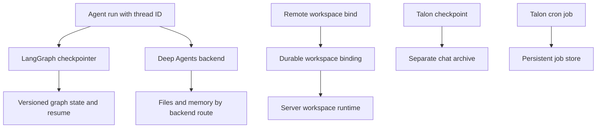
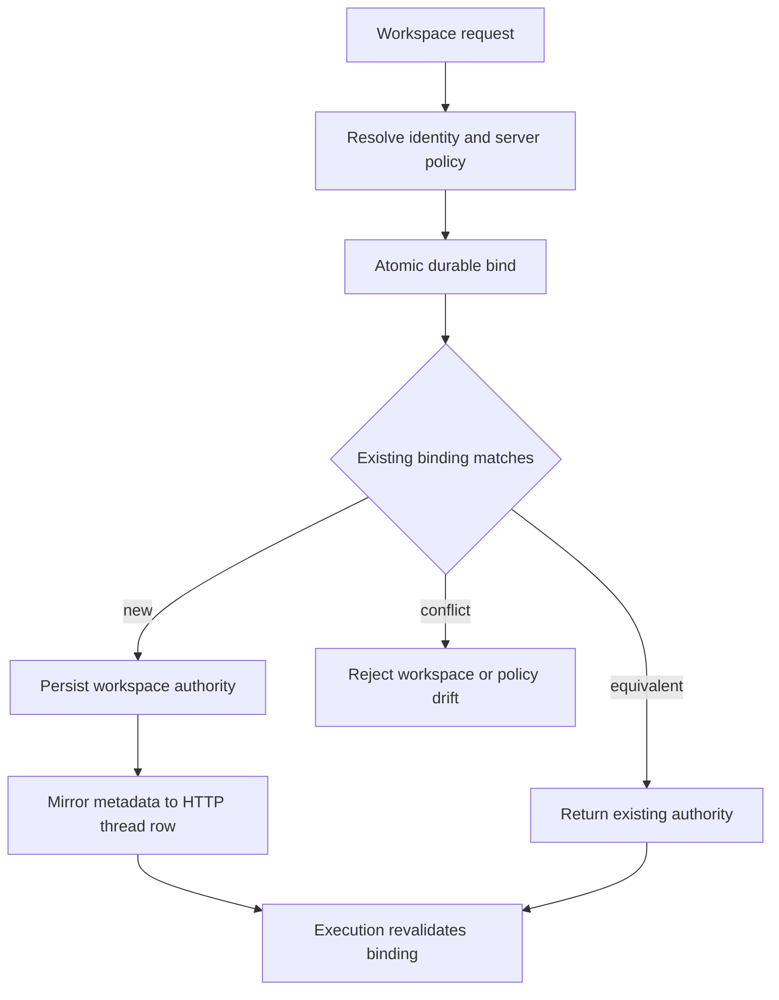

# State, Sessions, and Workspace Persistence

Persistence is not one database or lifecycle. Separate these owners:

1. **LangGraph checkpointers** version graph state for a `thread_id`: messages, interrupts, middleware channels, pending work, and resume points.
2. **Deep Agents backends** own files and memory. A backend route determines whether they live in checkpointed state, a store, or an external filesystem/service.
3. **dcode local sessions** use a SQLite LangGraph checkpointer; its checkpoint metadata is also the local thread catalog.
4. **dcode remote workspace bindings** are a server-authoritative record that pins a thread to a canonical workspace and resource policy. They are not checkpoint state.
5. **Talon** keeps ordinary conversation checkpoints, a separate chat-scoped retrieval archive, and persistent, origin-scoped cron jobs.

A durable checkpoint does not make backend files global or authorize an arbitrary remote directory. Likewise, a remote HTTP thread registration is not persisted graph state. See [Runtime behavior](/openwiki/architecture/runtime-behavior.md), [Backends](/openwiki/concepts/backends.md), [Context management](/openwiki/concepts/context-management.md), [Talon](/openwiki/integrations/talon.md), and [Cost and sessions](/openwiki/operations/cost-and-sessions.md).

This ownership map distinguishes checkpointed graph state from backend artifacts, dcode workspace authority, Talon retrieval records, and schedules.

## Graph state is the resume authority

Persistence in Deep Agents has two separate axes: LangGraph checkpoints preserve conversation state, message history, interrupts, and resumability per thread, while Deep Agents backends handle filesystem and memory persistence whose durability depends on the backend route.

`create_deep_agent` passes its optional `checkpointer` and `store` to LangChain's `create_agent`. A checkpointer persists graph state between runs; a backend using a store route separately requires `store`. Select these independently: use a restart-durable saver when a thread must survive process loss, and select a backend whose route has the required lifetime and sharing semantics.

The default `StateBackend` is deliberately thread-scoped. It reads and queues `files` updates through LangGraph's `CONFIG_KEY_READ` and `CONFIG_KEY_SEND`, so files are checkpointed with graph state and survive within that conversation thread, not across threads. It must run inside graph execution; direct use without LangGraph configuration fails. Its `fresh=True` reads let a tool observe its own pending file write in the same superstep.

### Delta checkpoints and extension channels

`DeepAgentState` is the default `state_schema` and replaces only `messages` from LangChain's `AgentState` with `DeltaChannel(_messages_delta_reducer, snapshot_frequency=50)`. Rather than repeat the full message list on each checkpoint, it stores deltas and periodically snapshots, making long-thread message persistence linear rather than quadratic while bounding replay work. `FilesystemState.files` uses the same 50-step delta/snapshot pattern.

The reducer accepts HTTP-serialized message-likes as well as message objects, deduplicates/replaces messages by stable ID, applies `RemoveMessage` tombstones, and honors `REMOVE_ALL_MESSAGES`. Stable IDs must already be assigned before serialization: assigning random IDs during replay would corrupt replacement semantics.

A custom `state_schema` should be a `TypedDict` extension of `DeepAgentState` to retain the message-channel contract. This is a static typing requirement, not an `issubclass` runtime validation. Middleware schemas are merged into graph state and may own typed `PrivateStateAttr` fields; private fields are excluded from parent/subagent state projection.

## dcode local sessions: the checkpoint database is the catalog

The local CLI obtains an `AsyncSqliteSaver` from `sessions.get_checkpointer()`, calls `setup()`, and passes it into CLI graphs. The hardened global database is `DEFAULT_STATE_DIR / "sessions.db"`. Thus LangGraph checkpoint and write rows, not a duplicate dcode transcript table, are the local truth for listing and resuming threads.

`list_threads` derives agent name, creation/update timestamps, Git branch, `cwd`, and latest checkpoint ID from checkpoint metadata, then can enrich rows with an initial prompt and visible message count. It filters by agent, branch, and exact `cwd` string; it does not normalize a path or resolve symlinks. A covering index is created opportunistically so the catalog query need not scan large checkpoint blobs. Index creation failure is nonfatal but makes large catalogs slower.

A delta checkpoint between snapshots may omit inline `messages`. In that case dcode reconstructs visible count by replaying root-namespace `messages` writes ordered by checkpoint, task, and write index, excluding subgraph writes even when they share the thread ID. This is a display/catalog reconstruction, not a separate persistence format.

### Per-checkpoint resume facts

`ResumeStateMiddleware` adds private channels so a resumed dcode UI can restore state without replaying or re-tokenizing all history. After successful model calls, graph middleware records context-token usage and effective model/request/cache facts alongside the response. Accepted goal and rubric selections may be written by the TUI with `aupdate_state`; pending criteria proposals and agent status changes are graph-written. These facts are checkpoint-versioned: selecting an older checkpoint restores its values, not a thread-wide aggregate.

### State-directory migration and backup

At normal command startup, dcode makes a best-effort, idempotent migration from `~/.deepagents/` to `~/.deepagents/.state/`. It preserves an existing destination rather than overwrite it, logs individual failures, and continues startup. `sessions.db`, `sessions.db-wal`, and `sessions.db-shm` move together; back up or manually move all three together. A reported collision means both copies require inspection before cleanup.

## Remote dcode: binding authority and thread registration are separate

A workspace binding is distinct from both a checkpoint and the LangGraph HTTP thread row. It stores canonical workspace identity, resolved `cwd` and project root, schema version, generation, resource key, configuration fingerprint, and server-resolved policy. The input directory is untrusted: it must be a nonempty absolute existing directory without traversal and is canonically resolved.

This lifecycle separates the durable authority record from the best-effort HTTP thread metadata mirror and from checkpoint persistence.

`bind_thread_workspace` serializes competing first claims with `BEGIN IMMEDIATE` and `INSERT OR IGNORE`. Equivalent binds are idempotent; a different workspace or protected policy produces `WorkspaceConflictError`. Compatible older rows can be upgraded after identity and recorded session-policy checks; current bindings reject identity or configuration drift rather than silently changing a thread's authority.

The workspace endpoint resolves policy on the server. It rejects client claims to project workspace policy, binds before mirroring metadata to the LangGraph thread row, and maps conflicts to HTTP 409. Metadata mirroring can subsequently fail with HTTP 503 even though the durable binding succeeded; retrying must treat that as a split outcome, not proof that no bind occurred.

Before remote execution, `make_graph` requires a nonempty `thread_id` and workspace context. It checks public context fields against the binding, rejects unsupported schema and policy mismatch, re-resolves workspace identity, and resolves current server configuration again to reject drift before selecting a cached or new workspace runtime.

`RemoteAgent` is a thin `RemoteGraph` adapter: it converts streamed message dictionaries for the UI but leaves state snapshots serialized as supplied by the server. Its in-memory workspace cache is only a client convenience; if absent it obtains a durable bind. `aensure_thread()` is separately an idempotent HTTP registration with `if_exists="do_nothing"`. This matters after server restart: checkpoint state may still exist while the server lacks a live thread row, so registration enables later state mutation but does not create, restore, or replace persisted checkpoints.

## Talon: checkpoints, archive, and schedules

Talon's conversation retrieval archive is explicitly independent from its checkpointer. `ConversationSaver` wraps an async LangGraph saver and an archive without owning either connection. For a trusted channel/chat scope, it registers the session, persists the checkpoint, then archives committed message revisions. There is no cross-store transaction: if archive persistence fails after the checkpoint succeeds, the error propagates and retrying the same write repairs the archive without duplicating revisions. Pending writes are archived only when their next checkpoint commits.

The archive is scoped by host-supplied `talon_history_channel` and `talon_history_chat`, not model arguments. It stores bounded transcript chunks, session summaries, and optional vector-index work in a distinct LangGraph Store namespace per assistant. Default history is local SQLite at the checkpoint path, but `DEEPAGENTS_TALON_HISTORY_URI` can select supported remote or plugin stores. Optional semantic search has explicit indexing status; callers must not assume a pending or unknown index is complete.

Deleting Talon history is deliberately retryable: owned backend threads are deleted before their archive registrations, and transcript deletion removes vectors first. The active conversation cannot be selected for deletion; use `/new` first. A partial failure can leave registrations/markers for a later retry rather than claim complete erasure.

Talon cron is another durable plane. `CronJobStore` serializes a versioned job list containing assistant identity, prompt, schedule/repeat state, outcome, and origin conversation/channel. The agent-facing create/list/edit/remove tools are origin-scoped, so one conversation cannot manage another's jobs. Schedules are minute-granularity and support relative one-shot/recurring forms plus IANA-timezone wall-clock forms.

The scheduler claims and advances a due job before invoking it, then records success or error. A failed tick is logged and retried on the normal interval; due work remains due for a later scan. Nonempty, non-silent results are delivered to the recorded origin. Scheduled jobs run on a per-job derived conversation thread; an existing turn on that thread must be stopped first, otherwise the job is recorded as failed rather than writing beneath live work.

## Operational checklist

- Configure a durable checkpointer before promising restart-safe graph resume. A checkpoint is the resume authority, not a remote thread row or workspace binding.
- Use `StateBackend` only for thread-local checkpointed files. Select a store- or filesystem-backed backend for cross-thread or independent durability.
- Preserve `DeepAgentState.messages` delta semantics in custom schemas; readers must tolerate checkpoints without an inline message snapshot.
- Back up dcode `sessions.db` and its `-wal`/`-shm` sidecars together, and resolve migration collisions manually.
- Bind a remote thread before execution and send the exact returned workspace payload. Treat conflicts and policy drift as safety behavior; use a new thread for another workspace/policy.
- For Talon, size and operate checkpoint storage, archive storage, vector indexing, and cron storage independently. Archive/search availability does not imply checkpoint resume availability, and vice versa.
