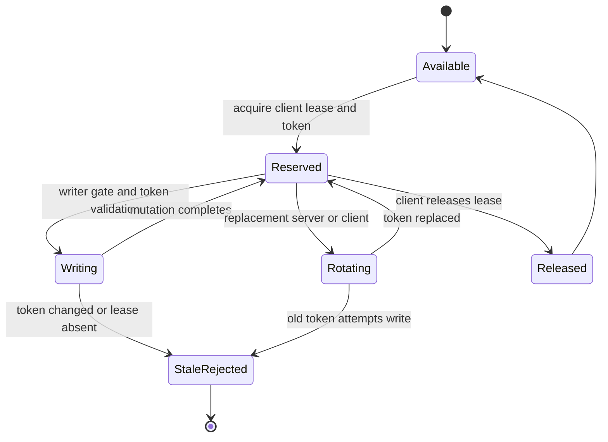

# State, Checkpoints, and Persistent Records

Persistence is deliberately divided by scope and owner. A dcode session is a LangGraph thread checkpointed in local `sessions.db`; it is neither a workspace binding nor a durable record of every auxiliary subsystem. DeepAgents graph state and its file backends have their own semantics, while Talon has a separate assistant-scoped checkpoint, archive, vector, and scheduler model. Do not treat any one of these stores as a transactional backup of the others.

## What belongs where

| Layer | Scope and authority | Persistence meaning |
| --- | --- | --- |
| dcode sessions | A LangGraph `thread_id` in the local SQLite sessions database | Resumable graph checkpoints and writes, plus checkpoint metadata used for thread discovery. |
| Local thread ownership | One local client process per dcode thread | Filesystem leases and fencing tokens prevent an old server/client from mutating a thread after release, takeover, or token rotation. |
| Workspace binding | A remote-server thread registration and validated workspace descriptor | Binds operations to a workspace; it is distinct from checkpoint storage and may need re-registration after server restart. |
| Pending-work recovery | The current graph snapshot and remote runs | Abandons unfinished nodes/tasks/interrupts rather than letting a resumed session execute stale tool work. |
| DeepAgents `StateBackend` | Current graph thread's `files` channel | Checkpointed only with graph state. |
| DeepAgents `StoreBackend` | Caller-selected `BaseStore` namespace | Cross-thread file records, durable only if the supplied store is durable. |
| Cost and offload records | dcode-owned side stores and files | Separate from checkpoints; deletion explicitly cleans them up rather than SQLite automatically owning them. |
| Talon records | Assistant-local home plus independently configured checkpoint/archive stores | A different application persistence model; Talon archive and vector data are not dcode session history. |

## dcode session database

`deepagents_code.sessions` owns the local SQLite path `DEFAULT_STATE_DIR / "sessions.db"` and hardens the state directory before using it. It opens `aiosqlite` through a cancellation-conscious wrapper: the connection timeout is extended for application operations, leaked worker threads are joined after close, and a guard preserves a SQLite handle that might otherwise be lost during cancellation while opening.

The database is LangGraph's SQLite checkpoint schema, not a hand-maintained conversation table. `list_threads()` derives rows from checkpoint metadata and makes the common listing path index-only with `idx_dcode_threads_list_v2`, so it does not scan large serialized checkpoint blobs. It can filter by agent, branch, or exact `cwd`; its in-memory list, message-count, and initial-prompt caches are presentation accelerators, not another persistent source of truth.

The messages channel may be a `DeltaChannel`, so the newest checkpoint need not contain an inline message list. For display, dcode reconstructs counts by replaying root-namespace `writes` in checkpoint/task/index order and excludes subgraph writes. It intentionally includes pending writes because the normal head-state read applies them; dcode does not create time-travel branches, so that full linear fold represents the visible head.

`get_checkpointer()` yields an ownership-fenced `AsyncSqliteSaver`. `save_thread_seed()` is the narrow bridge for discovering a remote handoff locally: it writes an initial seed only when no local checkpoint exists and later activity remains authoritative on the connected server. It holds or obtains the thread lease for the seed, stamps agent and workspace metadata, and releases only a lease it acquired itself.

## Local ownership, tokens, and fenced writes

A dcode SQLite database may be shared by the UI and its independently running `langgraph dev` process. `thread_ownership` therefore creates a per-database `.owners` directory (mode `0700`), hashes each `thread_id` for its lock-file stem, and requires operating-system file locks rather than accepting a soft-lock fallback. The reservation is process-scoped in an in-memory registry and cross-process through a `.client` file lock; different threads can be active concurrently.

Acquiring a lease writes a random owner token to the matching `.owner` file while retaining the client lock. A mutation takes a separate writer gate, validates both that its token still matches and that the client reservation is still live, then proceeds. `rotate()` takes the same gate before replacing the token, so it waits for an in-flight mutation and invalidates prior writers without releasing the reservation. Operations defer cancellation until their lock/file mutation completes, preventing an interrupted cleanup from exposing a thread prematurely.

```mermaid
stateDiagram-v2
    [*] --> Available
    Available --> Reserved: acquire client lease and token
    Reserved --> Writing: writer gate and token validation
    Writing --> Reserved: mutation completes
    Reserved --> Rotating: replacement server or client
    Rotating --> Reserved: token replaced
    Reserved --> Released: client releases lease
    Released --> Available
    Writing --> StaleRejected: token changed or lease absent
    Rotating --> StaleRejected: old token attempts write
    StaleRejected --> [*]
```
*The local lifecycle fences SQLite mutations: reservation precedes writes, rotation preserves the reservation while invalidating old tokens, and stale writers cannot write after release or takeover.*

`owned_saver_class()` applies this guard to checkpoint `aput`, pending `aput_writes`, and `adelete_thread`. The saved config retains `x-dcode-thread-owner`; a missing, released, changed, or stale token is rejected. Deletion first tries to reserve the thread, refuses an open thread, holds the reservation through the guarded database deletion, and releases afterward. Consequently an old server cannot append a checkpoint after the client crashes, changes workspace/server, or hands ownership to a successor.

`RemoteAgent` propagates the locally held token into mutation configurations and request headers. It does **not** claim reads: state reads can remain useful for discovery. An externally managed server can set `local_ownership=False`, which intentionally disables this local fencing because its storage is separate.

## Remote thread and workspace binding

The client launches a temporary `langgraph dev` workspace whose generated `checkpointer.py` reads `DEEPAGENTS_CODE_SERVER_DB_PATH` and instantiates the ownership-fenced SQLite saver. Startup resolves a required project workspace, then calls `RemoteAgent.set_workspace()` with the user cwd, workspace policy claim, and policy fingerprint.

A workspace is not encoded in the SQLite checkpoint. Before thread-scoped operations, the remote client requests a server-validated workspace descriptor and caches it per thread. A workspace switch replaces that cached binding; policy and fingerprint must be configured together. Checkpoint persistence and the dev server's HTTP thread registration are also separate: `aensure_thread()` idempotently creates the remote thread record with `if_exists="do_nothing"`, allowing a persisted checkpoint to be used after a server restart before a subsequent state mutation.

When replacing the server for a workspace change, the application rotates the active thread token before the old server can continue writing. This fencing is retained even if stopping the old server, starting the replacement, or the switch itself fails; the client that remains active must obtain/use the current token.

## Recovering unfinished graph work

A resumed state is considered pending when its snapshot has a queued `next` node, tasks, or interrupts. Resuming such work blindly is unsafe: an interrupted model turn may be queued to run a tool after its former client has gone away.

`RemoteAgent.aabandon_pending_work()` first best-effort cancels pending/running server runs. It reads the checkpoint, creates terminal error `ToolMessage` responses only for unanswered tool calls in the trailing turn, attributes those to the `tools` node, and then updates state at `__end__`. It verifies that no pending work remains. If a state update initially receives HTTP 409 because the cancelled run has not settled, `aupdate_state()` cancels active runs concurrently with bounded waits and retries once. This recovery intentionally prevents stale tool execution rather than attempting to resume it.

The integration test constructs a graph queued at `tools`, abandons it, and verifies no side-effecting tool ran, `next` and tasks are empty, and the dangling tool call has an error result. Focused ownership tests cover cross-process exclusion, client-crash rejection, in-flight-write versus rotation ordering, missing token rejection, delete cancellation, and server-replacement stale writes.

## Separation from graph, file, cost, and offload state

DeepAgents `messages` uses a `DeltaChannel` with snapshots every 50 updates. Its reducer depends on LangGraph-assigned stable IDs to deterministically replace, remove, or reset messages during replay. That graph-level mechanism explains why dcode's session browser may reconstruct the message count from writes; it does not make a browser cache a persistence layer.

`StateBackend` is a thread-scoped virtual filesystem over the graph `files` channel. It reads fresh graph state and queues partial updates through LangGraph config keys, giving same-superstep read-your-writes behavior; files persist only if the graph's checkpointer persists them. `StoreBackend`, by contrast, uses an explicit or execution-context `BaseStore` and a validated caller-selected namespace, so it can span threads that deliberately share that namespace. Neither backend is dcode's SQLite session metadata, workspace binding, or Talon archive.

dcode also owns state outside the checkpoint schema. `delete_thread()` deletes checkpoint and write rows under a lease, removes separately stored side-question costs, and then deletes offloaded history. Thus retention, backup, and deletion plans must include these records separately; a checkpoint deletion is not a general garbage collector for offload files or side costs. For accounting semantics and operator-facing costs, see [Cost and sessions](/openwiki/operations/cost-and-sessions.md).

## Talon is a separate persistence domain

Talon uses an assistant-local home with validated assistant IDs, direct-child state paths, and mode `0700` protections. It retains local model/conversation selections and cron JSON there. Its graph checkpointer is selected independently from its history archive: `DEEPAGENTS_TALON_CHECKPOINT_URI` supports built-in SQLite/file, PostgreSQL, MongoDB, or one plugin; `DEEPAGENTS_TALON_HISTORY_URI` independently selects SQLite, MongoDB, PostgreSQL, or one plugin. The default checkpoint is assistant-local SQLite; remote checkpoint thread IDs are not automatically assistant-namespaced, and changing URIs does not migrate data.

For a configured host, Talon wraps its checkpointer and archive in `ConversationSaver`. Only trusted, root checkpoint writes with Talon chat scope are eligible for archival. It registers the session's scope, persists the graph checkpoint before idempotently appending archive revisions, and then acknowledges archive completion. These are independent stores, not a transaction: archive failure after checkpoint success propagates as a repair condition, and cancellation is shielded until the sequence finishes.

Talon archive metadata, optional vectors, and operational cron records remain distinct. `StoreRecords` provides an in-process lock and redo-journal recovery for bounded idempotent archive mutations, not distributed coordination. The archive binds sessions to a trusted chat scope; vector indexes are separate derived data protected by an embedding fingerprint and can be explicitly rebuilt. Cron JSON uses atomic fsync-and-replace publication but only coordinates live stores in one process. Talon is experimental and is not a production-grade multi-tenant security boundary.

## Operational guidance and tests

- Back up, retain, and delete dcode checkpoints/writes, side costs, offload files, DeepAgents `BaseStore` records, and Talon data independently.
- Do not bypass `get_checkpointer()` or the generated ownership-aware checkpointer for a shared local dcode database. Acquire/resume the thread before mutating it, preserve the token through writes, and rotate it before server replacement.
- Treat a workspace switch as a binding/server lifecycle operation, not a move of checkpoint data. Re-register persistent threads with the remote server as needed.
- On resume, detect and abandon unfinished work before compaction or another turn when executing stale queued tools would be unsafe.
- Exercise `test_pending_work_recovery.py`, `test_thread_ownership.py`, `test_thread_ownership_transitions.py`, and `test_sessions.py` when changing these boundaries.

See [Code agent architecture](/openwiki/architecture/code-agent.md), [Configuration layering](/openwiki/concepts/config-layering.md), [Run a dcode session](/openwiki/workflows/run-dcode-session.md), and [Testing guide](/openwiki/testing/testing-guide.md).
