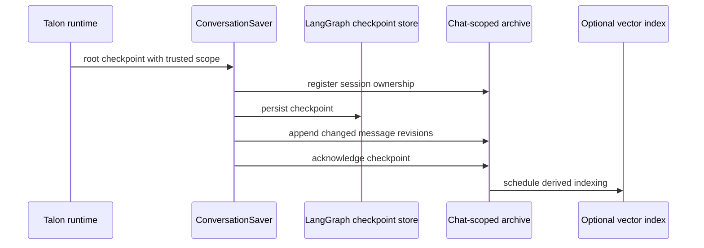

# State, Checkpoints, and Persistent Records

Talon persistence is split by purpose. A LangGraph checkpoint makes an agent thread resumable; a conversation archive makes selected chat history retrievable; a vector index accelerates retrieval but is derived; and the assistant home holds operational and scheduler state. These stores do **not** form one transaction, do not share one retention lifecycle, and checkpoint and history backends are selected independently.

> **Experimental and local-only boundary:** Talon is experimental, alpha-status software. It is not intended for production or enterprise use, and it is not a production or multi-tenant security boundary. Channel access should be treated as access to the operator's agent, credentials, tools, and host resources; sandboxing is opt-in and does not cover every integration.

```mermaid
sequenceDiagram
    participant Runtime as Talon runtime
    participant Saver as ConversationSaver
    participant Checkpoint as LangGraph checkpoint store
    participant Archive as Chat-scoped archive
    participant Vectors as Optional vector index

    Runtime->>Saver: root checkpoint with trusted scope
    Saver->>Archive: register session ownership
    Saver->>Checkpoint: persist checkpoint
    Saver->>Archive: append changed message revisions
    Saver->>Archive: acknowledge checkpoint
    Archive->>Vectors: schedule derived indexing
```
*An eligible interactive checkpoint is persisted before its transcript revisions; archive acknowledgement records completion across two independent stores.*

## Ownership map

| Record | Owner and identity | Durability role |
| --- | --- | --- |
| Graph checkpoint and pending writes | URI-selected LangGraph checkpointer, keyed by graph thread ID | Resume executable agent state. The default is the assistant home's `checkpoints.sqlite`. |
| Conversation archive | `StoreConversationArchive`, scoped by trusted channel and chat, with a session registration | Read, list, search, and erase chat history independently of graph-state mechanics. |
| Semantic vectors | A separate vector store/index keyed to archive material and an embedding generation | Derived retrieval data; it can be rebuilt from retained transcript metadata. |
| Assistant operational records | Per-assistant home | Holds model and conversation selection state, channel state, policies, media, and cron state. |
| Cron records | `<assistant home>/cron/jobs.json`, keyed by cron job ID | Durable job definitions, schedule progress, origin, delivery choice, and last-run outcome. |

Do not treat an archive as a backup of arbitrary graph state, or a vector index as the transcript authority. Likewise, deleting chat history does not imply deletion of cron jobs, assistant-home files, traces, or external backups.

## Assistant home and checkpoint selection

`TalonConfig` validates the assistant ID before deriving a home, normally `~/.deepagents/<assistant_id>`. IDs are safe path components (1–128 letters, digits, underscores, hyphens, or dots, excluding `.` and `..`). Home creation and materialized state directories use mode `0700`; state-path access verifies that the resolved file is directly inside the expected assistant home. Keep this home outside an agent workspace and manage filesystem access separately.

The home is operational state, not just a database directory. Relevant records include:

- `checkpoints.sqlite` for the default persistent LangGraph checkpoints;
- `conversations.json`, `models.json`, and `smart-model.json` for active conversation generations and model choices;
- `channels/`, `cron/`, tool policy, and inbound media directories; and
- fingerprint-specific `history-vectors-<generation>.sqlite` files when local vector indexing is used.

`DEEPAGENTS_TALON_CHECKPOINT_URI` selects the checkpointer independently of `DEEPAGENTS_TALON_HISTORY_URI`. When it is unset, `open_checkpointer()` uses the local checkpoint path as a file URI. Built-in schemes are `sqlite` and `file`, `postgres` and `postgresql`, and `mongodb` and `mongodb+srv`; remote URIs require both a host and database name. SQLite accepts a file path without a host. PostgreSQL setup is bounded to 15 seconds, while MongoDB uses finite server, connect, and socket timeouts.

An unknown scheme must have **exactly one** installed `deepagents_talon.checkpoint_backends` entry-point plugin. Its factory receives the unchanged URI and returns an async context manager yielding a ready async `BaseCheckpointSaver`; the plugin owns setup, connection options, bounded startup, cancellation, and cleanup. Built-ins take precedence. Startup exceptions other than configuration/import errors become a generalized `TalonConfigError`, so credentials embedded in a URI are not shown to the operator.

For a configured model host, the CLI opens both the selected checkpointer and history archive as owned async contexts, then passes `ConversationSaver(checkpointer, archive=archive)` to the agent. The contexts close after the host stops. Embedding hosts can supply a compatible saver directly, but must wrap it in `ConversationSaver` to get history tools and coordinated archival behavior. Changing a checkpoint URI does not migrate existing data; importantly, remote checkpoint thread IDs are **not** automatically namespaced by assistant ID. Use separate databases or an application-level thread-ID convention when assistants share a remote backend.

## Archive writes: a repairable two-store boundary

`ConversationSaver` bridges a LangGraph `BaseCheckpointSaver` and `StoreConversationArchive`. Synchronous write and administrative copy/prune APIs are deliberately unsupported so writes cannot silently bypass archival. A shared async lock serializes checkpoint/archive changes, reset, and selected deletion.

Only a root graph checkpoint carrying trusted `talon_history_channel` and `talon_history_chat` metadata is archive-eligible. Nested graph namespaces and unscoped writes remain normal checkpoints but do not enter the archive. Before checkpoint mutation, the wrapper registers the thread's archive ownership; a session is bound to its first scope and cannot subsequently move to another chat. The narrowly defined compatibility exception preserves legacy Slack public-thread history when it is accessed through its parent channel scope.

For an eligible write, the wrapper determines changed message revisions, persists the graph checkpoint, appends those revisions to the archive, then stores an archive acknowledgement for that checkpoint. There is no transaction spanning checkpoint and archive storage:

- If checkpoint persistence fails, uncommitted messages are not archived.
- If archive append fails after a successful checkpoint, the error propagates and the checkpoint remains a repair condition. Retrying the same checkpoint repairs the archive without duplicate revisions because archive chunks are revision-idempotent.
- Cancellation is shielded until the in-progress checkpoint/archive operation finishes, then cancellation is re-raised. Reset or deletion therefore cannot race an unfinished append.

Archive deletion follows the analogous retryable ordering: delete a backend thread first, then remove its archive registration. A failed step leaves the registration available for retry. Selected deletion rejects empty IDs, the current session, and running sessions; it only acts on sessions owned by the supplied chat scope. A batch can be partially complete, so retry the same requested IDs rather than assuming all-or-nothing erasure.

## Archive store, recovery, and delivery visibility

`StoreConversationArchive` stores transcript metadata through `StoreRecords`; metadata and vectors must be distinct `BaseStore` instances. It requires one active writer per namespace, read-after-write consistency, and no automatic TTL. Its bounded redo journal serializes access in-process, recovers a prior journal before records are exposed, writes the journal before an idempotent batch, and removes it only after successful replay. This makes partial batches restartable; it is neither a distributed lock nor a transaction with the checkpoint database.

Archive setup recovers records before retrieval or indexing begins, and close waits for active vector work. Session scope is authoritative: archive entries and deletion cannot cross channels or chats. Retrieval itself is bounded—pages are at most 20 items and scans stop at 500 records rather than silently claiming a complete result beyond that budget.

The archive distinguishes generated model output from a reply confirmed as delivered by the host. `record_delivery()` promotes the matching final reply (or records a delivery-specific entry) only after the host reports successful send, making it eligible for semantic indexing. If this post-delivery archive recording fails, the host logs it rather than changing the delivery result; delivery and history indexing are separate outcomes.

## History backends and derived vector indexes

`DEEPAGENTS_TALON_HISTORY_URI` selects archive metadata storage. If it is unset, history uses a separate SQLite connection to `checkpoints.sqlite`; SQLite or `file`, MongoDB, and PostgreSQL schemes are built in. Another scheme requires exactly one installed `deepagents_talon.history_backends` entry-point plugin. Archive records are namespaced by `("talon", assistant_id)`, allowing assistants to share a backend without sharing history.

Talon validates URI syntax at configuration time. Metadata startup, archive startup, and plugin failures are converted to generalized configuration errors so connection strings and credentials are not reflected in the user-facing error. Backend plugins are operator-installed, trusted code, not an isolation boundary.

Vector search is optional and independently configured. Metadata remains in the archive store while a vector backend—built in for the selected scheme or supplied by exactly one `deepagents_talon.history_vector_backends` plugin—holds embeddings. An embedding fingerprint guards reuse. If a retained index is incompatible, startup refuses it unless `DEEPAGENTS_TALON_HISTORY_REINDEX=1` is explicitly set; reindexing erases and rebuilds vectors while retaining transcripts, records durable progress, and resumes after interruption. Back up and erase transcript metadata independently from vectors, since vectors are reconstructible derived data.

## Scheduled work and cron records

`CronJobStore` persists an assistant-scoped, versioned `jobs.json`. A job records its assistant, prompt, schedule and repeat state, enablement, next/last/claim times, last status and error, delivery target, and origin. Origin contains the source conversation and channel plus optional sender and `history_chat`, allowing a scheduled Discord or Slack job to use the appropriate parent chat scope.

Publication is an atomic-file-replacement protocol: Talon serializes the complete JSON envelope to a temporary file in the cron directory, flushes and fsyncs it, sets mode `0600`, replaces `jobs.json`, and fsyncs the directory. Every live `CronJobStore` in a process that addresses the same resolved file shares a reentrant lock. That lock covers reads and complete mutations, preserving read-modify-write operations and exclusive claims even across separate store instances; it does not cover job execution or delivery. Other processes and external writers are not coordinated: each file must have one owning process. Atomic replacement is durable publication under that single-process contract, **not** a distributed transaction or cross-process cron coordination mechanism.

A scheduled invocation uses its own `:talon-cron` graph thread. When its origin has a trusted history scope, it may read that chat's archive; its graph writes are marked archive-read-only, so the unattended trace does not become transcript entries. It cannot delete history. The cron session registration is nevertheless retained so a chat reset can erase its owned checkpoint. If—and only if—the host successfully delivers a non-silent final result to the destination, it separately records that delivered reply into the origin chat's archive.

## Operating and testing this boundary

- Back up and set retention independently for checkpoints, assistant-home records, archive metadata, cron JSON, and vectors. A successful archive search does not prove a checkpoint can be resumed, and a checkpoint does not prove archive acknowledgement succeeded.
- Keep one active archive writer per assistant namespace. Run one owning process per cron file; multiple in-process `CronJobStore` instances are safe because they share the path lock, but do not add cross-process writers without storage-level coordination.
- Treat a checkpoint that lacks archive acknowledgement as repairable incomplete history. Preserve the checkpoint-first ordering and let an archive failure surface for retry.
- Plan remote checkpoint identity explicitly. Talon namespaces archive data by assistant but does not namespace remote checkpoint threads or migrate checkpoint data when its URI changes.
- Expect reset and selected deletion to be retryable but potentially partial. Stop active chat work before a full reset; do not conflate chat-history erasure with cron-job deletion.
- Focus regression tests on backend selection, plugin cleanup and credential-safe checkpointer failures; checkpoint versus archive failure ordering and cancellation; scope reassignment and scoped deletion; redo-journal recovery; scan limits; scheduled read-only history and successful-delivery recording; and overlapping cron mutations across store instances in one process.

See [Runtime behavior](/openwiki/architecture/runtime-behavior.md), [Talon scheduling](/openwiki/concepts/talon-scheduling.md), [Talon integration](/openwiki/integrations/talon.md), and [Security](/openwiki/operations/security.md).
