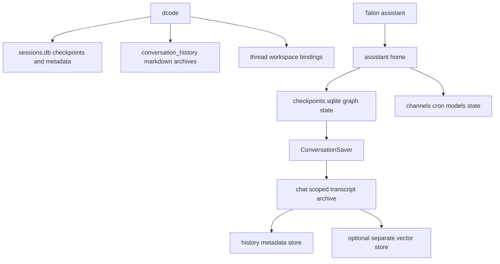

# State, Sessions, and Archives

Persistence is not one database. A LangGraph checkpointer holds executable graph state for a thread; dcode additionally records session-discovery metadata and may offload compacted transcript text; server mode pins a thread to an approved workspace; and Talon adds an assistant-scoped operational home plus a chat-scoped, transcript-oriented archive. These layers have different owners, identifiers, retention rules, and failure semantics. In particular, an archive is not a replacement for a checkpoint, and a vector index is not an archive authority.

```mermaid
flowchart TD
    Dcode["dcode"] --> DSession["sessions.db checkpoints and metadata"]
    Dcode --> DArchive["conversation_history markdown archives"]
    Dcode --> DWorkspace["thread workspace bindings"]
    Talon["Talon assistant"] --> THome["assistant home"]
    THome --> TCheckpoint["checkpoints.sqlite graph state"]
    THome --> TOps["channels cron models state"]
    TCheckpoint --> Saver["ConversationSaver"]
    Saver --> Archive["chat scoped transcript archive"]
    Archive --> Metadata["history metadata store"]
    Archive --> Vectors["optional separate vector store"]
```
*The durable layers are related at invocation time but retain independent data contracts and lifecycles.*

## LangGraph checkpoints: resumable execution state

A compiled Deep Agent accepts a LangGraph `checkpointer` independently of its `store` and cache. Its `DeepAgentState.messages` uses a delta channel with periodic snapshots, reducing growth of checkpointed message state; a checkpoint can therefore contain more than a human-readable transcript and remains the source for resuming the graph.

In local dcode, `get_checkpointer()` creates an `AsyncSqliteSaver` over the hardened global state database, `sessions.db`. Thread discovery reads LangGraph checkpoint rows and metadata, including the agent, working directory, timestamps, initial prompt, and latest checkpoint ID. The implementation maintains a covering SQLite index for thread listing so it does not scan large serialized state blobs. Deleting a dcode thread removes checkpoint and pending-write rows and associated side-question cost data; offloaded-history cleanup is deliberately best effort and does not change whether checkpoint deletion is reported successful.

Talon's normal model-host startup instead opens an `AsyncSqliteSaver` at the assistant's `checkpoints.sqlite`, runs its setup, opens the archive, and hands the agent a `ConversationSaver` wrapper. A custom embedding host can provide its own async checkpointer; history tools and reset require that it be wrapped in `ConversationSaver`. Changing Talon's history URI selects archive metadata storage only: it does not move the default graph checkpoint database.

## dcode sessions, compaction offload, and workspace bindings

### Session database and offloaded transcript recovery

dcode's `sessions.db` is a local checkpoint database, not a separate canonical conversation archive. Forced compaction summarizes checkpointed messages into graph state and writes raw compacted text as a per-thread Markdown archive. Under normal local operation, archives live in `$DEEPAGENTS_HOME/conversation_history/` (normally `~/.deepagents/conversation_history/`); the directory is hardened to `0700`. If the persistent root cannot be written, dcode uses a private temporary fallback and marks offload storage ephemeral, so an operator can understand that it may not survive restart.

Offload retention is controlled through the resolved `history.retention_days` option, including managed configuration, `DEEPAGENTS_CODE_HISTORY_RETENTION_DAYS`, and `config.toml`; `0` disables sweeping. The sweep only considers direct `.md` children and rechecks the open file's modification time immediately before unlinking, avoiding a race that could delete a concurrent archive refresh. Thread deletion also tries to remove that thread's archive and handoff recovery snapshots. It rejects suspicious IDs that would escape the archive directory and logs, rather than raises, filesystem cleanup failure.

The server-side `/offload` path has a stronger commit protocol because it must coordinate graph state and an external archive backend. It reserves the summary update, serializes the archive read/append with a per-session lock, then verifies that the follow-up checkpoint links the completed archive path. If append fails after reservation, it restores the previous state; if the archive was written but linking cannot be confirmed, it reports an indeterminate result rather than claiming success. This is still not a transaction across the checkpoint service and filesystem/backend.

### Server workspace identity is durable policy

In dcode server mode, a thread workspace binding is a server-authoritative record stored in `dcode_thread_workspaces` in the configured server database (or `sessions.db`). It contains canonical resolved `cwd` and project root, a workspace identity, generation, resource key, serialized policy, and compatibility fingerprints. The public runtime payload excludes policy and runtime fingerprints; clients may echo identity but cannot define the policy.

Binding resolves only an absolute, traversal-free, existing directory and fingerprints canonical JSON policy. `bind_thread_workspace()` creates or verifies it atomically. On later execution, `require_thread_workspace()` rejects a missing binding, mismatched context/fingerprint, unsupported schema, changed identity, or policy drift rather than silently switching a persisted thread to another workspace. Model/runtime changes can update the runtime fingerprint without invalidating a matching durable policy binding.

## Talon assistant home and operational records

`TalonConfig` derives one home per validated assistant ID, normally `~/.deepagents/<assistant_id>`. IDs are restricted to safe 1–128-character components. Home initialization stages defaults, uses mode `0700` for the home and materialized state directories, and protects state-path properties by requiring each resolved file to remain directly inside that home. Keep this operational home outside an agent workspace.

The home contains `checkpoints.sqlite`, active conversation generations in `conversations.json`, model selections in `models.json`, smart-model selection in `smart-model.json`, channel-session state under `channels/`, tool policy in `tools.json`, and downloaded inbound media. These are operational state, distinct from transcript archive metadata. Cron records live in `<home>/cron/jobs.json`: each job retains its assistant ID, prompt, schedule/repeat data, origin conversation scope, enablement, next/last run times, claim time, status, and error. The cron store publishes complete rewrites by fsyncing a `0600` temporary file, atomically replacing `jobs.json`, and fsyncing its directory; it is designed for Talon's single-writer model rather than cross-process coordination.

## Talon archive: checkpoint-derived, scoped transcripts

`ConversationSaver` composes an asynchronous LangGraph saver and a `StoreConversationArchive` without owning either lifecycle. It deliberately rejects synchronous writes and administrative copy/prune routes that could bypass archival. Its shared lock serializes checkpoint/archive mutation with reset and deletion.

Only root checkpoints carrying trusted host metadata `talon_history_channel` and `talon_history_chat` are archive input. Nested graph namespaces and unscoped writes are excluded. On an eligible write the saver registers the session in its trusted chat scope, determines changed message revisions, persists the graph checkpoint, appends archive revisions, and acknowledges the checkpoint in archive metadata. Checkpoint persistence thus precedes archive append. There is no cross-store transaction: archive failure propagates after a committed checkpoint, and a retry can repair it because archive revisions are idempotent. Cancellation is shielded until both writes finish, then re-raised.

A session binds to its first archive scope and cannot subsequently be appended from another chat scope or while deletion is under way. Clearing a chat deletes each owned backend thread before deleting archive registration, retaining registration after a failed deletion so the reset can be retried. Selected session deletion protects the current session and can be partially complete; retry the same IDs.

Scheduled work is intentionally different. A cron run gets its own `:talon-cron` graph thread and may read the origin chat's scoped history, but marks checkpoint writes archive-read-only and cannot delete history. If the host successfully delivers its final result to the origin chat, the host can record that delivered reply in the archive. This preserves user-visible results without turning an entire unattended execution trace into a chat transcript.

## History metadata and optional semantic indexes

`open_history()` selects metadata storage from `DEEPAGENTS_TALON_HISTORY_URI`; absent that variable it opens SQLite using the checkpoint path as a URI, with a separate connection. Built-ins are SQLite/file, MongoDB, and PostgreSQL. Any other scheme needs exactly one operator-installed `deepagents_talon.history_backends` entry-point plugin; unknown and duplicate schemes fail rather than fall back. Startup validates URI shape and converts backend, plugin, and archive failures to generalized configuration errors, avoiding credential disclosure. Metadata is namespaced by `("talon", assistant_id)`.

`StoreConversationArchive` treats metadata and vectors as separate stores. `StoreRecords` supplies single-process serialized mutation and redo-journal recovery for archive records: recovery precedes access, a bounded journal is persisted before idempotent batch operations, and clearing occurs only after success. This provides recovery for one active in-process writer, not a distributed lock or a transaction with graph checkpoints.

Vector search is optional derived data. Its backend is independently selected by the storage scheme or one vector-plugin entry point, and its embedding fingerprint guards compatibility. A mismatch requires explicit `DEEPAGENTS_TALON_HISTORY_REINDEX=1`, which removes/rebuilds vectors while retaining transcripts and records progress for interruption recovery. Archive startup recovers metadata before work begins and waits for outstanding vector work on close. Consequently backup, retention, and erasure plans must include checkpoints and transcript metadata; vectors can be rebuilt.

## Operations and verification

- Back up and manage retention separately for checkpoints, dcode offload archives, Talon archive metadata, and assistant-home operational files. Do not infer the presence of one from another.
- Surface dcode's ephemeral-offload condition to users: a temporary fallback is deliberately recoverable only for the current environment, not a durable history guarantee.
- Do not weaken `ConversationSaver` ordering or swallow archive errors. A committed checkpoint with an unacknowledged archive is a repair condition, not permission to fabricate atomicity.
- Treat Talon cron state as independent of history reset; reset does not delete job definitions. Keep a single operational writer for `jobs.json` and archive records.
- Test the boundaries: dcode tests should cover fallback/retention and workspace-context refusal; Talon tests should cover injected versus default checkpointers, archive retry/cancellation and scope isolation, URI error redaction, vector reindex recovery, and scheduled read-only history with final-delivery recording.

See [Code agent](/openwiki/architecture/code-agent.md), [Runtime behavior](/openwiki/architecture/runtime-behavior.md), [Context management](/openwiki/concepts/context-management.md), [Talon scheduling](/openwiki/concepts/talon-scheduling.md), and [Cost and sessions](/openwiki/operations/cost-and-sessions.md).
