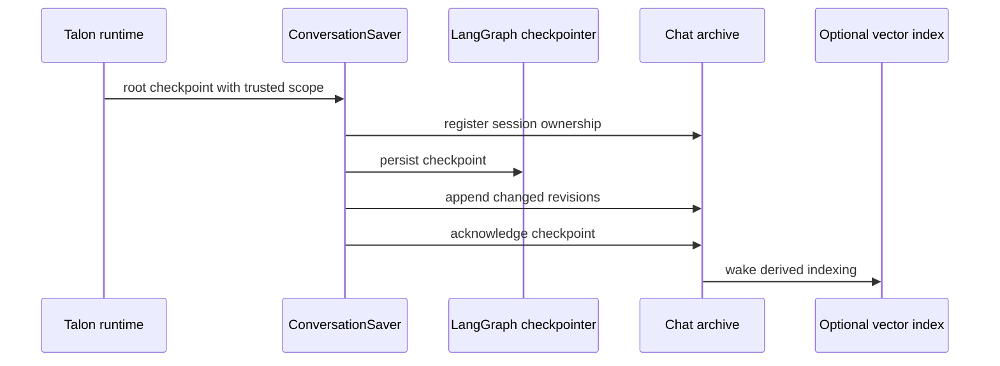

# State, Checkpoints, and Persistent Records

Persistence in this repository is deliberately split by **what is being retained** and **who may reuse it**. DeepAgents state belongs to a LangGraph execution/thread; a `StoreBackend` is a separately named cross-thread file store; Talon's checkpoint makes a graph thread resumable; its archive makes selected chat history retrievable; and assistant-home and cron files retain local operational choices. These are not interchangeable backups, do not have one retention lifecycle, and—except where a specific implementation says otherwise—do not share a transaction.

> **Security boundary:** Talon is experimental, not intended for production or enterprise use, and not a production-grade multi-tenant security boundary. Channel access should be treated as access to the operator's agent, credentials, tools, and host resources.

```mermaid
sequenceDiagram
    participant Runtime as Talon runtime
    participant Saver as ConversationSaver
    participant Checkpointer as LangGraph checkpointer
    participant Archive as Chat archive
    participant Vectors as Optional vector index

    Runtime->>Saver: root checkpoint with trusted scope
    Saver->>Archive: register session ownership
    Saver->>Checkpointer: persist checkpoint
    Saver->>Archive: append changed revisions
    Saver->>Archive: acknowledge checkpoint
    Archive->>Vectors: wake derived indexing
```
*An eligible interactive checkpoint is durable before its transcript revisions; acknowledgement records archive completion across independent stores.*

## Scope and ownership at a glance

| Layer | Identity and scope | What survives / recovery meaning |
| --- | --- | --- |
| DeepAgents graph state | LangGraph state channels within one graph thread | A checkpointer can restore the thread state; without a durable checkpointer, `StateBackend` files are only ephemeral graph state. |
| `StateBackend` files | The current graph's `files` state channel | They are checkpointed with graph state after agent steps, are isolated to a conversation thread, and cannot be read or written outside graph execution. |
| `StoreBackend` files | Caller-defined, validated `BaseStore` namespace | Persistent across threads sharing that namespace. The application, not the backend, chooses an identity such as user or assistant. |
| Talon graph checkpoint | Checkpointer URI and graph `thread_id` | Resumes executable graph state and pending writes. It is not automatically a chat-scoped transcript. |
| Talon conversation archive | Assistant namespace plus trusted channel/chat scope and registered session | Lists, reads, searches, and deletes retained chat history independently from graph checkpoint mechanics. |
| Vector index | Archive material plus embedding generation | Derived search data, separately stored and rebuildable from retained archive metadata. |
| Assistant home and cron | Per-assistant local home; cron JSON per home | Retains local selections, channel and scheduler state. It is independent of archive/checkpoint deletion. |

Do not treat an archive as a backup of arbitrary graph state, a vector index as transcript authority, or `StoreBackend` as a Talon conversation archive. Conversely, clearing a conversation does not by itself remove cron jobs, assistant-home files, external backups, or a separately configured cross-thread store.

## DeepAgents: graph state versus file backends

`DeepAgentState` puts `messages` on a `DeltaChannel` with a snapshot frequency of 50 to reduce message-checkpoint growth. Its reducer converts message-like inputs, preserves stable message IDs assigned by LangGraph before serialization, replaces an existing ID, removes a tombstoned ID, and honors `REMOVE_ALL_MESSAGES`. That stability matters on replay: assigning new IDs in the reducer would make replay differ from the persisted checkpoint.

The default `StateBackend` is a virtual file system over the graph `files` channel, not a host directory or independent database. It reads through `CONFIG_KEY_READ` with `fresh=True`, so pending writes are reduced for read-your-writes behavior in the same superstep. It queues partial dict updates with `CONFIG_KEY_SEND`; the `files` reducer merges updates, and `None` is a deletion marker. Consequently, files follow the lifetime and recovery properties of the graph/checkpointer and are visible only in the current thread. Direct use outside a graph context is rejected; seed initial files through graph invocation state.

Use `StoreBackend` when file-like data must span graph threads. It obtains an explicit `BaseStore` or the graph's `get_store()`, then stores each path as a key in a namespace returned by the caller's factory. Namespace components must be nonempty safe strings; validation rejects wildcard-like characters that could affect store lookups. The factory may derive scope from runtime identity, but that is an application isolation decision—not an automatic user/assistant namespace. `StoreBackend` writes with `put`/`aput`; recursive deletion searches its namespace and removes the exact key and descendants. It is persistent only to the extent that the supplied `BaseStore` is durable.

## Talon assistant home and checkpoint selection

`TalonConfig` validates the assistant ID before deriving the normal home, `~/.deepagents/<assistant_id>`. IDs are safe path components (1–128 letters, digits, underscores, hyphens, or dots, excluding `.` and `..`). The home and materialized state directories use mode `0700`, and state-path resolution verifies that a named state file remains directly inside the expected home.

The home is operational state, not merely a checkpoint directory. It includes the default `checkpoints.sqlite`; `conversations.json`, `models.json`, and `smart-model.json`; channel, cron, policy, and inbound-media state; and local fingerprint-specific vector files. Talon persists model selections in `models.json`, active conversation generations in `conversations.json`, and assistant-scoped jobs in `cron/jobs.json`.

`DEEPAGENTS_TALON_CHECKPOINT_URI` selects the LangGraph saver independently of `DEEPAGENTS_TALON_HISTORY_URI`. Unset uses the assistant-local SQLite checkpoint path. Built-ins accept SQLite/file, PostgreSQL, and MongoDB schemes; an unknown scheme needs exactly one `deepagents_talon.checkpoint_backends` entry-point plugin. The plugin receives the unchanged URI and returns an async context manager for an initialized async `BaseCheckpointSaver`; it owns its setup and cleanup. Built-ins take precedence, and initialization failures are sanitized to avoid exposing credentials in connection URIs.

For a model host, Talon opens the selected checkpointer and history archive as async contexts and supplies an agent with `ConversationSaver(checkpointer, archive=archive)`. Changing the checkpoint URI does not migrate data. Archive data is namespaced by assistant ID, but remote checkpoint thread IDs are **not** automatically namespaced by assistant ID; use separate databases or a deliberate thread-ID convention when sharing a remote checkpoint backend.

## Checkpoint-to-archive bridge: ordering, scope, and repair

`ConversationSaver` wraps a `BaseCheckpointSaver` and a `StoreConversationArchive` while leaving ownership of both stores with its caller. It disables synchronous write and administrative copy/prune paths so callers cannot silently bypass archive coordination. A shared async lock serializes checkpoint/archive updates, reset, and deletion.

Only a root graph checkpoint with trusted `talon_history_channel` and `talon_history_chat` metadata is archive eligible. Nested graph namespaces and unscoped writes remain normal graph checkpoints but are excluded from the archive. Before persistence, the wrapper registers the session's archive ownership; a session cannot be reassigned to a different chat scope or appended while deletion is in progress. The Slack parent-channel compatibility case is narrowly defined in archive scope checking.

For an eligible write, the saver derives changed message revisions, persists the graph checkpoint, appends the revisions to the archive, then acknowledges that checkpoint in the archive. There is no cross-store transaction:

- A failed checkpoint is not archived.
- If archive append fails after a successful checkpoint, the error propagates and the checkpoint is a repair condition. Retrying archives idempotent revisions without duplicates.
- Cancellation is shielded until the checkpoint/archive work completes, then re-raised; reset or deletion cannot race an unfinished append.
- Pending graph writes are persisted by the underlying checkpointer and enter the archive when their next checkpoint commits.

History clearing and selected deletion first delete the backend thread and then its archive registration. This is intentionally retryable rather than atomic: scope-limited deletion rejects empty IDs, the active session, and running sessions; a partially completed batch should be retried with the same IDs.

## Archive records, retrieval, and semantic indexing

`StoreConversationArchive` retains transcript metadata through `StoreRecords`; metadata and optional vectors must use separate `BaseStore` instances. It needs one active writer per namespace, read-after-write consistency, and no automatic TTL. `StoreRecords` holds an in-process lock, recovers an existing redo journal before exposing records, journals at most 12 idempotent writes before applying them, and clears the journal only after replay succeeds. This makes interrupted batches recoverable, but is neither distributed locking nor a transaction with the checkpointer.

Archive setup recovers records before retrieval or background indexing starts, and close waits for vector work. Session registration binds each session to trusted channel/chat scope, so reads, appends, and deletion cannot cross scopes. Retrieval pages are capped at 20 entries and scans at 500 records; exceeding scan budget raises an error instead of returning a complete-looking partial answer.

An AI reply becomes semantically indexable only after `record_delivery()` follows a successful, non-silent host delivery. The host logs failure to record this history without changing the send result. This deliberately distinguishes generated output, delivery, and derived semantic indexing.

`DEEPAGENTS_TALON_HISTORY_URI` selects the durable archive metadata backend. If unset, it uses SQLite at the checkpoint path; SQLite/file, MongoDB, and PostgreSQL are built in, and another scheme needs exactly one `deepagents_talon.history_backends` plugin. Talon namespaces archives by `("talon", assistant_id)`. It validates history URI syntax and converts metadata, plugin, and archive startup failures into generalized configuration errors so URI credentials do not surface.

Vectors are optional, independently selected from metadata storage, and guarded by an embedding fingerprint. An incompatible retained index requires explicit `DEEPAGENTS_TALON_HISTORY_REINDEX=1`; rebuilding preserves transcript metadata and records progress so it can resume after interruption. Treat vectors as disposable derived data and back up/retain archive metadata separately.

## Cron state and scheduled runs

`CronJobStore` retains an assistant-scoped versioned `cron/jobs.json`. Each record includes its assistant, prompt, schedule/repeat state, enabled/next/last/claim timing, last status/error, delivery choice, and an origin conversation/channel with optional sender and `history_chat`. It publishes changes by fsyncing a mode-`0600` temporary JSON file, atomically replacing `jobs.json`, then fsyncing the directory.

Live `CronJobStore` instances addressing the same resolved file share a reentrant in-process lock over reads and complete mutations. Other processes and external writers are not coordinated; one process must own each cron file. Atomic replacement is durable publication within that contract, not distributed scheduling or a cross-store transaction.

A scheduled invocation uses its own `:talon-cron` graph thread. When trusted origin scope exists, it may read the origin chat archive, but its graph writes are archive read-only and it cannot delete history. Its registration is retained so chat reset can remove its checkpoint. A final result is added to the origin archive only after successful non-silent delivery.

## Operations and focused tests

- Back up and define retention separately for graph checkpoints, `StoreBackend` data, archive metadata, cron JSON, assistant-home files, and vectors. Successful archive retrieval does not prove that a graph can resume, and a checkpoint does not prove archive acknowledgement completed.
- Keep one active archive writer per namespace and one owning process per cron JSON file. Do not rely on either local lock for inter-process coordination.
- Preserve checkpoint-first ordering. Investigate and retry a checkpoint without archive acknowledgement rather than hiding an archive failure.
- Choose `StateBackend` for thread-scoped checkpointed working files; choose `StoreBackend` only with an intentionally designed durable store and namespace. Neither choice makes host files, Talon home, or chat archive automatically persistent.
- Test state reducer replay and same-superstep read-your-writes; `StoreBackend` namespace validation and cross-thread scope; checkpoint/archive failure ordering and cancellation; redo-journal recovery; scoped deletion; retrieval limits; successful-delivery indexing; and concurrent cron mutations within one process.

See [Runtime behavior](/openwiki/architecture/runtime-behavior.md), [Backends](/openwiki/concepts/backends.md), [Talon scheduling](/openwiki/concepts/talon-scheduling.md), [Security](/openwiki/operations/security.md), and [Testing guide](/openwiki/testing/testing-guide.md).
