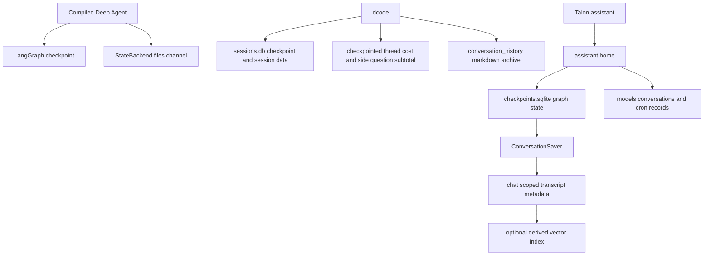

# State, Sessions, and Archives

Persistence is not one database. A LangGraph checkpointer holds executable state for a thread; SDK state-backed files live in that graph state; dcode adds session discovery, cost state, transcript offload, and server workspace policy; and Talon adds an assistant home and a chat-scoped transcript archive. These layers have different owners, identifiers, retention, and failure semantics. An archive does not replace a checkpoint, a vector index is not an archive authority, and a cost total is not an independently transactional ledger.

```mermaid
flowchart TD
    Agent["Compiled Deep Agent"] --> Checkpoint["LangGraph checkpoint"]
    Agent --> StateFiles["StateBackend files channel"]
    Dcode["dcode"] --> DSession["sessions.db checkpoint and session data"]
    Dcode --> DCost["checkpointed thread cost and side question subtotal"]
    Dcode --> DArchive["conversation_history markdown archive"]
    Talon["Talon assistant"] --> THome["assistant home"]
    THome --> TCheckpoint["checkpoints.sqlite graph state"]
    THome --> TOps["models conversations and cron records"]
    TCheckpoint --> Saver["ConversationSaver"]
    Saver --> Archive["chat scoped transcript metadata"]
    Archive --> Vectors["optional derived vector index"]
```
*Checkpoints, state-backed files, cost state, transcript archives, vector indexes, and cron state are related but independently durable contracts.*

## Graph state and state-backed files

A compiled Deep Agent accepts a LangGraph `checkpointer` independently of its `store` and cache. `DeepAgentState.messages` uses a delta channel with periodic snapshots, reducing checkpoint growth while retaining graph-resume state rather than merely a readable transcript.

`StateBackend`, the default backend when no backend is supplied, represents files in the graph's `files` state channel. It reads through LangGraph's `CONFIG_KEY_READ` and sends partial updates through `CONFIG_KEY_SEND`; the dict-merge reducer preserves untouched files. Reads request fresh channel state, so a write can be read within the same superstep, while the update becomes committed at the node boundary. The files follow the conversation thread's checkpoints and do not cross thread boundaries. The backend is not a general filesystem: using it outside a graph context or without those config capabilities raises a clear `RuntimeError`.

Deletion is represented as `None` updates for the exact file and nested keys, so deleting a directory is recursive in the state namespace. Uploads retain the original creation timestamp on overwrite and encode non-UTF-8 bytes as base64; downloads restore the bytes. These details make checkpoint compatibility, rather than host filesystem semantics, the persistence contract.

## dcode: sessions, costs, offload, and workspace identity

### Session checkpoints and cost state

In local dcode, `get_checkpointer()` opens an `AsyncSqliteSaver` over the hardened global `sessions.db`. Thread discovery reads LangGraph checkpoint rows and metadata, including agent, working directory, timestamps, initial prompt, and latest checkpoint ID. A covering SQLite index supports thread listing without scanning large serialized state blobs. Deleting a thread removes checkpoint and pending-write rows and its side-question cost data before attempting best-effort cleanup of offloaded history and handoff snapshots.

The graph owns dcode's cumulative main-thread estimate: `CostTrackingMiddleware` writes additive private state updates that ride normal checkpoints, rather than trusting a client-side lifetime counter. A process-wide recorder collects completed model requests; the middleware drains, prices, and checkpoints them, with a fallback for an unrecorded main-agent response to avoid double counting. Unpriceable calls retain usable token information but contribute no dollar estimate, and pricing failures must not fail a model turn.

Server-owned operations such as offload call `prepare_operation_cost()` to drain a rollback-capable delta. The operation must persist that delta with its own state update or call `rollback()` if abandoned. Nested agents checkpoint private spend before an interruption, then transfer their completed totals through parent-owned state. Side questions are deliberately separate: their recorder persists a subtotal in `sessions.db` because they may finish after the main graph has stopped. The UI combines reported totals only for display.

### Compaction offload and workspace bindings

`sessions.db` is a checkpoint database, not a canonical conversation archive. Forced compaction summarizes messages into graph state and writes raw compacted text as per-thread Markdown. Normal local archives live in `$DEEPAGENTS_HOME/conversation_history/`, normally `~/.deepagents/conversation_history/`, under a `0700` directory. If the persistent root cannot be used, dcode uses a private temporary fallback and records that offload storage is ephemeral.

The resolved `history.retention_days` setting controls cleanup; `0` disables sweeping. The sweep considers direct `.md` children and rechecks modification time before unlinking so it does not race an archive refresh. Thread deletion rejects IDs that could escape the archive directory and logs cleanup failures rather than changing checkpoint-deletion success.

In server mode, `dcode_thread_workspaces` is a durable, server-authoritative binding from a thread to canonical `cwd`, project root, identity, serialized policy, schema, and compatibility fingerprints. Clients cannot define that policy. Subsequent execution refuses a missing or incompatible binding, identity change, or policy drift rather than silently running a persisted thread in a different workspace; a runtime fingerprint can be updated without changing a matching durable policy.

## Talon assistant home and operational records

`TalonConfig` derives one home per validated assistant ID, normally `~/.deepagents/<assistant_id>`. IDs are restricted to safe 1–128-character components. Home setup applies `0700` to the home and materialized state directories, and state-path properties verify that a resolved file remains directly inside that home. Keep this operational home outside an agent workspace.

The home contains `checkpoints.sqlite`, active conversation generations in `conversations.json`, model selections in `models.json`, smart-model selection in `smart-model.json`, channel-session state under `channels/`, tool policy, and inbound media. These are operational records, distinct from transcript archive metadata. Talon starts its model host by opening an `AsyncSqliteSaver` at `checkpoints.sqlite`, running setup, opening history, and supplying a `ConversationSaver` wrapper to the agent. A supplied/injected checkpointer bypasses default SQLite-checkpoint creation.

Cron state is a third contract: `<home>/cron/jobs.json` stores assistant-scoped job definitions. Each record carries its assistant ID, prompt, schedule and repeat details, enablement, run/claim times, status/error, delivery choice, and origin. Origin metadata includes the conversation ID, channel, source message, sender, and an optional parent `history_chat` for public Discord threads. Complete rewrites are fsynced to a mode-`0600` temporary JSON file and atomically replaced into the `0700` cron directory, then the directory is fsynced. This is durable publication for Talon's single-writer model, not cross-process coordination.

## Talon archive: checkpoint-derived and chat-scoped

`ConversationSaver` composes an asynchronous LangGraph saver and a `StoreConversationArchive`. It serializes graph/archive mutation with a shared lock, rejects synchronous bypasses, and coordinates reset and deletion with in-flight appends.

Only root checkpoints with trusted `talon_history_channel` and `talon_history_chat` metadata become archive input; nested namespaces and unscoped writes are excluded. For an eligible checkpoint it registers the session in its trusted chat scope, calculates changed message revisions, persists the graph checkpoint, appends archive revisions, then acknowledges the checkpoint in archive metadata. The order matters: there is no cross-store transaction. Archive failure propagates after checkpoint persistence, and retry repairs the archive without duplicates because revisions are idempotent. Cancellation is shielded until both writes complete, then re-raised.

A session is bound to its first archive scope and cannot later be appended from another scope or while deletion is occurring. Clearing a chat deletes owned backend threads before archive registrations; a failure retains registration for retry. Selected deletion protects the active session and may be partially complete, so retry the same IDs.

Scheduled work has deliberately different history semantics. A cron run has its own `:talon-cron` graph thread and may read the origin chat's scoped history, but its checkpoint writes are archive read-only and it cannot delete history. If the host successfully delivers the final result to the original chat, it can archive that delivered reply. Thus an unattended execution trace does not become a user transcript, while the visible response can remain searchable.

## Archive metadata and derived vector indexes

`open_history()` selects archive metadata storage from `DEEPAGENTS_TALON_HISTORY_URI`; without it, Talon uses SQLite at the checkpoint path as a URI but with a separate connection. SQLite/file, MongoDB, and PostgreSQL are built in; any other scheme requires exactly one `deepagents_talon.history_backends` entry-point plugin. The archive namespace is `("talon", assistant_id)`. URI syntax is validated and backend/plugin/archive startup errors are generalized so connection credentials are not exposed.

`StoreConversationArchive` deliberately keeps transcript metadata and optional vectors in separate stores. `StoreRecords` serializes access for one in-process writer, recovers an earlier redo journal before use, persists a bounded journal before idempotent batches, and clears it only after successful recovery. This enables record recovery, not a distributed lock or a transaction with checkpoints.

Vector search is derived data. It is selected independently by storage scheme or one vector entry-point plugin and guarded by an embedding fingerprint. An incompatible retained index requires `DEEPAGENTS_TALON_HISTORY_REINDEX=1`; reindexing retains transcripts and records enough progress to resume after interruption. Archive opening recovers records before use, and close waits for outstanding vector work. Back up, retain, and erase checkpoint data and transcript metadata independently; vectors can be rebuilt.

## Operational guidance and focused verification

- Plan backup and erasure by contract: graph checkpoints and `StateBackend` files, dcode cost/side-question records, dcode offload Markdown, Talon archive metadata, Talon operational-home files, cron JSON, and derived vectors do not share an atomic lifecycle.
- Treat a committed checkpoint with an unacknowledged Talon archive as a repair condition. Do not weaken `ConversationSaver` ordering or convert archive errors into a false atomic-success result.
- Surface dcode ephemeral-offload storage; it is useful recovery data in the current environment, not a restart-durable archive guarantee. Likewise, treat cost totals as estimates checkpointed with graph state, with separately persisted side-question subtotals.
- Keep a single operational writer for Talon `jobs.json` and archive records. Resetting chat history is not cron-job deletion.
- Focus tests on the boundaries: `StateBackend` rejects out-of-graph access and preserves byte uploads; dcode tests cover deletion ordering, offload retention/fallback, cost rollback and workspace refusal; Talon tests cover injected/default checkpointers, archive retry/cancellation/scope isolation, URI redaction, reindex recovery, cron publication/origin fields, and scheduled read-only history with final-delivery recording.

See [Runtime behavior](/openwiki/architecture/runtime-behavior.md), [Backends](/openwiki/concepts/backends.md), [Talon scheduling](/openwiki/concepts/talon-scheduling.md), and [Cost and sessions](/openwiki/operations/cost-and-sessions.md).
