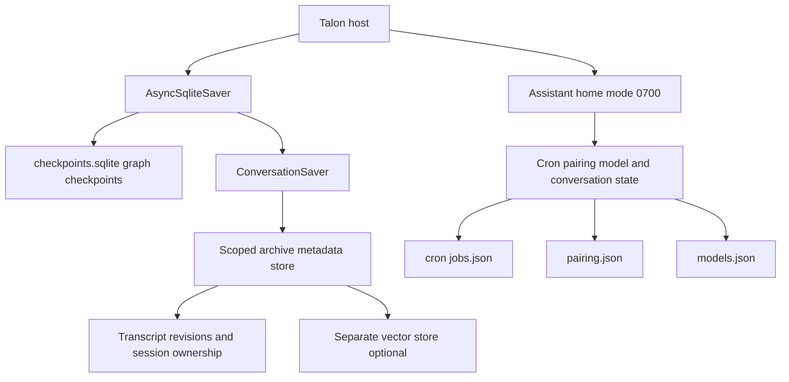

# State and Persistence

Talon persists several kinds of state with deliberately separate ownership and failure boundaries. Each assistant has a hardened home directory, LangGraph checkpoints make its threads resumable, a conversation archive makes prior interactive chats discoverable, and operational files retain configuration such as cron jobs, pairing, and model choices. A vector index is an optional derived search structure, not the transcript authority.

```mermaid
flowchart TD
    Host["Talon host"] --> Home["Assistant home mode 0700"]
    Host --> Checkpointer["AsyncSqliteSaver"]
    Checkpointer --> Checkpoints["checkpoints.sqlite graph checkpoints"]
    Checkpointer --> Saver["ConversationSaver"]
    Saver --> Archive["Scoped archive metadata store"]
    Archive --> Metadata["Transcript revisions and session ownership"]
    Archive --> Vectors["Separate vector store optional"]
    Home --> Operational["Cron pairing model and conversation state"]
    Operational --> Cron["cron jobs.json"]
    Operational --> Pairing["pairing.json"]
    Operational --> Models["models.json"]
```
*Graph checkpoints, archive metadata, optional vectors, and assistant-owned operational state have separate data contracts and lifecycles.*

## Assistant home and durable operational state

`TalonConfig` derives a per-assistant home as `<base home>/<assistant_id>` (normally `~/.deepagents/<assistant_id>`). Assistant IDs are limited to 1–128 letters, digits, underscores, hyphens, or dots, preventing path traversal through the ID. `ensure_home()` creates and re-applies mode `0700` to the home and its materialized manifest, `agents/`, `cron/`, `channels/`, and inbound-media directories. State-path resolution also verifies that `checkpoints.sqlite`, `conversations.json`, `models.json`, and vector database files remain immediately inside that assistant home.

The host loads conversation-generation state from `conversations.json` and per-conversation `/model` selections from `models.json`; a selection is therefore durable across host construction rather than merely an in-memory setting. Sender pairing is separately persisted in `pairing.json`. Its store reads the final component without following symlinks, accepts only a bounded regular file, serializes read-modify-write mutations with an exclusive sidecar lock, and atomically replaces the file. Its read cache is keyed by file identity, so a replacement used by revocation invalidates cached admission; unreadable or invalid pairing state fails closed and admits only environment-configured senders.

Cron state is likewise assistant-scoped but independent of chat archives: `CronJobStore` stores its job collection in `<home>/cron/jobs.json`. A job records its prompt, schedule, origin conversation/channel, enablement, next and last run data, and status. The running host is the cron store's writer; administrative maintenance that changes it should occur while Talon is stopped.

## Checkpoints and host startup

With a configured model and no caller-supplied checkpointer, the CLI opens `AsyncSqliteSaver` at `config.checkpoint_path`, calls `setup()`, opens history, and gives `ConversationSaver(sqlite_checkpointer, archive=archive)` to the agent runtime. Thus `checkpoints.sqlite` is the durable LangGraph source for graph state and resumability, while the wrapper adds archive behavior. An embedding host may instead supply a checkpointer; Talon uses that supplied object and does not create the default SQLite database.

A checkpoint is not an archive record. It can include graph state beyond messages and is addressed by its LangGraph thread ID. The archive is an independent transcript-oriented store, so backup, retention, and erasure must consider both stores. The default history URI is the checkpoint path as a SQLite URI, but it is opened through a separate store connection; setting a remote history URI does **not** move graph checkpoints away from local SQLite.

## ConversationSaver: commit order, scopes, and repair

`ConversationSaver` wraps an asynchronous LangGraph checkpoint saver without taking ownership of the saver or archive lifecycle. It rejects synchronous write and administrative copy/prune paths so that normal checkpoint writes cannot silently bypass archive behavior. A single wrapper lock serializes checkpoint/archive mutation and deletion for its archive.

For a root graph checkpoint with trusted `talon_history_channel` and `talon_history_chat` metadata, the saver first registers the session's archive ownership and determines changed message revisions. It then persists the checkpoint through the wrapped saver, appends those revisions to the archive, and finally acknowledges the checkpoint in archive metadata. Nested graph namespaces and unscoped checkpoints are not interactive transcript archive input.

The ordering is intentional and has important consequences:

1. **Checkpoint persistence precedes archive append.** A checkpoint write failure produces no archived messages.
2. There is **no cross-store transaction**. An archive failure propagates after the checkpoint has committed, leaving repairable divergence rather than pretending the write failed everywhere.
3. Repeating the same checkpoint write, or a later checkpoint, repairs an unacknowledged parent archive. Archive entries are idempotently deduplicated by session, message identity, revision, and chunk part, so repair does not create duplicate revisions.
4. Cancellation does not interrupt this sequence halfway. `aput()` shields its task until checkpoint and archive work finish, then re-raises `CancelledError`; reset/deletion waits on the same lock and cannot race an unfinished archive append.

Archive scope is host-supplied channel/chat identity, not a model-selected value. The first append binds a session to that scope; later appends from another scope, or appends while deletion is in progress, fail before corrupting ownership. Clearing a chat deletes each owned backend thread before deleting its archive registration. A failed backend deletion leaves registration and transcript available for retry; selected-conversation deletion can similarly be partially complete and retried.

## Archive metadata, history backends, and vectors

`open_history()` resolves `DEEPAGENTS_TALON_HISTORY_URI` by URI scheme. It checks built-in stores first—`sqlite`/`file`, `mongodb`/`mongodb+srv`, and `postgres`/`postgresql`—then requires **exactly one** trusted, operator-installed `deepagents_talon.history_backends` entry point for any other scheme. Zero or multiple plugins fail closed; an unknown scheme never falls back to SQLite. A history plugin receives the unchanged URI and owns its connection setup and cleanup.

Configuration validation requires a URI scheme with no whitespace or fragment; each backend then validates its own path, host, and database requirements. History startup is bounded and translates connection, driver, plugin, setup, and archive-initialization exceptions into generalized `TalonConfigError` messages. This prevents a URI or its credentials from appearing in startup errors. Metadata is namespaced as `("talon", assistant_id)`, isolating assistants that share a history database.

`StoreConversationArchive` expects an unindexed metadata `BaseStore` with read-after-write consistency and no automatic TTL. `StoreRecords` hashes the caller namespace into a versioned namespace and provides recovery for one active in-process writer: it takes a lock, replays any prior journal before exposing records, writes a bounded redo journal, applies idempotent batch operations, and removes the journal only after successful replay. Its cancellation helper finishes a storage mutation before re-raising cancellation. This is restart recovery, not a distributed lock or a transaction with the checkpointer.

Archive metadata and vector indexing must use different `BaseStore` instances. Archive startup recovers metadata before retrieval or index workers begin, and shutdown waits for outstanding indexing before caller-owned stores close. Keyword retrieval remains against retained transcript chunks. Optional semantic search indexes only user messages and final AI replies confirmed as delivered by the host; attachment binaries and tool results are not the archive's vector input.

Vector backend selection follows the history URI scheme but uses separate storage: local SQLite vector generations use assistant-home `history-vectors-<fingerprint>.sqlite`, MongoDB uses separate collections, and PostgreSQL uses generation setup. A non-built-in history scheme needs exactly one `deepagents_talon.history_vector_backends` plugin when vectors are needed. The embedding fingerprint captures index compatibility; if retained vectors do not match the selected profile, startup fails unless `DEEPAGENTS_TALON_HISTORY_REINDEX=1` explicitly erases and rebuilds vectors while preserving transcripts. Rebuild progress is durable, so it resumes after interruption. The index is therefore reconstructible derived data, not the history system of record.

## Scheduled work is not an interactive transcript

Scheduled runs still have persistent LangGraph checkpoints, using a job-specific `:talon-cron` thread. When a job has an origin channel/chat, Talon supplies that scope so the run can list, search, and read the origin chat's history; deletion is prohibited for scheduled history tools. Its graph invocation marks archive writes read-only, so scheduled prompts, tool activity, and intermediate model messages do not become an interactive transcript merely because a job ran.

This differs from delivery: when the host successfully delivers a scheduled final result to the origin chat, delivery recording can promote that final reply into the scoped archive. Consequently, history can contain what a user actually received without treating the entire scheduled execution trace as conversation history. Resetting that chat clears its owned cron-thread checkpoint alongside its registered archive sessions, but does not remove the independent cron job definition.

## Operational guidance and focused tests

- Keep assistant state outside an agent workspace and protect the assistant home: it contains checkpoints, history configuration/state, pairing admissions, model selections, and cron jobs.
- Use a history URI appropriate for archive metadata, but operate checkpoints and archive retention independently. Never report raw history connection failures to users or logs that could expose credentials.
- Preserve `ConversationSaver` ordering and its cancellation shield. Do not add a compensating archive write before checkpoint persistence or swallow archive failure: callers need the error to repair a committed checkpoint without duplicate transcript revisions.
- Treat vectors as disposable derived data. Change an embedding model or profile only with an intentional compatibility plan or `DEEPAGENTS_TALON_HISTORY_REINDEX=1`.
- Keep scheduled execution semantics distinct from interactive chat archival: origin-scoped read access is not permission to archive the run or delete chat history.

The focused Talon tests exercise default SQLite checkpoint persistence and injected checkpointers, URI validation and credential-redacted backend/plugin failures, archive retry and cancellation ordering, scope isolation, and scheduled history read-only behavior with final-delivery recording.

See [Runtime behavior](/openwiki/architecture/runtime-behavior.md), [Talon channel admission](/openwiki/concepts/talon-channel-admission.md), [Talon scheduling](/openwiki/concepts/talon-scheduling.md), [Talon](/openwiki/integrations/talon.md), and [Security](/openwiki/operations/security.md).
