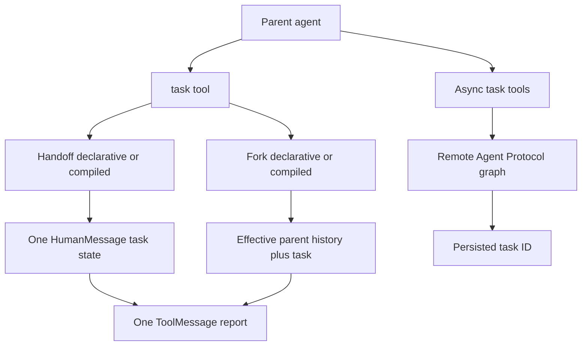

# Subagents & Skills

Deepagents provides two complementary middleware extensions. **Subagents** delegate work to an agent or remote graph; **skills** make a reusable instruction library discoverable without putting every instruction in every prompt. The SDK mechanisms below are distinct from dcode's product-level source assembly and filesystem discovery. See [middleware stack](/openwiki/architecture/middleware-stack.md), [SDK construction and execution](/openwiki/architecture/sdk-construction-execution.md), [context management](/openwiki/concepts/context-management.md), and [permissions and HITL](/openwiki/concepts/permissions-hitl.md).

## Four delegation paths

`create_deep_agent` sorts supplied definitions by shape: `graph_id` means remote `AsyncSubAgent`, `runnable` means `CompiledSubAgent`, and the remainder is a declarative `SubAgent`. Inline declarative and compiled entries are exposed through synchronous `task`; async entries receive a separate background-task tool suite.

*Inline handoff and fork return a report through `task`; the async path launches remote work and returns a durable handle instead.*

### `task`: handoff isolation and result boundary

`SubAgentMiddleware` exposes delegation to the main agent through a single `task` tool whose arguments are a free-form `description` and a `subagent_type` selecting which registered subagent to run. Names must be unique; duplicate names are rejected because selection by name would otherwise be ambiguous. An unknown type returns an explanatory tool result, while a missing tool-call ID is a `ValueError`.

Each ordinary `task` invocation runs a subagent statelessly in an isolated context window: the tool builds a fresh state whose messages are a single `HumanMessage` carrying the delegation description, after stripping `messages`, `todos`, `structured_response`, the internal fork marker, and any private middleware state keys from the parent state. It is therefore important to put task context and the requested output in `description`.

This is state isolation, not configuration isolation. The parent's callbacks, tags, and configurable reach the subagent automatically via LangGraph's per-key config merge, so the task tool only stamps `ls_agent_type="subagent"` on the subagent run rather than re-forwarding parent config. The tracing wrapper preserves the enclosing tracing context while adding the same marker.

When a subagent completes, the task tool returns the subagent's structured_response (JSON-serialized) as the ToolMessage content if present; otherwise it uses the last non-empty AIMessage text, deliberately skipping a trailing empty end_turn message. Apart from the explicitly excluded and private keys, returned state updates are also included in the command sent to the parent, so isolation does not make arbitrary compatible state updates invisible.

A CompiledSubAgent runnable is used as-is and must return a state containing a `messages` key; returning state without `messages` raises a ValueError, because that key is how results flow back to the parent. Compiled runnables likewise do not inherit `create_deep_agent(state_schema=...)`; their author owns compatibility with any state they need.

### Declarative compilation, defaults, and permissions

A declarative `SubAgent` is compiled with `create_agent`. It requires a unique `name` and `description`; the builder fills its model and tools from the parent unless the spec overrides them. `create_sub_agent` itself requires resolved `model` and `tools`, adds `HumanInTheLoopMiddleware` when `interrupt_on` is present, and supports a declared `response_format`.

Declarative subagents carry their own middleware stacks: the graph builder prepends a default FilesystemMiddleware, summarization middleware, and PatchToolCallsMiddleware before the spec's custom middleware, and appends a SkillsMiddleware when the spec declares `skills`. Harness-profile middleware, prompt caching, exclusions, and custom middleware placement are then applied by the same stack-building machinery. A custom filesystem middleware can replace the default stack slot.

A declarative subagent may override the parent's model and tools and set its own filesystem `permissions`, which replace the parent's rules entirely when provided and otherwise inherit the parent's. Rules are evaluated in declaration order and the first match wins. Derived permission interrupts are merged with explicit `interrupt_on`, connecting a narrower delegated filesystem policy to the same approval mechanism as the parent.

`GENERAL_PURPOSE_SUBAGENT` is a built-in SubAgent spec (name "general-purpose") that the graph builder auto-adds with the parent's model, tools, and a default middleware stack unless the harness profile disables it or the caller already supplied a spec with the same name.

Declarative subagents support structured output via a `response_format`, and callers can request a per-invocation dynamic response format through the `__deepagents_subagent_response_format` config key, which is rejected for CompiledSubAgent entries. The dynamic case recompiles the raw specification for that invocation rather than mutating a cached compiled runnable.

### Fork mode: inherited effective context

`mode="fork"` is an experimental alternative to the default `handoff` mode. It gives the child the parent's effective conversation rather than only the delegation description. Before appending a preamble and the requested task, the middleware removes a trailing assistant tool-call message and applies the parent's summarization event to its history; a fork therefore sees compacted effective history rather than messages the parent has already evicted.

A declarative fork inherits the parent's state except prior structured response and summarization bookkeeping, including private channels so mirrored prompt-producing middleware can rebuild the parent's system prompt. Its own system prompt is an addendum to that inherited prompt. It mirrors parent skills and memory when configured, and cannot declare `skills` itself; the builder rejects that combination. A compiled fork is intentionally more conservative: it gets neither private state nor fields excluded for regular task transfer because an opaque runnable may not declare those channels.

Forks retain a guarded `task` tool so their tool layout can mirror the parent, but their initial state carries a private fork marker and a call returns a refusal rather than recursively launching another subagent. The appended preamble also tells the fork that historical delegation already occurred, preventing it from treating the replayed conversation as a fresh instruction to delegate.

## Remote asynchronous subagents

AsyncSubAgentMiddleware runs subagents as background tasks on remote Agent Protocol servers via the LangGraph SDK: start_async_task creates a thread and run and returns a task_id immediately instead of blocking, and the middleware also provides check, update, cancel, and list tools. `check_async_task` fetches the run and, on success, returns the last remote thread message. `update_async_task` interrupts the current run and starts another run on the same thread, preserving the task ID and remote conversation history.

Async subagent tasks are persisted in agent state under `async_tasks` (a task-id-keyed dict with a merging reducer) so they survive context compaction and remain programmatically inspectable. Status checks and listing update timestamps and cached records; terminal statuses avoid needless live lookups, while live-status failures fall back to the stored status.

Async subagent clients are lazily created and cached per (url, headers); omitting `url` uses in-process ASGI transport reachable only via an async parent entrypoint, while the synchronous path requires a URL and raises if none is configured. Default headers add `x-auth-scheme: langsmith` unless the specification already supplies it; self-hosted deployments can provide their own headers.

## Skills: metadata first, instructions on demand

SkillsMiddleware implements progressive disclosure: it injects each skill's name and description into the system prompt and tells the model to read the listed SKILL.md path only when a task matches, keeping context small while making the full skill library reachable on demand. Supporting files remain available beneath that skill directory.

Each skill is a directory whose SKILL.md YAML frontmatter is parsed into SkillMetadata; name and description are required while license, compatibility, metadata, and allowed-tools are optional, and defensive validation skips oversized, non-UTF8, or malformed skills with a warning instead of crashing prompt rendering. Invalid naming convention is warned for compatibility, while missing required metadata prevents loading; overlong descriptions and compatibility strings are truncated for the prompt.

SkillsMiddleware uses backend APIs exclusively (ls/download_files and their async variants) rather than direct filesystem access, making skill loading portable across state, filesystem, and remote backends. Skills are loaded from ordered sources where later sources override earlier ones on name collision (last one wins), enabling layering such as base → user → project → team.

SkillsMiddleware loads skills once per session in before_agent/abefore_agent, skipping the load when skills_metadata is already in state, and stores metadata and recoverable per-source load errors as private state attributes not propagated to parent agents. Load diagnostics are bounded and framed as untrusted text before prompt insertion. An explicit `(path, label)` source controls its display label; bare paths derive a label from their leaf, with special handling for `built_in_skills` and `skills` directories.

The SkillsMiddleware system-prompt template requires the {skills_locations}, {skills_load_warnings}, and {skills_list} format slots, and passing system_prompt=None skips prompt injection while skills are still loaded into state.

## dcode assembly and filesystem definitions

The deepagents_code package resolves bundled skills from its `built_in_skills/` directory and registers that directory as the lowest-priority `(path, "Built-in")` source in dcode's ordered skill source list. When dcode enables skills, it installs PluginSkillsMiddleware with a FilesystemBackend and ordered sources from bundled and plugin skills through user/project Deepagents and Agents directories to experimental Claude directories; later sources have higher collision precedence.

PluginSkillsMiddleware preserves SDK loading for ordinary sources, but recursively discovers plugin skill directories and qualifies their names with the plugin namespace before last-one-wins merging. This namespacing is dcode behavior, not a generic SDK skill-name rule.

The deepagents_code app also loads filesystem-defined subagents from .deepagents/agents/{name}/AGENTS.md markdown files, where frontmatter `name` is optional and defaults to the folder name and the markdown body becomes the system_prompt, diverging from the Agent Skills spec which requires name. A non-empty `description` is required and `model`, if present, must be a string. Definitions with malformed YAML, unreadable files, wrong placement, a missing `AGENTS.md`, or invalid fields are logged and skipped; project definitions override user definitions. dcode turns accepted entries into declarative SDK subagents and adds its CLI-specific approval, configurable-model, and nested cost middleware.

## Focused change tests

The unit tests under `libs/deepagents/tests/unit_tests/` are the practical contract for this area. Subagent tests cover handoff state filtering and result extraction, compiled-runnable validation, response-format overrides, fork compaction/prompt inheritance/recursion refusal, middleware order, permission inheritance, and default general-purpose registration. Async tests cover client selection, errors, remote task lifecycle, reducer behavior, and sync-versus-ASGI constraints. Skills tests cover parsing and malformed inputs, source precedence and labels, private one-time loading, prompt-template validation, backend sync/async loading, and warning framing. When changing a state key, middleware order, or an invocation path, extend the corresponding focused test rather than relying only on an end-to-end prompt snapshot.

## Related

- [Middleware stack](/openwiki/architecture/middleware-stack.md)
- [SDK construction and execution](/openwiki/architecture/sdk-construction-execution.md)
- [Context management](/openwiki/concepts/context-management.md)
- [Permissions and HITL](/openwiki/concepts/permissions-hitl.md)
- [State persistence](/openwiki/concepts/state-persistence.md)
- [Build a deep agent](/openwiki/workflows/build-a-deep-agent.md)
