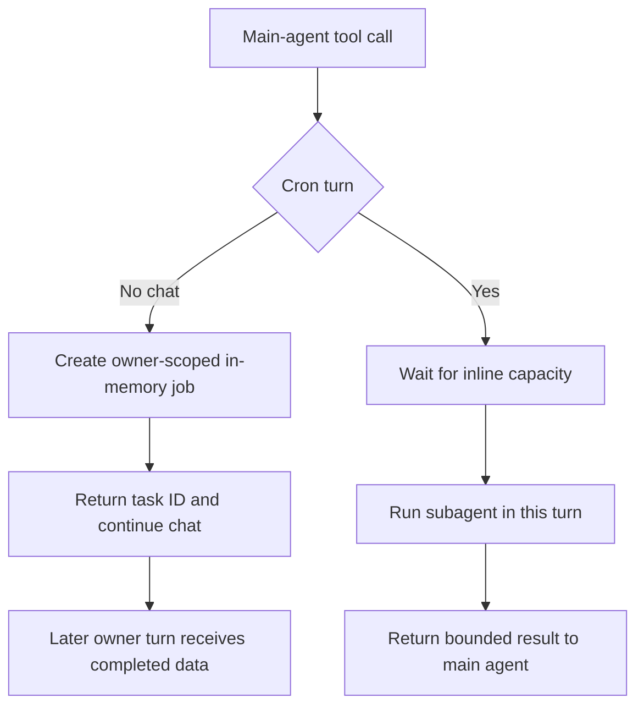

# Subagents and Skills

Talon uses configured subagents for focused delegated work. The relevant boundary is a **capability boundary**, not a sandbox: a locally compiled child receives fresh task input and only explicitly attached tools, while a graph snapshot determines which definitions and attachments a turn or already-started task continues to use. Delegation has two execution modes selected by the invoking turn: chat launches a background job and later receives its result; cron waits for an inline result in the same scheduled turn.

This page covers Talon’s delegation contract. For parent context and SDK `fork` semantics, see [Context management](/openwiki/concepts/context-management.md); for approval rules, see [Permissions and human-in-the-loop](/openwiki/concepts/permissions-hitl.md); for MCP configuration and authorization, see [MCP](/openwiki/integrations/mcp.md); and for persistent conversation behavior, see [State persistence](/openwiki/concepts/state-persistence.md).

## Two execution modes

`BackgroundSubagents` intercepts the SDK `task` and `start_async_task` tools only when called by the main agent. A nested child call is refused, so a delegated child cannot recursively launch local or remote work. The runtime sets the scheduled-turn flag only when `request.metadata["trigger"] == "cron"`; it resets the flag at the end of every invocation. A background-result delivery turn is not a cron turn, so it retains chat behavior and can detach new work.

*Chat delegation returns a handle for later delivery, whereas cron delegation returns the subagent outcome to the same turn.*

### Chat turns: detached jobs and later delivery

For a non-cron call, Talon requires a non-empty conversation thread ID, creates a `subagent-{uuid}` record, and starts a worker in a copied context. The record is owner-scoped: `list_subagents` lists only the caller’s thread and `cancel_subagent` rejects another conversation’s task ID. The worker receives a distinct task thread ID and runs local work or a remote stream independently of the parent turn. It returns the task ID immediately and instructs the main agent to continue the user conversation rather than poll.

Chat jobs are process-memory state. Talon retains at most 128 records and allows at most four running workers; a capacity hit refuses the launch. A worker has a one-hour timeout, caps stored text at 64,000 characters, turns exceptions and timeouts into generic result text, and cancels a remote stream on disconnect. It clears the authorization handler and operator flag before running, though copied scoped context such as history scope and cron origin remains available to attached tools. An approval interrupt therefore reports that the protected action did not run rather than waiting for an operator.

When a non-cancelled job has a result, the next delivery turn for its owner receives it as a synthetic data message. The runtime acknowledges it only after that main-agent turn completes, and returns the consumed IDs to the host. If the host discards that reply, it can requeue only those IDs. If a delivery turn fails, Talon retries the pending result; after three failed deliveries it marks it dropped. Cancelling a conversation’s workers also discards its completed results. Neither jobs nor pending results survive a process restart.

### Cron turns: inline, bounded, and non-interactive

A cron turn has nobody to converse with while work runs and no later user turn into which to inject a result. Talon therefore runs `task` and `start_async_task` inline: the tool call waits for the result, returns it directly to the scheduled main graph, and creates **no** job record. In this mode, `start_async_task` streams the configured remote graph itself instead of using the SDK pollable task mechanism. `list_subagents` and `cancel_subagent` are hidden from the model because the cron turn owns no background jobs.

Inline delegation has bounds separate from chat workers. It has a semaphore of four concurrent inline calls; additional cron fan-out waits rather than being refused, and it does not consume or contend with the four chat-worker slots. The default inline timeout is 600 seconds, distinct from the detached worker’s one-hour timeout. `DEEPAGENTS_TALON_INLINE_SUBAGENT_TIMEOUT` can override it with a positive integer number of seconds. Queue time does not consume that timeout; the timeout begins after an inline slot is acquired. Inline outputs are also clamped to 64,000 characters because a scheduled thread is reused on later fires.

Cron delegation disables interactive authority in two ways. The scheduled prompt tells the model to use each result in the same turn rather than await later delivery, and the scheduled invocation cannot set the approval-operator flag. An approval-gated tool is therefore denied through the scheduled approval flow, while the inline helper converts delegation errors and timeouts into sanitized tool errors instead of letting them escape and retry the whole graph. The child still cannot perform nested delegation.

## Local definitions and fresh compilation

Talon has no implicit `general-purpose` child. Without configured definitions there is no `task` tool; a configured child named `general-purpose` is only an ordinary named definition. At startup and explicit reload, the runtime reads local definitions from `agents/{name}/AGENTS.md`—using `assistant_dir/agents` when it exists, otherwise the parent directory’s `agents` directory—then combines those with supplied and loader-backed definitions. Names must be unique across all sources.

A local file uses YAML frontmatter plus a Markdown body. It requires a non-empty `description`; `name` falls back to the directory name, an optional `model` must be a string, and the body becomes the system prompt. Missing, unreadable, or malformed local files are skipped, but a duplicate resolved local name fails the load. Local `mode` may only be `fresh`; Talon rejects `fork` for local, supplied, and compiled specs.

The optional `tools` list contains unique, non-empty exact names. Talon resolves them from the parent graph’s attachment catalog before compilation and rejects unavailable attachments. `web: true` is boolean-only and additionally makes the configured web tools available. It is the declared option, not an agent name, that grants those web attachments.

A local definition is compiled as a fresh graph with its selected model, prompt, and attachments. The input adapter retains only `messages`; the child has no checkpointer, and task invocations use a recursion limit of 500. Thus the delegated description is the only user message: parent chat history, memory, skills, filesystem and shell tools, archive and reload tools, and delegation tools are not automatically carried into the child. This is an explicit compilation and attachment boundary; it does not claim operating-system or network sandboxing.

## Per-task capability additions and protections

`get_agent_tools` exposes a credential- and prompt-free attachment inventory. For a local child it reports configured tools and the parent tool names eligible for dynamic selection; opaque compiled and remote definitions report `tools: null`. The inventory also distinguishes the graph captured by the current turn from the latest active graph and reports saved changes that are not active.

A parent may use `task(..., tools=[...])` only with a named local child. Each requested name must be unique and selectable from the parent catalog; delegation and management tools are excluded. The request recompiles that one fresh child with its configured tools plus missing requested attachments—it cannot replace persisted attachments or edit `AGENTS.md`. Invalid, duplicate, unavailable, or opaque-child selections do not run a child.

Every locally compiled child installs `talon_mcp_middleware`. For a metadata-marked MCP attachment, it normalizes arguments against the tool schema, binds authorization invocation state, and converts `MCPError` to a sanitized `ToolMessage` containing only the code and message. This applies to configured and dynamically selected MCP tools in both inline and detached delegation.

Fresh compilation filters the current approval policy to enabled rules whose names are actually attached, then installs `HumanInTheLoopMiddleware` for that subset. Consequently, an explicitly attached protected tool still requires approval. Detached workers and cron turns cannot acquire an operator decision; their results report that the protected action has not run.

## Remote definitions and graph snapshots

The CLI provides `load_async_subagents` to `DeepAgentRuntime`. It reads `[async_subagents.<name>]` tables from `~/.deepagents/config.toml`: `description` and `graph_id` are required non-empty strings, `url` is an optional non-empty string, and `headers` must map strings to strings. A missing file or section yields no definitions. Unreadable or malformed TOML, a non-table section, or one invalid entry rejects the whole load rather than leaving a partial remote configuration active.

Remote definitions are loaded at startup and explicit reload, not on every turn. A configured middleware copy binds its remote targets to the graph snapshot. Therefore an already-started remote job continues with its original graph ID, URL, and headers after a reload; the same snapshot principle applies to already-running local work.

`reload_subagent_configuration` resolves and constructs a replacement graph under the tools lock before assigning either the resolved definitions or active graph. Failure leaves the previous graph active and returns a non-sensitive failure response from the exposed reload tool. Each invocation captures its graph in a context variable, so reload affects subsequent turns only. Removing an attachment or definition is not immediate revocation of running tasks: use `list_subagents` and `cancel_subagent` before relying on the capability change.

## Operations and focused tests

- Use chat delegation for work that may outlive a reply and should be delivered back to that conversation. Monitor and cancel it through `list_subagents` and `cancel_subagent`; account for its in-memory lifecycle and delivery retries.
- Use cron delegation when the scheduled graph must act on findings in that firing. Size `DEEPAGENTS_TALON_INLINE_SUBAGENT_TIMEOUT` to the schedule; a stalled inline call costs scheduled-run time, not a background slot.
- When changing attachments, test both configured and dynamic paths. The research-subagent tests cover fresh context, absent implicit delegation, exact attachments, dynamic additions, MCP middleware, approvals, web capability, and reload inventory.
- The background tests cover owner-scoped chat jobs, delivery acknowledgement and requeueing, result redaction, remote target snapshots, plus cron inline execution, concurrency queueing, timeout behavior, result clamping, and hidden job-management tools. Host tests cover the absence of approval and authorization handlers on background-result delivery turns and scheduled-run lifecycle behavior.

## Related

- [Context management](/openwiki/concepts/context-management.md)
- [Permissions and human-in-the-loop](/openwiki/concepts/permissions-hitl.md)
- [State persistence](/openwiki/concepts/state-persistence.md)
- [MCP](/openwiki/integrations/mcp.md)
- [Talon](/openwiki/integrations/talon.md)
- [Testing guide](/openwiki/testing/testing-guide.md)
