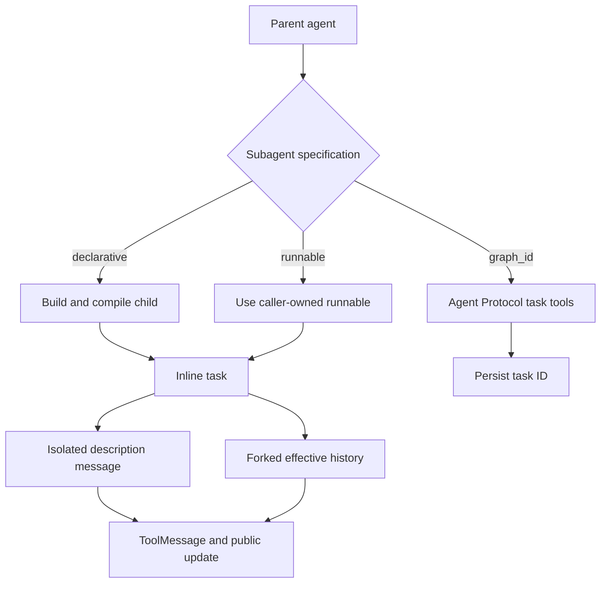

# Subagents, Skills, and Background Work

Deepagents offers two complementary extension mechanisms. **Subagents** delegate work across local, caller-owned, or remote execution boundaries. **Skills** disclose an instruction library by metadata first, avoiding an always-expanded prompt. Talon layers detached, in-memory background work over SDK delegation. See [middleware stack](/openwiki/architecture/middleware-stack.md), [state persistence](/openwiki/concepts/state-persistence.md), [Talon](/openwiki/integrations/talon.md), and [build a deep agent](/openwiki/workflows/build-a-deep-agent.md).

## Select a delegation boundary

`create_deep_agent` classifies `subagents` entries structurally:

- `graph_id` selects a remote `AsyncSubAgent` and installs asynchronous task tools.
- `runnable` selects a caller-owned `CompiledSubAgent` behind the inline `task` tool.
- Other entries are declarative `SubAgent` specifications: the builder supplies inherited defaults, builds their middleware, and compiles them for `task`.

Inline subagents default to **`isolated`**. `handoff` is retained as a legacy alias for isolation, not conversation transfer. Experimental **`fork`** is the only context-inheriting mode. Invalid modes, duplicate inline names, and a separate `skills` declaration on a declarative fork fail validation.

*Delegation chooses either a blocking inline report boundary or a remote task handle; only forked inline work inherits conversation context.*

## Inline `task`: isolation, configuration, and results

`SubAgentMiddleware` exposes one structured `task(description, subagent_type)` tool. The named type selects the child. Unknown types return a tool error; a valid invocation without a tool-call ID raises `ValueError`, because the parent-side `Command` must attach a `ToolMessage` to that ID.

### Isolated state is not configuration isolation

An isolated child gets a fresh `messages` value containing only `HumanMessage(description)`. Parent `messages`, `todos`, `structured_response`, the fork marker, and private middleware state are excluded. Put all necessary context, scope, and reporting requirements in the description.

This is state and prompt isolation, not configuration isolation. LangGraph's ambient per-key configuration merge carries parent callbacks, tags, metadata, and configurable values. The middleware adds only `ls_agent_type="subagent"` for tracing; a child runnable's bound configuration wins collisions such as run name and recursion limit.

The child must return `messages` or delegation raises `ValueError`. A non-null `structured_response` is JSON-serialized (including Pydantic models and dataclasses); otherwise the middleware uses the last non-empty `AIMessage` text. It returns that report as a parent `ToolMessage` plus compatible non-private state updates. Messages, todos, structured output, the fork marker, and private middleware keys do not cross back, though deliberately public custom channels can.

A `CompiledSubAgent` is opaque caller-owned code and does not inherit the builder's `state_schema`; compile it with a compatible `messages` key. A declarative spec is compiled by `create_sub_agent`, which requires resolved `model` and `tools`, accepts an optional state schema, adds `HumanInTheLoopMiddleware` for `interrupt_on`, and selects its response format. A raw declarative spec may receive a per-call `configurable["__deepagents_subagent_response_format"]` override; this recompiles it for that call and is rejected for compiled entries.

## Declarative defaults, permissions, and forks

A declarative child inherits parent model, tools, and filesystem permissions unless it overrides them. Supplying permissions replaces parent rules; filesystem rules are evaluated in declaration order and the first match wins. Permission-derived interrupts merge with explicit `interrupt_on`.

The normal child stack starts with filesystem, summarization, and patching middleware. Declared skills follow those core entries; profile middleware, prompt caching, exclusions, and custom middleware handling follow. The builder adds `general-purpose` with the parent model, tools, permissions, and default stack unless the harness profile disables it or an inline child already uses that name.

### Fork mode

A fork reconstructs the parent's **effective** history: it drops a trailing AI message with unresolved tool calls, applies the parent summarization event, then appends a human task preamble. The preamble establishes that delegation has already happened and directs the child to finish the task rather than delegate again.

A declarative fork rebuilds the inherited prompt and receives parent state, including private channels, except prior structured output plus summarization event and session bookkeeping. It mirrors the parent skill and memory prompt-producing middleware when configured, but cannot define a separate skill library. A compiled fork receives effective messages but omits private and ordinary task-excluded state because its schema is unknown. Both retain a guarded `task` tool; the private fork marker makes nested delegation return a refusal.

## SDK remote asynchronous subagents

`AsyncSubAgentMiddleware` manages Agent Protocol graphs independently of inline `task`. It provides `start_async_task`, `check_async_task`, `update_async_task`, `cancel_async_task`, and `list_async_tasks`.

Starting work creates a LangGraph SDK thread and run with the description as a user message, then immediately persists and returns the thread ID as `task_id`. The `async_tasks` reducer merges records by task ID, retaining remote thread/run IDs and timestamps through updates and compaction. Unknown types and launch failures return tool error text rather than a task record.

Checking reads the tracked run and, on success, retrieves the remote thread's final message. Updating creates a replacement run on the same remote thread using `multitask_strategy="interrupt"`; the task ID remains stable while the run ID changes. Cancellation calls the remote cancellation endpoint and records `cancelled`.

Task listing filters by **cached** status before live lookups. Terminal `cancelled`, `success`, `error`, `timeout`, and `interrupted` entries are not queried; failed live lookups retain cached status. Consequently, a prior tool result is not a current-status guarantee.

Clients are created lazily and cached by URL plus resolved headers. `x-auth-scheme: langsmith` is added unless provided, while custom headers support self-hosted servers. An absent URL means in-process ASGI transport and requires an asynchronous parent entrypoint such as `ainvoke`; synchronous invocation then raises `ValueError`.

## Skills: metadata first, instructions on demand

`SkillsMiddleware` implements progressive disclosure. Before a session it lists each backend source, examines immediate subdirectories, downloads candidate `SKILL.md` files, and injects a skill index into the system message. The index contains source locations, name, description, optional license and compatibility annotations, allowed tools, and the exact path to read. It directs the model to read full instructions only when applicable; support files remain available beneath the skill directory. Sources can be paths or `(path, label)` pairs.

A skill needs YAML frontmatter with non-empty `name` and `description`. Loading is defensive: malformed frontmatter or YAML, inaccessible content, non-UTF-8 bytes, and oversized files are skipped with warnings. Invalid name format or directory-name mismatch warns for compatibility but does not prevent loading. Descriptions and compatibility fields are bounded, and later sources replace same-named earlier skills.

`skills_metadata` and recoverable `skills_load_errors` are private state. Loading happens once per session or checkpointed state: if `skills_metadata` is already present, including as an empty list, it does not reload. A custom prompt template must contain `{skills_locations}`, `{skills_load_warnings}`, and `{skills_list}`. `system_prompt=None` suppresses prompt injection only, not discovery; rendered source errors are bounded, escaped untrusted diagnostics.

## dcode: filesystem definitions and contained skill reads

The dcode CLI discovers subagents at `.deepagents/agents/{name}/AGENTS.md`. YAML frontmatter requires non-empty `description`; the Markdown body is the `system_prompt`, and `model` is optional but must be a string. Omitted `name` falls back to the folder name, while a present blank or non-string name is invalid. Malformed, unreadable, misplaced, or incomplete definitions are skipped with warnings. Project definitions override user definitions with the same resolved name.

For interactive skills, dcode wraps the SDK parser with a local `FilesystemBackend`. Its precedence ascends through built-in, plugin, per-agent user `.deepagents`, user `.agents`, project `.deepagents`, project `.agents`, experimental user Claude, and experimental project Claude locations. Higher sources override equal names. Discovery exposes slash commands and pre-resolved allowed roots. Reading a full `SKILL.md` resolves its path and refuses a path outside those roots, including a symlink escape; configured extra directories and approved trusted directories can extend the allowlist.

## Talon: fresh agents, attachments, background delivery, and reload

Talon is experimental and has its own layer around the SDK. It loads remote definitions from `[async_subagents.<name>]` tables in `~/.deepagents/config.toml`. Each requires non-empty string `description` and `graph_id`; `url` is optional but non-empty when present, and `headers` must map strings to strings. A missing file yields no remote agents. The loader is fail-closed: unreadable or malformed configuration, a non-table section, or any invalid definition raises `ValueError` rather than silently activating a partial set. The CLI passes that loader into `DeepAgentRuntime`.

Talon compiles local `AGENTS.md` subagents as **fresh** task-only agents with optional exact tool attachments and the operator approval policy. SDK fork mode is unsupported. Its `task` wrapper can add selected catalog tools to a named local agent for one task, but cannot replace configured tools; duplicate or unavailable names are rejected. `get_agent_tools` reports a credential-free attachment inventory: configured tool names for inspectable local agents, `null` for opaque compiled or remote agents, selectable tool names, and whether saved edits are inactive.

Unlike the SDK's durable remote-task state, `BackgroundSubagents` detaches both inline `task` and `start_async_task` into bounded in-memory workers. Work is scoped to the owning conversation, exposed through `list_subagents` and `cancel_subagent`, and each job runs with a distinct thread ID. The main agent does not see the SDK polling/update/cancel async tools; it continues the conversation while work runs. Remote workers stream the configured graph and request cancellation on disconnect.

Finished, non-cancelled results are injected into the owning main-agent turn as data and acknowledged only after that turn completes. If the host later discards that reply, it can requeue exactly those result IDs. A failed delivery is retried up to three times before the result is marked dropped; cancellation suppresses delivery. This is operationally distinct from persistent task state and is lost on runtime restart.

`reload_subagent_configuration` explicitly resolves and validates replacement definitions under the tools lock, then activates a replacement graph for subsequent turns. Definitions are not automatically reloaded. A failed reload leaves the previous graph active; running turns and background jobs retain their original graph and capabilities, so inspect and cancel them before treating a removal as complete.

## Focused tests and safe changes

SDK tests cover routing and default registration, mode validation and the legacy alias, fork prompt/state differences and recursion refusal, dynamic response formats, duplicate names, result extraction, private-state filtering, configuration merge behavior, remote task reducers and timestamps, headers, cached filtering/live refresh, and ASGI restrictions. Skills tests cover backend loading, malformed candidates, precedence, private one-time state, and template validation.

Talon tests exercise TOML parsing, fresh local-agent attachments, conversation ownership and capacity limits, cancellation, result acknowledgement/requeue, and reload behavior. Preserve boundary tests when changing this code: state inheritance, capability attachment, source precedence, result delivery, and reload semantics are lifecycle and security contracts.

## Related

- [Middleware stack](/openwiki/architecture/middleware-stack.md)
- [Middleware catalog](/openwiki/concepts/middleware-catalog.md)
- [State persistence](/openwiki/concepts/state-persistence.md)
- [Talon](/openwiki/integrations/talon.md)
- [Build a deep agent](/openwiki/workflows/build-a-deep-agent.md)
