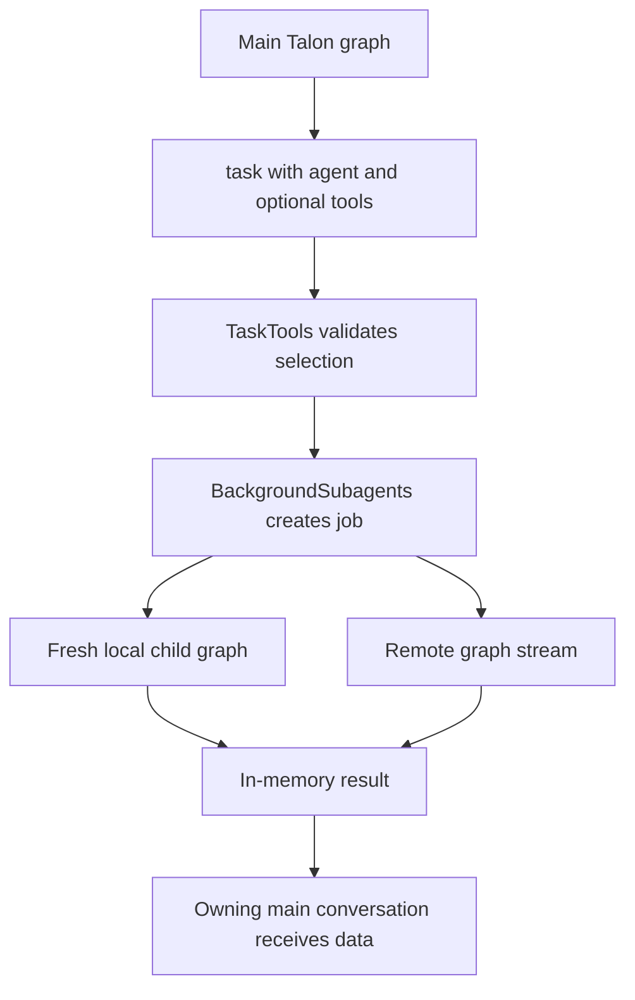
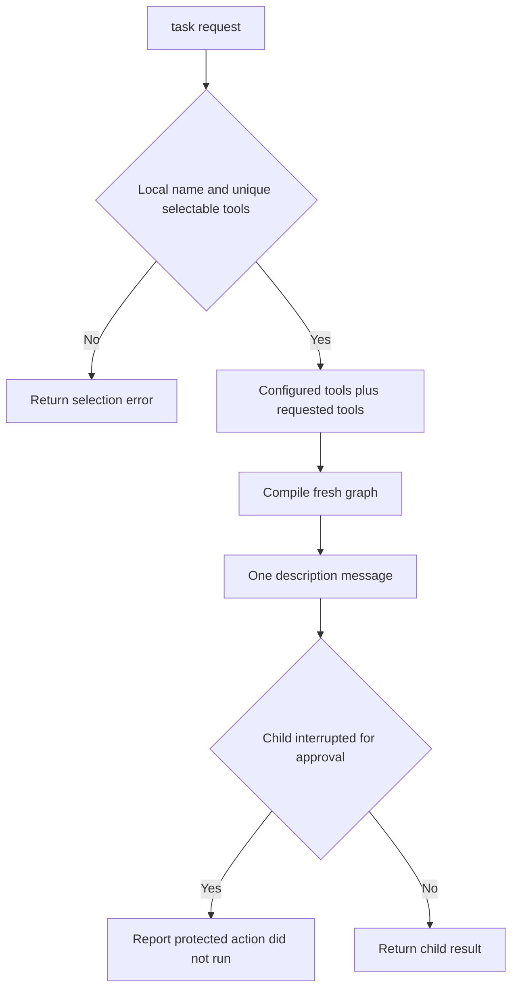

# Subagents and Skills

Talon is an experimental Deep Agents runtime with a deliberately narrower delegation contract than the SDK’s general subagent facility. A Talon local subagent is a **fresh, task-only graph**, not a continuation of the parent conversation. Its capabilities are explicitly selected from the runtime catalog, while work is normally detached into a bounded background worker. This makes the boundary useful for research and focused work without implicitly granting the child the parent’s history, memory, skills, filesystem access, shell, delegation tools, or arbitrary middleware.

This page describes Talon’s runtime contract. For parent-context and SDK `fork` semantics, see [context management](/openwiki/concepts/context-management.md); for approval policy, see [permissions and human-in-the-loop](/openwiki/concepts/permissions-hitl.md); and for MCP configuration and authorization, see [MCP](/openwiki/integrations/mcp.md).

## Delegation model

At startup, `DeepAgentRuntime` resolves local definitions from the assistant’s `agents/{name}/AGENTS.md` directories, optionally combines supplied and loader-backed definitions, rejects duplicate names across all sources, and builds a graph snapshot. The Talon CLI installs `load_async_subagents` as the remote-definition loader and supplies the Talon MCP middleware to the main graph.

*The normal Talon path returns a task ID first and injects a completed result into a later turn of the owning conversation.*

There is no implicit `general-purpose` child in Talon. If there are no configured subagents, there is no `task` delegation tool; configuring a local `general-purpose` name is just an ordinary explicit definition. Talon rejects the SDK’s `fork` mode from local, supplied, and compiled specs: its supported local mode is `fresh`, so a child never receives parent context.

## Local definitions and fresh compilation

A local definition is an `AGENTS.md` file below `agents/{directory}/`. It must contain YAML frontmatter with a non-empty `description`; `name` defaults to the directory name, and an optional `model` must be a string. The Markdown body becomes the child’s system prompt. Missing or malformed frontmatter and unreadable files are skipped, whereas duplicate resolved names or invalid operational options make resolution fail rather than silently select a different configuration. Talon uses `assistant_dir/agents` when present, otherwise its parent directory’s `agents` directory.

The only accepted local `mode` is the default `fresh`. The optional `tools` field must be a list of unique, non-empty exact names, and `web` must be boolean. Before compiling, Talon resolves those names against the parent’s attachment catalog—filesystem tools and runtime tools—and fails closed if a configured name is unavailable. `web: true` additionally makes the configured web tools available; the agent name itself has no special web privilege.

A resolved local definition is compiled by `_compile_fresh` with:

- the selected model, selected tools, and its own prompt;
- a task-only input adapter that retains only `messages`;
- no checkpointer and a recursion limit of 500 for a per-task dynamic compilation;
- `HumanInTheLoopMiddleware` only for approved attached tools; and
- Talon’s MCP middleware.

Accordingly, a child starts with the delegation description as its only user message. It does not inherit parent chat history, memory, skills, general filesystem tools, shell access, conversation/archive tools, reload tools, or delegation tools. The `TaskTools` wrapper also refuses a `task` call made from a child, preventing recursive local delegation.

## Capability attachments and per-task additions

Talon exposes `get_agent_tools` as a credential- and prompt-free inventory. It reports a local child’s configured `tools`, the names that are eligible for per-task selection, and whether saved configuration differs from the active graph. An opaque compiled or remote child reports `tools: null`, because Talon does not inspect its capabilities.

The parent may call `task(..., tools=[...])` only for a named local child. Each requested tool must be a unique exact name in the main graph’s selectable catalog; delegation and management tools are excluded from that catalog. Invalid, duplicate, unavailable, or opaque-child selections are rejected without running a child. Valid selection **adds** missing tools to that child’s configured tools for that one task; it does not replace the declared set or write configuration back to disk.

*Per-task additions are an explicit, ephemeral capability expansion; approval policy is still applied to the resulting child graph.*

## MCP and approval protections in child graphs

Capability isolation does not remove protections for a capability that is deliberately attached. `_compile_fresh` always adds `talon_mcp_middleware()`. For tools marked with Talon’s MCP metadata, that middleware normalizes arguments against the tool schema, runs the call in the authorization invocation scope, and converts an `MCPError` to a sanitized error `ToolMessage` containing its code and message rather than protocol error data. This applies to configured attachments and to dynamic per-task MCP attachments, including when the task is backgrounded.

Fresh compilation also filters the current approval policy to truthy rules whose names occur in the child’s attached-tool map, then installs `HumanInTheLoopMiddleware` for that subset. If a detached child reaches an approval interrupt, the background worker reports that the protected action did not run; it cannot obtain an operator decision itself. Background workers explicitly clear the request authorization handler and force the operator flag false, so authorization prompts from a completed parent turn cannot remain stranded. They retain the safe copied request context needed by scoped tools, such as history scope and cron origin.

These two controls are intentionally separate: attaching an MCP tool preserves MCP argument, authorization-scope, and error-sanitization behavior; marking an attached tool for approval prevents the action until a suitable foreground approval flow is available.

## Background lifecycle and result delivery

`BackgroundSubagents` wraps both the inline `task` tool and `start_async_task`. Outside a child, it replaces the immediate call with an in-memory job, returns `subagent-{uuid}` to the main agent, and tells the model to continue the user conversation rather than poll. Jobs are scoped to the conversation’s thread ID. `list_subagents` exposes only that owner’s jobs, and `cancel_subagent` cannot cancel another conversation’s work.

The worker uses its own thread ID, runs for at most one hour, and limits Talon to 128 retained jobs and four running jobs. It marks cancellation separately, truncates result text to 64,000 characters, reports generic failure or timeout text without exposing task arguments, and cancels remote streams on disconnect. A remote background task streams the original configured `graph_id`, URL, and headers; it does not use a later reload’s target.

A completed, non-cancelled result becomes a synthetic data message on a later turn of the same main conversation. The runtime acknowledges it only after that turn finishes. If the turn fails, delivery is retried; after three failed attempts the result is dropped and recorded as undelivered. If the host discards an otherwise completed reply, it can requeue only the result IDs consumed by that reply. Results and jobs are in memory, so they do not survive a runtime restart.

At runtime shutdown, Talon cancels background workers before closing its checkpointer. If workers outlive the cancellation wait, the runtime leaves resources open and raises instead of closing storage while a worker may still write.

## Remote definitions

Talon’s remote async subagents are configured as `[async_subagents.<name>]` tables in `~/.deepagents/config.toml`. Each entry requires non-empty string `description` and `graph_id`; optional `url` must be non-empty and optional `headers` must map strings to strings. An absent file or absent section produces no definitions. Unreadable or malformed TOML, a non-table section, or any invalid entry rejects the entire load, avoiding a partially active remote configuration.

The CLI creates `DeepAgentRuntime` with this loader. Definitions are read at startup and on explicit subagent reload, not for every turn. Local, supplied, and remotely loaded names must still be globally unique.

## Reloading without changing active work

`reload_subagent_configuration` is available when Talon has an assistant directory or a loader. It resolves definitions and compiles a full replacement graph while holding the tools lock; only after both succeed does it replace the resolved definitions and active graph. A failed parse, attachment resolution, or graph construction therefore leaves the previous graph and its subagents active. The tool returns a non-sensitive failure message rather than configuration contents.

An invocation captures the graph at its start in a context variable. Consequently, reload activates definitions for subsequent turns, while an active turn and any previously launched background job keep their original graph, tool attachments, and remote target. `get_agent_tools` exposes this distinction through the current graph’s attachment snapshot, the latest snapshot, `saved_changes_inactive`, and `current_turn_uses_previous_graph`. Removing a definition is not immediate revocation of work already running: inspect and cancel relevant jobs before treating a capability as withdrawn.

## Focused test coverage and change guidance

The Talon tests exercise the contracts that should remain stable when changing this subsystem:

- local research tests verify one-message fresh context, no inherited private memory or skills, explicit tool attachment, the absence of implicit general-purpose delegation, fork rejection, dynamic-tool validation, `web` capability behavior, and reload inventory behavior;
- MCP adapter and callback tests cover real tool invocation, open argument schemas, error behavior, in-flight adapter replacement, elicitation cancellation, and OAuth callback issuer preservation;
- local-subagent MCP tests verify that static and dynamic attachments retain MCP normalization, authorization context, sanitized errors, and protections in both foreground and background delegation;
- background tests cover conversation ownership, capacity, cancellation, delivery acknowledgement and requeueing, failure/timeout redaction, copied context with cleared authorization handler, remote-target snapshotting, and shutdown safety; and
- reload tests cover add/edit/delete, failed replacement rollback, loader timing, persistent history continuity, and a turn that remains on its original graph while a new graph becomes active.

When extending Talon delegation, resolve a capability from the catalog before compilation, attach it only to the intended child graph, and add the required middleware inside that graph. Treat graph snapshots, per-task attachments, and background result ownership as security boundaries rather than convenience details.

## Related

- [Context management](/openwiki/concepts/context-management.md)
- [Permissions and human-in-the-loop](/openwiki/concepts/permissions-hitl.md)
- [MCP](/openwiki/integrations/mcp.md)
- [Talon](/openwiki/integrations/talon.md)
- [Build a deep agent](/openwiki/workflows/build-a-deep-agent.md)
