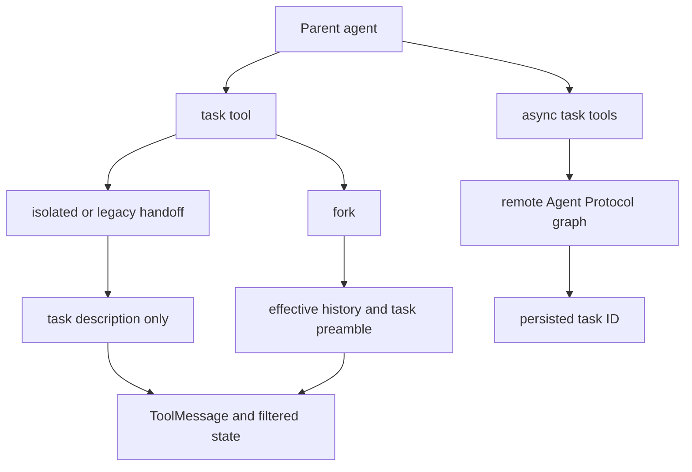

# Subagents & Skills

Deepagents has two complementary extensions: **subagents** split work across other agents or remote graphs, while **skills** make a large instruction library discoverable without copying every instruction into each model request. They are middleware mechanisms: `create_deep_agent` assembles them, but `SubAgentMiddleware`, `AsyncSubAgentMiddleware`, and `SkillsMiddleware` own their respective runtime behavior. See [middleware stack](/openwiki/architecture/middleware-stack.md), [context management](/openwiki/concepts/context-management.md), [permissions and HITL](/openwiki/concepts/permissions-hitl.md), and [state persistence](/openwiki/concepts/state-persistence.md).

## Delegation choices and entrypoints

A `subagents` entry is classified structurally by `create_deep_agent`:

- `graph_id` selects a remote `AsyncSubAgent`, exposed through the asynchronous-task tools.
- `runnable` selects a caller-supplied `CompiledSubAgent`, exposed through the inline `task` tool.
- Every other entry is a declarative `SubAgent`, which the builder completes and compiles for `task`.

The default declarative and compiled mode is **`"isolated"`**. `"handoff"` remains accepted only as a legacy alias for `"isolated"`; it does not transfer the parent conversation. The only context-inheriting mode is experimental **`"fork"`**. Invalid modes fail construction, as do duplicate inline names or an empty `SubAgentMiddleware` configuration. The task tool describes forked entries as context-aware so the parent model knows that it need not repeat the conversation.

*Inline delegation blocks for a report; the remote path starts background work and returns a durable handle.*

### Inline `task` contract

`SubAgentMiddleware` contributes exactly one structured tool, `task(description, subagent_type)`. The subagent type is a registered name, so duplicate names are rejected instead of silently resolving by order. An unrecognized name returns an explanatory tool result; a valid invocation without a tool-call ID raises `ValueError`, because a parent `Command` must associate its `ToolMessage` with that call.

The normal path is deliberately **state-isolated**. Before invoking the selected runnable, the middleware excludes parent `messages`, `todos`, `structured_response`, the private fork marker, and configured private middleware keys, then supplies a new `messages` list containing one `HumanMessage(description)`. Put all context, scope, and desired report shape in `description`: the child does not see the parent conversation merely because it is invoked from it. This boundary also keeps child-private state from leaking to siblings.

Isolation is not configuration isolation. LangGraph supplies ambient parent config by its per-key merge; callbacks, tags, configurable values, and user metadata therefore reach the child without explicit forwarding. The invocation supplies only `ls_agent_type="subagent"` and uses a tracing context that preserves existing tracing fields while adding the same marker. Bound child config wins collisions such as its run name or recursion limit.

The return boundary is intentionally narrow but not message-only. A child must return a state containing `messages`, or `task` raises `ValueError`. The middleware chooses a non-null `structured_response` first and JSON serializes it (including Pydantic models and dataclasses); otherwise it walks backward to the last AI message with non-empty text. It returns that content as the one parent `ToolMessage`. Compatible state updates are returned too, except `messages`, `todos`, `structured_response`, the fork marker, and private keys. Thus custom public channels can cross the boundary, but todo state and private middleware channels cannot.

A `CompiledSubAgent` is opaque caller-owned code. The middleware applies a name/run configuration but does not inject the parent `state_schema`; its author must compile a compatible runnable and include `messages` in its state schema. In contrast, `create_sub_agent` compiles a raw declarative spec with `create_agent`, requires resolved `model` and `tools`, forwards an optional state schema, adds `HumanInTheLoopMiddleware` for `interrupt_on`, and selects the declared response format.

For a raw spec, a task caller may set `__deepagents_subagent_response_format` in `configurable` to request a dynamic response format. This recompiles that raw spec for that invocation rather than changing its cached runnable. The same override is rejected for a compiled spec, which cannot safely be recompiled by the middleware.

## Builder inheritance, permissions, and defaults

`create_deep_agent` resolves declarative subagent model and tools from the parent when the spec omits them; a spec can override either. It resolves filesystem permissions similarly: specified rules replace the parent rules entirely, otherwise the parent rules are inherited. Filesystem rules are declaration-ordered and the first match wins. Permission-derived interrupts are merged with explicit `interrupt_on`, making the delegated filesystem policy participate in the normal approval path.

For an ordinary isolated declarative entry, the builder creates a default child stack beginning with `FilesystemMiddleware`, summarization, and `PatchToolCallsMiddleware`. If the spec declares `skills`, it adds `SkillsMiddleware` after those core entries, then applies harness-profile extensions, prompt caching, exclusions, and custom middleware placement. A supplied filesystem middleware can replace the default filesystem slot. This means an isolated child may carry its own skills library, but it does not automatically receive the parent skill or memory state.

Unless disabled by the harness profile or replaced by a supplied inline entry with that name, the builder prepends the built-in `general-purpose` declarative subagent. It receives the parent model, tools, permissions, and the corresponding default stack; profile configuration can replace its description or prompt.

## Fork: explicit inherited context

`mode="fork"` is beta/experimental. A fork continues the parent’s **effective** conversation: the middleware drops a trailing AI message carrying unresolved tool calls, applies the parent summarization event to replay compacted history, then appends a `HumanMessage` containing a fork preamble plus the new task. The preamble says the historical delegation has already happened and directs the child to complete the task itself.

A declarative fork is built to mirror the parent’s prompt-producing behavior. It starts from the parent prompt and appends the fork’s own `system_prompt`; it also carries private state (except prior `structured_response` and summarization event/session bookkeeping) so mirrored middleware can rebuild the same prompt. When parent skills or memory are configured, the builder includes corresponding skill and memory middleware for the fork. A fork **cannot** declare its own `skills`, and construction rejects that combination, preventing divergence from inherited skills.

A compiled fork gets the same effective message history but is more conservative with state: because the runnable is opaque, private state and regular task-excluded fields are omitted. Both fork kinds retain a guarded `task` tool in order to keep the tool layout aligned with the parent. Their initial fork marker causes a nested `task` attempt to return a refusal rather than recursively invoke another child.

## Remote asynchronous subagents

`AsyncSubAgentMiddleware` is separate from inline `task`. It requires at least one uniquely named remote spec and exposes five tools: `start_async_task`, `check_async_task`, `update_async_task`, `cancel_async_task`, and `list_async_tasks`.

`start_async_task` creates a LangGraph SDK thread, starts the configured Agent Protocol `graph_id` with a user message containing the description, and immediately returns the thread ID as `task_id`. It persists an `AsyncTask` record keyed by that ID, including remote thread/run IDs, status, and UTC timestamps. The reducer merges records by ID, preserving unrelated tasks across state updates and context compaction. Launch failures and unknown agent types return tool error strings rather than a task record.

`check_async_task` retrieves the current run and, on success, reads the remote thread’s final message; it returns JSON status, result, or server error and updates timestamps/state. `update_async_task` starts a new run on the same remote thread with `multitask_strategy="interrupt"`: the task ID and prior conversation remain, while the current run ID is replaced. `cancel_async_task` cancels the current run and records `cancelled`. `list_async_tasks` first filters by the cached status, then refreshes the selected nonterminal tasks concurrently in async mode; terminal `cancelled`, `success`, `error`, `timeout`, and `interrupted` statuses skip live lookup. On a status-fetch failure it retains the cached value, so previously reported statuses should be treated as stale until checked again.

Clients are created lazily and cached by `(url, resolved headers)`. Resolved headers add `x-auth-scheme: langsmith` unless the spec supplies that header. A URL-less spec uses in-process ASGI transport only through an async parent entrypoint such as `ainvoke`; synchronous use without a URL raises `ValueError`. Custom headers support self-hosted Agent Protocol servers.

## Skills: metadata first, instructions on demand

`SkillsMiddleware` implements progressive disclosure. Before agent execution it lists each configured source through the backend, finds subdirectories, downloads each candidate `SKILL.md`, and injects a system-prompt index containing source locations, skill name, description, optional annotations, allowed tools, and the exact instruction path. The prompt tells the model to read the full `SKILL.md` only when the task matches. Supporting files remain accessible beneath the skill directory.

A skill must have YAML frontmatter with non-empty `name` and `description`. Parsing is defensive: malformed YAML/frontmatter, inaccessible or missing content, non-UTF-8 bytes, and oversized files are skipped with warnings. Metadata is normalized; descriptions and compatibility strings are truncated to their configured limits. Nonconforming names—including names that differ from the containing directory—produce a compatibility warning but do not themselves prevent loading.

The middleware uses backend `ls`/`download_files` APIs and their asynchronous counterparts rather than direct filesystem calls. It processes sources in order and stores by skill name, so a later source overrides an earlier source with the same name. Sources may be plain paths or `(path, label)` pairs; labels disambiguate prompt listings. `skills_metadata` and recoverable `skills_load_errors` are private state, not propagated to parent agents. Loading happens once per session/checkpointed state: if `skills_metadata` is already present, even as an empty list, it is not reloaded.

A custom skill prompt template must contain `{skills_locations}`, `{skills_load_warnings}`, and `{skills_list}` or construction fails. `system_prompt=None` suppresses prompt injection, not backend loading. Recoverable source errors are logged and, when rendered, placed in an explicitly untrusted diagnostic block with bounded, escaped content.

## dcode filesystem definitions

The dcode application discovers subagents in `.deepagents/agents/{name}/AGENTS.md`. The YAML frontmatter must provide a non-empty `description`; `model`, if supplied, must be a string. The markdown body becomes `system_prompt`. `name` may be omitted and then resolves to the folder name, unlike SDK skills whose frontmatter requires a name. A present but blank or non-string name is invalid rather than silently falling back.

Malformed or unreadable files, definitions in the wrong location, folders without `AGENTS.md`, and invalid metadata are logged and skipped. Within a source, colliding resolved names warn and the later filesystem iteration entry replaces the earlier one; across configured sources, project entries load after user entries and override them.

## Focused validation tests

The focused tests are the safest change guide. `test_subagent_middleware_init.py` covers mode validation and the legacy alias, fork warnings and restrictions, state inheritance differences, recursion refusal, tool order, dynamic response formats, duplicate names, and raw-spec requirements. `test_subagents.py` exercises end-to-end inline routing, result extraction, private-state filtering, public-state transfer, concurrent tool calls, config merge behavior, and default registration. `test_async_subagents.py` verifies all five remote tools, SDK failures, status and timestamp updates, cached filtering/live refresh, reducer behavior, header selection, and sync-versus-ASGI constraints. For skills, preserve the backend-loading, malformed-input, source-precedence, private one-time-loading, and template-validation contracts in the dedicated middleware tests when changing parser, state, or prompt behavior.

## Related

- [Middleware stack](/openwiki/architecture/middleware-stack.md)
- [Context management](/openwiki/concepts/context-management.md)
- [Permissions and HITL](/openwiki/concepts/permissions-hitl.md)
- [State persistence](/openwiki/concepts/state-persistence.md)
- [Build a deep agent](/openwiki/workflows/build-a-deep-agent.md)
