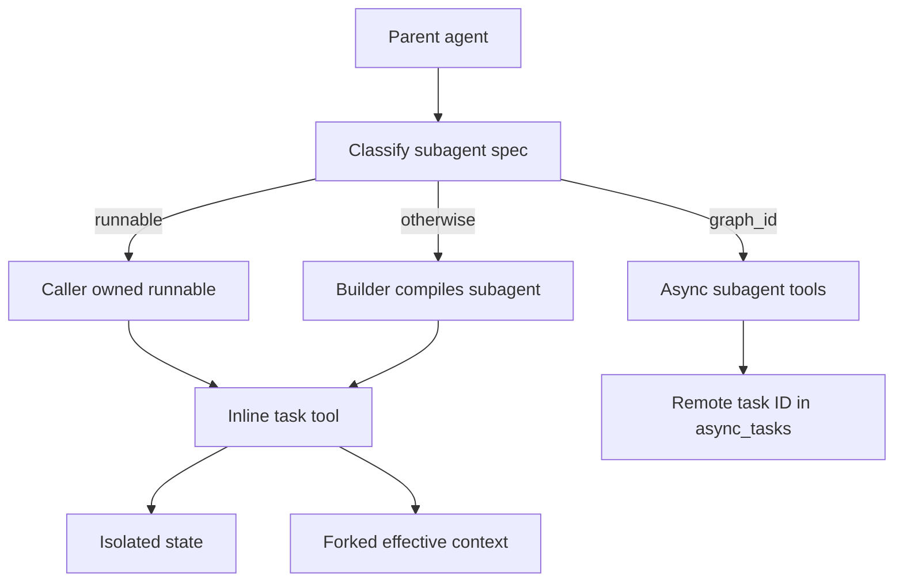
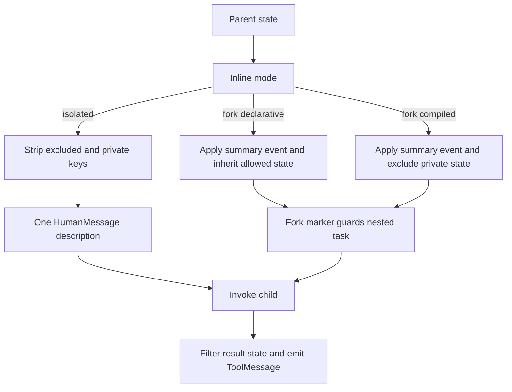
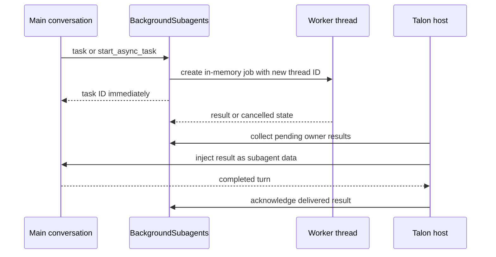
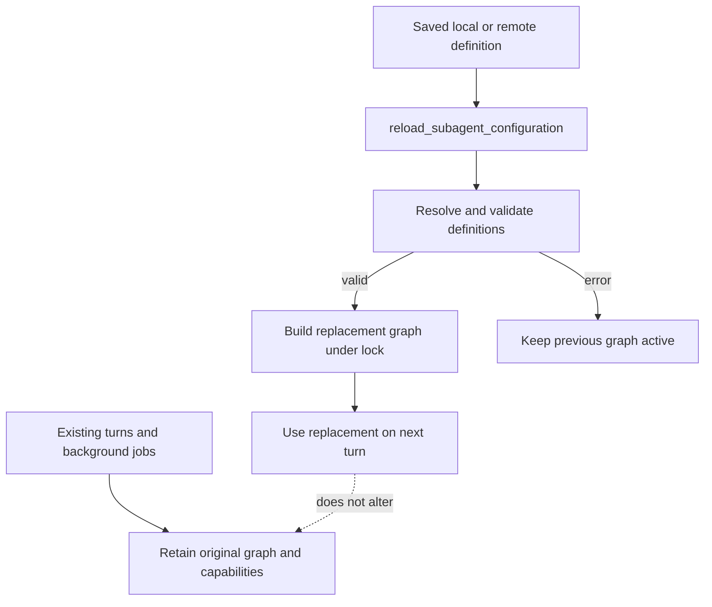

# Subagents, Skills, and Background Work

Deepagents has complementary extension mechanisms. **Subagents** delegate a bounded task to a local agent, caller-provided runnable, or remote Agent Protocol graph. **Skills** advertise a large instruction library through metadata, allowing the model to read full `SKILL.md` instructions only when needed. `create_deep_agent` assembles the SDK middleware; `SubAgentMiddleware`, `AsyncSubAgentMiddleware`, and `SkillsMiddleware` own the corresponding runtime boundaries. Talon deliberately changes the delegation lifecycle by backgrounding work in its own process. See [middleware stack](/openwiki/architecture/middleware-stack.md), [context management](/openwiki/concepts/context-management.md), and [build a deep agent](/openwiki/workflows/build-a-deep-agent.md).

## Select the delegation boundary

`create_deep_agent` classifies each `subagents` entry structurally:

- `graph_id` identifies a remote `AsyncSubAgent` and produces asynchronous task tools.
- `runnable` identifies a caller-owned `CompiledSubAgent` invoked through the inline `task` tool.
- Any other entry is a declarative `SubAgent`; the builder fills defaults, constructs its middleware, and compiles it for `task`.

The SDK default is **`"isolated"`**. `"handoff"` is only a legacy alias for isolated operation; it does not transfer the conversation. Experimental **`"fork"`** is the only context-inheriting mode. Validation rejects unsupported modes, duplicate inline names, and a separate `skills` declaration on a forked declarative spec.

*The builder selects an execution boundary first; state inheritance is a separate choice for inline work.*

## Inline `task`: state boundary and result contract

`SubAgentMiddleware` exposes one structured `task(description, subagent_type)` tool. The registered name selects the child. An unknown name returns an explanatory tool result. A valid call without a tool-call ID raises `ValueError`, because the parent-side `Command` needs that ID to attach its `ToolMessage`.

### Isolated does not mean configuration-isolated

An isolated child receives a fresh `messages` value containing only `HumanMessage(description)`. The middleware strips parent `messages`, `todos`, `structured_response`, `skills_metadata`, the fork marker, and private middleware channels before invocation. The task description must therefore provide context, scope, and reporting requirements.

This is **state and prompt isolation**, not configuration isolation. LangGraph's ambient per-key configuration merge carries parent callbacks, tags, metadata, and configurable values. The middleware only adds `ls_agent_type="subagent"` for tracing; bound child configuration wins collisions such as run name and recursion limit.

The child result must contain `messages` or delegation raises `ValueError`. A non-null `structured_response` is JSON-serialized (including Pydantic models and dataclasses); otherwise the middleware returns the last non-empty `AIMessage` text. The resulting `Command` contains the `ToolMessage` and compatible non-private state updates, but does not propagate messages, todos, structured response, skill metadata, the fork marker, or private middleware keys. Deliberately public custom state can cross this boundary.

A `CompiledSubAgent` is opaque caller-owned code: it does not inherit the builder's `state_schema`, so its author must provide a compatible `messages` state key. A declarative spec is compiled by `create_sub_agent`, which requires resolved `model` and `tools`, accepts an optional state schema, adds `HumanInTheLoopMiddleware` for `interrupt_on`, and selects the response format. Raw declarative specs also accept a per-call `configurable["__deepagents_subagent_response_format"]` override; that recompiles the spec for that call and is rejected for compiled entries.

## Declarative construction, permissions, and forks

A declarative subagent inherits the parent model, tools, and filesystem permissions unless it overrides them. A supplied permission list replaces parent rules; filesystem rules are evaluated in declaration order and the first matching rule wins. Permission-derived interrupts are merged with explicit `interrupt_on`.

The ordinary declarative stack starts with filesystem, summarization, and patching middleware. Declared skills follow those core entries, then harness-profile middleware, prompt caching, exclusions, and custom middleware are applied. The builder separately auto-adds `general-purpose` with the parent model, tools, permissions, and default stack, unless the harness profile disables it or an inline subagent already uses that name.

### Fork mode is a distinct state-schema contract

A fork reconstructs the parent’s **effective** history: it removes a trailing AI message with unresolved tool calls, applies the parent summarization event, and appends a `HumanMessage` with a task preamble. The preamble says that prior delegation already occurred and directs the child to complete the task rather than delegating again.

A declarative fork rebuilds the inherited prompt-producing arrangement. Its base prompt is the parent prompt plus the fork `system_prompt`; it receives parent state, including private channels, except prior structured output and summarization event/session bookkeeping. When the parent uses skills or memory, the fork includes the relevant middleware to rebuild from inherited state. It cannot define a different skill library. Its own tools still work, although different tools can reduce prompt-cache reuse.

A compiled fork receives the effective messages but excludes private and ordinary task-excluded state because its schema is unknown. Both forms retain a guarded `task` tool so their tool layout stays stable, but a private fork marker refuses nested delegation.

*Fork inheritance differs by child schema ownership; it is not an isolated-task variant with extra messages.*

## SDK remote asynchronous subagents

`AsyncSubAgentMiddleware` is independent of inline `task`. It supplies `start_async_task`, `check_async_task`, `update_async_task`, `cancel_async_task`, and `list_async_tasks` for Agent Protocol servers.

`start_async_task` creates a LangGraph SDK thread and run, passing the description as a user message. It immediately returns and persists the thread ID as `task_id`. The `async_tasks` state reducer merges entries by task ID, retaining the remote thread/run IDs and timestamps through later state updates and context compaction. Unknown types and launch failures return tool error text rather than a task record.

`check_async_task` reads the tracked run and, upon success, fetches the remote thread values to extract its final message. `update_async_task` posts a user message to the same remote thread with `multitask_strategy="interrupt"`; it replaces the current run ID but retains the task ID and remote conversation. Cancellation calls the remote run cancellation endpoint and records `cancelled`.

`list_async_tasks` filters using cached state before querying selected entries. It never queries terminal `cancelled`, `success`, `error`, `timeout`, or `interrupted` entries. The asynchronous form refreshes selected entries concurrently; a live lookup failure preserves the cached status, so prior status output is not a freshness guarantee.

Clients are lazy and cached by `(url, resolved headers)`. Resolved headers add `x-auth-scheme: langsmith` unless supplied, while custom headers support self-hosted servers. A URL-less specification uses in-process ASGI transport and requires an async parent entrypoint such as `ainvoke`; synchronous `invoke` raises `ValueError` for it.

## Skills: metadata first, instructions on demand

`SkillsMiddleware` implements progressive disclosure. Before agent execution it lists each configured backend source, examines immediate child directories, downloads candidate `SKILL.md` files, and injects a skill index into the system prompt. The index includes source locations, name, description, optional license and compatibility annotations, allowed tools, and the exact path to read. It instructs the model to read full instructions only when applicable. Sources can be paths or `(path, label)` pairs, whose labels appear in the rendered source list.

A skill needs YAML frontmatter with non-empty `name` and `description`. Loading defensively skips malformed YAML/frontmatter, inaccessible content, non-UTF-8 bytes, and oversized files with warnings. A name-format or directory-name mismatch warns for compatibility but does not prevent loading. Metadata is normalized, oversized descriptions and compatibility values are truncated, and later sources replace earlier skills of the same name.

`skills_metadata` is omitted from output and `skills_load_errors` is private state. Metadata loads once per session/checkpoint: a list, including an empty list, suppresses reload; missing metadata or `None` loads again. Thus callers can request a reload with `invoke({"skills_metadata": None})` or `update_state()`. A custom prompt template requires `{skills_locations}`, `{skills_load_warnings}`, and `{skills_list}`. `system_prompt=None` suppresses prompt injection but not discovery; recoverable source errors are still logged and rendered as bounded, escaped untrusted diagnostics when a prompt is used.

## dcode: local definitions and guarded skill reads

The dcode CLI discovers subagents in `.deepagents/agents/{name}/AGENTS.md`. YAML frontmatter requires a non-empty `description`; `model`, if supplied, must be a string, and the Markdown body becomes `system_prompt`. An omitted `name` falls back to the folder name, while a present blank or non-string name is invalid. Bad, unreadable, misplaced, or incomplete definitions are skipped with warnings. Project definitions load after user definitions and override matching resolved names.

For interactive skill commands, dcode adapts the SDK parser through a local `FilesystemBackend`. Its ascending precedence is built-in, plugin, per-agent user `.deepagents`, user `.agents`, project `.deepagents`, project `.agents`, experimental user Claude, then experimental project Claude locations. Higher sources replace same-named skills. Plugin sources may be recursively discovered and namespaced.

Discovery returns slash-command metadata plus pre-resolved allowed roots. Loading full `SKILL.md` content resolves the requested path and rejects it when it lies outside those roots, including a symlink escape. Declarative extra allowed directories and persisted approved trusted directories can extend the allowlist; a single inaccessible source does not prevent discovery from other sources.

## Talon: fresh agents, background workers, and explicit reload

Talon is experimental and wraps the SDK with its own delegation semantics. Remote definitions come from `[async_subagents.<name>]` tables in `~/.deepagents/config.toml`. Every entry requires non-empty string `description` and `graph_id`; optional `url` must be non-empty and `headers` must be string-to-string. An absent file produces no remote agents. The loader is fail-closed: an unreadable or malformed file, invalid section, or any invalid entry raises `ValueError`, rather than silently starting with a partial remote inventory.

Talon also loads local `AGENTS.md` roles from its assistant directory. It compiles local definitions as **fresh**, task-only agents with exact tool attachments and applicable operator approval policy. It rejects SDK fork mode. Its `task` wrapper can add selected catalog tools to a named local role for one call; it cannot replace configured attachments and rejects duplicate or unavailable names.

Unlike the SDK remote-task state, `BackgroundSubagents` detaches both inline `task` and `start_async_task` into bounded, in-memory workers. Jobs are scoped to their owning conversation and use a new job thread ID, not the main conversation ID. The main agent receives a task ID and keeps conversing; it can list or cancel only its own jobs. The worker has a one-hour timeout, no inherited authorization handler, and treats required approval as an unperformed protected action. Remote work streams the configured graph and requests cancellation on disconnect.

*Only non-cancelled results are injected into the owner’s next delivery turn; acknowledgement follows a completed main-agent turn.*

Results are not durable across a runtime restart. If a delivery turn fails, Talon retries the pending result; after three failed delivery attempts it marks the result dropped. If a host discards an otherwise completed reply because a newer turn superseded it, it can requeue the acknowledged result for a later turn.

Configuration changes are not automatic. `reload_subagent_configuration` resolves and validates replacement definitions, builds a replacement graph under the runtime tool lock, and activates it for subsequent turns. A failed reload leaves the old graph active. The invocation graph is captured per turn, and background dispatch snapshots the existing tool/graph, so active turns and jobs retain old capabilities after reload. Operators should inspect and cancel active work before treating a removed capability as revoked.

*Reload changes the graph selected by future turns, not the capabilities already captured by executing work.*

## Focused tests and safe changes

SDK tests cover routing, mode validation and the legacy alias, duplicate names, state filtering, response extraction, dynamic response formats, async task reducer/status refresh behavior, and ASGI restrictions. Integration tests exercise declarative and compiled delegation with tools and structured responses. Skills tests should preserve source precedence, malformed-candidate handling, private cached state, reload signaling, and prompt-template validation.

Talon tests cover TOML parsing, fresh-role attachments and fork rejection, background ownership/capacity/cancellation/result delivery, and reload behavior. Treat these as lifecycle and security boundaries: changing state inheritance, attachment selection, source precedence, or delivery/reload sequencing can grant unexpected capability or lose work.

## Related

- [Middleware stack](/openwiki/architecture/middleware-stack.md)
- [SDK construction and execution](/openwiki/architecture/sdk-construction-execution.md)
- [Context management](/openwiki/concepts/context-management.md)
- [Talon](/openwiki/integrations/talon.md)
- [Build a deep agent](/openwiki/workflows/build-a-deep-agent.md)
