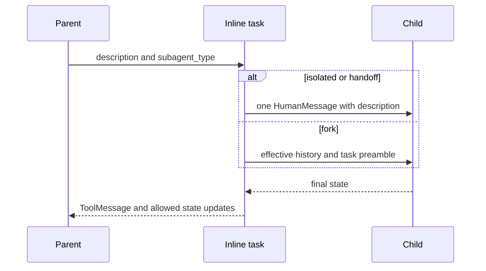
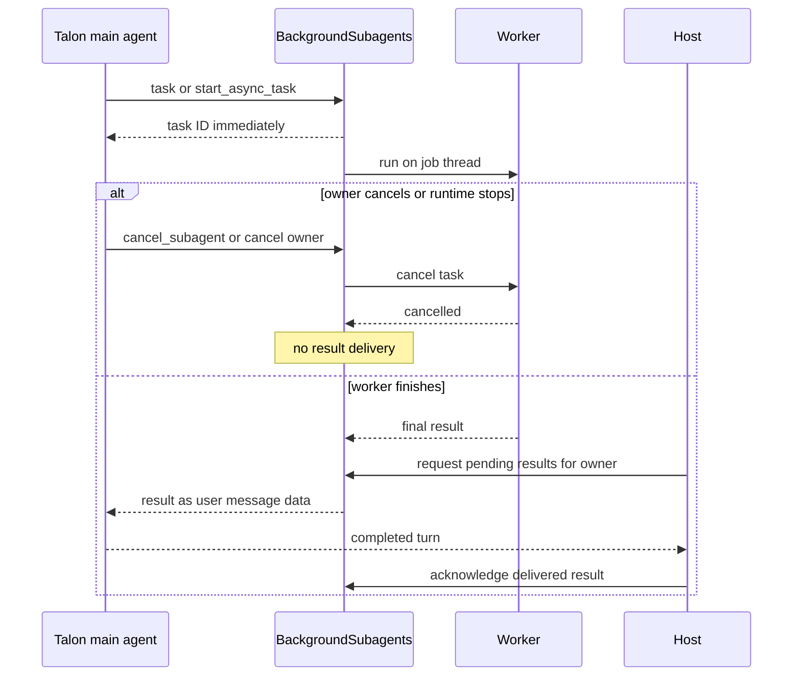

# Subagents, Skills, and Delegation

Deepagents has two complementary extension mechanisms. **Subagents** delegate work to another local agent, caller-supplied runnable, or remote graph. **Skills** make a large instruction library discoverable without putting every instruction in every model request. `create_deep_agent` assembles the middleware; `SubAgentMiddleware`, `AsyncSubAgentMiddleware`, and `SkillsMiddleware` own SDK behavior. Talon wraps delegation in an in-memory background service with result delivery. See [middleware stack](/openwiki/architecture/middleware-stack.md), [context management](/openwiki/concepts/context-management.md), [permissions and human approval](/openwiki/concepts/permissions-hitl.md), and [Talon](/openwiki/integrations/talon.md).

## Choose the delegation boundary

`create_deep_agent` classifies each `subagents` entry structurally:

- `graph_id` creates a remote `AsyncSubAgent`, exposed through asynchronous-task tools.
- `runnable` selects a caller-owned `CompiledSubAgent`, exposed through the inline `task` tool.
- Any other entry is a declarative `SubAgent`; the builder supplies defaults, builds middleware, and compiles it for `task`.

The SDK default is **`"isolated"`**. `"handoff"` remains a legacy alias for isolated operation; it does not transfer a conversation. **`"fork"`** is the only context-inheriting mode. Unsupported modes, duplicate inline names, and `skills` declared on a forked declarative specification are rejected.

*Inline delegation waits for a child report; isolated mode does not pass parent conversation state.*

## Inline `task`: state, results, and compilation

`SubAgentMiddleware` exposes one structured tool: `task(description, subagent_type)`. The registered name selects the child. An unknown name produces an explanatory tool result; a valid call without a tool-call ID raises `ValueError`, because the parent-side `Command` needs an ID to attach its `ToolMessage`.

### Isolated state is not configuration isolation

An isolated child receives a fresh `messages` value containing only `HumanMessage(description)`. The middleware removes parent `messages`, `todos`, `structured_response`, skill metadata, the fork marker, and private middleware channels before invocation. The description must therefore carry the required context, scope, and report expectations.

This is **state and prompt isolation**, not configuration isolation. LangGraph's ambient per-key merge carries parent callbacks, tags, metadata, and configurable values. The middleware adds the `ls_agent_type="subagent"` tracing marker; the child runnable's bound configuration wins collisions such as run name and recursion limit.

When the child completes, its result must contain `messages` or delegation raises `ValueError`. A non-null `structured_response` wins and is JSON-serialized, including Pydantic models and dataclasses. Otherwise, the middleware finds the last non-empty `AIMessage` text. It returns a parent `ToolMessage` plus compatible public state updates, never messages, todos, structured output, skill metadata, the fork marker, or private middleware keys. Deliberately public custom channels can cross this boundary.

A `CompiledSubAgent` is opaque caller-owned code. It does not inherit the builder's `state_schema`, so its author must compile it with a compatible `messages` state key. A declarative entry is passed to `create_sub_agent`, which requires resolved `model` and `tools`, forwards an optional state schema, adds `HumanInTheLoopMiddleware` for `interrupt_on`, and chooses the response format. A raw declarative spec can also receive a per-call `configurable["__deepagents_subagent_response_format"]` override, which recompiles that spec for the call; the override is rejected for compiled entries.

## Declarative defaults, permissions, and forks

A declarative subagent inherits the parent model, tools, and filesystem permissions unless it overrides them. A supplied permission list replaces parent rules. Filesystem rules are evaluated in declaration order, with the first match winning; permission-derived interrupts merge with explicit `interrupt_on`.

An ordinary declarative child starts with filesystem, summarization, and patching middleware. Its declared `skills` follow those core entries, then harness-profile middleware, prompt caching, exclusions, and custom middleware machinery are applied. It has its own compiled prompt and skill metadata, not the parent conversation, skill state, or memory state. Unless its harness profile disables it or a supplied inline agent uses the same name, the builder also adds `general-purpose` with parent model, tools, permissions, and the corresponding default stack.

### Fork mode

A fork starts from the parent’s **effective** history. The middleware drops a trailing AI message that has unresolved tool calls, applies the parent summarization event to reconstruct compacted history, then appends a `HumanMessage` containing a fork preamble and the delegated task. The preamble explains that earlier delegation already happened and directs the child to complete the work instead of delegating again.

A declarative fork rebuilds the parent's prompt-producing arrangement: its base prompt is the parent prompt plus the fork `system_prompt`; it receives parent state, including private channels, except prior structured output and summarization event/session bookkeeping. When the parent configured skills or memory, the fork includes the relevant middleware so inherited state can rebuild its prompt. It cannot define a separate skill library. Its own tools remain permitted, though differing tools can reduce prompt-cache reuse.

A compiled fork gets the same effective messages but not private or ordinary task-excluded state because its schema and semantics are unknown. Both fork kinds retain a guarded `task` tool so the tool layout remains stable; a private fork marker causes nested delegation to return a refusal rather than recursively launch another child.

## SDK remote asynchronous subagents

`AsyncSubAgentMiddleware` manages Agent Protocol graphs independently of inline `task`. It supplies `start_async_task`, `check_async_task`, `update_async_task`, `cancel_async_task`, and `list_async_tasks`.

`start_async_task` creates a LangGraph SDK thread, starts the configured `graph_id` with the description as a user message, then immediately persists and returns the thread ID as `task_id`. The `async_tasks` reducer merges records by task ID, retaining remote thread/run IDs and timestamps through subsequent updates and compaction. Unknown types and launch failures return tool error text rather than a task record.

`check_async_task` reads the tracked run and, on success, retrieves the remote thread's final message. `update_async_task` adds a user message on the same remote thread with `multitask_strategy="interrupt"`: it replaces the current run ID while retaining the task ID and remote conversation. Cancellation calls the remote run cancellation endpoint and records `cancelled`.

`list_async_tasks` filters by cached state before it performs live lookup. It does not query terminal `cancelled`, `success`, `error`, `timeout`, or `interrupted` entries. The asynchronous implementation refreshes selected entries concurrently; a failed lookup retains cached status, so an old tool result is not a current status guarantee.

Clients are lazy and cached by `(url, resolved headers)`. Resolved headers add `x-auth-scheme: langsmith` unless the specification provides it; custom headers support self-hosted servers. A URL-less specification uses in-process ASGI transport and requires an asynchronous parent entrypoint such as `ainvoke`; synchronous invocation without a URL raises `ValueError`.

## Skills: metadata first, instructions on demand

`SkillsMiddleware` implements progressive disclosure. Before an agent session it lists each configured backend source, examines immediate subdirectories, downloads candidate `SKILL.md` files, and injects a skill index into the system message. The index includes source locations, name, description, optional license/compatibility annotations, allowed tools, and the exact path to read. It directs the model to read full instructions only when a skill applies; supporting files remain available under the skill directory. Sources may be paths or `(path, label)` pairs, with labels used in the rendered source list.

A valid skill requires YAML frontmatter with non-empty `name` and `description`. Loading is defensive: malformed frontmatter or YAML, inaccessible or missing content, non-UTF-8 bytes, and oversized files are skipped with warnings. Invalid name format or directory-name mismatch warns for compatibility but does not prevent loading. Metadata is normalized, overlong descriptions and compatibility values are truncated, and later sources replace earlier skills of the same name.

Recoverable `skills_load_errors` is private state. `skills_metadata` is accepted as input but omitted from output, so a caller can reset it without it surfacing in results, and it is excluded from subagent state so a subagent loads from its own sources. Loading occurs once per session or checkpointed state: if `skills_metadata` holds a list—even empty—the middleware does not reload; setting it to `None`, through `invoke()` or `update_state()`, makes the next run reload. A custom prompt template needs `{skills_locations}`, `{skills_load_warnings}`, and `{skills_list}`. `system_prompt=None` suppresses prompt injection only, not discovery; source errors are logged and, when rendered, bounded and escaped as untrusted diagnostics.

## dcode: filesystem-defined agents and skills

The dcode CLI discovers declarative subagents at `.deepagents/agents/{name}/AGENTS.md`. YAML frontmatter requires a non-empty `description`; optional `model` must be a string, and the Markdown body becomes `system_prompt`. An omitted `name` falls back to the folder name, but a present blank or non-string name is invalid. Malformed, unreadable, misplaced, or incomplete definitions are skipped with warnings. Project definitions load after user definitions and override equal resolved names.

For interactive `/skill:` commands, dcode wraps the SDK skill parser with a local `FilesystemBackend`. Its ascending precedence is built-in, plugin, per-agent user `.deepagents`, user `.agents`, project `.deepagents`, project `.agents`, experimental user Claude, then experimental project Claude locations. Higher sources override equal names. Discovery builds slash commands and pre-resolved allowed roots; a failed refresh preserves the preceding cache. Reading a full `SKILL.md` resolves its path and rejects paths outside those roots, protecting against symlink traversal. Configured extra directories and approved trusted directories can extend the allowlist.

## Talon: fresh, backgrounded, and reloadable delegation

Talon is experimental and has its own delegation layer around the SDK. It loads remote definitions from `[async_subagents.<name>]` tables in `~/.deepagents/config.toml`; each requires non-empty string `description` and `graph_id`, with optional non-empty `url` and string-to-string `headers`. A missing file yields no remote agents. The loader is fail-closed: unreadable or malformed TOML, a non-table section, or one invalid definition logs a warning and raises `ValueError` rather than starting with a partial remote-agent set. The CLI supplies this loader to `DeepAgentRuntime`.

Talon also reads local `AGENTS.md` definitions from its assistant `agents/{name}/` directory (or its parent fallback). These require name and description, may select a model and exact unique tool names, and compile as **fresh** agents with a task-only input and the operator approval policy. Talon does not support SDK fork mode: local configuration accepts only its `fresh` default, and preparation rejects `fork`. Per call, its `task` wrapper can add selected catalog tools to a named local subagent without replacing configured tools; it rejects duplicate or unavailable selections.

Unlike the SDK's durable remote-task state, Talon's `BackgroundSubagents` detaches both inline `task` and `start_async_task` work into in-memory workers. It returns a Talon task ID immediately, scopes inspection and cancellation to the owning conversation, caps total and concurrent work, and runs each job with a separate thread ID. Remote jobs stream their originally configured target and request cancellation on stream disconnect. Finished, non-cancelled results are delivered back to the owning main agent as data and acknowledged only after that turn completes; they are not durable across a runtime restart.

*The Talon worker is detached from the originating turn; cancellation discards its result, while acknowledgement occurs only after the consuming main-agent turn completes.*

Talon provides `reload_subagent_configuration` when local or loader-backed definitions are configured. It validates and builds a replacement graph under a lock, activates it for the next turn, and preserves the old graph when reload fails. Running turns and background tasks retain their original capabilities, so operators should inspect and cancel them before claiming a removal has taken effect.

## Focused tests and safe changes

SDK tests cover routing and default registration, mode validation and the legacy alias, fork prompt/state differences and recursion refusal, dynamic response formats, duplicate names, result extraction, private-state filtering, public-state transfer, configuration merge behavior, remote tools, reducers/timestamps, headers, cached filtering/live refresh, and ASGI restrictions. Skills tests cover backend loading, malformed candidates, precedence, private one-time state, and template validation.

The dcode tests cover source discovery, override precedence, slash-command discovery, and containment/trust roots. Talon tests cover TOML parsing, fresh local-agent validation and attachments, background ownership, capacity, cancellation, result delivery, requeueing after an undispatched reply, and reload behavior. Preserve these boundary tests when changing delegation: state inheritance, capability attachment, source precedence, cancellation, and reload semantics are security and lifecycle contracts rather than display details.

## Related

- [Middleware stack](/openwiki/architecture/middleware-stack.md)
- [Context management](/openwiki/concepts/context-management.md)
- [Permissions and human approval](/openwiki/concepts/permissions-hitl.md)
- [Talon](/openwiki/integrations/talon.md)
- [Build a deep agent](/openwiki/workflows/build-a-deep-agent.md)
- [Run a dcode session](/openwiki/workflows/run-dcode-session.md)
