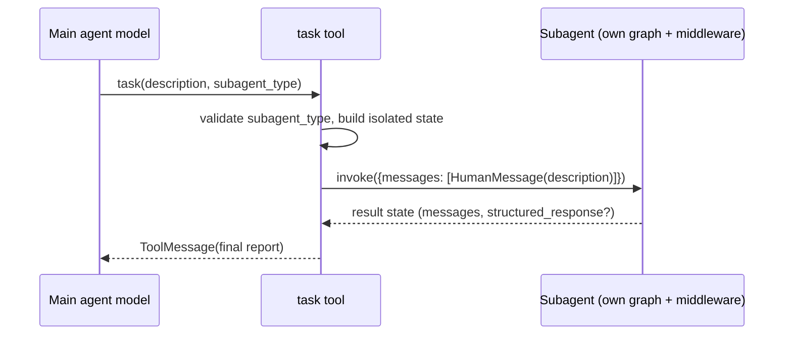

# Subagents & Skills

Two complementary extension mechanisms let a deepagents agent scale beyond a
single model loop: **subagents** delegate a bounded task to a separate agent
with its own isolated context window, and **skills** inject reusable,
domain-specific behaviors into the system prompt on demand. Both are delivered
as middleware and plug into the [middleware stack](/openwiki/architecture/middleware-stack.md);
their wiring is assembled by the graph builder described in
[config layering](/openwiki/concepts/config-layering.md), and they build on the
backend-portable filesystem described in
[tools & filesystem](/openwiki/concepts/tools-filesystem.md).

## Subagents

### The `task` tool and delegation

`SubAgentMiddleware` adds a single `task` tool to the main agent. The model
calls it with a free-form `description` and a `subagent_type` naming which
subagent to run. Each subagent runs to completion and returns exactly one final
report; the tool description instructs the model to put full detail in the
prompt, that each invocation is stateless, and that independent subagents may be
launched concurrently in one message with multiple tool calls.

Delegation is valuable because a subagent can perform a long, multi-step, or
context-heavy task and then hand back a clean, concise result rather than
polluting the main agent's context with intermediate work. Only the subagent's
final assistant message (or its structured response) is forwarded to the parent.

### Subagent types

The SDK supports several subagent shapes, distinguished structurally when the
graph builder partitions the caller-supplied `subagents` list:

- **`GENERAL_PURPOSE_SUBAGENT`** — a built-in `SubAgent` spec (`name:
  "general-purpose"`) that the graph builder auto-adds unless the harness
  profile disables it or the caller already supplied a spec with the same name.
  The builder fills in the parent's model, tools, and default middleware stack.
- **Declarative `SubAgent`** — a `TypedDict` describing a subagent by `name`,
  `description`, and `system_prompt`, with optional `tools`, `model`,
  `middleware`, `interrupt_on`, `skills`, `permissions`, and `response_format`.
  It is compiled into a runnable via `create_agent`.
- **`CompiledSubAgent`** — a caller-supplied `runnable` used as-is. Its state
  schema must include a `messages` key so results can flow back; it does **not**
  inherit `create_deep_agent(state_schema=...)`.
- **`AsyncSubAgent` / remote** — a spec identified by `graph_id` that runs as a
  background task on a remote Agent Protocol server via the LangGraph SDK.

Because a `CompiledSubAgent` simply wraps a `runnable`, any LangGraph
`CompiledStateGraph` (including one produced by LangChain's `create_agent`) can
be registered as a subagent as long as its state schema exposes `messages`.

### Isolated context and per-subagent middleware

Each subagent runs in an isolated context window: the `task` tool builds a fresh
state for the subagent whose messages are just a single `HumanMessage` carrying
the delegation description, after stripping excluded keys (`messages`, `todos`,
`structured_response`) and any private middleware state keys from the parent
state. The parent's callbacks, tags, and `configurable` still reach the subagent
because LangGraph seeds each run from the ambient parent config and merges it
per key; the middleware only stamps `ls_agent_type="subagent"` for tracing.

Subagents carry their own middleware stacks. When compiling a declarative
`SubAgent`, the graph builder prepends a default stack — `FilesystemMiddleware`,
summarization, and `PatchToolCallsMiddleware` — before any custom `middleware`
the spec supplies, appends a `SkillsMiddleware` when the spec declares `skills`,
and applies the subagent's own harness profile. This means a subagent can have a
different model, a narrower tool set, its own filesystem permissions, and its
own skills, independent of the main agent.

### Returning results

When a subagent finishes, the `task` tool inspects the returned state. If
`structured_response` is non-`None`, it is JSON-serialized (via
`model_dump_json`, dataclass `asdict`, or `json.dumps`) and used as the
`ToolMessage` content. Otherwise the tool walks back to the last non-empty
`AIMessage` text — deliberately skipping a trailing empty `end_turn` message
some providers emit. Non-excluded, non-private state keys returned by the
subagent are merged back into the parent state alongside the `ToolMessage`. A
`CompiledSubAgent` that returns a state without a `messages` key raises a
`ValueError`.

### Structured output

Declarative subagents accept a `response_format` (a `ResponseFormat` strategy, a
bare type, or a JSON-schema dict). Callers can also request a per-invocation
dynamic response format by placing it under the
`__deepagents_subagent_response_format` config key; this recompiles the raw spec
for that call. Dynamic response formats are rejected for `CompiledSubAgent`
entries, whose runnables the caller owns.

## Async (remote) subagents

`AsyncSubAgentMiddleware` targets long-running or remote work. Instead of
blocking, `start_async_task` creates a thread and run on a remote Agent
Protocol server (LangGraph Platform or self-hosted) and returns a `task_id`
immediately, so the main agent can keep working. The middleware exposes five
tools: `start_async_task`, `check_async_task`, `update_async_task`,
`cancel_async_task`, and `list_async_tasks`.

Tracked tasks are persisted in agent state under `async_tasks` (an
`AsyncTask`-per-`task_id` dict with its own reducer) so they survive context
compaction and can be inspected programmatically. Clients are lazily created and
cached per `(url, headers)`; authentication for managed deployments is resolved
by the SDK from environment variables, while self-hosted servers can pass custom
`headers`. Omitting `url` uses in-process ASGI transport, which is only
reachable through an async parent entrypoint (`ainvoke`) — the synchronous path
requires a URL.

## Skills

### Progressive disclosure

`SkillsMiddleware` implements the Agent Skills pattern with **progressive
disclosure**: the model always sees each skill's `name` and `description` in the
system prompt, but only reads the full `SKILL.md` (and any supporting files) when
a task matches. This keeps context small while making a large library of
behaviors reachable on demand. The injected prompt instructs the model to read
the listed `SKILL.md` path with `read_file` when a skill applies.

### Skill structure and metadata

Each skill is a directory containing a `SKILL.md` file whose YAML frontmatter is
parsed into `SkillMetadata`. Required fields are `name` and `description`;
optional fields include `license`, `compatibility`, `metadata`, and
`allowed-tools`. Names are validated against the Agent Skills specification
(lowercase alphanumeric plus single hyphens, ≤64 chars, matching the parent
directory name); violations log a warning but the skill still loads for
backwards compatibility. Oversized files, non-UTF8 content, malformed
frontmatter, and over-limit descriptions/compatibility are handled defensively
so a bad skill is skipped (with a log warning) rather than crashing prompt
rendering.

### Sources, layering, and loading

Skills are loaded from one or more **sources**, each either a bare path or a
`(path, label)` tuple. Sources are loaded in order and later sources override
earlier ones when names collide (last one wins), enabling layering such as
base → user → project → team. The middleware uses backend APIs exclusively (no
direct filesystem access), so it works across StateBackend, FilesystemBackend,
and remote backends alike. Loading happens once per session in
`before_agent`/`abefore_agent` and is skipped if `skills_metadata` is already in
state; results and any recoverable per-source load errors are stored as private
state attributes that are not propagated to parent agents.

Display labels are derived from the source: an explicit tuple label is used
verbatim; a bare path capitalizes its leaf, with special cases where a
`built_in_skills` leaf collapses to `Built-in` and a literal `skills` leaf
climbs one level (so `~/.claude/skills` renders as `Claude`). The
`deepagents_code` package ships bundled skills under its `built_in_skills/`
directory (resolved by `Settings.get_built_in_skills_dir()`), registered as a
`("...", "Built-in")` source.

### Injecting skills into the prompt

At model-call time the middleware formats the loaded metadata into a skills
section — locations, the per-skill list (name, description, optional
license/compatibility annotations, allowed tools, and the `SKILL.md` path to
read), and any load warnings wrapped as untrusted diagnostics — and appends it
to the system message. The system-prompt template requires the
`{skills_locations}`, `{skills_load_warnings}`, and `{skills_list}` slots;
passing `system_prompt=None` skips prompt injection while still loading skills
into state.

## Filesystem-defined subagents in the app package

Beyond the SDK's programmatic specs, the `deepagents_code` app loads subagent
definitions from the filesystem: markdown files at
`.deepagents/agents/{name}/AGENTS.md` with YAML frontmatter. Unlike the Agent
Skills spec (which requires `name`), the subagent loader treats `name` as
optional and falls back to the folder name; the markdown body becomes the
`system_prompt`. Stray files, missing `AGENTS.md`, invalid frontmatter, and name
collisions are logged and skipped rather than failing the load.

## Related

- For observed delegation frequency and subagent latency, see
  [runtime behavior](/openwiki/runtime-behavior.md).
- For how these middlewares are ordered and composed, see the
  [middleware stack](/openwiki/architecture/middleware-stack.md).
- For how models, tools, permissions, and profiles layer onto subagents, see
  [config layering](/openwiki/concepts/config-layering.md).
