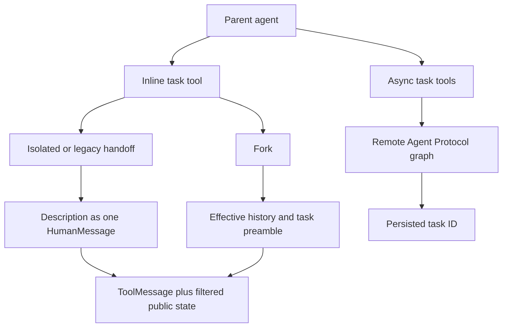

# Subagents & Skills

Deepagents has two complementary extension mechanisms. **Subagents** delegate a task to another agent or a remote graph; **skills** make a large instruction library discoverable without putting every instruction in every model request. `create_deep_agent` assembles the relevant middleware, while `SubAgentMiddleware`, `AsyncSubAgentMiddleware`, and `SkillsMiddleware` own their runtime behavior. See [SDK construction and execution](/openwiki/architecture/sdk-construction-execution.md), [context management](/openwiki/concepts/context-management.md), and [middleware catalog](/openwiki/concepts/middleware-catalog.md).

## Choosing a delegation mechanism

A `subagents` entry is classified structurally by `create_deep_agent`:

- `graph_id` selects a remote `AsyncSubAgent`, exposed through background-task tools.
- `runnable` selects a caller-owned `CompiledSubAgent`, exposed through the inline `task` tool.
- Any other entry is a declarative `SubAgent`; the builder resolves defaults and compiles it for `task`.

The recent default is **`"isolated"`**. `"handoff"` is accepted only as a legacy alias for isolated operation—it does not hand off the conversation. **`"fork"`** is the only context-inheriting mode and is beta/experimental. Unsupported modes, duplicate inline names, and `skills` on a forked declarative spec fail validation.

*The inline path waits for a report; the remote path starts work and returns a durable handle.*

## Inline `task`: isolation, results, and compiled agents

`SubAgentMiddleware` contributes one structured tool, `task(description, subagent_type)`. A registered name selects the child. An unknown name produces an explanatory tool result; a valid call without a tool-call ID raises `ValueError`, because the parent-side `Command` must attach its `ToolMessage` to that call.

### Default isolated state versus inherited configuration

An isolated child receives a fresh `messages` value containing only `HumanMessage(description)`. The middleware removes the parent's `messages`, `todos`, `structured_response`, fork marker, and private middleware channels before invoking it. Therefore the description must include the needed context, scope, and expected report format. This is **state and prompt isolation**, not a guarantee of configuration isolation: LangGraph's ambient per-key merge carries parent callbacks, tags, metadata, and configurable values; the middleware only adds `ls_agent_type="subagent"` for tracing. A child runnable's bound configuration wins collisions such as run name and recursion limit.

When the child completes, its result must contain `messages` or delegation raises `ValueError`. A non-null `structured_response` takes precedence and is JSON serialized (including Pydantic models and dataclasses); otherwise the middleware uses the last non-empty `AIMessage` text. It returns one parent `ToolMessage`, plus compatible public state updates. It never returns messages, todos, structured output, the fork marker, or private middleware keys. This allows intentional public custom channels to cross the boundary without sharing task-local or private channels.

A `CompiledSubAgent` is opaque caller-owned code: it receives a name/run configuration but does not inherit the builder's `state_schema`. Its author must compile a runnable with a compatible `messages` state key. A declarative spec instead goes through `create_sub_agent`, which requires resolved `model` and `tools`, optionally forwards a state schema, adds `HumanInTheLoopMiddleware` for `interrupt_on`, and selects its response format. Raw declarative specs also support a per-call `configurable["__deepagents_subagent_response_format"]` override; it recompiles that raw spec for the invocation. The override is rejected for compiled entries.

## Builder defaults, permissions, and fork behavior

For a declarative subagent, the builder inherits the parent model, tools, and filesystem permissions unless the spec overrides each item. A supplied permission list replaces parent rules, and filesystem rules are evaluated in declaration order with the first match winning. Permission-derived interrupts are merged with explicit `interrupt_on`.

An ordinary isolated declarative child starts with filesystem, summarization, and patching middleware. Declared child `skills` are added after those core entries; harness-profile, prompt-caching, exclusions, and custom middleware are then applied. It has its own compiled prompt and its own skill metadata, rather than inherited parent conversation, skill state, or memory state. Unless disabled by the harness profile or replaced by a caller entry of the same name, the builder also adds `general-purpose`, with the parent's model, tools, permissions, and a corresponding default stack.

### Fork: what is inherited and what remains isolated

A fork continues the parent’s **effective** history. The middleware drops a trailing AI message with unresolved tool calls, applies the parent summarization event to reconstruct the compacted history, and appends a `HumanMessage` with a fork preamble and the new task. The preamble establishes that the historical delegation already happened and directs the child to finish the work rather than delegate again.

A declarative fork mirrors the parent's prompt-producing arrangement: its base prompt is the parent prompt with the fork `system_prompt` appended; it carries parent state, including private channels, except a prior structured response and summarization event/session bookkeeping. When parent skills or memory are configured, it includes the corresponding skills and memory middleware so the inherited state can rebuild the prompt. A fork cannot declare separate skills, preventing a divergent skill library. Its own tools are allowed, although different tools can affect prompt-cache reuse.

A compiled fork receives the same effective message history but not private state or normal task-excluded channels, because its runnable schema and state semantics are unknown. Both fork kinds retain a guarded `task` tool to preserve tool layout; the private fork marker makes nested delegation return a refusal instead of recursively launching another subagent.

## Remote asynchronous subagents

`AsyncSubAgentMiddleware` manages remote Agent Protocol graphs independently of inline `task`. It supplies `start_async_task`, `check_async_task`, `update_async_task`, `cancel_async_task`, and `list_async_tasks`.

`start_async_task` creates a LangGraph SDK thread, starts the configured `graph_id` with the description as a user message, and immediately persists and returns the thread ID as `task_id`. The `async_tasks` state reducer merges records by task ID, retaining remote thread/run IDs and timestamps through subsequent updates and compaction. Launch failures and unknown types return tool error text rather than a task record.

`check_async_task` reads the tracked run; on success it retrieves the remote thread's final message. `update_async_task` sends a user message on the same remote thread with `multitask_strategy="interrupt"`, replacing the current run ID while retaining the task ID and remote conversation. Cancellation calls the remote run cancellation endpoint and records `cancelled`.

`list_async_tasks` filters using cached state before live lookup, then refreshes selected nonterminal runs (concurrently in the async implementation). Terminal `cancelled`, `success`, `error`, `timeout`, and `interrupted` entries are not queried. If a live lookup fails, the cached status is retained; users should check again rather than treat an old tool result as current.

Clients are lazy and cached by `(url, resolved headers)`. The default resolved headers add `x-auth-scheme: langsmith`, unless supplied by the spec; custom headers support self-hosted servers. A URL-less spec uses in-process ASGI transport and requires an asynchronous parent entrypoint such as `ainvoke`; synchronous invocation without a URL raises `ValueError`.

## Skills: metadata first, instructions on demand

`SkillsMiddleware` implements progressive disclosure. Before an agent session it lists every configured backend source, finds immediate subdirectories, downloads candidate `SKILL.md` files, and injects an index into the system message. The index shows source locations, name, description, optional license/compatibility annotations, allowed tools, and the exact path to read. It directs the model to load full instructions only if a skill matches the task; supporting files remain available beneath the skill directory.

A valid skill needs YAML frontmatter with non-empty `name` and `description`. Parsing is defensive: malformed frontmatter/YAML, inaccessible or missing content, non-UTF-8 bytes, and oversized files are skipped with warnings. Name-format or directory-name incompatibilities warn for compatibility but do not prevent loading. Metadata is normalized, while overlong descriptions and compatibility values are truncated to configured bounds. Sources are processed in order, and a later skill of the same name replaces an earlier one.

`skills_metadata` and recoverable `skills_load_errors` are private state. Loading runs once per session/checkpointed state: the middleware does not reload if `skills_metadata` exists, even when it is empty. A custom template must include `{skills_locations}`, `{skills_load_warnings}`, and `{skills_list}`. `system_prompt=None` suppresses only prompt injection, not discovery; rendered source errors are bounded and escaped in an explicitly untrusted diagnostic block.

## dcode: filesystem-defined subagents and skills

The dcode CLI discovers declarative subagents at `.deepagents/agents/{name}/AGENTS.md`. Its YAML frontmatter requires a non-empty `description`; an optional `model` must be a string, and the Markdown body becomes `system_prompt`. Omitted `name` falls back to the folder name, while a present blank or non-string name is invalid. Malformed, unreadable, misplaced, or incomplete definitions are skipped with warnings. Project definitions load after user definitions and override equal resolved names; dcode converts the resulting metadata into SDK `SubAgent` specs during agent construction.

For interactive `/skill:` commands, dcode wraps the SDK skill parser with a local `FilesystemBackend`. Its precedence from lowest to highest is built-in, plugin, per-agent user `.deepagents`, user `.agents`, project `.deepagents`, project `.agents`, experimental user Claude, and experimental project Claude directories. Higher sources override same-named skills. Startup/reload discovery creates slash commands and records resolved allowed roots. Reading a full `SKILL.md` resolves the path and rejects it when it lies outside those roots, protecting against symlink traversal; configured or approved extra directories can extend the allowlist.

## Talon: configured remote subagents

Talon is an experimental runtime that exposes remote subagents through `~/.deepagents/config.toml`. Each `[async_subagents.<name>]` table needs non-empty string `description` and `graph_id`; it may specify a non-empty `url` and string-to-string `headers`. The Talon CLI passes a strict loader to `DeepAgentRuntime`: absent configuration yields no agents, while unreadable or malformed configuration and invalid entries fail startup in strict mode. Outside strict mode, invalid entries are warned about and skipped so valid entries can still be used.

## Focused tests and safe changes

The SDK tests in `test_subagent_middleware_init.py` and `test_subagents.py` cover mode validation and the legacy alias, fork prompt/state differences and recursion refusal, dynamic response formats, duplicate names, result extraction, filtering of private state, public-state transfer, config merge behavior, and builder routing/default registration. `test_async_subagents.py` covers the five remote tools, errors, reducer and timestamp behavior, headers, cached filtering/live refresh, and ASGI restrictions. Skills middleware tests cover backend loading, malformed candidates, precedence, private one-time state, and template validation. dcode skill-invocation tests cover source discovery and containment/trust roots; Talon's async-subagent tests cover TOML parsing, partial failure, and absence behavior.

## Related

- [SDK construction and execution](/openwiki/architecture/sdk-construction-execution.md)
- [Context management](/openwiki/concepts/context-management.md)
- [Middleware catalog](/openwiki/concepts/middleware-catalog.md)
- [Talon](/openwiki/integrations/talon.md)
- [Build a deep agent](/openwiki/workflows/build-a-deep-agent.md)
