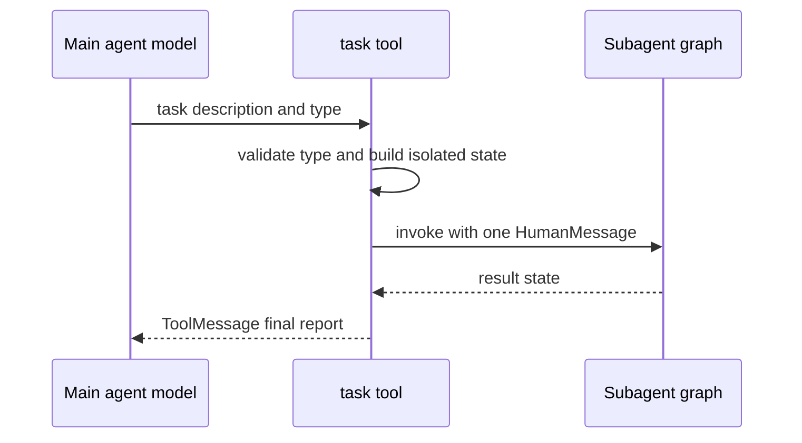

# Subagents & Skills

Deepagents has two complementary extension mechanisms. **Subagents** delegate a
bounded task to another agent with an isolated context window. **Skills** expose
a reusable library through metadata first and full instructions only when needed.
Both are middleware-based SDK mechanisms, but dcode is a product assembly on top
of them: its source precedence, plugin behavior, filesystem subagent discovery,
and shell environment handling are not general SDK subagent semantics. See the
[middleware stack](/openwiki/architecture/middleware-stack.md), [config
layering](/openwiki/concepts/config-layering.md), and [tools & filesystem](/openwiki/concepts/tools-filesystem.md).

## SDK subagents: synchronous delegation

### The `task` tool and isolation

`SubAgentMiddleware` gives the main model one `task` tool. Its arguments are a
free-form `description` and a `subagent_type` chosen from registered agents. The
tool instructions emphasize that a task is stateless: include all needed context
and expected output in the description. Independent tool calls can be issued
concurrently. A subagent completes before its particular `task` call returns;
the parent sees a final report, not its intermediate tool work.

*The synchronous `task` path isolates the delegated prompt and returns one result to the parent.*

The task state starts with `HumanMessage(description)`. It copies only parent
state outside `messages`, `todos`, `structured_response`, and middleware-private
keys. This is context isolation, not total configuration isolation: LangGraph's
ambient-config merge carries parent callbacks, tags, and `configurable` values;
the task path adds only `ls_agent_type="subagent"` for tracing. On return,
non-excluded, non-private state updates are merged into the parent as well as
the `ToolMessage`.

Result selection is deliberately defensive. A non-`None` `structured_response`
is JSON serialized (Pydantic `model_dump_json`, dataclass conversion, or
`json.dumps`). Otherwise the middleware searches backward for the last non-empty
`AIMessage` text, avoiding an empty trailing `end_turn` message. A compiled
runnable without a returned `messages` key fails with `ValueError`, since that
key is the result channel.

### Shapes, construction, and boundaries

The graph builder partitions supplied entries structurally:

- A declarative **`SubAgent`** has `name`, `description`, and `system_prompt`;
  it may set a model, tools, middleware, interrupts, skills, permissions, and a
  response format. It is compiled with `create_agent`.
- A **`CompiledSubAgent`** has a caller-owned `runnable` and is used as-is. Its
  schema must contain `messages`; it does not inherit a state schema supplied to
  `create_deep_agent`.
- An entry with **`graph_id`** is an **`AsyncSubAgent`**, handled by the remote
  asynchronous middleware rather than the inline `task` tool.

For declarative agents, the builder resolves a subagent model and profile,
uses its permissions when present (otherwise the parent's), and builds a base
stack of `FilesystemMiddleware`, summarization, and
`PatchToolCallsMiddleware`. A declared `skills` list adds `SkillsMiddleware`;
profile middleware and custom middleware are then applied through the builder's
middleware ordering/exclusion machinery. A subagent can therefore use a
different model, tools, permissions, and skill sources. Permission rules replace
rather than combine with parent rules, and filesystem rules are evaluated in
declaration order with first match winning.

`GENERAL_PURPOSE_SUBAGENT` is the built-in `general-purpose` declarative spec.
The builder adds it with parent model, tools, and a default stack unless the
harness profile disables it or an inline subagent already has that name. An
explicit declarative `response_format` supports a strategy, type, or JSON schema.
A caller may request a one-call replacement through
`__deepagents_subagent_response_format`; that recompiles a raw spec and is
rejected for caller-owned compiled runnables.

## SDK remote asynchronous subagents

`AsyncSubAgentMiddleware` is a distinct remote-work model, not a nonblocking
form of `task`. `start_async_task` creates a thread and run on an Agent
Protocol-compatible server through the LangGraph SDK and immediately returns a
`task_id`. The companion tools check, update, cancel, and list tasks. Task
records live in the `async_tasks` state dictionary, whose reducer merges by task
id, so task handles survive compaction and remain inspectable.

Clients are created lazily and cached by `(url, headers)`. With no `url`, async
invocation uses in-process ASGI transport; synchronous invocation rejects that
configuration because it requires a URL. This separation matters when choosing
between immediate isolated work and durable remote background work.

## SDK skills: progressive disclosure

`SkillsMiddleware` lists every loaded skill's name and description in the system
prompt but directs the model to use `read_file` on its `SKILL.md` only when the
task matches. Supporting files remain reachable at their paths. This keeps the
normal prompt small without hiding the library.

A skill is a directory with `SKILL.md` YAML frontmatter. `name` and `description`
are required; license, compatibility, metadata, and `allowed-tools` are
optional. The loader validates size, encoding, frontmatter, and metadata limits.
Malformed, non-UTF-8, or oversized candidates are warned and skipped rather
than breaking prompt construction; name-spec violations also warn for backwards
compatibility.

Sources are ordered and collision resolution is last-one-wins, enabling layers
such as base → user → project → team. A source can be a bare path or `(path,
label)`. Bare labels derive from the final directory name, with `built_in_skills`
shown as `Built-in` and a literal `skills` leaf using its parent. The SDK uses
backend `ls`/`download_files` APIs (or async equivalents), rather than direct
filesystem access, so this works with state, filesystem, and remote backends.

Loading happens once in `before_agent` or `abefore_agent`; existing
`skills_metadata`, including an empty list, prevents reloading. Metadata and
recoverable source errors are private state and do not propagate to a parent
agent. At model-call time the middleware formats locations, skill annotations,
paths, and safely framed load warnings into the system message. A custom prompt
template must contain `{skills_locations}`, `{skills_load_warnings}`, and
`{skills_list}`; `system_prompt=None` still loads state but does not inject a
prompt section.

## dcode product assembly

### Skill sources and plugin namespacing

When skills are enabled, dcode installs `PluginSkillsMiddleware` over a real
`FilesystemBackend`; it is not relying on the SDK's generic source list alone.
Its sources are ordered from lowest to highest priority: bundled skills, plugin
skills, user `.deepagents`, user `.agents`, project `.deepagents`, project
`.agents`, then experimental user and project `.claude` skills. Thus later
sources shadow earlier same-name skills. The bundled root is
`deepagents_code/built_in_skills` and is labeled `Built-in`.

For ordinary sources, `PluginSkillsMiddleware` delegates to SDK loading. For
plugin sources it recursively discovers nested skill directories and qualifies
names as `plugin_id:...` before merging, avoiding collisions between plugins and
with ordinary skills. This is a dcode convention layered on the SDK's generic
last-one-wins rule.

### Filesystem-defined dcode subagents

dcode also builds declarative SDK subagents from user and project directories at
`.deepagents/agents/{name}/AGENTS.md`. YAML frontmatter requires a non-empty
`description`; `model` is optional and must be a string when present; the
markdown body is the `system_prompt`. Unlike an Agent Skill, a missing `name`
uses the containing directory name (but an explicitly empty or invalid name is
rejected). Project definitions override same-named user definitions.

Malformed frontmatter, unreadable files, misplaced markdown, missing
`AGENTS.md`, and in-directory name collisions are logged and skipped. During
agent assembly dcode turns each accepted definition into a declarative SDK
`SubAgent`, applies its model policy, and adds CLI-specific approval, configurable
model, and nested cost-tracking middleware. This product behavior should not be
assumed when using the SDK directly.

### Server and shell environment boundary

In normal dcode operation, the agent graph runs in a `langgraph dev` server
subprocess. The server launch environment copies the process environment but
strips startup-sensitive values, including `PYTHONPATH`. A launch-time
`PYTHONPATH` is instead captured in the private
`DEEPAGENTS_INHERITED_PYTHONPATH` carrier, so it cannot alter the server
interpreter's `sys.path`.

For local approval-gated `execute` commands, dcode constructs a curated shell
environment. It restores the caller's tracing flags and tracing API keys,
restores the caller's `LANGSMITH_PROJECT` (or removes dcode's default), sets
`GIT_TERMINAL_PROMPT=0`, then converts the carrier back to `PYTHONPATH`.
`LocalShellBackend` receives that complete mapping with `inherit_env=False`;
otherwise a second inheritance would reintroduce the carrier or dcode tracing
credentials. Consequently, a shell command may receive the user's launch import
path, while the server process and delegated agent graphs do not acquire it
through interpreter startup.

## Related

- [Middleware stack](/openwiki/architecture/middleware-stack.md)
- [SDK construction and execution](/openwiki/architecture/sdk-construction-execution.md)
- [Configuration layering](/openwiki/concepts/config-layering.md)
- [Build a deep agent](/openwiki/workflows/build-a-deep-agent.md)
- [Run a dcode session](/openwiki/workflows/run-dcode-session.md)
- [Testing guide](/openwiki/testing/testing-guide.md)
