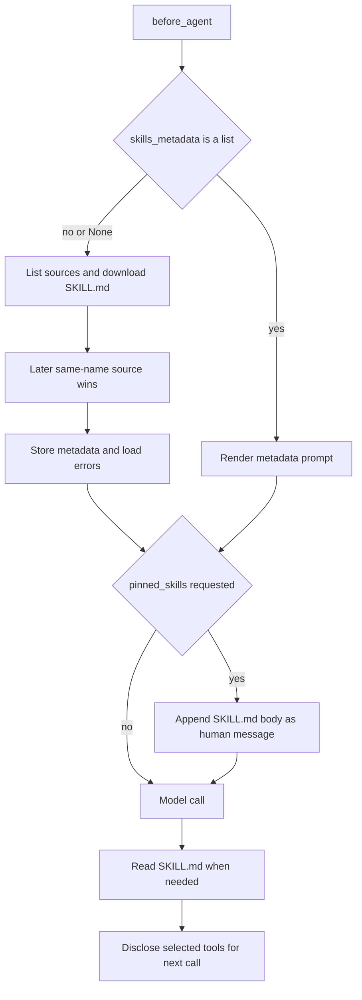

# Subagents and Skills

`create_deep_agent` combines two separate mechanisms. **Subagents** execute delegated work: a local `task` call waits for a child result, whereas an `AsyncSubAgent` starts and subsequently manages a remote Agent Protocol run. **Skills** are backend-resident instruction bundles: `SkillsMiddleware` indexes their metadata, prompts the model to read relevant `SKILL.md` files on demand, and can expose skill-selected tools only after disclosure.

A skill is not an authorization policy or a subagent. Its instructions guide the model, and `metadata.include_tools` participates in a tool-availability gate; filesystem access, registered tools, and approval/`interrupt_on` policy remain separate controls. See [Middleware stack](/openwiki/architecture/middleware-stack.md), [Middleware catalog](/openwiki/concepts/middleware-catalog.md), and [Build a Deep Agent](/openwiki/workflows/build-a-deep-agent.md).

## Assembly and delegation boundaries

`subagents=` accepts declarative `SubAgent` specs, caller-owned `CompiledSubAgent` specs, and remote `AsyncSubAgent` specs (identified by `graph_id`). The factory compiles declarative local specs, uses compiled runnables as supplied, and installs local `SubAgentMiddleware` and `AsyncSubAgentMiddleware` independently. Unless a harness profile disables it or a spec replaces it, it adds the synchronous `general-purpose` worker.

```mermaid
flowchart TD
    Parent["Parent model"] --> Task["task"]
    Task --> Mode{"Local mode"}
    Mode -->|"isolated"| Isolated["New task message and filtered state"]
    Mode -->|"fork"| Fork["Effective history and inherited context"]
    Isolated --> Local["Local runnable"]
    Fork --> Local
    Local --> Result["ToolMessage and allowed state update"]
    Parent --> Start["start_async_task"]
    Start --> Remote["Agent Protocol thread and run"]
    Remote --> Tasks["async_tasks state"]
    Tasks --> Manage["check update cancel list"]
```

*Local delegation waits for a child result; remote delegation stores a task ID and lets the parent continue.*

The local `task` interface accepts only `description` and `subagent_type` (besides injected runtime), rejects duplicate names and invalid modes while constructing the tool, and retains `handoff` as an alias for `isolated`. Invocation inherits ambient parent configuration, while LangSmith tracing and child configurable metadata mark the run as `ls_agent_type="subagent"`.

### Isolated local work

Isolation is the default. The child starts with a new `HumanMessage` containing the description and a state copy that excludes `messages`, `todos`, `structured_response`, `skills_metadata`, `pinned_skills`, `_skill_tools_disclosed`, the fork marker, and declared middleware-private fields. The same exclusions constrain state returned to the parent. This prevents a child transcript, skill index, pending pin, or latest disclosure record from overwriting the parent.

For a declarative worker, omitted `tools` inherit the parent application tools while an explicit list replaces them. Omitted `permissions` and `interrupt_on` inherit from the parent; explicit values take precedence. A compiled worker is an opaque runnable that owns its graph behavior and must return a state containing `messages` to communicate a result.

One invocation produces one `ToolMessage` for the original call. A non-null `structured_response` is JSON-serialized; otherwise the boundary forwards the last non-empty child `AIMessage` text. It may return other non-excluded public state, but never the child transcript or private fields.

### Forked local work

Experimental `mode="fork"` continues from the parent rather than creating a blank-task child. It applies the pending summarization event to recover effective history, removes the parent’s pending tool-call message, then appends a preamble and the delegated description. A declarative fork retains the state required to rebuild parent middleware context and uses the parent prompt plus its own prompt addendum; a compiled fork receives only non-excluded public state because its internal schema is unknown.

A fork cannot declare `skills`: it replays parent skill behavior. It receives a guarded mirror of `task`, and the fork marker makes every nested `task` call return a refusal. Prefer a fork only for work that needs the effective conversation and prompt; use isolated mode for an intentional narrow boundary.

## Remote asynchronous work

An `AsyncSubAgent` supplies remote `graph_id`, optional `url`, and optional headers. `start_async_task` creates an Agent Protocol thread and run with the description as a user message, then persists an `AsyncTask` under its thread ID in `async_tasks`. The reducer merges task updates, retaining agent name, thread and run IDs, status, and lifecycle timestamps across normal state updates.

`check_async_task` retrieves the current run and, on success, returns its final remote message. `update_async_task` creates an interrupting replacement run on the same thread, preserving the task ID but replacing the run ID. `cancel_async_task` cancels the tracked run. `list_async_tasks` filters on cached status and refreshes selected nonterminal tasks; a failed status fetch retains the cached value. Unknown agent types or task IDs and SDK failures are tool errors, not task-state mutations.

Clients are cached by URL and resolved headers. The middleware adds `x-auth-scheme: langsmith` unless the spec provides it; environment credentials serve managed deployments and `headers` are the self-hosted extension point. A spec without `url` uses in-process ASGI transport and therefore requires an async parent entry point such as `ainvoke`; synchronous invocation requires a URL. Remote graphs own their tools, permissions, HITL policy, and state schema rather than inheriting them from the local parent.

## Skills: discovery, prompt index, and pins

A skill source is a backend path or `(path, label)` pair. Before execution, the middleware lists immediate source directories and downloads each candidate `SKILL.md`. Valid frontmatter provides the required name and description; metadata additionally records the path, optional license and compatibility, `allowed-tools`, and arbitrary `metadata`. The injected prompt lists source labels, descriptions, and paths, then directs the model to use `read_file` for complete instructions and supporting files only when relevant.

```mermaid
flowchart TD
    Begin["before_agent"] --> Cached{"skills_metadata is a list"}
    Cached -->|"yes"| Prompt["Render metadata prompt"]
    Cached -->|"no or None"| Scan["List sources and download SKILL.md"]
    Scan --> Overlay["Later same-name source wins"]
    Overlay --> Store["Store metadata and load errors"]
    Store --> Pin{"pinned_skills requested"}
    Prompt --> Pin
    Pin -->|"yes"| Snapshot["Append SKILL.md body as human message"]
    Pin -->|"no"| Model["Model call"]
    Snapshot --> Model
    Model --> Read["Read SKILL.md when needed"]
    Read --> Gate["Disclose selected tools for next call"]
```

*Skill metadata is cached per state; a requested pin inserts an instruction snapshot before the next model call.*

Sources are processed in order, with a later same-named skill replacing an earlier one. `skills_metadata` caches even an empty list; set it to `None` in invocation input or with `update_state` to reload. Source-level listing failures are written to `skills_load_errors`; the prompt bounds and escapes those diagnostics and labels them untrusted. `system_prompt=None` suppresses only this prompt fragment, not discovery or error collection. A custom prompt template must include `{skills_locations}`, `{skills_load_warnings}`, and `{skills_list}`.

### One-turn pinned-skill snapshots

Pass skill names in `pinned_skills` when the next model call must receive their full instructions without relying on a model-initiated `read_file`. Before that call, the middleware resolves distinct known names in first-seen order, downloads their current `SKILL.md` files, strips frontmatter, and appends one `HumanMessage` per readable file. Each message wraps the body in `<skill>` and carries `lc_source="pinned_skill"` plus name, path, and description metadata.

The pin request is cleared with `Overwrite([])`, so it is a one-turn request rather than a persistent control value; appended messages remain in conversation state. A pin is consequently a snapshot: editing the file afterward does not alter the already appended message, while pinning again reads and appends the current body. Unknown, missing, empty, oversized, or non-UTF-8 skills are skipped and do not block other requested pins.

Top-level `skills=` adds skills middleware to the main graph and auto-generated general-purpose worker. A named isolated declarative worker receives skills only from its own `skills` spec. Forks replay parent skill behavior and cannot declare separate sources. Normal isolation excludes metadata, pending pins, and disclosure state; a declarative fork retains enough private state to rebuild its inherited behavior.

## Skill-selected tools: disclosure is a gate

`metadata.include_tools` is a space-separated list of include names. `SkillsMiddleware(tools=...)` accepts a list of tools/callables or a `SkillToolResolver`; list entries resolve by exact name, while a resolver can map an include name to runtime-dependent `BaseTool` instances. These tools are deliberately not registered on the ordinary tool node, so construction alone does not make them callable.

A successful `read_file` result for a known normalized `SKILL.md` path, or a pinned-skill message, is a disclosure trigger. Offsets, limits, and later clipping do not negate it. The middleware evaluates visible triggers before the next model call, resolves unclaimed include names, anchors each generated tool at its earliest trigger, and records only gated names as `{tool name: include name}` in private `_skill_tools_disclosed`. If compaction removes an anchoring read or pin, a tool is withdrawn unless another visible trigger can re-anchor it.

At tool execution, an ordinarily registered runtime tool wins. Otherwise `wrap_tool_call` admits only a name in the latest disclosure record, re-resolves its recorded include name, and attaches a returned tool with the same name. Missing or malformed disclosure and stale resolver output therefore remain invalid-tool calls. Resolver errors and invalid return types propagate; an async resolver requires the async entry point. This is a model-visible availability boundary, not a substitute for permissions or `interrupt_on`: a disclosed tool still traverses approval middleware.

A skill can name an already registered tool. That does not replace it. If the registered tool has `extras={"defer_loading": True}`, a trigger exposes its schema but it remains an ordinary, ungated tool; `disclosed_skill_tool_names()` reports only genuinely gated skill tools for middleware that needs the same gate semantics.

### Provider request formats

For models without supported mid-conversation additions, disclosed tools are added to the next request’s bound tool list. Supported Anthropic models receive inline `tool_addition` blocks; supported OpenAI Responses models receive `additional_tools` developer items. Both are placed after the triggering tool-result batch and queued follow-ups, preserving parallel-result grouping and stable request prefixes. The private disclosure record reflects what the latest model call was actually shown.

Anthropic disclosure withholds a schema containing root `oneOf`, `anyOf`, or `allOf`, because that provider rejects such a definition; the withheld tool is not admitted. OpenAI Responses may receive the corresponding additional schema.

## Operations and focused tests

Use an isolated declarative subagent for a bounded task with explicit inputs and independent tool configuration. Use a fork only for context-dependent continuation, accepting beta behavior and nonrecursive delegation. Use a compiled worker when another graph owns the boundary, and an async worker for long-running remote work requiring status management.

Focused tests cover task validation, state isolation, fork reconstruction and refusal, structured-result forwarding, tracing identity, remote launch/check/update/cancel/list behavior, discovery precedence and reload, and propagation to the appropriate worker. Skill-tool tests cover pre-read and same-turn rejection, pin-triggered disclosure, compaction withdrawal, resolver behavior, approval integration, and provider payload placement. Pinned-skill tests verify ordering, deduplication, one-turn clearing, snapshot semantics, unreadable-file skipping, parallel pins, and that subagent output cannot pin instructions into the parent.

## Related

- [Middleware stack](/openwiki/architecture/middleware-stack.md)
- [Middleware catalog](/openwiki/concepts/middleware-catalog.md)
- [Talon integration](/openwiki/integrations/talon.md)
- [Build a Deep Agent](/openwiki/workflows/build-a-deep-agent.md)
