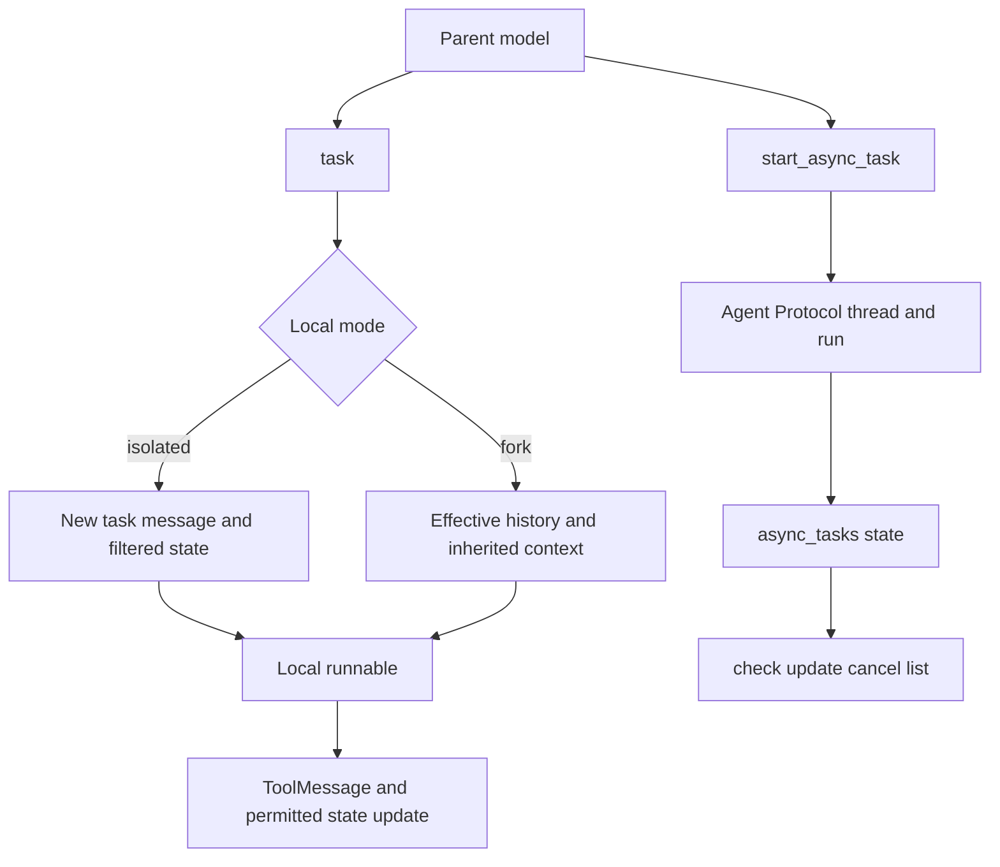
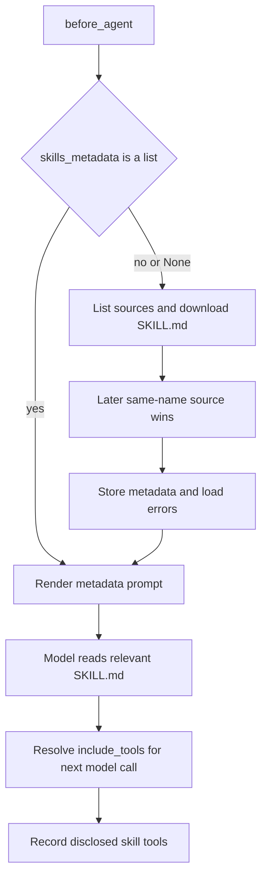

# Subagents and Skills

`create_deep_agent` combines two distinct mechanisms. **Subagents** are delegated executions: a local `task` call waits for a child result, while an `AsyncSubAgent` launches a remote Agent Protocol run that is managed later. **Skills** are backend-resident instruction bundles. `SkillsMiddleware` indexes their metadata, adds a progressive-disclosure prompt, and—when configured with skill tools—makes selected tools available only after an observed successful read of the relevant `SKILL.md`.

A skill is therefore neither an authorization policy nor a subagent. Its instruction text can guide the model, and `metadata.include_tools` can participate in a model-visible and execution-time tool gate, but filesystem permissions, ordinary registered tools, and approval/`interrupt_on` policies remain separate controls. See [Middleware stack](/openwiki/architecture/middleware-stack.md), [SDK construction and execution](/openwiki/architecture/sdk-construction-execution.md), and [Permissions and HITL](/openwiki/concepts/permissions-hitl.md).

## Assembly and delegation boundaries

`subagents=` accepts declarative `SubAgent` specs, prebuilt `CompiledSubAgent` specs, and `AsyncSubAgent` specs identified by `graph_id`. The factory compiles declarative local specs, leaves a compiled runnable caller-owned, and installs the synchronous `SubAgentMiddleware` and remote `AsyncSubAgentMiddleware` independently. Unless the harness profile disables it or a caller provides a `general-purpose` replacement, it also installs the default synchronous general-purpose worker.

```mermaid
flowchart TD
    Parent["Parent model"] --> Task["task"]
    Task --> Branch{"Local mode"}
    Branch -->|"isolated"| Isolated["New task message and filtered state"]
    Branch -->|"fork"| Fork["Effective history and inherited context"]
    Isolated --> Local["Local runnable"]
    Fork --> Local
    Local --> Return["ToolMessage and permitted state update"]
    Parent --> Start["start_async_task"]
    Start --> Remote["Agent Protocol thread and run"]
    Remote --> Tasks["async_tasks state"]
    Tasks --> Manage["check update cancel list"]
```

*Local delegation blocks for one child result; remote delegation records a task ID and continues.*

The local `task` schema accepts `description` and `subagent_type` (plus injected runtime), rejects invented arguments, and rejects duplicate names or unsupported modes during construction. `handoff` is retained as an alias for `isolated`. A child invocation receives ambient parent configuration through the runtime, while its tracing context and configurable metadata identify it as `ls_agent_type="subagent"`.

### Isolated local work

Isolation is the default. The child receives a new `HumanMessage` containing the delegated description and a state copy excluding `messages`, `todos`, `structured_response`, `skills_metadata`, `_skill_tools_disclosed`, the fork marker, and middleware-private fields. The same exclusions apply to updates returned to the parent. This prevents a child’s conversation, skills index, or latest disclosure record from replacing the parent’s state.

For declarative workers, omitted `tools` inherit the parent application tool sequence; an explicit value replaces it. Omitted `permissions` and `interrupt_on` inherit parent configuration, while explicit values take precedence. A `CompiledSubAgent` is an opaque runnable: its own graph owns such behavior and it must return a state with `messages` to communicate a result.

The child result becomes one `ToolMessage` associated with the original tool call. A non-null `structured_response` is JSON-serialized; otherwise the adapter finds the last non-empty child `AIMessage` text. Other non-excluded public state updates may cross back, but the child transcript does not.

### Forked local work

Experimental `mode="fork"` continues the parent rather than starting with a blank task. The adapter applies any summarization event to reconstruct effective history, removes the parent’s pending tool-call message, and appends a preamble plus the delegated task. Declarative forks inherit parent state except fork-excluded transient output/summarization state, retain private channels so their middleware can reconstruct context, rebuild the parent prompt, and add their own prompt as an addendum. A compiled fork gets only non-excluded public state because its graph is opaque.

A fork cannot set `skills`; it uses the parent’s skills behavior. It receives a guarded mirror of `task`, not unrestricted recursive delegation: any nested call sees the fork marker and returns a refusal. Use a fork only when the child needs the effective conversation and prompt context; use isolated mode for a narrower task boundary.

## Remote asynchronous work

An `AsyncSubAgent` specifies a remote `graph_id`, optional `url`, and optional headers. `start_async_task` creates a remote thread and run with the description as a user message, then stores an `AsyncTask` in state under the thread ID. The record includes agent name, thread/run IDs, status, and lifecycle timestamps; a reducer merges task updates so they survive normal state lifecycle and context compaction.

`check_async_task` retrieves the run and returns the final remote message on success. `update_async_task` starts a new run on the same thread using `multitask_strategy="interrupt"`, retaining the task ID but replacing its run ID. `cancel_async_task` cancels the tracked run. `list_async_tasks` filters by cached status, then refreshes nonterminal selected tasks, retaining cached status if the remote fetch fails. Unknown agent types or task IDs and SDK failures are returned as tool errors rather than state mutations.

Clients are cached by URL and resolved headers. The middleware supplies `x-auth-scheme: langsmith` unless the spec supplies it; SDK environment credentials serve managed deployments and `headers` are the self-hosted extension point. A synchronous parent requires a URL: omitted `url` selects in-process ASGI transport, available only from an async parent invocation. Remote graphs own their own tools, permissions, HITL policy, and state schema; those are not inherited from the local parent.

## Skills: discovery and prompt index

A source is a backend path or `(path, label)` pair. Before agent execution, the middleware lists immediate source directories and downloads each candidate `SKILL.md` through backend APIs. Valid frontmatter supplies a skill name and description; metadata also captures its path, optional license and compatibility, `allowed-tools`, and arbitrary `metadata`. The listing prompt shows source labels, skill descriptions and paths, then directs the model to use `read_file` to obtain full instructions and supporting files only when relevant.

```mermaid
flowchart TD
    Begin["before_agent"] --> Cached{"skills_metadata is a list"}
    Cached -->|"yes"| Prompt["Render metadata prompt"]
    Cached -->|"no or None"| Scan["List sources and download SKILL.md"]
    Scan --> Overlay["Later same-name source wins"]
    Overlay --> Store["Store metadata and load errors"]
    Store --> Prompt
    Prompt --> Read["Model reads relevant SKILL.md"]
    Read --> Resolve["Resolve include_tools for next model call"]
    Resolve --> Gate["Record disclosed skill tools"]
```

*Skills load once per state unless invalidated; tool disclosure follows a successful skill-file read.*

Sources are processed in order and later skills with the same name replace earlier entries. `skills_metadata` caches the resulting list per state, including an empty list; set it to `None` in invocation input or through `update_state` to request a reload. Source-level listing errors are retained in `skills_load_errors`. If a prompt is enabled, diagnostics are bounded, escaped, and explicitly labelled untrusted. `system_prompt=None` suppresses only this prompt fragment: metadata and errors still load. A custom template must contain `{skills_locations}`, `{skills_load_warnings}`, and `{skills_list}`.

Top-level `skills=` installs a skills middleware on the main graph and the auto-generated general-purpose worker. A named isolated declarative worker gets skills only from its own `skills` spec; its sources do not inherit from the parent. Forks replay the parent behavior and cannot specify separate sources. Normal isolation excludes both skill metadata and the disclosure record; forks preserve metadata to rebuild parent context but still exclude `_skill_tools_disclosed`.

## Skill-selected tools: disclosure is a gate, not authorization

`metadata.include_tools` is a space-separated list of include names. `SkillsMiddleware(tools=...)` accepts a list of tools/callables or a `SkillToolResolver`; list entries resolve by exact tool name, while a resolver can map one include name to a family of `BaseTool` instances using graph runtime context. Skill tools are deliberately not registered in the ordinary tool node, so a model cannot call them merely because middleware was constructed.

Only a successful `read_file` tool result for a known skill’s normalized `SKILL.md` path counts as a disclosure trigger; offsets, limits, and later clipping do not invalidate that read. The read affects the **next** model call, not a tool call made in the same model response. For every still-visible successful read, the middleware resolves unclaimed include names, anchors each produced tool at its earliest read, and writes `{tool name: include name}` to private `_skill_tools_disclosed` state for the latest model call. If summarization removes the anchoring read, the tool is withdrawn or re-anchored to a remaining read.

At tool execution, an ordinary registered tool already selected by the runtime wins. Otherwise `wrap_tool_call` admits only a name recorded in `_skill_tools_disclosed`, re-resolves the recorded include name, and attaches the returned matching tool. Missing disclosure, stale/malformed records, or a resolver that no longer returns the named tool leaves the call to fail as an invalid tool. Resolver exceptions and invalid resolver return types propagate; async resolvers require the async entry point. This observable gate constrains tool availability, but it does not replace permission checks or `interrupt_on`: disclosed tools still pass through normal approval middleware.

A skill can also name an already registered tool. That does not replace it. If that registered tool is deferred with `extras={"defer_loading": True}`, the skill read exposes its schema but it remains an ordinary, ungated tool; `disclosed_skill_tool_names()` deliberately reports only gated skill tools for other middleware that needs matching gate semantics.

### Provider request formats

On models without supported mid-conversation tool additions, disclosed tools are appended to the next request’s bound tool list. For supported Anthropic models, the middleware inserts `tool_addition` / `tool_definition` blocks after the relevant complete tool-result batch. For supported OpenAI Responses models, it inserts `additional_tools` developer items at the equivalent point. Insertions do not split parallel tool results or precede queued user turns, and the stable placement preserves request-prefix caching. Unsupported provider/model paths use bound tools instead.

Anthropic disclosure rejects a tool schema with a root `oneOf`, `anyOf`, or `allOf`, because that provider rejects it; the tool is neither disclosed nor admitted. OpenAI Responses can receive the corresponding additional tool schema. In every provider path, the private disclosure record is derived from what was actually shown to the latest model call, so execution uses the same boundary.

## dcode skill discovery and `/skill` invocation

The dcode client uses a filesystem-facing loader rather than the SDK's per-thread `SkillsMiddleware` state. When skills are enabled, `create_cli_agent` builds `PluginSkillsMiddleware` from an ordered source list: shipped built-ins; discovered plugin sources; user and project `.deepagents` and `.agents` directories; then experimental user and project `.claude` directories. Later sources have higher precedence for ordinary duplicate names. A missing directory is skipped, and one source failure is logged without preventing the other sources from loading.

The shipped `deepagents-plugin-discovery` skill is consequently available even when no plugin skill sources exist. It instructs the agent to use the local CLI's read-only `plugin list --json` or `plugin marketplace list --json` with the current `DEEPAGENTS_HOME` profile when a needed capability may be in a configured marketplace. Catalog discovery neither enables nor installs a plugin, and a result with `enabled: false` must not be presented as proof that the plugin is installed. It also cannot inspect the host profile when `execute` or the local CLI/profile is unavailable in a remote sandbox.

Plugins contribute each inventory skill directory with the plugin ID as a namespace. dcode recursively walks a plugin source until it finds directories containing `SKILL.md`, stops descending below such a directory, and names a discovered skill as lowercase `plugin_id:subfolder:skill-name`. This makes separately packaged plugin skills collision-safe while preserving ordinary source precedence. Plugin discovery failure degrades to no plugin sources; it does not suppress built-in or user/project skills.

A user can invoke a discovered skill explicitly with `/skill:<name> [args]`. dcode re-discovers on a cache miss, reads the selected `SKILL.md`, wraps its complete content and optional request into the initial user message, and records name, description, source, and arguments in `additional_kwargs["__skill"]` for trace attribution. Before reading, `load_skill_content` resolves the path and requires it to fall under an allowed root—built-in, plugin, configured, or previously trusted—so a symlink escape is refused. An out-of-bounds path in the interactive app is a trust decision: an approval adds the resolved target directory for the session and attempts to persist that trust; a target that changes before the retry is refused.

## Operations and focused tests

Choose an isolated declarative subagent for a focused task with explicit inputs and independently configured tools. Choose a fork only for context-dependent continuation, accepting its experimental and nonrecursive behavior. Use a compiled worker when a separately built graph is the intended ownership boundary, and an async worker for remote, long-running work that needs persistent status management.

Focused SDK tests cover task argument validation, state isolation, fork reconstruction and refusal, structured-result forwarding, tracing identity, remote launch/check/update/cancel/list behavior, skill source precedence and reload, and skill propagation to the right worker. The skill-tool tests additionally verify pre-read and same-turn rejection, compaction withdrawal, resolver behavior, approval integration, and provider payload placement for Anthropic, OpenAI, and fallback binding paths. dcode loader tests confirm the shipped plugin-discovery skill is present without plugin sources and that an inaccessible source does not block a healthy one; invocation tests cover containment and symlink-escape rejection.

## Related

- [Code agent architecture](/openwiki/architecture/code-agent.md)
- [Middleware stack](/openwiki/architecture/middleware-stack.md)
- [SDK construction and execution](/openwiki/architecture/sdk-construction-execution.md)
- [Permissions and HITL](/openwiki/concepts/permissions-hitl.md)
- [MCP integration](/openwiki/integrations/mcp.md)
- [Tools and filesystem](/openwiki/concepts/tools-filesystem.md)
- [Testing guide](/openwiki/testing/testing-guide.md)
- [Build a Deep Agent](/openwiki/workflows/build-a-deep-agent.md)
