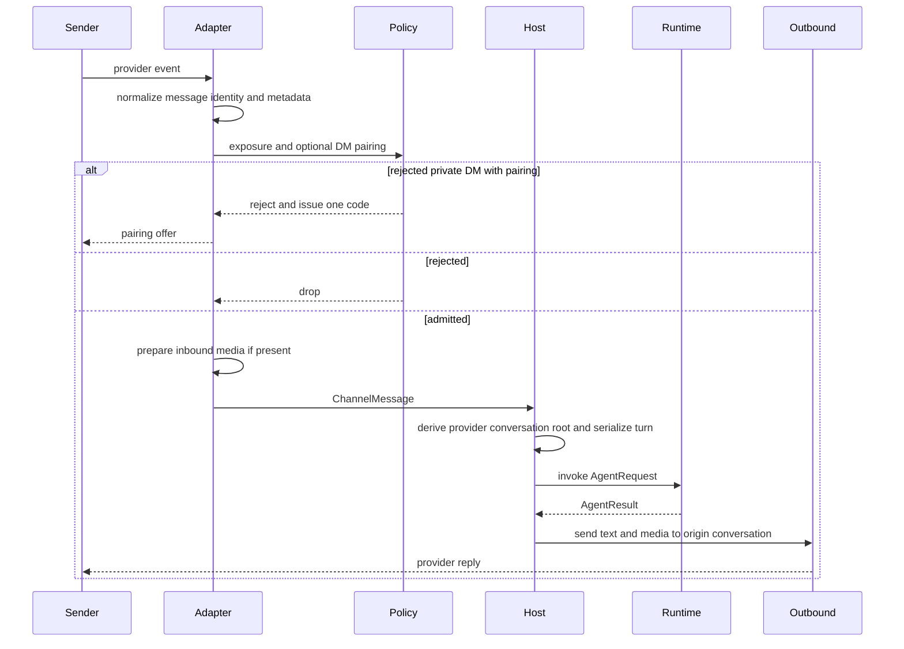

Talon channels are provider adapters around one host-owned protocol. An adapter turns a provider event into a `ChannelMessage` or `ChannelReaction`, makes the admission decision, and invokes a callback registered by `TalonHost`. The host—not the provider payload—constructs the agent conversation identity, serializes turns, handles control surfaces, invokes the runtime, and routes output back through the same adapter.

This page concerns the security-sensitive boundary from an external event to agent execution. It complements [runtime behavior](/openwiki/architecture/runtime-behavior.md), [permissions and HITL](/openwiki/concepts/permissions-hitl.md), [scheduling](/openwiki/concepts/talon-scheduling.md), [the Talon integration](/openwiki/integrations/talon.md), and [security operations](/openwiki/operations/security.md).

## Shared adapter contract

`ChannelAdapter` supplies lifecycle methods, a host message-handler registration point, text/media send and edit methods, typing, and status. `ChannelMessage` carries a provider-specific stable `conversation_id`, plain text, optional sender and message IDs, and adapter metadata. `ReactionChannelAdapter` is optional and adds a separately registered reaction callback. The protocol deliberately does **not** imply a common provider transport: Discord uses gateway events and supports application-command interactions, Slack has channel/thread and slash-command surfaces, Telegram polls Bot API updates, and WhatsApp communicates through a loopback bridge. Each adapter must normalize its own event semantics before it reaches the host.

At host startup, `TalonHost` binds callbacks before starting each adapter; it also binds reaction callbacks only where the adapter implements the reaction protocol. A missing message handler is logged and dropped rather than treated as an authorization success.

## Admission is layered, and its layers are not interchangeable

Every adapter evaluates its provider event before downloading/preparing inbound media or dispatching it. For Discord, Slack, and Telegram, the ordinary message predicate first recognizes the shared exposure policy and, if that fails, an optional pairing policy. Their `*_ALLOWLIST_USERS` values are a distinct exception for **DM senders in `allowlist` exposure**, rather than a list of allowed conversations. Provider-specific code preserves necessary semantics—for example, a Slack allowed channel admits every thread in that channel.

### 1. Exposure mode — the broad trigger rule

`ChannelExposure` defaults to `self` and has three modes:

| Mode | Admission rule |
| --- | --- |
| `self` | A message is admitted only if its metadata says `from_self` is exactly `True`, or its sender ID is in configured operator IDs. Discord, Slack, and Telegram require at least one configured operator ID when this mode is selected. |
| `allowlist` | A message is admitted when its conversation ID is in `*_ALLOWLIST_CHATS`, or its text matches one of the glob-style `*_MENTION_PATTERNS`. The provider adapters additionally admit a private/DM sender listed in `*_ALLOWLIST_USERS`. |
| `open` | Every message is admitted. It requires the matching `*_OPEN_ACK=allow-arbitrary-senders` acknowledgement and logs that arbitrary senders can trigger the agent with operator credentials and local host access. |

`DEEPAGENTS_TALON_<PROVIDER>_EXPOSURE` selects the mode. Open exposure is an explicit risk acceptance, not an authentication mechanism. `self` is an event-exposure behavior, not a general operator privilege check.

### 2. Static allowlisted sender IDs — configured DM access

`DEEPAGENTS_TALON_<PROVIDER>_ALLOWLIST_USERS` grants an explicitly listed sender access to a private/DM conversation while the channel is in `allowlist` mode. It is static configuration; it survives pairing revocation and cannot be revoked through `/pair`. Removing it requires editing environment configuration and restarting. Operators and allowlisted IDs are also passed into pairing as environment-authoritative senders, so they are admitted in DMs and never receive a pairing code.

### 3. Paired DM admission — opt-in, narrow, revocable access

Pairing is available for Discord, Slack, and Telegram, not WhatsApp. Enable it with `DEEPAGENTS_TALON_<PROVIDER>_PAIRING=enabled`; it is invalid with `open` exposure because that mode already admits everyone. An otherwise rejected sender may receive a pairing offer only from a direct/private message. A paired sender is admitted only in a DM, and reaction admission is restricted further to the exact DM conversation recorded at pairing. Pairing does not authorize group/guild/channel traffic.

**Pairing grants precisely the configured DM access of `*_ALLOWLIST_USERS`: it lets that sender's admitted DMs reach the agent, with the operator's credentials and host access. It never makes the sender an operator and never grants Talon's control plane.**

### 4. Operator authority — a separate, stricter capability

An operator is identified by a configured channel-specific operator ID. The host uses this identity for sensitive surfaces such as model switching and pending tool approvals; it does not infer authority merely because a sender passed exposure or pairing. In particular, `/pair` is accepted only in a DM from an explicitly configured operator ID; even `from_self` is not sufficient for that command. The command never reaches the model.

This distinction is operationally important: an `open` channel can expose normal agent invocation to anyone, while it still does not confer operator-only controls; a paired or allowlisted DM sender likewise is not an operator.

## Inbound event through host delivery

*Inspected inbound admission-to-host-delivery flow; the common contract is shown, while provider transport and command forks remain adapter-specific.*

The provider-specific forks are intentional rather than a promise of uniform transport:

- **Discord** drops its own gateway `on_message` events to prevent reply loops. Its application commands are converted to the same textual command form as typed commands, subjected to admission, and replied to via a deferred interaction/follow-up sink.
- **Slack** gives a root message and its replies one thread conversation ID, so the host retains a conversation per thread. Slack slash commands are likewise translated to text after an authorization-first check; in channels, commands are rejected because they carry no thread target.
- **Telegram** polls updates, marks an event `from_self` only after comparing the sender to the bot identity learned from `getMe`, and persists its polling offset after batches.
- **WhatsApp** polls a bearer-token loopback bridge. Its adapter applies exposure rules and specially prevents outbound self-authored messages from other chats being redispatched. It has no sender-pairing feature because it operates on the operator's own account and would otherwise reply to every person who messages that account.

After admission, the host derives a conversation root from the trusted adapter/provider identity and channel conversation ID, then derives the agent thread ID from that root. This is what prevents identically named provider conversations from sharing a host thread. It also locks that root so turns in one conversation do not overlap; a new message cancels/replaces an active turn rather than running two concurrent turns for the thread. The host, rather than inbound metadata, sets security-relevant request fields such as the channel/provider and selected model; message metadata is included as context but cannot override host-set values.

Commands are consumed before agent invocation. `/help` is answered immediately; conversation commands include `/new`, `/stop`, history reset, MCP reload, context diagnostics, `/pair`, and `/model`. Reactions go to the host only after adapter admission and can resolve an outstanding tool-approval request; they are not normal model prompts.

## Pairing lifecycle and persistence guarantees

The per-assistant `pairing.json` store contains pending requests and approved senders, namespaced by provider. A request binds an 8-character code, sender ID, and originating DM conversation. The requester can be sent the code once (or requests can be recorded silently with `*_PAIRING_REPLY=disabled`); the operator approves with `/pair approve <code>` from their own DM or with the `deepagents-talon pairing` CLI. The code serves as an out-of-band binding signal: codes are accepted on operator surfaces, not from arbitrary requesters.

The following invariants matter when operating or changing the feature:

- Codes use a cryptographically selected unambiguous alphabet, expire after one hour, are provider-scoped, and are removed when successfully approved. A code is therefore single-use; expired, wrong-provider, or already-consumed codes cannot approve a sender.
- Requests and approvals are bounded per provider. Repeated live requests do not generate repeated code offers.
- The store holds mutations under a sidecar exclusive lock and writes by atomic replacement. Its read cache tracks stat identity including inode so a replacement caused by concurrent CLI or host work—including revocation—is not hidden by cache state.
- Store reads reject symlinks, non-regular or oversized files, malformed/duplicate/unexpected JSON fields, invalid IDs and timestamps. A pairing lookup with an unreadable or invalid store **fails closed**: no paired sender is admitted; only environment-configured access remains until repair. Store files are created privately (mode `0600`).
- Revoking removes both the approved record and any pending request for that sender. Environment-configured IDs remain authoritative and cannot be revoked by pairing.

A `/pair revoke <sender-id>` performed by an operator also makes the host cancel active work for the paired sender's recorded conversation and pause cron jobs whose origin is that provider/conversation. In-progress scheduled runs for those jobs are cancelled and treated as revoked. The standalone CLI can revoke the record but prints a follow-up `pause-jobs` operation; a running host is what performs immediate cancellation and pausing as part of its command path.

## Replies, progress, media, and retries

The host sends a typing indicator while a normal turn runs, passes runtime progress through a guarded callback, and suppresses stale results when a newer generation has replaced the turn. A completed reply is delivered only to the originating adapter conversation. `send_with_retry` converts send exceptions to failed `SendResult` values and retries retryable/transient network failures twice with exponential backoff; a legacy adapter returning `None` is normalized to success.

Agent result text can contain markdown media references. The host extracts them, turns valid references into `ChannelMedia`, sends attachments with captions where possible, and falls back to explanatory text if attachment preparation or sending fails. Text is chunked to the shared 4096-character maximum, with adapters retaining their own formatting and reply mechanics.

### Media boundaries are not authorization or containment

Outbound media has a trusted root selected from `DEEPAGENTS_TALON_OUTBOUND_MEDIA_DIR`, then `DEEPAGENTS_TALON_WORKSPACE`, then the process working directory. Before an adapter uploads a file, `validate_media` resolves the path under that root (including symlinks), requires a regular existing file, checks its inferred type matches the requested channel media type, and applies `DEEPAGENTS_TALON_MAX_MEDIA_BYTES` (default 1 GiB; WhatsApp additionally clamps to its own cap). Inbound attachment download paths and byte limits are adapter-specific; download failure or oversize media is represented as skipped media rather than admitting a separate path.

These checks are **transport boundaries**: they constrain what a channel adapter may read/upload and avoid oversized or path-escaping attachment handling. They do not authorize a sender, make a model output safe, or contain the agent/runtime. Admission and operator checks remain the authorization controls; workspace and runtime security must be configured independently.

## Configuration checklist

1. Configure provider credentials and `DEEPAGENTS_TALON_<PROVIDER>_OPERATOR_ID` before relying on `self` exposure for Discord, Slack, or Telegram.
2. Choose `self`, `allowlist`, or `open` deliberately. For `open`, set the provider's required `*_OPEN_ACK=allow-arbitrary-senders`; do not enable pairing alongside it.
3. In `allowlist`, distinguish `*_ALLOWLIST_CHATS`/mention patterns (conversation/text exposure) from `*_ALLOWLIST_USERS` (static private sender access).
4. Enable pairing only if the intended access model is revocable private-DM access, and keep the assistant home/store private. Use `/pair list`, approval, and revocation only from a configured operator's DM.
5. Configure outbound media root and global byte cap to a deliberate directory/cap. Treat attachment paths and provider data as untrusted inputs even after transport validation.

## Focused verification

The most valuable regression coverage is intentionally cross-layered:

- `libs/talon/tests/channels/test_base.py` covers mode rules, root/type/size media validation, metadata normalization, and retry behavior.
- `libs/talon/tests/channels/test_discord.py` and `libs/talon/tests/channels/test_slack.py` cover adapter admission, conversation/thread routing, reactions, media restrictions, and command response behavior; `libs/talon/tests/integration_tests/test_slack_host.py` confirms a Slack event traverses host invocation and replies into the expected thread.
- `libs/talon/tests/unit_tests/test_pairing.py` verifies code expiry/single use/provider binding, fail-closed corruption handling, DM-only admission, operator-only commands, and host revocation cancellation/job pausing. `libs/talon/tests/unit_tests/test_pairing_slack.py` adds the Slack pairing path.

When changing this area, test both a rejected event (including unknown DM pairing offers) and the admitted event, plus the downstream host delivery target. Do not assume an assertion about one provider's event or command transport establishes another provider's behavior.
