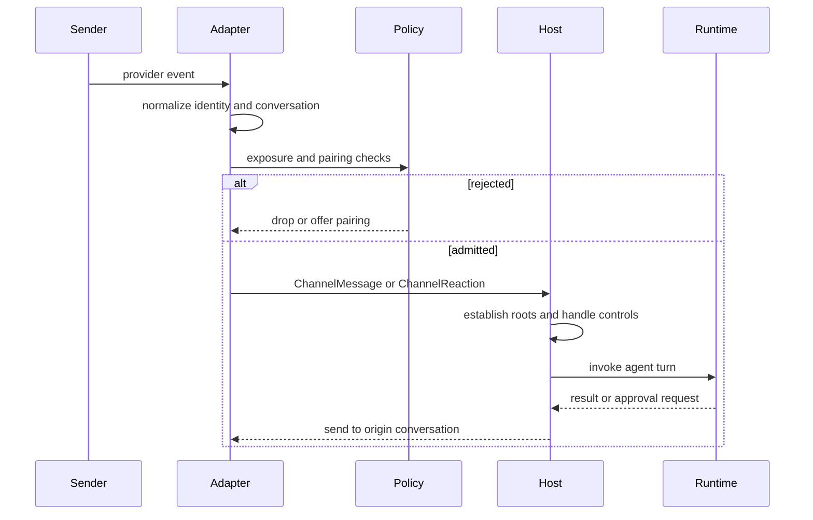

Talon adapters are the boundary between provider events and a host-owned agent runtime. They normalize provider events into `ChannelMessage` or `ChannelReaction`, apply provider admission, and call handlers bound by `TalonHost`. The host, not the adapter, owns commands, agent thread identity, history scope, active-turn replacement, runtime invocation, and delivery to the originating provider conversation.

> **Security posture:** Treat Talon channel access as direct access to the operator's agent, credentials, MCP tools, and host resources. Exposure rules and pairing decide who may invoke that access; they do not sandbox the runtime or grant an independent, constrained session.

This page covers the event boundary, identity roots, and sender lifecycle. See [runtime behavior](/openwiki/architecture/runtime-behavior.md), [permissions and HITL](/openwiki/concepts/permissions-hitl.md), [state persistence](/openwiki/concepts/state-persistence.md), [the Talon integration](/openwiki/integrations/talon.md), and [security operations](/openwiki/operations/security.md) for adjacent concerns.

## Adapter boundary and host lifecycle

`ChannelAdapter` supplies start/stop, message-handler registration, text/media send and edit, typing, and status. `ChannelMessage` carries a provider-local conversation ID, sender and message IDs when available, and metadata; `ChannelReaction` adds the reacted-to message and emoji. Reactions are optional through `ReactionChannelAdapter`.

On startup, the host starts the agent runtime, binds each adapter's handler **before** starting that adapter, then starts the scheduler. If startup fails, it stops already-started components in reverse order; shutdown cancels host work before stopping channels, scheduler, and runtime. An adapter that receives a message without a handler logs and drops it. Adapters intentionally retain provider-specific identity, formatting, media, and thread semantics instead of presenting a generic transport.

*Admission happens at the adapter; the host owns the resulting conversation and control flow.*

## Exposure policy

`ChannelExposure` has three modes selected by `DEEPAGENTS_TALON_<PROVIDER>_EXPOSURE`; `self` is the default.

| Mode | Admission |
| --- | --- |
| `self` | `metadata["from_self"] is True`, or sender ID is in configured `*_OPERATOR_ID` values. Discord, Slack, and Telegram require an operator ID for this mode. |
| `allowlist` | Conversation ID is in `*_ALLOWLIST_CHATS`, or text matches a glob-style `*_MENTION_PATTERNS` value. |
| `open` | Every message is admitted, but configuration must set `*_OPEN_ACK=allow-arbitrary-senders`; Talon logs the arbitrary-sender risk. |

`*_ALLOWLIST_USERS` is distinct from allowed conversations: Discord, Slack, and Telegram use it for static private/DM sender access in allowlist mode. For Slack, allowing a channel admits every thread in that channel. `DEEPAGENTS_TALON_SLACK_MENTION_ALLOWLIST_USERS` instead controls which outbound Slack user mentions may be restored after formatting.

Exposure is an invocation gate, not operator authority. Passing an allowlist, `open`, or pairing rule does not make the sender an operator. In particular, `open` is a deliberate decision to let arbitrary external users invoke the operator's configured agent and local host access, and cannot be paired with sender pairing.

## Conversation, agent, and history identity

For an admitted non-help message, the host first obtains the adapter status provider and derives a root from the trusted provider key and the adapter conversation ID—for example, `slack:C1:1700000000.000100`. This root is the LangGraph thread ID and persisted `/new` reset-counter key; an active reset appends the reset generation to form the agent conversation ID. Provider qualification prevents the same provider-local conversation identifier on different adapters from sharing a turn, checkpoint, reset counter, or lock. The deliberate unconditional re-keying means an upgrade from legacy bare keys abandons those old checkpoints and reset counters rather than migrating them.

The host also records a separate history scope for each root and locks that scope before the conversation root. A Slack non-DM thread retains its thread identity for the agent turn and reply, but its `history_chat` is the parent `C...` or `G...` channel; Slack DM history remains scoped to the DM. Thus related Slack threads can share channel-level archive/history context without collapsing their active agent threads.

A new message holds the root lock, processes controls before model invocation, and replaces rather than overlaps an active turn for that root. It increments a generation and suppresses a completed older turn's result if a newer turn has taken the root. Provider metadata becomes request context, but the host sets the conversation ID and selected model, so an adapter must never treat its metadata as host authority.

## Slack thread identity and context

Slack accepts DMs and `app_mention` events, dropping bot-authored events, edits, deletions, and ordinary channel-message duplicates before admission. A DM uses its channel ID as `conversation_id`. A channel mention becomes `channel:root_timestamp`; replies retain that root timestamp, so inbound follow-ups, tool approvals, and output remain in the same Slack thread. A new root mention creates an independent agent conversation.

For a non-DM threaded message, Slack can fetch preceding thread context. It includes only messages from configured operator or statically allowed user IDs, labels it as context rather than instructions, and leaves the current inbound message as the current message. Failure to retrieve context produces a warning marker rather than silently pretending context was available. Thread context does not replace command or approval parsing.

Slash commands are authorization-checked before command discovery and are DM-only: a channel slash command has no thread target to own an agent conversation. The command response uses Slack's command responder, preventing a duplicate normal channel post.

## Pairing: provider-scoped, revocable invocation access

Pairing is opt-in for Discord, Slack, and Telegram; WhatsApp is excluded. Enable it with `DEEPAGENTS_TALON_<PROVIDER>_PAIRING=enabled`. It is invalid with `open` exposure because that mode already admits everyone.

A rejected sender can request pairing. Discord and Telegram issue a code only from a direct/private message. Slack can instead open the rejected non-DM sender's DM, bind the request to that DM, and offer the code there; if it cannot open the DM, it creates no request. `*_PAIRING_REPLY=disabled` suppresses the code reply while leaving the pending request visible to an operator listing or CLI.

Approved pairing is provider-scoped and admits the sender in **any chat visible to the adapter**, including reactions; the recorded DM is for pairing communication and legacy job matching, not a post-approval chat fence. This is delegation of normal agent invocation, not control-plane authority. Environment-configured operator and allowlisted IDs remain authoritative in DMs, never receive pairing codes, and cannot be revoked through pairing.

### Approval, revocation, and persistence

The operator approves a code with `/pair approve <code>` in their DM or with `deepagents-talon pairing`. `/pair` is consumed before model invocation and requires an explicitly configured operator ID in a DM; `from_self` alone does not suffice. Revoking an environment-configured sender requires editing configuration and restarting.

Each assistant's private `pairing.json` stores provider-scoped pending and approved records. Writes take a sidecar lock and atomically replace the file; cache identity includes the inode so an external CLI replacement is noticed. The reader rejects symlinks, nonregular files, oversized content, and invalid state. A store read failure fails closed for paired access, while environment-configured admission continues. Codes use an unambiguous cryptographic alphabet, expire after one hour, are provider-bound, and are single-use.

Host-mediated `/pair revoke` removes the pairing, cancels active work in the recorded DM and every tracked conversation the sender started, pauses their provider-scoped cron jobs, and cancels in-progress scheduled runs. A CLI store mutation affects later admission but cannot cancel work held by a running host; use host revocation for immediate containment.

## Privileged replies and reactions are bound to their origin

An adapter-admitted reaction is only eligible to reach the host. To settle a tool approval, the host finds a pending approval at the provider-qualified conversation root and verifies provider, channel conversation, prompt message ID, original sender, and a recognized decision emoji. A normal text approval similarly checks the sender that initiated the turn. These checks prevent another admitted user, a reaction on a different message, or a matching-looking event from resolving an approval.

MCP authorization callbacks are also intercepted outside the model. A pending flow is bound to provider, channel conversation, initiating sender, expected callback endpoint, and expiry; a callback from another chat, channel, or sender cannot complete it. This isolates authorization interaction from ordinary model input even after a sender has passed adapter admission.

## Delivery and media boundaries

Progress and final output return through the origin adapter conversation. Text and extracted Markdown media references are delivered with retry; stale-generation results are dropped. `send_with_retry` converts exceptions to failed `SendResult` values and retries transient failures with exponential backoff.

For outbound media, Talon selects a trusted root from `DEEPAGENTS_TALON_OUTBOUND_MEDIA_DIR`, then `DEEPAGENTS_TALON_WORKSPACE`, then the working directory. Validation requires resolved containment under that root, an existing regular file, compatible requested and inferred media types, and compliance with `DEEPAGENTS_TALON_MAX_MEDIA_BYTES` (default 1 GiB). This is an upload transport boundary—not sender authorization, model-output validation, or runtime containment.

## Operational checklist

1. Configure provider credentials and `DEEPAGENTS_TALON_<PROVIDER>_OPERATOR_ID` before using `self` exposure on Discord, Slack, or Telegram.
2. Choose `self`, `allowlist`, or `open` deliberately. For `open`, set its acknowledgement and do not configure pairing.
3. Treat `*_ALLOWLIST_USERS` as static DM access, distinct from allowed conversations and not revocable through `/pair`.
4. Enable pairing only for people who may invoke the agent from every chat the bot can see; protect the assistant home and `pairing.json`.
5. Use `/pair revoke` on the running host when access must stop immediately; a CLI change does not cancel live work.
6. Preserve Slack `channel:thread_ts` IDs when implementing Slack-facing features. Do not use the parent history scope as a thread reply destination.
7. Set an intentional outbound-media root and byte cap.

## Focused verification

`libs/talon/tests/channels/test_slack.py` verifies Slack event filtering, root-thread identity, every-thread channel allowlisting, reply routing, reaction reconstruction, command behavior, and mention formatting. `libs/talon/tests/integration_tests/test_slack_host.py` verifies that root and follow-up Slack messages share an agent thread, separate roots do not, replies remain threaded, parent-channel history scope is retained, and thread context cannot interfere with commands or approvals. `libs/talon/tests/test_host.py` verifies lifecycle unwind, provider-qualified roots, agent-origin versus channel reply identity, host-side authorization binding, and turn behavior. Pairing and base-channel tests cover the shared exposure, persistence, revocation, and media guarantees described above.
