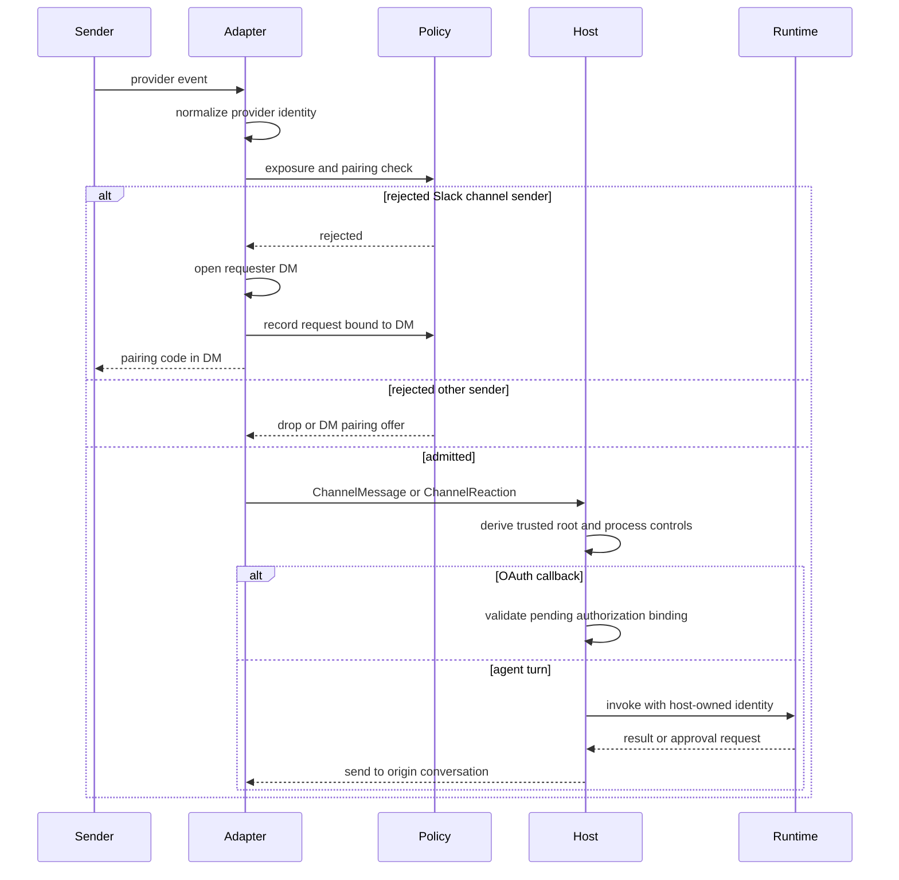

Talon adapters are the security-sensitive boundary between provider events and the host-owned agent runtime. An adapter normalizes a provider event, decides whether its sender may enter, and invokes a handler registered by `TalonHost`. The host—not the adapter—then owns commands, agent-thread identity, active-turn replacement, model invocation, and delivery.

> **Security posture:** Channel access is access to the configured agent, its credentials, MCP tools, and host resources. Exposure and pairing are invocation gates, not sandboxing or a lower-privilege session.

See [runtime behavior](/openwiki/architecture/runtime-behavior.md), [Talon scheduling](/openwiki/concepts/talon-scheduling.md), [the Talon integration](/openwiki/integrations/talon.md), and [security operations](/openwiki/operations/security.md) for adjacent concerns.

## Boundary, lifecycle, and routing

`ChannelAdapter` defines lifecycle, host-message registration, text/media sending and editing, typing, and status. `ChannelMessage` and `ChannelReaction` retain the adapter's provider-local conversation, sender, message, and metadata identities; reactions are an optional adapter capability. Provider-specific adapters deliberately retain their own thread, formatting, and media semantics.

The host starts the runtime first, binds callbacks before it starts each channel, and starts the scheduler after the channels. A partial start is unwound in reverse order. On shutdown, host work is cancelled before channels, scheduler, and runtime stop. An adapter with no registered message handler drops the event rather than processing it.

*Admission ends at the adapter-to-host callback; the host owns privileged controls, agent identity, and runtime routing.*

## Exposure policy

`ChannelExposure` selects `self`, `allowlist`, or `open` through `DEEPAGENTS_TALON_<PROVIDER>_EXPOSURE`; `self` is the default.

| Mode | Admission |
| --- | --- |
| `self` | `metadata["from_self"] is True`, or the sender is in configured `*_OPERATOR_ID` values. Discord, Slack, and Telegram require an operator ID for this mode. |
| `allowlist` | The conversation is in `*_ALLOWLIST_CHATS`, or message text matches a glob-style `*_MENTION_PATTERNS` value. |
| `open` | Every message is admitted, but `*_OPEN_ACK=allow-arbitrary-senders` is required and Talon logs the arbitrary-sender risk. |

`*_ALLOWLIST_USERS` is separate from allowed conversations: Discord, Slack, and Telegram use it for static private/DM sender access in allowlist mode. For Slack, allowlisting a channel admits every thread in that channel. `DEEPAGENTS_TALON_SLACK_MENTION_ALLOWLIST_USERS` is different again: it limits which user mentions are restored in outbound Slack formatting.

Exposure is not operator authority. In particular, `open` deliberately permits arbitrary external invocations with the operator's configured host access and cannot be combined with sender pairing.

## Conversation identity and host ownership

After admission (except `/help`), the host combines a trusted provider key with the adapter conversation ID—for example, `slack:C1:1700000000.000100`—to form the conversation root. That root is the LangGraph thread and persisted `/new` reset-counter key. A reset generation produces the agent conversation ID. Always provider-qualifying roots prevents cross-adapter collisions, but deliberately leaves legacy bare-key checkpoints and reset counters unreachable after upgrade rather than migrating them.

The host serializes work per root, handles commands and authorization/approval interactions before model invocation, replaces an active turn with a newer one, increments a generation, and suppresses a stale result. Adapter metadata is request context only: the host sets the request conversation and selected model.

History scope is distinct from active conversation identity. Slack non-DM threads preserve their `channel:root_timestamp` identity for agent work and replies, but use their parent `C...` or `G...` channel as `history_chat`; Slack DMs retain their own history scope. Do not use that parent history scope as a thread reply destination.

## Slack admission, commands, and context

Slack accepts DMs and `app_mention` events. It drops bot-authored events, edits, deletions, unsupported subtypes, and ordinary channel-message duplicates before admission. A DM conversation is its channel ID. A channel mention creates `channel:root_timestamp`; a reply carries the original root timestamp, so follow-ups, tool approvals, and output stay in that thread while a new root creates a separate agent conversation.

Slash-command authorization is checked before command discovery, so an unauthorized caller does not learn available commands. Commands are normally DM-only and use the Slack command responder rather than a normal channel post. The exception is an explicitly configured operator's `/pair approve <code>`, which Slack and the host permit outside a DM; pairing list and revoke remain DM-only. `/pair` is intercepted before model invocation, and pairing never grants its control-plane authority.

For admitted non-DM thread messages, Slack retrieves preceding replies and retains only configured operators or static allowlisted users. It attaches that material separately as `slack_thread_context`; the host labels it as context rather than instructions and preserves the inbound text as the current message. Retrieval failure becomes an explicit unavailable marker.

OAuth callback URLs are excluded from historical Slack context before per-message truncation and before the adapter applies its sender filter. The recognizer decodes Slack markup first and recognizes loopback callback forms, while ordinary non-loopback URLs remain eligible context. This prevents a historical callback's code or state from being exposed to model-visible context, including when a long message would otherwise hide sensitive parameters after truncation.

## Pairing: revocable invocation access

Pairing is opt-in for Discord, Slack, and Telegram through `DEEPAGENTS_TALON_<PROVIDER>_PAIRING=enabled`; WhatsApp is excluded. It is invalid with `open` exposure.

A rejected sender can request pairing. Discord and Telegram issue a request only from a direct/private message. For Slack, a rejected sender who mentions the bot in a non-DM can receive the code privately: Slack opens a DM for that user, validates that it is a DM, binds the pending record to it, and offers the code there. If it cannot open the DM, it creates no request. `*_PAIRING_REPLY=disabled` records a pending request but withholds the courtesy code reply for operator listing or CLI handling.

Approval is provider-scoped. An approved sender is admitted to any chat visible to the adapter, including reactions; the recorded DM supports pairing notices and legacy job matching, not a post-approval chat fence. Pairing grants ordinary agent invocation only. Configured operators and static allowlisted IDs remain environment-authoritative DM senders, never get pairing codes, and cannot be revoked through pairing.

### Approval, persistence, and revocation

An explicitly configured operator manages pairing with `/pair` or `deepagents-talon pairing`. The host consumes `/pair` outside the model; `from_self` alone is insufficient. General administration is DM-only, apart from the operator `/pair approve` exception above. Removing an environment-configured sender requires configuration change and restart.

Each assistant's private `pairing.json` holds provider-scoped pending and approved records. Updates use a sidecar lock and atomic replacement; the read cache includes inode identity so an external CLI replacement becomes visible. The store rejects symlinks, nonregular files, excessive content, and invalid data; unreadable or invalid state fails closed for paired access while environment admission continues. Codes use an unambiguous cryptographic alphabet, are provider-bound, expire after one hour, and are single-use.

Host-mediated `/pair revoke` removes pairing, cancels active work in the recorded DM and every tracked conversation the sender initiated, pauses that sender's provider-scoped cron jobs, and cancels active scheduled runs as revoked-run failures. By contrast, `deepagents-talon pairing` can list, approve, and revoke records, and can pause jobs only while Talon is stopped; a CLI store change cannot cancel work held by a running host.

## Privileged replies are origin-bound

Adapter admission of a reaction is not itself tool approval. The host resolves a pending provider-qualified approval only when the reaction's provider, conversation, prompt message, initiating sender, and decision emoji match. A text approval similarly requires the initiating sender.

MCP authorization callbacks are intercepted before model invocation. Completion requires a pending binding that matches provider, channel conversation, initiating sender, expected callback endpoint, and expiry. A callback in another chat or from another sender cannot resolve the authorization.

## Delivery and media boundary

The host routes text and extracted Markdown media references back through the origin adapter conversation. It retries transient send failures with exponential backoff and drops results from an older conversation generation.

Outbound media uses a trusted root selected from `DEEPAGENTS_TALON_OUTBOUND_MEDIA_DIR`, then `DEEPAGENTS_TALON_WORKSPACE`, then the working directory. Validation requires resolved containment under that root, a regular existing file, matching requested and inferred type, and compliance with `DEEPAGENTS_TALON_MAX_MEDIA_BYTES` (default 1 GiB). It is an upload transport boundary, not sender authorization, model-output validation, or runtime containment.

## Operational checklist

1. Set `DEEPAGENTS_TALON_<PROVIDER>_OPERATOR_ID` before using `self` exposure on Discord, Slack, or Telegram.
2. Choose `self`, `allowlist`, or `open` deliberately. For `open`, set its acknowledgement and do not enable pairing.
3. Treat `*_ALLOWLIST_USERS` as static DM access, not as a revocable pairing grant.
4. Enable pairing only for people who may invoke the agent in every chat the bot can see. Protect the assistant home and `pairing.json`.
5. Use host `/pair revoke` for immediate containment; CLI edits affect future admission but not in-memory work.
6. Preserve Slack `channel:thread_ts` IDs in Slack-facing features. Keep OAuth callbacks out of context paths and never treat history context as instructions.
7. Configure an intentional outbound-media root and byte cap.

## Focused verification

`libs/talon/tests/unit_tests/test_pairing.py` covers code lifetime, persistence failure, admission, control authority, revocation, and CLI semantics. `libs/talon/tests/unit_tests/test_pairing_slack.py` verifies Slack's rejected-channel-sender DM flow, missing-DM failure, reply suppression, paired access across chats, and command admission. `libs/talon/tests/unit_tests/test_slack_oauth_context.py` verifies callback exclusion before truncation and absence of callback secrets from the model request. Slack host integration tests cover root-thread identity, reply routing, parent-channel history scope, and context wrapping.
