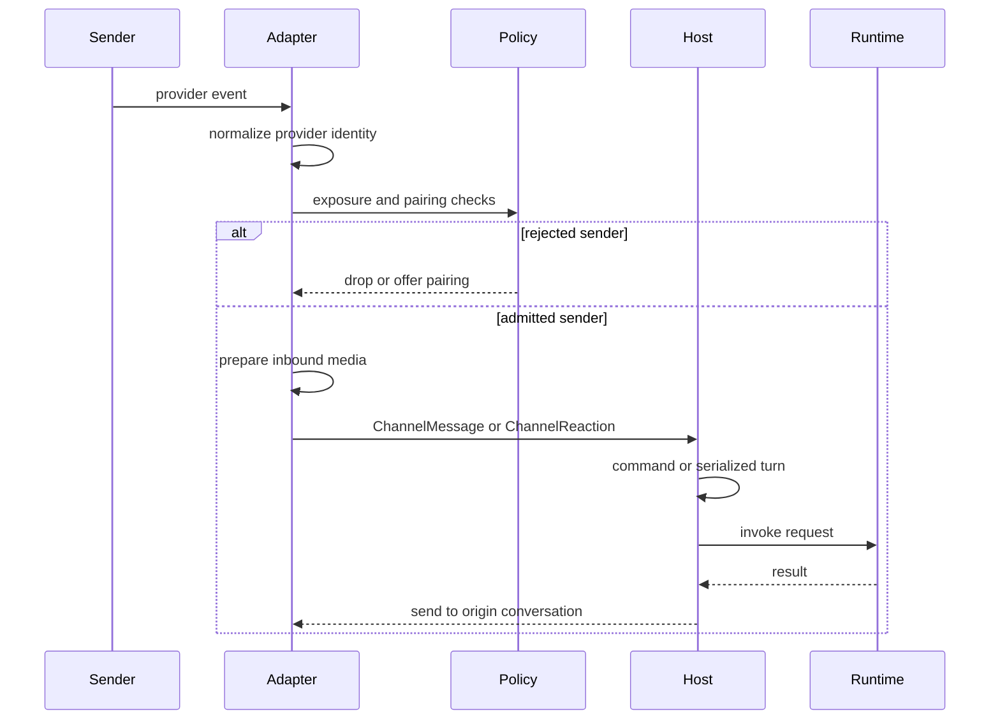

Talon adapters are the boundary between provider events and a host-owned agent runtime. An adapter normalizes a provider event into a `ChannelMessage` or `ChannelReaction`, applies its admission rules, and calls a handler registered by `TalonHost`. The host then owns commands, conversation identity, turn replacement, runtime invocation, and delivery back to the originating conversation.

This page covers the external-event boundary and revocable sender access. See [runtime behavior](/openwiki/architecture/runtime-behavior.md), [permissions and HITL](/openwiki/concepts/permissions-hitl.md), [scheduling](/openwiki/concepts/talon-scheduling.md), [the Talon integration](/openwiki/integrations/talon.md), and [security operations](/openwiki/operations/security.md) for adjacent concerns.

## Adapter and host boundary

`ChannelAdapter` defines lifecycle, host-handler registration, text/media send and edit, typing, and status operations. A `ChannelMessage` supplies a provider-local stable `conversation_id`, text, optional sender and message IDs, and metadata. Reactions are optional: adapters that implement `ReactionChannelAdapter` register a separate host callback.

At startup the host binds the callbacks before it starts each adapter. An adapter with no message handler logs and drops the event. The protocol is deliberately not a uniform provider transport: each adapter retains its provider’s identities, interaction behavior, and media preparation rules.

*Provider-specific adapters admit and normalize an event before the host serializes work and returns output through that adapter.*

## Exposure policy

`ChannelExposure` has three modes, selected by `DEEPAGENTS_TALON_<PROVIDER>_EXPOSURE`; the default is `self`.

| Mode | Message admission |
| --- | --- |
| `self` | `metadata["from_self"] is True`, or the sender ID is in the configured `*_OPERATOR_ID` values. Discord, Slack, and Telegram require an operator ID for this mode. |
| `allowlist` | The conversation ID is in `*_ALLOWLIST_CHATS`, or message text matches a glob-style `*_MENTION_PATTERNS` value. |
| `open` | Every message is admitted. Configuration must include `*_OPEN_ACK=allow-arbitrary-senders`; Talon logs that arbitrary senders can invoke an agent with operator credentials and local host access. |

The adapter-specific `*_ALLOWLIST_USERS` setting is different from an allowed conversation: Discord, Slack, and Telegram use it for direct/private-message sender access in `allowlist` mode. Slack also keeps its thread semantics: allowing a channel permits every thread in that channel. Slack has an additional `DEEPAGENTS_TALON_SLACK_MENTION_ALLOWLIST_USERS` configuration surface for its mention behavior.

Exposure is an invocation gate, not an assertion of operator authority. In particular, passing `open`, an allowlist rule, or pairing does not make a sender an operator.

## Pairing: opt-in, provider-scoped sender admission

Pairing is available for Discord, Slack, and Telegram; WhatsApp is explicitly excluded. Enable it with `DEEPAGENTS_TALON_<PROVIDER>_PAIRING=enabled`. It cannot be combined with `open` exposure, because open already admits everyone.

An unadmitted sender can create a pairing request. Discord and Telegram offer a code only for a direct/private message. Slack also supports a rejected non-DM sender: it attempts to open that sender’s DM and records/offers the request there; if it cannot open the DM, it creates no request. A request binds the provider, sender, and DM conversation. Code replies can be disabled with `*_PAIRING_REPLY=disabled`, leaving the request visible only to the operator’s listing/CLI.

An approved paired sender is admitted **in any chat the bot can see**, not only in the recorded DM. The same is true of reactions from a paired sender. The saved DM is used for the pairing offer/approval notification and legacy scheduled-job matching; it is not a post-approval conversation fence.

This is therefore a substantial delegation of normal agent invocation. Pairing never grants Talon control-plane authority: environment-configured operator IDs remain authoritative, and a paired sender cannot manage pairing or obtain operator-only model or approval privileges merely by being paired. `*_ALLOWLIST_USERS` and operator IDs are environment-authoritative pairing senders: they are admitted in DMs, never receive a code, and cannot be removed through pairing revocation.

### Approval and revocation

The requester supplies the code out of band. An operator approves it through `/pair approve <code>` in the operator’s direct message or through the `deepagents-talon pairing` CLI. `/pair list`, approval, and revocation are all consumed by the host before model invocation. The host accepts `/pair` only from a sender explicitly listed in the channel exposure’s operator IDs and only in a direct message; `from_self` alone is insufficient.

`/pair revoke <sender-id>` removes an approved pairing and any pending request for that sender. It cannot revoke an environment-configured sender; Talon tells the operator to remove that ID from configuration and restart.

## Pairing store lifecycle and failure behavior

Each assistant has a `pairing.json` store with provider-scoped pending and approved records. A pending record includes sender, code, originating DM, creation time, and expiry; an approval retains the sender and originating DM.

- Codes are eight characters from an unambiguous cryptographic alphabet, expire after one hour, are provider-bound, and are removed on successful approval. Code comparison processes all pending entries and uses constant-time comparison for individual candidates.
- There are bounded pending and approved records per provider. A sender with a live request does not get another code; an already-paired sender cannot request one.
- Mutations use an exclusive sidecar lock and atomic replacement. The read cache includes inode in its file identity, so a replacement by the CLI or host is observed rather than hidden by a cache hit.
- Reads refuse symlinks, non-regular files, oversized input, and invalid store data. Pairing lookup fails closed when the store cannot be read or validated: no paired sender is admitted, while environment-configured access still follows its own rules.

## Reactions and host-side constraints

Adapters apply their message/reaction admission rules before forwarding reactions. Pairing admits an approved sender’s reaction in any conversation; this only makes the event eligible to reach the host.

The host ignores a reaction unless there is a pending tool-approval request for that provider-qualified conversation. It further verifies the reaction’s provider, conversation, prompt message ID, sender identity, and a recognized approval/rejection emoji before resolving the request. This prevents an admitted sender from using an unrelated reaction—or another sender’s reaction—to decide a pending approval.

## Revocation stops work, including work started outside the DM

A host-mediated revocation does more than update `pairing.json`. The host finds the revoked sender’s recorded DM and every conversation in which that sender started a tracked turn, then cancels their active work. It also finds the sender’s cron jobs for that provider, pauses enabled jobs, and cancels in-progress scheduled runs. A cancelled scheduled run caused by revocation is repaired and reported as `ScheduledRunRevokedError`, allowing the scheduler to record failure without delivering the result.

The CLI can modify the shared pairing store, but it cannot itself cancel work held by an already-running host. Operationally, use the host `/pair revoke` path for immediate cancellation and job pausing; a separate store change takes effect for future admission because the store cache detects replacement.

## Provider-specific boundaries

The adapters preserve important provider semantics rather than flattening them into one transport:

- **Discord** drops self-authored gateway messages before exposure checks to avoid reply loops. Application-command interactions are admitted and converted into host message dispatch, with deferred interaction/follow-up response handling.
- **Slack** represents a root message and replies with a thread conversation ID. Slash commands are authorized before dispatch and only work in a DM because a channel slash command has no thread target.
- **Telegram** polls updates, learns the bot identity to mark `from_self`, and attempts pairing after ordinary admission fails.
- **WhatsApp** uses a bearer-token loopback bridge, applies exposure policy, excludes sender pairing, and avoids redispatching outbound self-authored messages from other chats.

## Host conversation and delivery behavior

After adapter admission, the host derives a provider-qualified conversation root and agent conversation ID, keeps a per-root lock, and replaces an active turn with a newer one rather than running both. It handles commands and pending tool-approval replies before starting the agent. The host controls the request’s conversation ID and model selection; adapter metadata is supplied as context, so adapters should treat provider payload values as untrusted input rather than authority.

Progress and final output return through the originating adapter conversation. The host suppresses a result from an older generation once a newer turn has taken the conversation. Sending uses `send_with_retry`: exceptions become failed `SendResult` values, and retryable/transient failures receive up to two exponential-backoff retries.

## Media is a transport boundary, not authorization

For outbound media, Talon chooses a trusted root from `DEEPAGENTS_TALON_OUTBOUND_MEDIA_DIR`, then `DEEPAGENTS_TALON_WORKSPACE`, then the process working directory. `validate_media` resolves paths under that root, requires a regular existing file, checks inferred type against the requested channel media type, and applies `DEEPAGENTS_TALON_MAX_MEDIA_BYTES` (default 1 GiB).

These checks constrain what an adapter may upload. They do not authorize a sender, validate model output, or sandbox the agent/runtime. Keep sender admission, operator privileges, workspace controls, and runtime containment as separate controls.

## Operational checklist

1. Configure provider credentials and `DEEPAGENTS_TALON_<PROVIDER>_OPERATOR_ID` before using `self` exposure on Discord, Slack, or Telegram.
2. Select `self`, `allowlist`, or `open` deliberately. For `open`, set the required acknowledgement and do not configure pairing.
3. Distinguish allowed conversations/mention patterns from `*_ALLOWLIST_USERS`, which grants static direct-message sender access and is not revocable by `/pair`.
4. Enable pairing only if the approved person may invoke the agent from **any chat visible to the bot**. Keep the assistant home and `pairing.json` private, and use an explicitly configured operator’s DM for `/pair` management.
5. Use host `/pair revoke` when access must stop immediately, especially when the sender may have active turns or scheduled jobs.
6. Configure the outbound-media root and byte cap to a deliberate directory and limit.

## Focused verification

`libs/talon/tests/channels/test_base.py` covers exposure rules, media root/type/size validation, metadata normalization, and retries. `libs/talon/tests/unit_tests/test_pairing.py` covers code expiry and single use, provider scoping, fail-closed store reads, cross-chat paired admission and reactions, operator-only pairing commands, and revocation cancellation/job pausing. `libs/talon/tests/unit_tests/test_pairing_slack.py` additionally verifies Slack’s DM-opening pairing offer and `/talon pair` command path.
