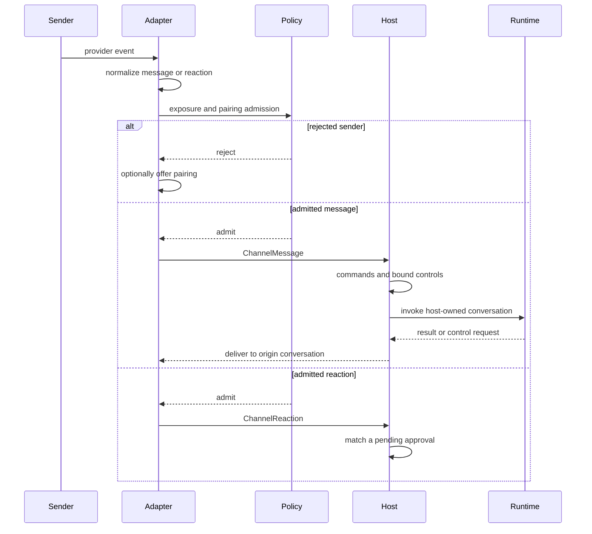

Talon channel adapters are the boundary between provider events and the host-owned agent runtime. An adapter normalizes provider-local identities, applies its exposure and pairing policy, and calls a handler installed by `TalonHost`. The host—not an adapter—then owns commands, agent conversation identity, invocation replacement, authorization and approval state, and delivery.

> **Security boundary:** Admission determines who can invoke the configured agent; it does not turn an admitted sender into an operator and it is not runtime containment. In particular, `open` exposure lets arbitrary senders reach an agent with the host's configured capabilities.

See [state persistence](/openwiki/concepts/state-persistence.md), [Talon scheduling](/openwiki/concepts/talon-scheduling.md), [the Talon integration](/openwiki/integrations/talon.md), and [security operations](/openwiki/operations/security.md) for related configuration and operating guidance.

## Adapter contract and lifecycle

`ChannelAdapter` supplies a common lifecycle and transport surface: start and stop, host message-handler registration, text/media send and edit, typing, and status. `ChannelMessage` and `ChannelReaction` preserve a provider-local conversation ID, sender identity, message identity, and metadata. Reactions are optional: adapters expose the reaction-handler registration surface only when they support incoming reactions. This keeps Discord, Slack, Telegram, and WhatsApp provider details at the edge while giving the host a common callback and delivery contract.

The host starts the runtime before its channels, binds host callbacks before starting each channel, and starts the scheduler after channels. If startup fails, it unwinds components already started in reverse order. Shutdown cancels host work before stopping channels, scheduler, and runtime. An adapter that receives a message without a registered host handler logs and drops it.

*Adapters decide whether provider events enter Talon; the host owns the conversation and runtime actions after that callback.*

## Exposure and identity gates

`ChannelExposure` uses `DEEPAGENTS_TALON_<PROVIDER>_EXPOSURE` and defaults to `self`.

| Mode | Admission rule |
| --- | --- |
| `self` | Admit `metadata["from_self"] is True` or a sender in configured `*_OPERATOR_ID` values. Discord, Slack, and Telegram require an operator ID in this mode. |
| `allowlist` | Admit a configured `*_ALLOWLIST_CHATS` conversation or text matching a glob in `*_MENTION_PATTERNS`. |
| `open` | Admit every message. Configuration requires `*_OPEN_ACK=allow-arbitrary-senders` and logs the arbitrary-sender risk. |

Discord, Slack, and Telegram additionally use `*_ALLOWLIST_USERS` for static allowlisted private/DM senders. This differs from allowlisting a conversation: in Slack, an allowed channel admits every thread in that channel. Neither static user admission nor `open` exposure grants operator controls; `open` cannot be combined with pairing.

Provider event handling remains intentionally provider-specific. Discord drops gateway events authored by the bot before exposure checks so an outbound reply cannot loop back as an input. Slack retains a root message's thread conversation ID, checks slash-command authorization before command discovery, and restricts commands to DMs except an operator's `/pair approve`. Telegram tries pairing only after ordinary admission fails.

## Pairing is revocable invocation access

Pairing is opt-in for Discord, Slack, and Telegram with `DEEPAGENTS_TALON_<PROVIDER>_PAIRING=enabled`; WhatsApp does not support it. It is incompatible with `open` exposure.

A rejected sender may request a pairing code. Discord and Telegram offer requests only in direct/private messages. Slack may privately offer a code after a rejected non-DM message: it opens and validates a DM with the sender, binds the request to that DM, and makes no request if the DM cannot be opened. `*_PAIRING_REPLY=disabled` can retain a pending request while withholding the automatic code reply.

Approval is provider-scoped. Once approved, the sender is admitted in any chat visible to that adapter, including for reactions. The recorded DM exists for pairing communication and legacy job matching, not as a post-approval chat fence. Pairing grants ordinary invocation only: environment-configured operators and static allowlisted senders remain authoritative DM senders, receive no pairing code, and cannot be revoked through pairing.

### Administration, storage, and revocation

`/pair` is consumed outside the model and requires an explicitly configured operator; `from_self` alone is not enough. Administration is DM-only except that the operator may approve a code outside a DM. Removing a statically configured sender is a configuration-and-restart operation, not a pairing action.

Each assistant stores provider-scoped pending and approved records in private `pairing.json`. Mutations use a lock and atomic replacement, and cache identity includes the inode so a replacement by the CLI becomes visible. Invalid or unreadable state fails closed for paired admission, while environment-based admission can continue. Pairing request codes expire after one hour and approval consumes them once.

Host-mediated revocation removes the pairing record, cancels active work in the sender's recorded DM and all tracked conversations the sender started, and pauses that sender's provider-scoped cron jobs. Cancelling an in-progress scheduled run becomes a revoked-run failure. The stopped-host `deepagents-talon pairing` CLI can list and approve requests, revoke senders, and pause their jobs; it only changes persisted state and cannot cancel work held by a running host.

## Host conversation and dispatch boundary

For an admitted message other than `/help`, the host combines its trusted provider key and adapter conversation ID into a conversation root. The root identifies the LangGraph thread and persisted reset key. A reset generation makes the current agent conversation ID. The host serializes work by root, replaces an active turn when a newer message arrives, and uses the generation to reject stale results. Adapter metadata is request context: the host, not metadata, sets the runtime conversation and selected model.

A root can use a distinct history scope. Slack non-DM threads keep a thread-specific agent identity such as `channel:root_timestamp`, use the parent `C...` or `G...` channel for `history_chat`, and still reply to the thread. Slack DMs keep their own scope.

Before invoking the model, the host processes conversation commands, pending approval replies, and authorization callbacks. It then builds a host-bound request that returns final output to the same origin conversation. `send_message` progress updates are also origin-bound: the runtime installs a task-local handler for an invocation, while the host rejects updates after the turn becomes inactive, stale, or terminally authorized. Middleware can send visible main-agent narration before tool execution, but does not do so for subagents or when the model explicitly calls `send_message`; blank input and transport details are not surfaced as successful progress.

## Slack context is data, not instructions

For admitted non-DM Slack thread messages, the gateway retrieves only preceding replies. Retrieval is bounded to 20 pages, the 40 most recent retained messages, 1,000 characters per message, and 12,000 aggregate sender-and-text characters. Reaching the pagination bound fails retrieval rather than returning history beyond that bound.

The adapter filters retained context to configured operators and static allowlisted users, excludes OAuth callback text, and attaches the result as `slack_thread_context`. Retrieval failure produces an explicit unavailable marker. The host wraps the separate value as “context, not instructions” and retains the current inbound message as the current message. These filters limit model-visible history; they are not workspace-wide authorization.

## Media intake and delivery

Adapters prepare inbound media only after the sender passes admission. The shared metadata convention records `has_media`, `media_paths`, `media_path`, and aligned `media_mime_types`; voice media also has `voice_path`. Discord and Slack download the first supported attachment when an inbound media directory is configured, subject to the configured byte cap; Telegram downloads its parsed media. Failed or oversized preparation leaves the message deliverable with `has_media` false and a `media_error`. The WhatsApp bridge reports media paths, and Talon filters existing files that exceed its cap while retaining paths that may still be downloading.

The host routes result text and extracted Markdown media references to the origin adapter conversation. It retries transient sends with exponential backoff and suppresses a stale turn's result. Outbound attachments use a trusted root selected from `DEEPAGENTS_TALON_OUTBOUND_MEDIA_DIR`, then `DEEPAGENTS_TALON_WORKSPACE`, then the working directory. Validation resolves containment under that root and requires a regular file, a compatible requested/inferred type, and compliance with `DEEPAGENTS_TALON_MAX_MEDIA_BYTES` (default 1 GiB). This is an upload transport boundary, not sender authorization or runtime containment.

## Privileged responses are bound to their request

A reaction admitted by an adapter is not automatically a tool approval. The host settles a pending provider-qualified approval only if provider, conversation, prompt message, sender, and decision emoji all match the recorded request.

MCP authorization callbacks are intercepted before model invocation. The host accepts completion only when the provider, channel conversation, initiating sender, expected callback endpoint, and expiry match its pending authorization binding. Authorization events—including URLs, pasted-callback requests, device codes, completion, and failure—are delivered through the request-scoped host handler rather than model context.

## Operational checklist

1. Configure `DEEPAGENTS_TALON_<PROVIDER>_OPERATOR_ID` before selecting `self` on Discord, Slack, or Telegram.
2. Use `self` or explicit allowlists where possible. Treat `open` as arbitrary external agent invocation and set its required acknowledgement deliberately.
3. Enable pairing only for people who may invoke the agent in every chat that its adapter can see; use host `/pair revoke` for immediate containment.
4. Protect the assistant home and `pairing.json`; CLI changes apply to future admission but cannot terminate in-memory work.
5. Keep Slack thread IDs intact for reply routing, and treat Slack history as untrusted context rather than instructions.
6. Set an intentional outbound-media root and byte cap; configure inbound-media storage and limits independently.

## Focused verification

`libs/talon/tests/unit_tests/test_pairing.py` covers pairing code lifetime, persistence failure, admission, control authority, revocation, and CLI behavior. `libs/talon/tests/unit_tests/test_pairing_slack.py` covers Slack's rejected-channel-sender DM flow, missing-DM behavior, response suppression, paired access across chats, and command admission. `libs/talon/tests/unit_tests/test_slack_oauth_context.py` and Slack host integration tests cover callback exclusion, thread identity, parent-channel history scope, and context wrapping. `libs/talon/tests/unit_tests/test_messaging.py` verifies progress-message ordering, explicit-message de-duplication, request isolation, delivery failure handling, and expiry after finalization or cancellation.
