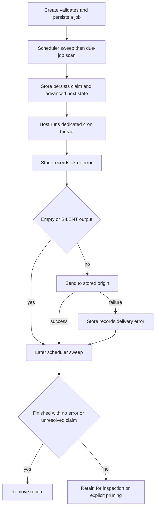

# Talon Scheduled Work and Cron Semantics

> **Experimental and unattended.** Talon is experimental. Cron is persistent, unattended access to the installed assistant—not a sandbox or containment boundary. A scheduled invocation has no approval or authorization handler and no approval-operator authority; runtime approval interrupts for `trigger: "cron"` are automatically rejected. Do not schedule work that requires a person to approve a tool call or complete interactive authorization. Channel admission and tool policy still determine which inbound users can create jobs; they do not make a later cron execution safe by isolation.

Talon separates durable scheduling from host execution. `CronJobStore` persists a job and advances its occurrence; `PersistentCronScheduler` sweeps and claims due work; `TalonHost` invokes the agent and the configured channel delivers non-silent output to the recorded origin. The CLI wires this scheduler only when channels are configured.

## Origin identity, scope, and the non-conversation boundary

Each job stores a durable `CronOrigin`: conversation ID, channel/provider, and optional source message ID. The runtime injects that trusted origin into cron tools rather than letting the model supply it. Create, list, edit, and remove are scoped by **conversation ID plus channel**; message ID is retained for identity/audit context but does not participate in the comparison. The same origin selects the destination channel and conversation for delivery.

Cron is not an attended inbound conversation turn. It runs on a dedicated `<job-id>:talon-cron` thread and carries `trigger: "cron"`; it can receive a read-only origin history scope when that channel can be resolved, but the runtime disables its archive scope. Thus the scheduled prompt and execution do **not** create a transcript archive entry or an attended chat turn. A successfully delivered final reply is a separate host delivery action and may be recorded by a history-capable host as delivered output.

The agent-facing tools are `create_job`, `list_jobs`, `edit_job`, and `remove_job`. A created job contains a self-contained prompt, so it must include all instruction needed at fire time. `edit_job(..., enabled=False)` pauses a job; an empty `until` clears that bound.

## Schedule language and local-time rules

Schedule text is limited to 200 characters. Supported forms are:

| Form | Semantics |
| --- | --- |
| `in <N>m` or `in <N>h` | One-shot relative interval, at least one minute. |
| `every <N>m` or `every <N>h` | Recurring relative interval, at least one minute. |
| `at YYYY-MM-DD HH:MM <IANA-zone>` | One-shot explicit local wall-clock time. |
| `daily at HH:MM <IANA-zone>` | Recurring local wall-clock time. |
| `cron <minute> <hour> <day-of-month> <month> <day-of-week> <IANA-zone>` | Recurring five-field cron in that zone. |
| `cron @hourly`, `@daily`, `@weekly`, `@monthly`, `@yearly`, `@annually`, or `@midnight` plus a zone | Supported cron macro. |

Wall-clock, `until`, and cron forms require an explicit IANA zone. Cron has minute, hour, day-of-month, month, and day-of-week fields; it accepts ranges, steps, lists, month/week-day aliases, and limited `L`, `W`, and `#` calendar extensions. When neither textual day field begins with `*`, day-of-month and day-of-week use Vixie-style OR; otherwise both predicates must match. Parsed expressions and resolved zones use bounded 128-entry caches because the input originates with the agent.

Local candidates preserve wall-clock semantics across DST. A nonexistent local time advances to the first valid minute; an ambiguous time uses its earlier occurrence. Several cron candidates skipped into one DST gap coalesce to one fire. `until` is recurring-only and inclusive; a due occurrence has five minutes of late-claim grace, after which it is dropped rather than delivered after the requested window.

## Durable lifecycle and dispatch

`jobs.json` is a versioned, self-contained JSON store containing prompt, assistant, origin, structured schedule, enable/repeat state, timestamps, outcome/error, `until`, and claim timestamp. Writes use restrictive directory/file permissions and atomic replacement. An unreadable or unsupported store is logged and treated as empty, so operators should protect and back up the file.

*The store advances and persists the occurrence before the host executes it; delivery and cleanup are later transitions.*

At each default 60-second tick, the scheduler sweeps finished records, obtains due jobs, and processes them sequentially. It calls `advance_next_run` before invocation. This is an at-most-once claim for an occurrence: a crash after claiming can lose that delivery, but does not make the same occurrence claimable again. One-shots and exhausted repeats disable before the run. A recurring job consumes its repeat count at claim time. Interval schedules retain phase and skip ahead after downtime rather than replaying a backlog.

The scheduler records `ok` before delivery. It suppresses empty output and output beginning or ending with `[SILENT]`. An invocation error, or a delivery exception after an otherwise successful result, becomes an `error` outcome. Disabled/expired jobs without an error or unresolved claim are removed on a later sweep; failed final runs and interrupted claims remain inspectable until `prune_completed(retain_for=...)` removes eligible completed records. A failed scan is logged and retried on the normal tick interval.

## Host execution, delivery, and cancellation

The host serializes runs of a job on its dedicated cron thread and bounds a scheduled run to 30 minutes. A timeout triggers interrupted-checkpoint recovery so a later run is not left behind an incomplete tool call. The host supplies cron metadata, including the durable origin channel and conversation, but withholds approvals, authorization, progress messaging, and operator authority. Scheduled subagent work is inline, so its result belongs to the job invocation instead of a future attended turn.

For non-silent output, the host finds a channel matching the stored provider and sends to the stored conversation ID with retry behavior. A missing matching channel is logged and dropped rather than treated as a delivery exception by the CLI callback. This makes origin identity both a tool-scope boundary and a delivery address; it does not admit a new sender or recreate the original inbound request.

Revoking a paired sender through the running host is an active safety intervention: it cancels that sender's current conversation work, pauses jobs whose stored origin is that sender's DM, and cancels in-flight runs of those jobs. A revoked scheduled run is surfaced as a scheduler error and delivers nothing. Pausing can fail (for example, a store error), in which case the host reports that operators must inspect logs.

By contrast, `deepagents-talon pairing pause-jobs <channel> <conversation_id>` is explicitly an offline operational command: stop Talon first. The cron store is single-writer in normal operation, and the CLI command does not coordinate with a running host. Use host-side revocation for live intervention; use the CLI pause command only while the host is stopped.

## Safe changes and focused tests

Preserve strict parsing/serialization, local-date DST candidate construction, and the **persist-before-run** claim ordering. Keep origin injection trusted and management scoped to conversation plus channel. Do not add an approval or authorization path to cron. Treat execution status, channel delivery, retention, and archive behavior as distinct boundaries.

Focused coverage includes `libs/talon/tests/cron/test_jobs.py` for persistence, schedule state, scope, and recurrence; `test_scheduler.py` for claim/run/delivery/error behavior and ticker survival; `libs/talon/tests/test_host.py` for timeout, exclusion, and revocation; and `libs/talon/tests/unit_tests/test_scheduled_history.py` for origin-history access and the no-archive execution boundary. See [Talon channel admission](./talon-channel-admission.md), [Permissions and Human-in-the-Loop](./permissions-hitl.md), [State and persistence](./state-persistence.md), and [Talon runtime integration](../integrations/talon.md).
