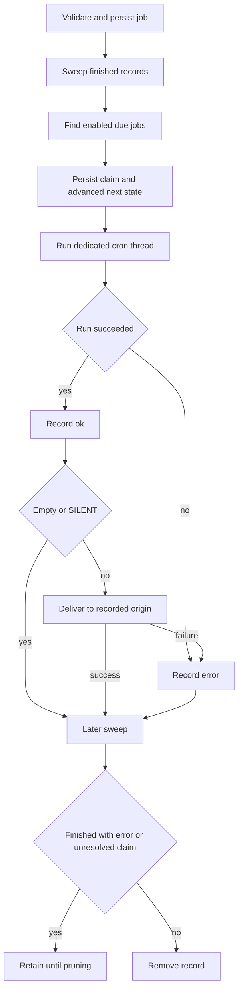

# Talon Scheduling and Cron Records

> **Experimental and unattended.** Talon is experimental. A cron job is persistent, unattended access to the installed assistant, not a sandbox. Unattended scheduled runs cannot obtain channel approvals or interactive authorization: the host supplies neither handler nor operator authority, and the runtime automatically rejects approval interrupts with `trigger: "cron"`. Do not schedule work that needs a person to approve a tool call or complete interactive authorization.

`CronJobStore` owns durable job state, `PersistentCronScheduler` claims and dispatches due work, and `TalonHost` runs the agent and delivers non-silent output to the recorded origin. The standard host wiring starts this scheduler only when at least one channel is configured.

## Job origin and management boundary

A record holds a self-contained prompt, assistant ID, parsed schedule, repeat and enabled state, timestamps and outcome, optional `until`, delivery choice, and a durable `CronOrigin`. The origin records conversation ID, provider channel, source message ID, creator sender ID, and—where applicable—a parent history chat. It is runtime-supplied metadata, not a model-selected destination. A cron run that creates another job inherits the original creator sender ID.

The agent receives `create_job`, `list_jobs`, `edit_job`, and `remove_job`. Creation persists the later prompt, so it must contain all fire-time instructions. Listing, editing, and removal are scoped to **conversation ID plus channel**; the source message ID is retained but is not part of that comparison. `enabled=False` pauses a job, and an empty `until` in an edit clears its bound. `deliver_to` is `channel` or `thread`; the distinction applies only to adapters that distinguish a thread from its parent.

## Accepted schedules and local time

Schedule text is limited to 200 characters. The supported forms are:

| Form | Meaning |
| --- | --- |
| `in <N>m` or `in <N>h` | One-shot relative interval; at least one minute. |
| `every <N>m` or `every <N>h` | Recurring relative interval; at least one minute. |
| `at YYYY-MM-DD HH:MM <IANA-zone>` | One-shot explicit local wall-clock time. |
| `daily at HH:MM <IANA-zone>` | Recurring local wall-clock schedule. |
| `cron <minute> <hour> <day-of-month> <month> <day-of-week> <IANA-zone>` | Recurring five-field cron in an explicit zone. |
| `cron @hourly`, `@daily`, `@weekly`, `@monthly`, `@yearly`, `@annually`, or `@midnight` plus a zone | Supported cron macros. |

Cron accepts ranges, steps, lists, month and weekday aliases, and limited `L`, `W`, and `#` calendar extensions. When neither textual day field begins with `*`, day-of-month and day-of-week use Vixie-style OR; otherwise both predicates must match. Parsed expressions and resolved zone names each use bounded 128-entry caches because this input originates with the agent.

Wall-clock schedules, `until`, and cron evaluate local candidates in the explicit IANA zone. A nonexistent spring-forward time advances to the first valid minute; an ambiguous fall-back time selects the earlier occurrence. Cron candidates that snap into one DST-gap instant coalesce to one fire. An `at` schedule that has already passed is rejected rather than rescheduled. Interval jobs preserve phase from their previous occurrence and skip ahead after downtime rather than replaying a backlog.

`until` is a local `YYYY-MM-DD HH:MM <IANA-zone>` bound, valid only for recurring jobs. It is inclusive: the occurrence at the bound may be claimed, with a five-minute tick-latency grace. An occurrence missed past that grace is disabled and dropped rather than delivered after the requested window. Creation and edits reject a bound before the first possible fire.

## Durable lifecycle and outcomes

`jobs.json` is a versioned JSON envelope. The store is deliberately single-writer and read-all/write-all: its directory and file are tightened to `0700` and `0600`, and a write fsyncs a temporary file before atomically replacing the store and fsyncing the directory. An unreadable, malformed, or wrong-version store is logged and treated as empty. This keeps the ticker alive but can lose jobs, so protect and back up the cron directory.



*Each occurrence is durably claimed and advanced before invocation; delivery and retention are later state transitions.*

On each 60-second default tick, the scheduler sweeps eligible finished records, finds due jobs, and processes them sequentially. It persists `advance_next_run` before invoking the host. A one-shot and a recurring job whose repeat cap is exhausted are disabled before their run; recurring repeat count is consumed at claim time. This is at-most-once claiming: a process failure after the persisted claim can lose that occurrence, but cannot make it claimable again.

After a successful invocation, the scheduler records `ok`; empty output and output beginning or ending with `[SILENT]` are not delivered. An invocation exception records `error`. A delivery exception turns an already-recorded success into `error` with a delivery-failure message. Unexpected tick failures are logged and the ticker waits for its normal interval before retrying.

A later sweep removes completed or expired records only when they have neither an error nor an unresolved `claimed_at`. Failed final runs and claims interrupted before an outcome remain inspectable. `prune_completed(retain_for=...)` removes disabled completed records after the selected retention window.

## Execution, history, and delivery

The host uses a per-job `<job-id>:talon-cron` thread and lock, bounds a run to 30 minutes, and repairs interrupted graph state after timeout so a partial tool-call checkpoint does not poison a later run. It supplies the stored origin as cron metadata while withholding approvals, authorization, progress messaging, and operator authority.

Cron is not an attended inbound turn. If a matching channel and a history-enabled runtime are available, it gets a read-only scope for the resolved origin history. Its archive scope is disabled, so the scheduled prompt and execution create no transcript archive entry and cannot delete conversations. A successfully delivered final non-silent reply is separately recorded when the runtime supports delivery history.

The delivery target is resolved from the stored provider and conversation. A result can go to the parent channel or thread according to `deliver_to`, and the host sends through retrying channel delivery. Origin identity is therefore both the management scope and the delivery address; it does not admit a new sender or recreate the attended request.

## Pairing revocation and operations

Live revocation through a running host cancels the revoked sender's current conversation work, finds jobs whose stored provider and creator sender ID match, pauses every enabled match, and cancels matching in-flight scheduled runs. A revoked run becomes a scheduler error and is not delivered. If the store operation fails, the host tells operators to inspect logs.

The offline counterpart is:

```text
deepagents-talon pairing pause-jobs <channel> <sender_id>
```

Run it only while Talon is stopped. The running host is the cron store's only normal writer, and the command does not coordinate with it. CLI `pairing revoke` only revokes the pairing and reports still-enabled matching jobs with this follow-up command; use host-side revocation for immediate cancellation and pausing.

## Change guidance and focused tests

Preserve strict schedule and store validation, trusted origin injection, conversation-plus-channel management scope, and the **persist-before-run** ordering. Do not introduce an interactive approval or authorization path for cron. Treat execution status, delivery, history access, archive writes, retention, and channel admission as separate boundaries.

Focused tests include `libs/talon/tests/cron/test_jobs.py` for persistence, scope, recurrence, and permissions; `libs/talon/tests/cron/test_until.py` for bounds, grace, expiry, and retention; `libs/talon/tests/cron/test_scheduler.py` for claim/run/delivery/error and ticker survival; and `libs/talon/tests/unit_tests/test_scheduled_history.py` for origin-history access, no execution archive entry, delivery history, and thread targets. See [runtime behavior](../architecture/runtime-behavior.md), [permissions and HITL](./permissions-hitl.md), [state persistence](./state-persistence.md), [Talon channel admission](./talon-channel-admission.md), and [Talon integration](../integrations/talon.md).
