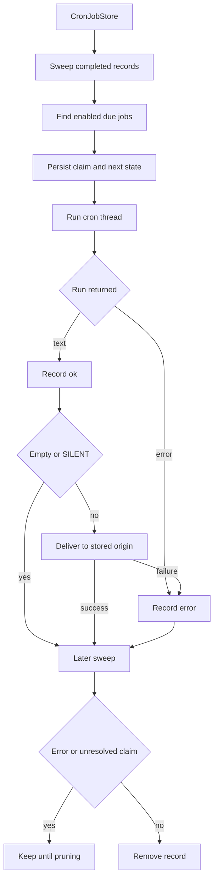

# Talon Scheduling and Background Work

> **Experimental and unattended.** Talon is experimental. A cron invocation has no person available to approve a tool call or complete interactive authorization: the host provides neither handler, and the runtime rejects approval interrupts for `trigger: "cron"`. A scheduled prompt is persistent, unattended access to the installed assistant, not a sandbox. Do not schedule work that requires interactive approval.

Talon separates durable scheduling from execution. `CronJobStore` owns records in `jobs.json`; `PersistentCronScheduler` claims due occurrences; `TalonHost` runs a claimed prompt and routes its result. Normal model-host startup opens the configured checkpoint and history services, wraps them in `ConversationSaver`, and wires the scheduler only when at least one channel exists.

## Schedule ownership and address

A cron record persists a self-contained prompt, assistant ID, parsed schedule, repeat/enabled state, timestamps, outcome/error, optional `until`, claim timestamp, delivery choice, and `CronOrigin`. The origin contains the channel conversation, provider, creating message and sender IDs, and optional parent history chat. It is host-supplied metadata: it sets both the management boundary and the later delivery address. A job created during a run keeps the original creator sender ID.

The agent uses `create_job`, `list_jobs`, `edit_job`, and `remove_job`; the tools obtain the current origin from runtime context rather than accepting a model-selected destination. `enabled=False` pauses a job, an empty edit `until` clears the bound, and create/edit responses include a few `upcoming` occurrences.

Management scope is **provider plus channel-level origin scope**, not raw message or thread ID. Slack `C`/`G` threads share their parent channel; Discord threads use `history_chat` when present; other conversations and providers remain isolated. The stored `message_id` is not part of this comparison. `deliver_to` defaults to `channel` and can be `thread`; it affects only target selection for adapters that distinguish parent and thread, not management authority.

## Accepted schedules and civil time

Schedule text is capped at 200 characters.

| Form | Meaning |
| --- | --- |
| `in <N>m` or `in <N>h` | One-shot relative interval of at least one minute. |
| `every <N>m` or `every <N>h` | Recurring relative interval. |
| `at YYYY-MM-DD HH:MM <IANA-zone>` | One-shot wall-clock time. |
| `daily at HH:MM <IANA-zone>` | Recurring local wall-clock time. |
| `cron <minute> <hour> <day-of-month> <month> <day-of-week> <IANA-zone>` | Recurring five-field cron in an explicit zone. |
| `cron @hourly`, `@daily`, `@weekly`, `@monthly`, or `@yearly` plus a zone | Agent-documented macros. |

Zones must be `UTC` or an IANA region such as `America/New_York`; bare offsets and legacy POSIX aliases are rejected so future daylight-saving rules remain available. The parser additionally accepts `@annually` and `@midnight`. Fields support ranges, steps, lists, month/weekday aliases (including Sunday as `0` or `7`), and limited `L`, `W`, and `#` calendar extensions. When neither textual day field starts with `*`, day-of-month and day-of-week are ORed as in Vixie cron; otherwise they are ANDed. Parsed expressions and resolved zones each use bounded 128-entry caches because this input comes from an agent.

Wall-clock schedules, `until`, and cron candidates are resolved in their stated zone. A nonexistent spring-forward time advances to the first valid minute; an ambiguous fall-back time chooses the earlier occurrence. Multiple skipped cron candidates that snap to the same instant coalesce into one fire. A past `at` is rejected. Interval jobs retain phase from the prior due time and skip ahead after downtime rather than replay all missed intervals.

`until` is a local `YYYY-MM-DD HH:MM <IANA-zone>` limit only for recurring jobs. It is inclusive and allows five minutes of late-claim grace; an occurrence found later than that is disabled and dropped, not delivered outside the requested window. Create and edit reject a bound before the first possible run.

## Durable store and claim protocol

`jobs.json` is a versioned JSON envelope with structured schedule fields and whole-second UTC timestamps. Unreadable, malformed, invalid-record, or wrong-version content is logged and treated as an empty store. That keeps the ticker alive, but a later write can replace bad data, so operators should protect and back up the cron directory.

Writes create a temporary file in the cron directory, flush and `fsync` it, set mode `0600`, atomically replace `jobs.json`, and `fsync` the directory; the directory is `0700`. Parsed records are cached by `(mtime_ns, size, inode)`, with identity captured via `fstat` on the opened file so an atomic replacement cannot associate old bytes with a newer pathname identity.

All live `CronJobStore` instances for one resolved path share a reentrant lock **only in the current process**. It covers complete reads and mutations, including claiming, but not another process, external writers, execution, or delivery. Run one owner process per cron file and do not perform offline store mutation while the host is live.



*The persisted cron lifecycle. Storage serialization ends at the claim; execution and delivery are outside the store lock.*

Each 60-second default tick sweeps first, then processes due jobs sequentially. `advance_next_run` rechecks eligibility and persists `claimed_at` and advanced state before invoking the host. One-shots and exhausted recurrences are disabled before their final attempt, and repeat count is consumed at claim time. This is at-most-once claiming: a process failure after durable claim can lose that occurrence rather than making it runnable again.

An invocation exception records `error`. A successful run is recorded as `ok` before output handling; empty output and output with `[SILENT]` at either trimmed end are withheld. A non-silent delivery failure changes the outcome to `error`. Unexpected failures escaping a whole tick are logged; the ticker waits its normal interval and continues.

Later sweeps delete completed or expired records only when they have neither an error nor unresolved `claimed_at`. Failed final runs and interrupted claims remain inspectable. `prune_completed(retain_for=...)` removes disabled, no-next-run records older than its non-negative retention window.

## Execution, checkpoints, and history

The host runs each claimed job on a locked dedicated `<job-id>:talon-cron` graph thread. It limits the run to 30 minutes and calls interruption recovery after timeout, repairing a checkpoint whose assistant tool calls may otherwise lack results and poison the next fire. This thread lock is separate from the cron-store lock.

The standard model host opens a checkpointer from `DEEPAGENTS_TALON_CHECKPOINT_URI` or the local checkpoint path and gives it, together with the history archive, to `ConversationSaver`. Built-in checkpoint URI schemes are SQLite/file, PostgreSQL, and MongoDB; a custom scheme requires exactly one `deepagents_talon.checkpoint_backends` entry point. Initialization errors are surfaced as sanitized configuration errors rather than exposing URI credentials. Thus cron-thread recovery and continued graph state depend on a durable, correctly configured checkpointer; the bare runtime fallback is in-memory and is unsuitable for persistence across process restart.

A cron run receives durable origin metadata for tool scope. When the matching channel and history-enabled runtime are available, it can read the resolved origin history scope. Archive scope is disabled, so the scheduled prompt and execution create neither an attended turn nor a transcript archive entry. A successfully delivered final reply may separately be recorded in delivery history.

For delivery, the host resolves the stored provider's adapter and chooses parent or thread from `deliver_to`, then sends with retry. A callback failure is a scheduler delivery error. The standard callback instead logs and drops output when no configured adapter serves the origin, leaving the already-recorded run successful; removing or renaming a provider with outstanding jobs can therefore lose messages. Stored origin metadata is not channel admission and does not let model output choose an arbitrary destination.

## Background subagents: chat versus cron

`BackgroundSubagents` changes delegation semantics based on the request trigger. In an attended chat, `task` and `start_async_task` create in-memory, thread-owned workers. The main conversation can continue; completed results are injected into a later main-agent turn. Workers and results are not durable. The subsystem caps its job table at 128 and detached running workers at four; a detached worker has a one-hour timeout. Results are limited to 64,000 characters, and a result whose host turn repeatedly fails delivery is dropped after three attempts.

A scheduled turn cannot wait for a future user turn. The runtime marks `trigger: "cron"` as scheduled, replaces the ordinary background instructions, hides `list_subagents` and `cancel_subagent`, and runs `task` or `start_async_task` inline to completion instead of adding a background job. Inline delegations are limited to 10 minutes, queue behind a separate four-slot semaphore, and return a safe error message on failure or timeout rather than escaping and causing graph retry. Their result is clamped to 64,000 characters because a cron thread is reused across fires. Nested delegation remains blocked. Consequently, cron fan-out can add latency while it holds the per-job thread lock, but it does not consume chat background-worker capacity or leave a result for a nonexistent future turn.

On shutdown, the runtime first cancels background workers. If they outlive the cancellation wait, it deliberately leaves graph/checkpoint resources open and raises rather than closing resources a live worker might still write; the host treats that as a component failure while completing its own shutdown.

## Revocation and operating limits

Live revocation through the running host cancels the revoked sender's active conversation work, pauses enabled jobs whose stored provider and creator sender ID match, and cancels their in-flight scheduled runs. A cancelled revoked cron run becomes an error and is not delivered.

The offline command is:

```text
deepagents-talon pairing pause-jobs <channel> <sender_id>
```

Run it only while Talon is stopped. It disables matching enabled jobs but cannot coordinate with the live process; the running host is the cron store's normal writer. Offline pairing revocation similarly cannot cancel work already executing. Use host-side revocation when immediate pause and cancellation matter.

## Change and test guidance

Preserve strict parsing and record validation, trusted origin injection, channel-level scope, persist-before-run claiming, and the single-process store ownership assumption. Do not add an interactive approval or authorization path to cron. Keep execution status, result delivery, history access, archive writes, channel admission, background delegation, and retention as distinct boundaries.

Focused coverage includes `libs/talon/tests/cron/test_jobs.py` for persistence, scope, grammar, local time, caching, and recovery; `libs/talon/tests/cron/test_until.py` for bounds and retention; `libs/talon/tests/cron/test_scheduler.py` for ordering and failures; `libs/talon/tests/unit_tests/test_cron_concurrency.py` for in-process locking and exclusive claims; `libs/talon/tests/unit_tests/test_background.py` for detached and inline delegation behavior; and `libs/talon/tests/unit_tests/test_checkpoint_backends.py` for backend selection, persistence, cleanup, and sanitized startup errors. See [state persistence](./state-persistence.md), [Talon channel admission](./talon-channel-admission.md), [Talon integration](../integrations/talon.md), and [development operations](../operations/development.md).
