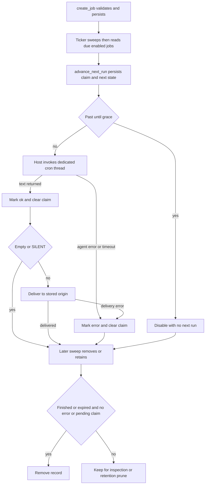

# Talon Scheduled Work and Cron Semantics

> **Experimental and unattended.** Talon is experimental and may change or be removed. A scheduled job later invokes an agent without an interactive approval or authorization path; approval-gated actions are auto-rejected. Channel exposure settings, tool policy, schedule creation, and approvals reduce accidental exposure but are **not** sandboxing, isolation, or a production security/containment boundary. Treat scheduling as persistent access to the assistant's installed capabilities, credentials, MCP tools, and host resources—not as a safe way to contain them. See [Permissions and Human-in-the-Loop](./permissions-hitl.md) and [Talon runtime integration](../integrations/talon.md).

Talon's scheduler is a persistent, minute-granularity dispatcher. `CronJobStore` owns durable job records and their state transitions; `PersistentCronScheduler` scans and claims due jobs; `TalonHost` invokes the agent and routes a result back to the stored origin. This division is intentional: the store makes an occurrence unclaimable before execution, while the scheduler and host handle execution, outcomes, and delivery.

## Operator model and entrypoints

The CLI creates one `CronJobStore` for the selected assistant at `<assistant-home>/cron/jobs.json`. Assistant setup and store access harden the directory to `0700` and the JSON file to `0600`. The file is a versioned JSON envelope (`version: 1`) and is updated by writing, fsyncing, atomically replacing, and fsyncing the directory. It is a single-writer, read-all/write-all store: its inode/mtime/size cache avoids repeated decoding and notices an external replacement, but it does not provide a cross-process transaction or locking protocol.

A malformed, unsupported-version, or malformed-record store is logged and treated as empty; a later write replaces it with a valid envelope. That is a scheduler-availability trade-off with a serious operational implication: protect and back up `jobs.json`; unreadable content can make scheduled jobs disappear from the active view and be overwritten on the next write.

The agent receives four conversation-scoped LangChain tools:

- `create_job(prompt, schedule, name="", repeat_times=None, until=None)` persists a job and returns its state plus three `upcoming` UTC instants.
- `list_jobs()` returns only jobs in the current origin scope.
- `edit_job(job_id, ...)` changes a scoped job; an empty `until` clears its bound, and `enabled=False` pauses it.
- `remove_job(job_id)` deletes a scoped job.

An origin records the conversation ID, optional channel provider, and source message ID. Management scope compares **conversation ID and channel**, not message ID, so a job cannot be listed, edited, or removed from another conversation/provider scope. The stored origin is also the eventual delivery address. The runtime injects the current trusted request origin rather than accepting it as a model argument.

Use the `current_time` tool before interpreting relative wording or creating a wall-clock schedule. It can return a requested IANA zone or attempt to identify the host zone; if the host has an offset but no IANA name, it explicitly tells the agent to ask the user before creating a wall-clock schedule.

## Supported schedule grammar

Only the following forms are implemented. Keywords are case-insensitive; IANA timezone spelling remains case-sensitive. Schedule text is capped at 200 characters.

| Form | Meaning and constraints |
| --- | --- |
| `in <N>m` or `in <N>h` | One-shot interval, at least one minute. |
| `every <N>m` or `every <N>h` | Recurring interval, at least one minute. Late ticks retain the original interval phase and skip forward rather than accumulating a backlog. |
| `at YYYY-MM-DD HH:MM <IANA-zone>` | One-shot local wall-clock instant. A past instant is rejected. |
| `daily at HH:MM <IANA-zone>` | Recurring local wall-clock time. |
| `cron <minute> <hour> <day-of-month> <month> <day-of-week> <IANA-zone>` | Recurring five-field local-time cron. |
| `cron @hourly|@daily|@weekly|@monthly|@yearly|@annually|@midnight <IANA-zone>` | The supported cron macros. |

Zones must be `UTC` or a usable slash-containing IANA region key such as `America/New_York`. POSIX forms such as `EST5EDT`, bare offsets, paths, and unrecognized names are rejected because they cannot safely carry a region's future DST rules. Resolved zones are cached with a 128-entry bound because names originate in agent input.

### Five-field cron

Fields are minute (`0–59`), hour (`0–23`), day of month (`1–31`), month (`1–12` or `jan`–`dec`), and day of week (`0–7` or `sun`–`sat`). Sunday is both `0` and `7`. Each ordinary field accepts `*`, a value, ascending `A-B`, a step (`*/15`, `9-17/2`, or `5/10`), and comma lists; a step on a single value continues to the field maximum. Unsupported forms—including `?`, six-field cron, reversed ranges, zero steps, and unlisted macros—fail validation with `CronJobError`.

The implemented calendar extensions are deliberately limited:

- Day of month: `L` for the last calendar day, `LW` for the final weekday, and `NW` for the weekday nearest day `N`. Nearest-weekday selection never crosses its month.
- Day of week: `NL` for the last weekday `N` in the month and `N#K` for its Kth occurrence, where `K` is 1–5.

Day-of-month/day-of-week behavior follows the Vixie rule encoded by this implementation: when **both** fields are restricted—specifically, neither textual field starts with `*`—a date matches when either field matches. Otherwise both predicates must match. Thus `cron 0 0 13 * 5 UTC` runs on the 13th or Fridays, while `cron 0 0 */2 * 5 UTC` requires both an odd-numbered day and Friday. Parsed expressions use a bounded 128-entry cache; next-match search walks allowed local calendar days for at most 50 years, which accommodates rare leap-day/weekday combinations while rejecting an expression that never yields a next run.

## Time zones and daylight saving time

Wall-clock and cron schedules are evaluated as local calendar times in their explicit zone, then converted to UTC. Daily schedules rebuild each candidate from its local date instead of adding 24 hours; cron searches local candidates. Therefore a `daily at 08:00 America/New_York` or `cron 0 8 * * * America/New_York` retains 08:00 local time across offset changes.

DST resolution is precise and shared by `at`, `daily`, `until`, and cron:

1. For a **nonexistent** spring-forward local time, Talon advances minute by minute to the first valid local minute. For example, `daily at 02:30 America/New_York` fires at 03:00 on the transition date rather than being skipped. Multiple matching cron minutes that land in the same gap collapse to that one instant, so they produce one fire.
2. For an **ambiguous** fall-back local time, Talon uses the earlier occurrence (`fold=0`). A 01:30 schedule consequently fires once at the daylight-time occurrence and resumes at 01:30 on the next local date; it does not fire again during the repeated hour.

`until` is an optional inclusive last local instant for recurring schedules only, written `YYYY-MM-DD HH:MM <IANA-zone>` and resolved with those same rules. It must permit at least the first run. The scheduler permits a run due at `until` to be claimed up to five minutes late to cover tick latency; if the host was down beyond that grace, the missed occurrence is dropped rather than delivered after the requested window.

## Persistent state, claims, and completion

A record stores the self-contained prompt, assistant ID, origin, parsed schedule, display text, enabled flag, creation time, next and last run timestamps, repeat state, optional `until`, latest status/error, and `claimed_at`. Timestamps are normalized to whole-second UTC. Persisted schedule fields are structured rather than reparsed display text; cron expressions are validated again when loaded.

`repeat_times` is valid only for recurring jobs and must be at least one. Its `completed` count advances when an occurrence is **claimed**, not when it succeeds. A repeat cap of one means “attempt the next match once.” For recurring intervals, a late claim advances from the former scheduled time to preserve phase; long downtime catches up to the first future interval rather than replaying every missed interval. One-shot jobs, exhausted caps, and a calculated next occurrence beyond `until` are disabled with `next_run_at=None` during the claim.

*The persisted claim precedes execution; outcome recording and later sweep determine removal versus retained diagnostics.*

At each default 60-second tick, the scheduler first calls `discard_finished`, then lists due jobs sorted by `next_run_at`, and processes them sequentially. For each job it calls `advance_next_run` **before** invoking the agent. This durable claim prevents that occurrence from becoming claimable again after a failure or process crash, but it also means delivery is at-most-once per claimed occurrence—not an exactly-once delivery guarantee.

After an agent return, the scheduler records `ok` before delivery. It records `error` when invocation raises or delivery raises; delivery failure replaces an earlier successful outcome with `delivery failed: ...`. An empty result is not delivered. A result whose trimmed text starts or ends with `[SILENT]` is successful but withheld. Scheduler and lifecycle events, including ticks, dispatch, success/failure, suppression, delivery, and removal, are structured log events.

The next tick removes a disabled/expired record only when its latest outcome is not an error and it has no unresolved claim. Failed final runs and claims left without an outcome after restart are retained for inspection; an expired retained record is made finished. `prune_completed(retain_for=...)` is the explicit later cleanup mechanism for disabled, no-next-run records, using `last_run_at` or creation time. A negative retention window is rejected.

## Host execution and delivery boundary

When channels are configured, the CLI attaches `PersistentCronScheduler` with `TalonHost.run_scheduled_job` and origin delivery callbacks. A scheduled run uses a dedicated `<job-id>:talon-cron` graph thread and holds that thread's conversation lock, preventing overlapping fires of the same job. The host limits the scheduled agent turn to 30 minutes. On timeout it attempts interrupted-checkpoint recovery before surfacing the failure, so a later run is not poisoned by dangling tool calls.

The host invokes cron with `trigger: "cron"`, no approval handler, no authorization handler, no progress-message handler, and no approval-operator authority. Do not design a job that requires a person to approve a tool or complete OAuth at run time: protected calls are rejected and interactive authorization is unavailable. Scheduled subagent delegation is inline rather than detached, so the scheduled invocation receives its result instead of leaving work for an unrelated future chat turn.

For non-silent output, the host selects a configured channel matching the recorded origin provider and sends to the recorded conversation ID with retry behavior. If no matching channel exists, the result is logged and dropped; the scheduler's delivery callback does not turn that absence into a retryable job failure. Successful channel delivery is the point at which the host records the final reply in durable conversation history.

## Failure behavior and safe changes

A ticker catches unexpected exceptions from a scan, logs `cron.tick_failure`, waits the normal interval, and continues. Unclaimed due jobs remain eligible on the next scan. Individual job exceptions become error outcomes and do not stop a later due job in the same tick. Dispatch is sequential, however, so preserve the host's scheduled-run bound: an unbounded callback would delay later jobs.

When changing this subsystem:

1. Keep schedule parsing and serialization strict; do not silently accept a new grammar or timezone representation without migration and tests.
2. Preserve local-date candidate construction and the gap/ambiguity rules. “Fixing” DST by adding durations changes wall-clock semantics.
3. Claim and persist before execution; do not reintroduce duplicate execution after restart by moving the advance after the callback.
4. Keep origin injected from trusted request context and scope management by conversation plus channel.
5. Treat output delivery, `ok` state, and retention as separate transitions. An `ok` job may later acquire `error` if delivery fails, and a failed/unknown finished job intentionally remains inspectable.
6. Do not pass chat approval, authorization, or operator authority into the cron request.

Focused regression coverage is in `libs/talon/tests/cron/test_expression.py` (grammar, Vixie day semantics, extensions, DST, rare matches), `test_jobs.py` (durability, scope, caps, storage), `test_until.py` (bounds, grace, lifecycle, retention), and `test_scheduler.py` (claim/run/deliver/errors/ticker survival). Host and runtime tests additionally cover timeout recovery, per-job exclusion, trusted origin injection, and automatic rejection of cron approval interrupts. See [Runtime behavior](../architecture/runtime-behavior.md), [State and persistence](./state-persistence.md), and [Testing guide](../testing/testing-guide.md).
