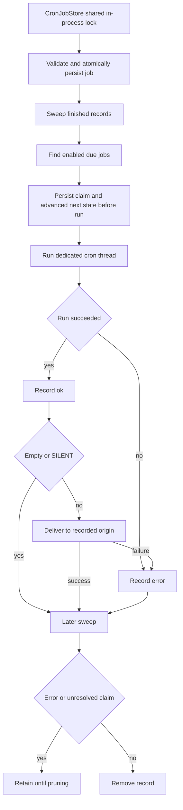

# Talon Scheduling and Cron Records

> **Experimental and unattended.** Talon is experimental. A scheduled invocation has no person available to approve a tool call or complete interactive authorization. The host supplies no approval or authorization handler, and the runtime rejects approval interrupts for requests whose `trigger` is `"cron"`. Treat a cron prompt as persistent, unattended access to the installed assistant—not as a sandbox—and do not schedule work that requires interactive approval.

`CronJobStore` owns durable records, `PersistentCronScheduler` claims due occurrences and invokes callbacks, and `TalonHost` runs the agent and delivers eligible output. Standard host startup attaches this scheduler only when at least one channel is configured.

## Origin, tools, and delivery address

A job persists its self-contained fire-time prompt, assistant ID, parsed schedule, repeat and enabled state, timestamps and last outcome/error, optional `until`, claim timestamp, delivery choice, and `CronOrigin`. An origin contains the conversation ID and provider channel, plus the creating message ID, sender ID, and optional parent history chat. It is host-supplied metadata: it supplies both the management boundary and the later delivery address. A cron execution that creates a new job retains the original creator sender ID.

The agent-facing tools are `create_job`, `list_jobs`, `edit_job`, and `remove_job`. They obtain the current origin from the runtime rather than accepting a destination from the model. `enabled=False` pauses a job; an edit with an empty `until` clears that bound. Tool results include the next few `upcoming` occurrences so the agent can verify the schedule it chose.

Scope is **provider plus the channel-level conversation scope**, not simply the raw message or thread ID. Ordinary origins use their conversation ID. Slack channel (`C` or `G`) thread origins share their parent channel ID, while Discord thread origins use `history_chat` when present; unrelated conversations and providers remain isolated. The source `message_id` is persisted but does not affect scope. Thus participants in a supported shared channel can manage its jobs across threads, without gaining access to jobs in another channel.

`deliver_to` is `channel` by default or `thread`. It changes the target only where an adapter distinguishes a thread from its parent (documented for Slack channel threads and public Discord threads); it does not alter job-management scope.

## Schedule language and local-time rules

Schedule text is limited to 200 characters. The accepted forms are:

| Form | Meaning |
| --- | --- |
| `in <N>m` or `in <N>h` | One-shot relative interval, at least one minute. |
| `every <N>m` or `every <N>h` | Recurring relative interval, at least one minute. |
| `at YYYY-MM-DD HH:MM <IANA-zone>` | One-shot explicit wall-clock time. |
| `daily at HH:MM <IANA-zone>` | Recurring daily local wall-clock time. |
| `cron <minute> <hour> <day-of-month> <month> <day-of-week> <IANA-zone>` | Recurring five-field expression evaluated in its explicit zone. |
| `cron @hourly`, `@daily`, `@weekly`, `@monthly`, or `@yearly` plus a zone | Macros described by the agent tool help. |

The parser also recognizes the equivalent `@annually` and `@midnight` macros. Cron fields support ranges, steps, comma lists, month and weekday aliases (`0` or `7` is Sunday), and limited `L`, `W`, and `#` calendar extensions. When both textual day fields are restricted—neither starts with `*`—Talon uses Vixie-style OR; otherwise the two day predicates must both match. Parsed expressions and resolved zone names use separate bounded 128-entry caches because schedule input is agent-supplied.

Wall-clock schedules, `until`, and cron candidates are evaluated in the declared IANA zone. A nonexistent spring-forward local time moves to the first valid minute; an ambiguous fall-back time uses the earlier occurrence. Several cron candidates that snap into the same gap-end instant coalesce to one fire. A past `at` schedule is rejected. Intervals preserve their phase from the previous due time and skip to a future interval after downtime instead of replaying every missed occurrence.

`until` is a local `YYYY-MM-DD HH:MM <IANA-zone>` bound for recurring jobs only. It is inclusive, so an occurrence at the bound can run, with a five-minute grace for tick latency. A due occurrence claimed after that grace is disabled and dropped rather than delivered after the requested window; creation and edits reject a bound before the first possible run.

## Store, locking, and cache coherence

`jobs.json` is a versioned JSON envelope. Records contain structured schedule fields rather than relying on reparsing display text; timestamps are normalized to whole UTC seconds. On read, malformed JSON or record data, unreadable files, and an unsupported schema version are logged and treated as an empty store. This keeps the ticker alive, but a subsequent write can replace the bad data, so operators should protect and back up the cron directory.

Writes use a temporary file in the cron directory, flush and `fsync` it, set mode `0600`, atomically replace `jobs.json`, and `fsync` the directory. The directory is maintained at `0700`. The store caches parsed jobs by the read file's `(mtime_ns, size, inode)` identity: unchanged reads need only `stat`, an atomic replacement invalidates another store instance's cache, and identity is captured with `fstat` on the opened file so a replacement cannot label older bytes as newer content.

All `CronJobStore` instances addressing the same resolved path share one reentrant lock **within the current process**. The lock covers complete storage reads and mutations, including read-all/write-all updates, so concurrent local stores cannot lose a committed creation or double-claim an occurrence. It deliberately is **not distributed coordination**: another process or an external writer is outside this contract. Deploy one owning process per cron file, and do not use offline mutation commands while the host runs. The lock does not cover agent execution or delivery.

## Claim, execution, and retention lifecycle



*The store lock serializes only in-process storage access, not distributed writers, execution, or delivery; each occurrence is persisted and advanced before it is run.*

On each default 60-second tick, the scheduler first sweeps finished records, then collects due jobs and handles them sequentially. For each, `advance_next_run` atomically rechecks eligibility and persists `claimed_at` plus the next state before calling the host. One-shots and exhausted recurring jobs are disabled before their final invocation; repeat count is consumed at claim time. This is an at-most-once claim protocol: a process failure after that durable claim may lose the occurrence, but does not make it claimable again.

An invocation exception records `error`. A successful invocation is first recorded as `ok`; empty output and output with `[SILENT]` at either trimmed end are withheld. If non-silent delivery fails, the result is changed to `error` with a delivery failure. Unexpected errors escaping a whole tick are logged and the ticker retries after the normal interval.

A later sweep removes a completed or expired record only when it has neither an error nor an unresolved `claimed_at`. Failed final executions and claims interrupted before an outcome stay available for inspection. `prune_completed(retain_for=...)` later removes disabled, no-next-run records whose last-run time (or creation time) is outside the chosen non-negative retention window.

## Host execution, history, and output

The host executes each job on a dedicated `<job-id>:talon-cron` graph thread, protected by that thread's conversation lock. It bounds the run to 30 minutes and calls interruption recovery after a timeout, preventing a partial tool-call checkpoint from poisoning a later fire. This execution lock is distinct from the store lock.

A cron run receives durable origin metadata for cron-tool scope and can obtain a read-only resolved origin-history scope when the matching channel and a history-enabled runtime are available. Archive scope is disabled, so the scheduled prompt and execution do not create an attended turn or transcript archive entry. A final non-silent reply that is delivered can separately be recorded in delivery history when the runtime supports it.

For delivery, the host resolves the adapter matching the stored provider, resolves the parent or thread target from `deliver_to`, and sends with retry. The scheduler treats a callback failure as a delivery error. Delivery therefore reuses the recorded origin; it does not admit a sender, recreate the inbound request, or let model output select an arbitrary destination.

## Revocation and operating limits

Live revocation through the running host cancels the revoked sender's active conversation work, finds jobs whose stored provider and creator sender ID match, pauses enabled matches, and cancels their in-flight scheduled runs. A cancelled revoked cron run is converted to an error, so the scheduler does not deliver it. Store failures are logged and reported to the operator.

The offline command is:

```text
deepagents-talon pairing pause-jobs <channel> <sender_id>
```

Run it only while Talon is stopped. It finds every matching provider/sender record and disables enabled ones, but cannot coordinate with the live process; the CLI explicitly documents the running host as the store's only normal writer. Likewise, `pairing revoke` in the offline CLI revokes pairing and reports enabled matching jobs for this follow-up—it cannot cancel work already executing. Use host-side revocation when immediate pause and cancellation matter.

## Change guidance and focused tests

Preserve strict parsing and record validation, trusted origin injection, channel-level origin scope, atomic persist-before-run claiming, and the single-process ownership assumption. Do not add an interactive approval or authorization path to cron. Keep execution status, result delivery, history access, archive writes, channel admission, and retention as separate boundaries.

Focused tests: `libs/talon/tests/cron/test_jobs.py` covers persistence, scope, grammar, local-time behavior, caching, and store recovery; `libs/talon/tests/cron/test_until.py` covers inclusive bounds, grace, expiry, and retention; `libs/talon/tests/cron/test_scheduler.py` covers ordering, suppression, errors, and ticker recovery; and `libs/talon/tests/unit_tests/test_cron_concurrency.py` verifies shared-lock mutations and exclusive claims across separate store instances in one process. See [runtime behavior](../architecture/runtime-behavior.md), [state persistence](./state-persistence.md), [Talon channel admission](./talon-channel-admission.md), [Talon integration](../integrations/talon.md), and the [testing guide](../testing/testing-guide.md).
