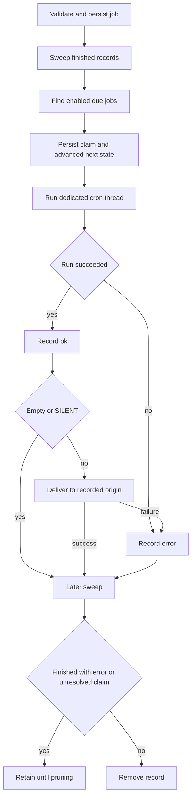

# Talon Scheduled Work and Cron Semantics

> **Experimental and unattended.** Talon is experimental. A cron job is persistent, unattended access to the installed assistant, not a sandbox. Scheduled runs have no approval or authorization handler or operator authority; the runtime automatically rejects approval interrupts whose trigger is `cron`. Do not schedule work that needs a person to approve a tool call or complete interactive authorization.

`CronJobStore` owns durable job state, `PersistentCronScheduler` claims and dispatches due work, and `TalonHost` runs the agent and delivers a non-silent result to the recorded origin. The normal host creates this scheduler only when channels are configured.

## Job origin and management boundary

A job has a self-contained prompt, assistant ID, parsed schedule, repeat and enabled state, timestamps/outcome, optional `until`, and a durable `CronOrigin`. The origin records the conversation ID, provider channel, source message ID, creator sender ID, and (for applicable Discord threads) history chat. It is trusted metadata supplied by the runtime, not a model-selected destination. A cron run that creates another job inherits its creator sender ID.

The agent gets `create_job`, `list_jobs`, `edit_job`, and `remove_job`. Creation persists the prompt that will be used later, so it must contain all fire-time instructions. List, edit, and removal are scoped to **conversation ID plus channel**; source message ID is retained but not part of this comparison. `enabled=False` pauses a job, and an empty `until` in an edit clears the bound. `deliver_to` selects `channel` or `thread` only where an adapter distinguishes a public/channel thread from its parent.

## Accepted schedules and time boundaries

Schedule text is limited to 200 characters. The parser accepts:

| Form | Meaning |
| --- | --- |
| `in <N>m` or `in <N>h` | One-shot relative interval; at least one minute. |
| `every <N>m` or `every <N>h` | Recurring relative interval; at least one minute. |
| `at YYYY-MM-DD HH:MM <IANA-zone>` | One-shot explicit local wall-clock time. |
| `daily at HH:MM <IANA-zone>` | Recurring local wall-clock schedule. |
| `cron <minute> <hour> <day-of-month> <month> <day-of-week> <IANA-zone>` | Recurring five-field cron in an explicit zone. |
| `cron @hourly`, `@daily`, `@weekly`, `@monthly`, `@yearly`, `@annually`, or `@midnight` plus a zone | Supported cron macro. |

Cron supports ranges, steps, lists, month and weekday aliases, and limited `L`, `W`, and `#` day extensions. When neither textual day field begins with `*`, day-of-month and day-of-week use Vixie-style OR; otherwise both predicates must match. Parsed expressions and resolved zone names are each held in bounded 128-entry caches because they derive from agent input.

Wall-clock schedules, `until`, and cron evaluate local candidates in the explicit IANA zone. A nonexistent spring-forward time advances to the first valid minute; an ambiguous fall-back time selects the earlier occurrence. Cron candidates that snap into the same DST gap coalesce to one fire. Interval jobs instead preserve phase from their previous occurrence and skip ahead after downtime rather than replaying a backlog.

`until` is a local `YYYY-MM-DD HH:MM <IANA-zone>` bound, valid only for recurring jobs. It is inclusive: the occurrence at the bound may be claimed, with a five-minute tick-latency grace. If a due occurrence is later than that grace, it is disabled and dropped rather than delivered after the requested window. Creation and edits reject a bound that precedes the first possible fire.

## Persist-before-run lifecycle

`jobs.json` is a versioned JSON envelope. It is deliberately a single-writer, read-all/write-all store: its directory and file are tightened to `0700` and `0600`, respectively, and a write fsyncs a temporary file then atomically replaces the store. A malformed, unreadable, or wrong-version store is logged and treated as empty—an availability safeguard with a job-loss consequence, so protect and back up the cron directory.



*Each occurrence is durably claimed and advanced before invocation; delivery and retention are later state transitions.*

On each 60-second default tick, the scheduler first removes eligible finished records, obtains due jobs, and processes them sequentially. For each job it calls `advance_next_run` **before** calling the host. A one-shot and a recurring job whose repeat cap is exhausted are disabled before their run; a recurring repeat count is consumed at claim time. This is at-most-once claiming: a crash after the persisted claim can lose that occurrence, but cannot make it claimable again.

After a successful invocation, the scheduler records `ok`; empty output and output beginning or ending with `[SILENT]` are not delivered. An invocation exception records `error`. A delivery exception changes an already-recorded success to `error` with a delivery-failure message. Unexpected tick failures are logged and the ticker waits for its normal interval before retrying.

A later sweep removes completed or expired records only if they have neither an error nor an unresolved `claimed_at`. Failed final runs and claims interrupted before an outcome remain inspectable; `prune_completed(retain_for=...)` can remove disabled completed records after the selected retention window.

## Execution, history, and delivery

The host uses a per-job `<job-id>:talon-cron` thread and lock, bounds the run to 30 minutes, and invokes recovery after a timeout so a partial tool-call checkpoint does not poison a later run. It passes the stored origin as cron metadata while withholding approval, authorization, progress messaging, and operator authority.

Cron is not an attended inbound turn. When a matching channel and history-enabled runtime are available, it receives a read-only scope for the resolved origin history. Its execution archive scope is disabled, so the scheduled prompt and agent execution create no transcript archive entry and cannot delete conversations. If a final non-silent reply is successfully delivered, the host separately records that delivery when the runtime supports delivery history.

The delivery target is resolved from the stored provider and conversation. A result can go to the parent channel or thread according to `deliver_to`; the host uses retrying channel send behavior. Origin identity is therefore both the cron management scope and the delivery address—it does not admit a new sender or recreate the original attended request.

## Pairing revocation and operations

Live revocation through a running host actively cancels the revoked sender's current conversation work, finds jobs whose stored provider and creator sender ID match, pauses every enabled match, and cancels matching in-flight scheduled runs. A cancelled revoked run is converted to a scheduler error and is not delivered. If the store operation fails, the host reports that operators must inspect logs.

The offline counterpart is:

```text
deepagents-talon pairing pause-jobs <channel> <sender_id>
```

Run it only while Talon is stopped. The running host is the cron store's only normal writer, and the command does not coordinate with it. CLI `pairing revoke` only revokes the pairing and reports still-enabled matching jobs with this follow-up command; use host-side revocation for immediate cancellation and pausing.

## Change guidance and focused tests

Preserve strict schedule and store validation, trusted origin injection, conversation-plus-channel management scope, and the **persist-before-run** ordering. Do not introduce an interactive approval or authorization path for cron. Treat execution status, delivery, history access, archive writes, retention, and channel admission as separate boundaries.

Focused tests include `libs/talon/tests/cron/test_jobs.py` for persistence, scope, recurrence, and permissions; `libs/talon/tests/cron/test_until.py` for bound parsing, grace, expiry, and retention; `libs/talon/tests/cron/test_scheduler.py` for claim/run/delivery/error and ticker survival; and `libs/talon/tests/unit_tests/test_scheduled_history.py` for origin-history access, no execution archive entry, delivery history, and thread targets. See [runtime behavior](../architecture/runtime-behavior.md), [state persistence](./state-persistence.md), [Talon channel admission](./talon-channel-admission.md), and [Talon integration](../integrations/talon.md).
