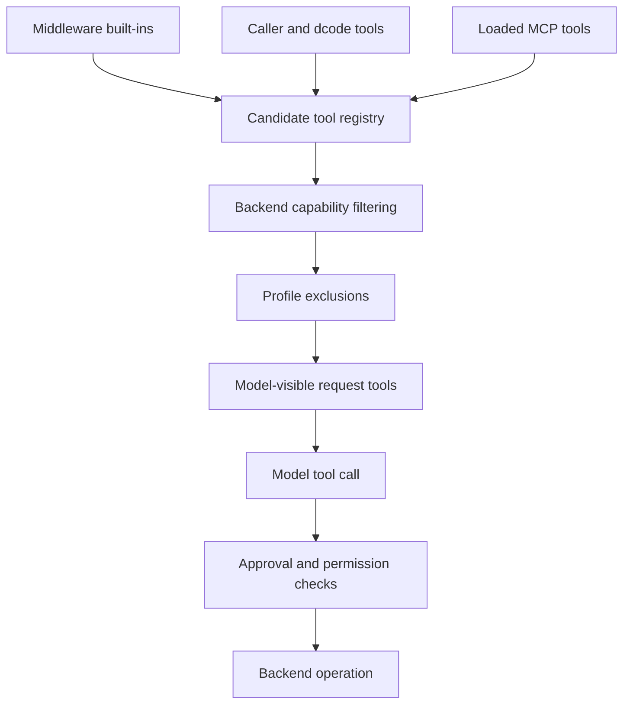

# Tool Surface, Filesystem, and Execution

A tool's presence is not one authorization decision. The system deliberately separates **assembly and visibility** (schemas bound for the model), **backend capability** (operations the resolved backend can perform), and **permission or approval** (whether a particular call may proceed). A visible tool can therefore still return a capability or permission error, or pause for review.

This diagram distinguishes composition-time visibility from per-call enforcement.

## Tool assembly and visibility

`create_deep_agent` composes a middleware stack that contributes filesystem tools and, when configured, subagent delegation tools; caller `tools=` join that construction. In dcode, extension ownership is resolved before `create_deep_agent`: an extension replaces a colliding supplied tool or middleware, its units are added, and extension runtime middleware is installed. A name should therefore have one intended owner in a dcode configuration.

Profiles can rewrite descriptions and suppress tool names. Description overrides copy and rewrite dict tools and `BaseTool` instances, but leave plain callables alone rather than mutating or wrapping caller-owned values. With non-empty `excluded_tools`, graph construction appends `_ToolExclusionMiddleware` after custom middleware. It removes excluded names from sync and async model requests and rejects an emitted excluded call with `Error: <name> is not available.` The second check is necessary because the tool executor still registers and dispatches tools by name. Exclusion keeps advertised and callable surfaces consistent; it is not an authorization boundary.

### dcode catalog and MCP tools

The `dcode tools list` command and interactive `/tools` command enumerate real bound tools instead of maintaining a second catalog. They compile a CLI agent with an offline placeholder model, then inspect its bound tool node; no credentials or model network call are needed. The catalog forwards the filesystem allowlist. Since filesystem middleware does not instantiate disallowed tool factories, enumeration should already be limited; a defensive leak check logs an error and deliberately returns the unfiltered list if that invariant fails.

MCP discovery is a separate source of tools. dcode wraps each remote tool as an asynchronous `StructuredTool` backed by `MCPSessionManager`; it normalizes arguments, calls the original remote name through that server session, and retains provenance metadata. Optional prefixing sanitizes server and tool names for providers, enforces a 64-character maximum, and gives changed or overlong names a deterministic SHA-256-derived suffix. Discovery is bounded and concurrent, while its server information remains in configuration order and its combined tools are name-sorted. Unavailable servers report status rather than silently contributing no tools.

## Filesystem middleware and backend contract

`FilesystemMiddleware` owns model-facing filesystem tools and accepts an initialized `BackendProtocol` instance, defaulting to ephemeral `StateBackend`. The backend owns storage and filesystem operations; middleware validates inputs, applies policy, formats `ToolMessage` output, and manages context eviction. A callable backend factory is rejected: callers must pass an initialized backend instance.

The fixed filesystem vocabulary is `ls`, `read_file`, `write_file`, `edit_file`, `delete`, `glob`, `grep`, and `execute`.

| Tool | Role |
| --- | --- |
| `ls` | List directory entries. |
| `read_file` | Read a paginated file window. |
| `write_file` | Create or replace a file. |
| `edit_file` | Perform exact string replacements in an existing file. |
| `delete` | Recursively delete a file, directory, or backend key prefix when supported. |
| `glob` | Find matching regular files. |
| `grep` | Search literal text. |
| `execute` | Run a command only when the backend provides shell execution. |

Backends return structured results rather than preformatted text. `ReadResult` validates pagination at construction: window fields must occur together, bounds must be forward and within `total_lines`, and `next_offset` must be the line immediately after the returned window. Middleware, not the backend, adds line-number gutters and continuation rows for very long lines. `GrepResult` and `GlobResult` can carry valid but incomplete matches with `truncated=True`; callers must not interpret truncation as a hard failure or proof that no additional matches exist.

### Allowlist, capabilities, and request lifecycle

`FilesystemMiddleware(tools=...)` is a visibility allowlist, not a permission policy. `None` and `"all"` opt into all names; a list constructs only listed factories, so omitted tools never reach the dispatchable node. An explicit list must include `read_file`, otherwise construction raises `ValueError`.

Before both sync and async model calls, the middleware filters tools that the resolved backend cannot serve. `execute` requires `SandboxBackendProtocol`; `delete` requires a backend implementation rather than the protocol's default `NotImplementedError`. If `execute` somehow reaches its implementation without support, it returns an execution-not-available error. This request pass also rewrites `grep` and `execute` descriptions for the active search/execution tools and, when execution is active, adds composite-backend shell-path routing guidance.

`grep` is literal substring search, not regex. Its default total match cap is `grep_max_count=1000`; a call can override it with `max_count`, and `None` disables the default. The asynchronous protocol wrapper applies a wait timeout and enforces the requested cap even if an older concrete backend does not accept `max_count`. For actual regex, the `grep` description recommends `rg` through `execute` only if execution is available.

Large results from tools outside the filesystem set can be evicted beneath the backend artifacts root so the model sees a preview and file reference. `ls`, `glob`, `grep`, `read_file`, `edit_file`, `write_file`, and `delete` are excluded because they truncate themselves, have awkward reread behavior, or provide compact confirmations. Large human messages follow a related lifecycle: the full message remains in state while the request receives a tagged preview and filesystem reference.

## Shell execution and path routing

`LocalShellBackend` is execution-capable because it extends `FilesystemBackend` and implements `SandboxBackendProtocol`, but its name must not be read as a security guarantee. It runs `subprocess.run(..., shell=True)` directly on the local host with the user's permissions. `virtual_mode` restricts filesystem-tool path mapping only; it does not confine shell commands. Treat it as appropriate for trusted local development, not untrusted or multi-tenant production workloads, and pair it with HITL when used.

Its default command timeout is 120 seconds and its output is capped at 100,000 bytes by default. It runs commands with `root_dir` as the working directory, combines stdout and stderr, reports nonzero exit codes, and marks capped output as truncated. Middleware additionally validates a requested command timeout against its positive `max_execute_timeout` limit, which defaults to one hour.

In a `CompositeBackend`, file-tool paths can be virtual routes while `execute` runs only on the default backend's shell. The middleware does not rewrite a command: if the default is `LocalShellBackend`, it supplies the model prefix substitutions for local `FilesystemBackend` routes; routes on remote/sandbox defaults or store-backed routes have no shell mapping and must be accessed through file tools.

## Permissions and HITL are separate from visibility

`FilesystemPermission` rules are enforced inside filesystem tool implementations, not by removing schemas. Rules use wcmatch operation-and-path matching and return the first matching `allow`, `deny`, or `interrupt` decision. Denied operations return an error, and denied paths are filtered from list and search results.

Exact-path tools (`read_file`, `write_file`, `edit_file`) test their one target. Bulk tools (`ls`, `glob`, `grep`, `delete`) must interrupt when their search subtree may overlap an anchored protected prefix. A pathless bulk call such as `grep(path=None)` conservatively fires for any relevant interrupt rule; `glob` also considers an absolute pattern that can redirect its search outside the supplied path. Graph assembly converts interrupt-mode permission rules into predicates for `HumanInTheLoopMiddleware`, which owns pausing and approval. A preceding deny wins for exact-path calls, so a denial does not become an approval request.

Permission patterns must start with `/` and cannot contain `..` or `~`. Permissions combined with an execution-capable backend are rejected unless every rule is scoped to routes, because arbitrary shell commands cannot be governed by tool-level filesystem permissions. This protects against mistaking path policy for a shell sandbox.

## Focused behavioral tests and operational guidance

The state-backend integration tests demonstrate that two parallel `write_file` calls merge file updates correctly, ordinary edits replace one or all matching occurrences, and invalid edit or traversal inputs become tool errors rather than crashing the graph. They also document an intentional unresolved boundary: parallel `edit_file` calls to the same file are marked `xfail` because reducers and backends can race; prompt or application logic should avoid them until explicit rejection/serialization exists.

When troubleshooting, first identify the layer:

1. **Absent from model choices:** inspect the filesystem `tools=` list, installed middleware, profile exclusions, extension collisions, and MCP server status.
2. **`execute` or `delete` absent:** inspect backend capability. An allowlist cannot manufacture a missing implementation.
3. **Visible but rejected or paused:** distinguish exclusion, backend error, filesystem denial, and HITL interruption; they have different owners.
4. **Search seems incomplete:** inspect `truncated`, then narrow the path or pattern.
5. **Shell can’t see a file-tool path:** inspect composite route guidance; use file tools for mounts without a host mapping.

## Related pages

- [Backends](backends.md) — backend implementations, routing, and sandbox capability.
- [Middleware catalog](middleware-catalog.md) — middleware responsibilities and ordering.
- [Permissions & HITL](permissions-hitl.md) — approval policy and interrupts.
- [Sandbox partners](../integrations/sandbox-partners.md) — execution-capable backend integrations.
