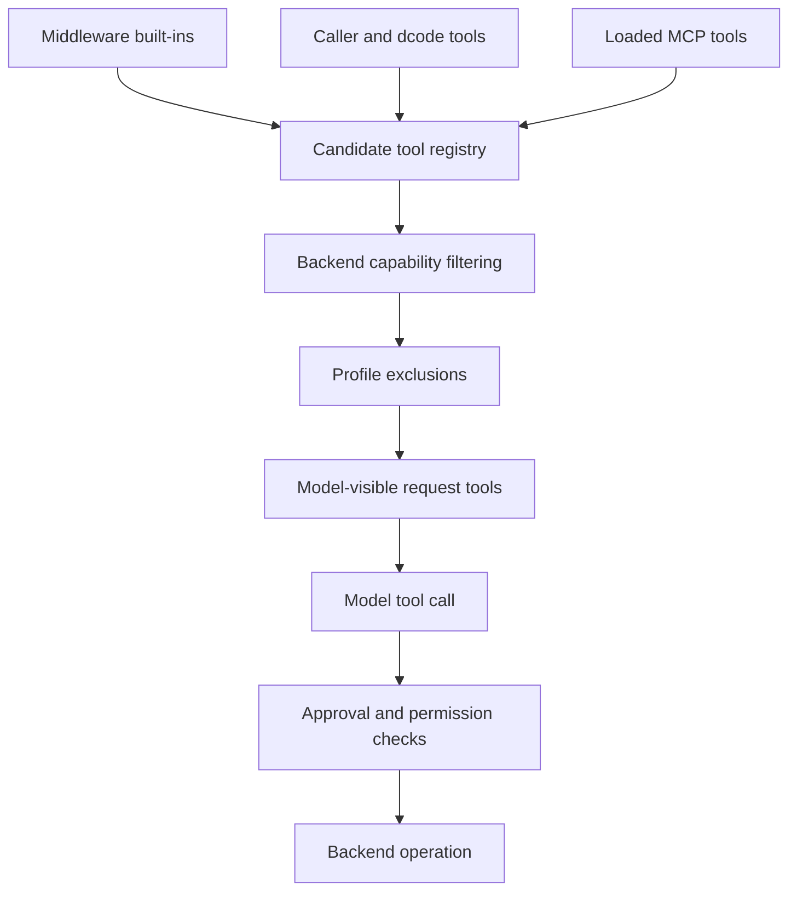

# Tools & Filesystem

A tool being present in an agent is not one decision. This system deliberately separates three concerns:

- **Tool assembly and visibility:** which schemas are bound into the request sent to the model.
- **Backend capability:** which filesystem and shell operations the resolved backend can actually perform.
- **Permission and approval:** whether a particular attempted operation is denied or must wait for a human.

Do not diagnose these as one problem. A missing schema is a composition or visibility issue; a visible tool that returns an error can be a capability, permission, approval, or ordinary backend-operation failure. In particular, a visible tool is not automatically authorized or executable.

This shows the distinct paths from tool assembly to a backend operation.

## Assembly: what the model can see

`create_deep_agent` builds a middleware stack that contributes the built-in filesystem tools, and can also add subagent delegation tools. The caller's `tools=` are passed to the same agent construction; dcode performs a final composition step before that call, replacing conflicting caller tools with extension-owned units and adding extension middleware. Consequently, tool names need a single intended owner in a dcode configuration: an extension with a registered name replaces an explicitly supplied item with that name rather than coexisting with it.

Profiles add two further controls. Description overrides are copied onto dict tools and `BaseTool` instances without mutating caller-owned objects; plain callables are left unchanged. A non-empty `excluded_tools` profile installs `_ToolExclusionMiddleware` at the tail of the middleware stack, after custom middleware, so no earlier custom `wrap_model_call` can restore an excluded name.

`_ToolExclusionMiddleware` has two jobs:

1. It removes matching tools from `request.tools` in synchronous and asynchronous model calls.
2. It also returns `Error: <name> is not available.` at the tool-call boundary if that name is emitted anyway. The underlying executor still has registered tools and dispatches by emitted name, so visibility filtering alone is insufficient for consistency.

This is explicitly a consistency control, not a security boundary. Use permissions and HITL policy for authorization.

### dcode and MCP additions

The dcode runtime supplies its assembled `tools` list to `create_deep_agent`. It can include regular caller tools, dcode-provided tools, extension units, and MCP adapters. MCP discovery reads configured server tools and wraps each as an asynchronous LangChain `StructuredTool` backed by an `MCPSessionManager`; runtime calls acquire the server session and call the original MCP tool name. The wrapper records the MCP origin, server name, and original name in metadata.

When prefixing is enabled, MCP tool names are composed from server and tool names. They are sanitized to provider-safe characters and bounded to 64 characters; names that would change or exceed the limit gain a deterministic SHA-256-derived suffix. This prevents remote tool names from becoming invalid provider tool names while retaining a stable mapping to the original name.

MCP loading is operationally separate from filesystem capability. Discovery is bounded and concurrent, but returned server information follows configuration order and tools are sorted by name. A server that is unauthenticated, disabled, awaiting reconnect, or has an error has no loaded tools and is surfaced with its status rather than silently appearing as an empty successful server. Project-level MCP servers are a trust boundary: untrusted project configuration does not load servers unless the whole configuration is trusted or the server has a matching scoped approval; explicit user denials still win. See [MCP](../integrations/mcp.md).

The `dcode tools list` and `/tools` catalog avoids maintaining another tool list. It compiles the CLI agent with an offline placeholder chat model and reads the bound tool node. It passes the filesystem allowlist through to that compilation; if a filesystem tool forbidden by that allowlist appears anyway, catalog code logs the enforcement failure and returns the unfiltered catalog rather than hiding the evidence.

## Filesystem middleware and backend routing

`FilesystemMiddleware` owns the filesystem tool implementations. It accepts an initialized `BackendProtocol` instance (defaulting to `StateBackend`), rather than a backend factory. The backend is the storage and operation provider; middleware validates input, shapes model-facing `ToolMessage` output, and applies its own permission policy before or after backend calls. The backend protocol defines structured results such as `ReadResult`, `GrepResult`, and `GlobResult`, so partial or truncated results are representable without confusing them with hard errors.

`ReadResult` has strict pagination invariants: `start_line` and `end_line` are paired; pagination fields require a window; the next offset must be the zero-indexed line immediately after the returned end line. Backends return raw content, while middleware applies the line-number gutter and splits very long source lines. A malformed result fails at construction rather than silently causing skipped or incorrectly numbered content.

The fixed filesystem vocabulary is `ls`, `read_file`, `write_file`, `edit_file`, `delete`, `glob`, `grep`, and `execute`.

| Tool | Model-facing role |
| --- | --- |
| `ls` | List directory entries. |
| `read_file` | Read a paginated file window. |
| `write_file` | Create or replace a file. |
| `edit_file` | Make exact string replacements in an existing file. |
| `delete` | Delete a file or directory when the backend supports it. |
| `glob` | Find matching regular files. |
| `grep` | Search literal text in files. |
| `execute` | Run a shell command when the backend supplies sandbox execution. |

### Exposure configuration and capabilities

`FilesystemMiddleware(tools=...)` is a tool-surface allowlist, not a permission policy. `None` and `"all"` enable all filesystem names, while a list constructs only the listed factories. The omitted tools do not reach the dispatchable node. Every explicit list must include `read_file`; otherwise construction raises `ValueError`.

The allowlist is still not a promise of capability. At each synchronous or asynchronous model request, the middleware resolves backend support and removes unsupported capability-gated tools from the request. `execute` is available only with a `SandboxBackendProtocol`; if it is somehow invoked without that capability, it returns an execution-not-available error. The same request pass updates the `grep` and `execute` descriptions to match active facilities and appends composite-backend virtual-to-host route guidance only when execution is active.

`grep` is literal substring search, not regex. Its middleware default cap is `grep_max_count=1000`; callers can override it per call or use `None` to disable the default. At the protocol boundary an asynchronous backend call has a timeout safety net, and the match cap is applied even for older backend implementations that cannot accept `max_count`. `glob` and `grep` may return valid partial results marked truncated, so consumers should narrow a search rather than assume an incomplete result means no matches.

Large non-filesystem tool results can be evicted under the backend artifacts root to preserve model context. Filesystem tools with their own truncation or compact confirmations (`ls`, `glob`, `grep`, `read_file`, `edit_file`, `write_file`, and `delete`) are excluded from that generic eviction path.

## Permissions and approval are not visibility

`FilesystemPermission` is evaluated in filesystem tool implementations rather than by removing their schemas. Rules match an operation and absolute glob path using wcmatch and yield `allow`, `deny`, or `interrupt`. A denied call returns a permission error, and listing/search results are filtered so denied paths are not returned.

Exact-path tools (`read_file`, `write_file`, `edit_file`) are tested against their target path. Bulk tools (`ls`, `glob`, `grep`, `delete`) must trigger when their searched subtree could overlap an anchored protected prefix; a pathless bulk call such as `grep(path=None)` is treated as potentially touching every interrupt-protected path.

The middleware itself enforces denies. Graph assembly translates interrupt-mode filesystem rules into `interrupt_on` entries for `HumanInTheLoopMiddleware`, which owns the pause and approval lifecycle. This separation matters: changing an approval decision does not alter which schemas are visible, and a deny is not an approval prompt. See [Permissions & HITL](permissions-hitl.md).

Permission patterns are validated early: they must start with `/` and cannot include `..` or `~`. Permissions are rejected with execution-capable backends unless all rules are route-scoped, because tool-level enforcement for arbitrary `execute` shell commands is not implemented. Treat that rejection as a security invariant, not a configuration inconvenience.

## Practical troubleshooting

1. **Tool absent from model choices:** inspect the filesystem `tools=` allowlist, the middleware installed into the agent, profile `excluded_tools`, and MCP load/server status. For dcode, also inspect extension name replacement.
2. **`execute` absent:** confirm that the resolved backend implements sandbox execution. Adding it to an allowlist cannot manufacture that capability.
3. **Tool visible but rejected:** distinguish the exclusion-boundary error, a filesystem deny, and a HITL interrupt awaiting approval. They have different owners and fixes.
4. **MCP tool absent:** inspect discovery and trust status before changing the agent's filesystem configuration; MCP availability is not filesystem capability.
5. **Search looks incomplete:** inspect `truncated` and narrow the path or pattern. Do not infer that only the returned matches exist.

## Related pages

- [Backends](backends.md) — backend implementations, routing, and sandbox capability.
- [Middleware catalog](middleware-catalog.md) — middleware responsibilities and ordering.
- [Permissions & HITL](permissions-hitl.md) — approval policy and interrupt handling.
- [MCP](../integrations/mcp.md) — configuration, trust, and authentication for MCP servers.
- [Sandbox partners](../integrations/sandbox-partners.md) — execution-capable backend integrations.
