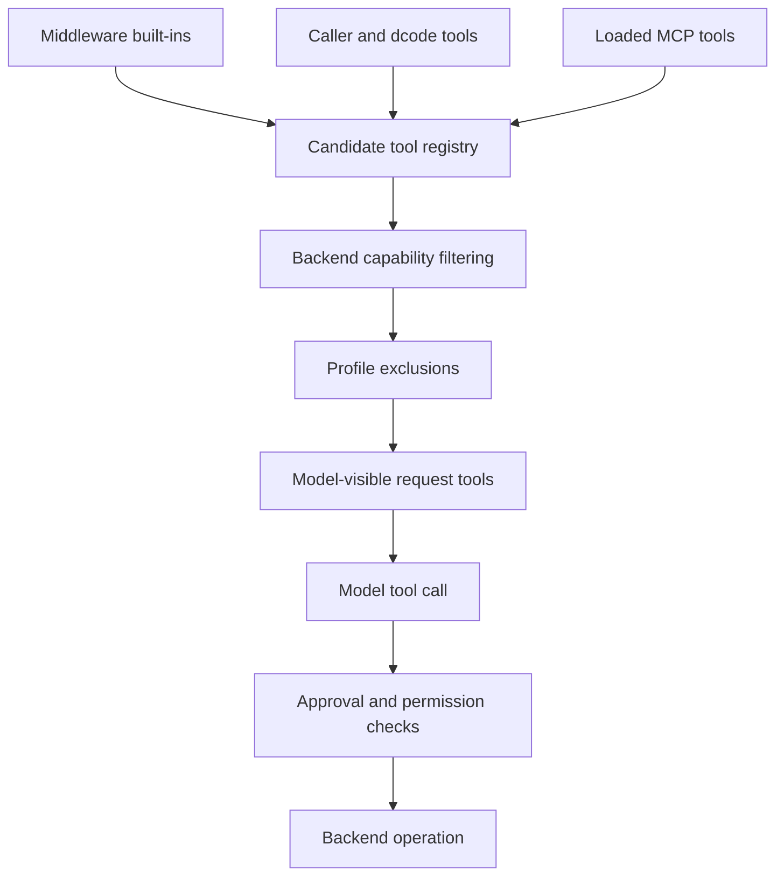

# Tools and Filesystem Semantics

Tool availability is deliberately not a single authorization decision. Deep Agents separates **tool assembly and model visibility**, **backend capability**, and **per-call permission or approval**. Thus a schema can be visible to the model but a call can still be rejected at the tool boundary, denied by filesystem policy, paused for human approval, or fail because the backend cannot perform it.

This diagram distinguishes composition-time visibility from enforcement when a tool is called.

## Assembly, ownership, and visibility

`create_deep_agent` assembles a layered surface: middleware provides built-ins such as filesystem, todo, and delegation tools; caller `tools=` supplies additional tools; the resolved backend removes unsupported operations; and a harness profile can exclude names. In dcode, extension resolution happens before `create_deep_agent`: extension tools replace colliding supplied tools, extension middleware replaces colliding middleware, and an `ExtensionRuntimeMiddleware` is installed. A configured tool name should consequently have one owner.

Profile description overrides do not mutate caller objects: dict tools and `BaseTool` instances are copied before rewriting, while plain callables pass through unchanged. If the resolved profile has `excluded_tools`, graph assembly puts `_ToolExclusionMiddleware` after custom middleware. It strips those names from synchronous and asynchronous model requests and returns `Error: <name> is not available.` if the executor receives one anyway. This second check matters because the executor still has registered tools and dispatches by the emitted name. It keeps the advertised and callable surfaces aligned; it is not an authorization boundary.

`dcode tools list` and `/tools` compile an agent with an offline placeholder chat model and inspect its bound tool node. The catalog therefore reflects the model-facing tool names and descriptions without credentials or a model network call. It passes the filesystem allowlist into compilation. Because filesystem middleware does not instantiate omitted factories, the catalog should be narrow already; its defensive leak path logs the enforcement failure and returns the unfiltered list rather than concealing it.

## Filesystem middleware and backend results

`FilesystemMiddleware` is the model-facing adapter for filesystem tools. It accepts an initialized `BackendProtocol` instance and otherwise creates an ephemeral `StateBackend`; backend factories are rejected. The backend performs storage operations and returns structured outcomes, while middleware validates model inputs, applies policy, formats `ToolMessage` content, and performs context eviction.

The built-in filesystem vocabulary is fixed: `ls`, `read_file`, `write_file`, `edit_file`, `delete`, `glob`, `grep`, and `execute`.

| Tool | Semantics |
| --- | --- |
| `ls` | Lists a directory's entries. |
| `read_file` | Reads a paginated text window or returns supported media as multimodal content. |
| `write_file` | Creates a file or replaces its full content. |
| `edit_file` | Replaces exact text in an existing file. |
| `delete` | Deletes a file or recursively deletes a directory when the backend supports deletion. |
| `glob` | Finds regular files matching the shared glob semantics. |
| `grep` | Searches literal text, optionally constrained by an include glob. |
| `execute` | Runs a shell command only on an execution-capable backend. |

Backends return data rather than model formatting. `ReadResult` rejects inconsistent pagination metadata: window fields occur together; a window is forward and within `total_lines`; and a present `next_offset` resumes immediately after the returned range. The middleware adds line gutters and splits source lines longer than 5,000 characters into continuation rows. `GrepResult` and `GlobResult` may validly contain partial matches with `truncated=True`; this is neither a hard error nor evidence that there are no more results.

### Paths and glob matching

`validate_path` is a virtual-filesystem normalizer. It converts separators, supplies a leading `/`, rejects `..`, leading `~`, and Windows drive paths, and can check an allowed prefix. Filesystem tool implementations turn such invalid model input into error `ToolMessage`s. These checks make file-tool paths predictable; **they do not constrain shell execution**.

The shared matcher used for `glob` and grep include globs supports `*`, `**`, `?`, character classes, and brace expansion. A pattern without `/` matches a basename at any depth; one with `/` is relative to the search root, and a leading `/` anchors there. Dot names require a dot-prefixed pattern segment, and `**` does not descend through dot-directories. Negated `!` patterns are literal, not exclusions. Glob patterns with a `..` segment are rejected centrally, including on backends that otherwise differ in implementation.

### Allowlist and capability lifecycle

`FilesystemMiddleware(tools=...)` is a model-visibility allowlist, not a permission policy. `None` and `"all"` enable all names. A list constructs only the selected factories, so omitted tools never enter the dispatchable node; any list must include `read_file` or construction raises `ValueError`.

Before both synchronous and asynchronous model calls, middleware removes capability-gated tools from the request. `execute` requires `SandboxBackendProtocol`; `delete` requires a concrete delete implementation. A reached-but-unsupported `execute` call returns an execution-not-available error. The same pass adjusts `grep` and `execute` descriptions to tools actually visible and, when execution is active, supplies virtual-to-host path routing guidance.

`grep` is literal substring search, not regex. `grep_max_count` defaults to 1,000 total matches and is overridable by `max_count`; setting the configured cap to `None` disables the default. The protocol's async wrapper limits how long it waits and applies the requested cap even when an older backend cannot accept `max_count`. The `grep` description recommends `rg` through `execute` for real regex only when execute is active.

Large results from tools other than the filesystem set can be evicted beneath the artifacts root, leaving the model a preview and file reference. `ls`, `glob`, `grep`, `read_file`, `edit_file`, `write_file`, and `delete` are excluded because they already truncate, are unsuitable for this eviction path, or provide small confirmations. Oversized human text follows a related request transformation: full content remains in state while the model receives a preview and a filesystem reference.

## Shell execution and route safety

`execute` is a capability, not proof of isolation. `LocalShellBackend` implements `SandboxBackendProtocol` but runs `subprocess.run(..., shell=True)` directly on the host with the current user's permissions. Its `virtual_mode` maps **filesystem tool** paths beneath `root_dir`; it does not restrict a command. Do not treat path validation, virtual mode, a filesystem allowlist, or filesystem permissions as a shell-execution sandbox.

By default the local shell waits 120 seconds and captures at most 100,000 output bytes. It uses `root_dir` as the working directory, combines stdout and stderr, reports the exit code, and identifies truncated output. Middleware additionally rejects a negative timeout and a timeout above its positive `max_execute_timeout`, which defaults to 3,600 seconds; a backend that does not support per-command timeout overrides also returns a tool error. Use an isolated `BaseSandbox`-derived backend for execution outside trusted development, and use HITL as a safeguard for local shell use.

With a `CompositeBackend`, file paths can be virtual routes while `execute` runs on the default backend's shell. Middleware does not rewrite commands. Only routes backed by a `FilesystemBackend` and sharing a `LocalShellBackend` default have host-prefix mappings; remote/sandbox-default and store-backed routes have none and must be accessed through file tools.

## Filesystem policy and human approval

`FilesystemPermission` rules are evaluated within filesystem tool implementations, not by removing their schemas. Rules use wcmatch operation-and-path matching and return the first matching `allow`, `deny`, or `interrupt` mode. A denial becomes a tool error and denied paths are filtered from list/search output.

Exact-path tools (`read_file`, `write_file`, `edit_file`) test their target path. Bulk tools (`ls`, `glob`, `grep`, `delete`) need a conservative overlap check: an interrupt fires when the subtree the call might touch intersects an interrupt rule's anchored prefix. A pathless bulk call such as `grep(path=None)` fires for every relevant interrupt rule; `glob` also accounts for an absolute pattern that may redirect the search root. Graph assembly translates interrupt rules into `HumanInTheLoopMiddleware` predicates. For an exact path, a preceding deny wins, so the call is denied rather than requesting approval.

Permission patterns must begin with `/` and cannot contain `..` or `~`. Combining permissions with an execution-capable backend is rejected unless every permission path is scoped to composite routes: arbitrary `execute` commands have no tool-level filesystem-permission implementation. This is an intentional guard against representing filesystem policy as a shell sandbox.

## MCP as an additional tool source

MCP tools come from configured servers, not the built-in filesystem middleware. dcode adapts each discovered MCP tool through `langchain.mcp.as_langchain_tool`, which owns protocol schema conversion, client invocation, and MCP `isError` handling. dcode requires the adapted result to be an asynchronous `StructuredTool`, wraps its coroutine to normalize arguments, assigns a provider-safe exported name, and records MCP/server/original-name provenance in metadata.

At the MCP call boundary, `normalize_mcp_arguments` removes `""` for non-required string or ambiguous properties so optional identifiers are omitted rather than sent as invalid empty values. Required empty strings and non-string falsy values are preserved. `MCPToolMiddleware` applies the same normalization to marked MCP tools and translates recognized stale OAuth-token failures into an error `ToolMessage` with actionable reauthentication guidance; unrelated exceptions continue to propagate.

Exported MCP names are based on server and original tool names. They are sanitized, bounded to 64 characters, and receive a deterministic SHA-256-derived suffix whenever sanitization or truncation changes the raw name. A second uniqueness pass allocates numeric suffixes deterministically if exported identities collide. Server `allowedTools` or `disabledTools` can use literal names or fnmatch-style patterns and match original, bare, or prefixed forms; unmatched entries warn rather than aborting startup.

Discovery preflights and connects servers concurrently with a bounded fan-out. Per-server configuration, setup, connection, and tool-construction failures are isolated into `MCPServerInfo` status rather than hiding healthy servers. Returned server information follows configuration order and the combined tool list is name-sorted. MCP server status is explicit: an `ok` entry has tools and no error; non-`ok` entries have an error and no tools. Failed configurations using environment interpolation redact failure details so resolved secrets are not echoed. Stateless MCP tools instead reload a single authorized original tool and clean up its session manager for each invocation; stateful loads return or adopt a manager that owns live connections.

## Focused tests and troubleshooting

State-backend integration tests verify that parallel `write_file` calls merge updates and that traversal errors become `ToolMessage` failures. Concurrent `edit_file` calls on the same file are deliberately `xfail`: reducers and backends can race, including outside StateBackend. Avoid issuing such edits in parallel until serialization or rejection is implemented. Filesystem-backend tests additionally exercise virtual-root mapping, traversal rejection, dotfile glob rules, literal search characters, and read pagination/error behavior. MCP tests exercise empty-string normalization and real in-memory FastMCP client/session/schema paths.

When diagnosing a tool issue, locate its layer:

1. **Absent from model choices:** inspect filesystem `tools=`, middleware assembly, profile exclusion, extension collisions, and MCP server status/filtering.
2. **`execute` or `delete` absent:** inspect backend capability; an allowlist cannot create an implementation.
3. **Visible but rejected or paused:** distinguish exclusion, backend error, filesystem denial, and HITL interruption.
4. **Search seems incomplete:** inspect `truncated` and `truncation_reason`, then narrow the query where appropriate.
5. **A shell cannot see a file-tool path:** inspect composite route mapping; use file tools for routes without a host mapping.

## Related pages

- [Backends](backends.md) — backend implementations, routing, and execution capability.
- [Context management](context-management.md) — message and tool-result context handling.
- [Permissions and HITL](permissions-hitl.md) — approval policy and interrupts.
- [MCP integration](../integrations/mcp.md) — MCP configuration and operational controls.
- [Security](../operations/security.md) — deployment and execution-risk guidance.
