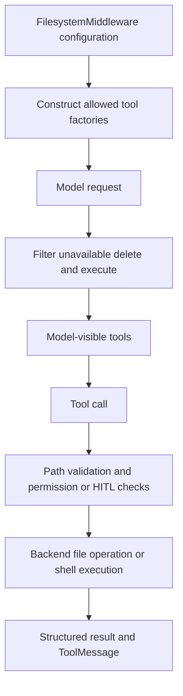
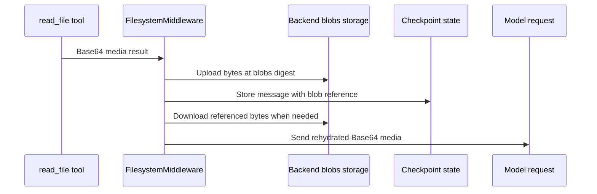

# Filesystem and Execution Tools

`FilesystemMiddleware` is the model-facing adapter for an initialized `BackendProtocol`. It constructs file tools, validates inputs and backend results, formats model-facing messages, and manages oversized or binary content. The backend owns storage and implements the operations; a filesystem tool name is neither a guarantee that the backend supports it nor an authorization decision. For backend implementations and routing, see [Backends](backends.md); for approvals and path policy, see [Permissions & HITL](permissions-hitl.md).

## Tool surface and backend contract

The built-in vocabulary is `ls`, `read_file`, `write_file`, `edit_file`, `delete`, `glob`, `grep`, and `execute`. `tools=None` and `tools="all"` expose the full filesystem suite; an explicit list constructs only those named tool factories and must include `read_file`. This is a model-visibility allowlist, not a security policy.

At each model request the middleware removes `delete` and `execute` if the resolved backend lacks the corresponding capability. `delete` is optional on `BackendProtocol`; `execute` requires `SandboxBackendProtocol` support (for a composite, its default backend). Thus an allowlist cannot manufacture an implementation. The middleware also adjusts `grep` and `execute` descriptions for the visible set and appends composite host-path guidance only when execution is active.

```mermaid
flowchart TD
    Config["FilesystemMiddleware configuration"] --> Factories["Construct allowed tool factories"]
    Factories --> Request["Model request"]
    Request --> Capability["Filter unavailable delete and execute"]
    Capability --> Model["Model-visible tools"]
    Model --> Call["Tool call"]
    Call --> Policy["Path validation and permission or HITL checks"]
    Policy --> Backend["Backend file operation or shell execution"]
    Backend --> Result["Structured result and ToolMessage"]
```

This flow separates construction-time visibility, request-time capability filtering, per-call controls, and backend execution.

`BackendProtocol` returns structured results rather than model-formatted strings. `ReadResult` validates pagination invariants: a line window must be complete and forward, `total_lines` must cover it, and `next_offset` must be the first unshown line. Backends tolerate negative offsets and non-positive read limits; the latter represents an uninspected empty window. Middleware adds line-number gutters and splits exceptionally long lines into continuation rows. `GrepResult` and `GlobResult` may be successful but incomplete (`truncated=True`), so partial matches are not proof that no further match exists.

`grep` matches literal text, not regular expressions. Its default total cap is 1,000 matches, a positive call-level `max_count` can override it, and `None` disables the default cap. The async protocol wrapper bounds how long the caller waits and enforces the cap even for older concrete backends that cannot accept `max_count` themselves.

### Initialization and state

With no backend, the middleware uses `StateBackend()`. Backend factories are rejected: pass an initialized instance, including an initialized callable backend if applicable. It recursively detects state-backed branches of a composite and adds the `files` state channel when any route uses `StateBackend`; otherwise it uses the base state schema.

The `files` channel is a delta-reduced mapping: writes for distinct paths in the same step merge, while a `None` update removes a path. The channel snapshots periodically to bound read depth. Before dispatching a tool batch, the middleware rejects a later `write_file`, `edit_file`, or `delete` call that normalizes to the same path as an earlier mutation in that assistant response. This prevents two parallel calls from independently modifying one logical file.

## File behavior and execution boundary

`read_file` renders text as a paginated, line-numbered result. For base64 declared by the backend, it instead produces multimodal content: a recognized extension determines `image`, `audio`, `video`, or `file`; unknown binary content is a generic file. Binary payloads are never line-numbered, and the result records the validated source path and MIME type.

Video is a special binary path: when video dependencies are available, `read_file` samples frames into a synthetic `HumanMessage` while the tool result explains the sampled window. The middleware moves those synthetic media messages after the complete `ToolMessage` batch for the preceding AI tool-call message, preserving provider ordering requirements.

`execute` is deliberately more than another file operation. It calls an execution-capable backend, refuses a per-command timeout above `max_execute_timeout` (default 3,600 seconds), and returns the command exit code in `ToolMessage.artifact`. A command that ran is a successful tool invocation even when its exit code is nonzero; consumers must inspect the artifact to recognize command failure. Filesystem path mapping does not rewrite shell commands.

A `LocalShellBackend` is execution-capable but is not a sandbox: it runs host commands with the current user's permissions. Likewise, a composite routes filesystem paths by prefix but sends `execute` to its default backend. Do not treat virtual paths, a tool allowlist, or filesystem permissions as shell confinement; use an isolated sandbox for untrusted execution. See [Sandbox partners](../integrations/sandbox-partners.md).

## Permissions and compatibility recovery

Filesystem permissions are applied inside tool implementations, not by hiding schemas. Paths are canonicalized before matching; invalid traversal and malformed permission patterns are rejected. Rules match operations and canonical paths in declaration order with `allow`, `deny`, or `interrupt` outcomes. Bulk tools conservatively interrupt when their search subtree could overlap an interrupt rule; denied entries can be filtered from list and search results. Graph construction converts interrupt rules to human-in-the-loop predicates. Because a path rule cannot constrain arbitrary shell syntax, unscoped filesystem permissions are rejected for execution-capable backends.

`UnsupportedContentMiddleware` runs last in the `create_deep_agent` middleware stack. On every request it consults the active request model's profile and replaces only blocks the model explicitly cannot accept with a placeholder that identifies the original `read_file` path. It copies request messages rather than mutating persisted history, so a later compatible model can receive the original media. Inline non-PDF base64 documents have a stricter OpenAI Responses API compatibility path.

If a provider still raises `ModelInvalidRequestError`, filesystem middleware retries once only when the latest tool turn contains multimodal `read_file` material. It replaces those latest read results with an unsupported-content notice and leaves unrelated invalid model requests to raise normally.

## Text eviction and binary blob lifecycle

Large text and binary media use different storage strategies.

- **Text eviction:** Before a model call, an oversized human message can be written under the backend's `conversation_history` artifact prefix and replaced for the request with a preview and file reference; state retains the original content. Oversized ordinary tool results can similarly be written under `large_tool_results`, with a line-numbered head-and-tail preview. Filesystem-tool results are excluded from this generic result eviction because they already return paginated or compact responses. If an artifact write fails, the original message stays intact.
- **Binary offload:** `offload_binary_content=True` moves valid inline base64 payloads from `read_file` results and inline human media into content-addressed files under `blobs/` below the artifacts root. State stores a block with `deepagents_blob` and the SHA-256 digest rather than the base64 data; therefore checkpoints do not carry the binary bytes.

```mermaid
sequenceDiagram
    participant Tool as read_file tool
    participant MW as FilesystemMiddleware
    participant Store as Backend blobs storage
    participant State as Checkpoint state
    participant Model as Model request
    Tool->>MW: Base64 media result
    MW->>Store: Upload bytes at blobs digest
    MW->>State: Store message with blob reference
    MW->>Store: Download referenced bytes when needed
    MW->>Model: Send rehydrated Base64 media
```

The binary offload lifecycle: persisted messages retain a digest reference, while the request is rehydrated immediately before it reaches the model.

Offload is best effort. It considers only valid base64 blocks and deduplicates identical payloads by digest. Failed uploads leave content inline. On rehydration, an in-run private, untracked payload cache avoids repeated downloads; otherwise the backend batch download is used. Each downloaded byte sequence is hashed before use because blobs are on an agent-writable filesystem. Missing, malformed, failed, or hash-mismatched blobs become a text notice asking the model to re-read the file rather than injecting untrusted or stale bytes.

Human media entered after the last AI message is offloaded at the next model call. The resulting replacement updates state, while the initial input write remains present in checkpoint history. Offload is automatically disabled with a warning if the `blobs/` route resolves to `StateBackend`, since that would retain the bytes in checkpointed state and defeat the purpose.

## Operational guidance and focused tests

Configure token limits only as context-management controls; they are not retention or access controls. Keep `read_file` in any tool allowlist, inspect backend capability when `delete` or `execute` is absent, and treat `truncated` search output as incomplete. For binary offload, select a backend whose blob route persists outside checkpoint state and supports batch upload/download.

Focused tests cover the important failure boundaries: middleware initialization verifies the state schema selected for state and composite backends, rejects factories, and permits tool-description overrides. Blob tests verify that only `read_file` results are offloaded, command-result media is traversed, uploads that fail leave media inline, and tampered or malformed references degrade to a text notice. Local sandbox operation tests exercise raw reads, pagination, permissions, exact and replace-all edits, and CRLF-aware edits that preserve the source line-ending style.

## Related pages

- [Backends](backends.md) — storage, routing, and execution-capable implementations.
- [Middleware catalog](middleware-catalog.md) — composition and request/tool wrappers.
- [Permissions & HITL](permissions-hitl.md) — policy and approval configuration.
- [Sandbox partners](../integrations/sandbox-partners.md) — isolated execution integrations.
- [Build a Deep Agent](../workflows/build-a-deep-agent.md) — agent assembly and configuration.
