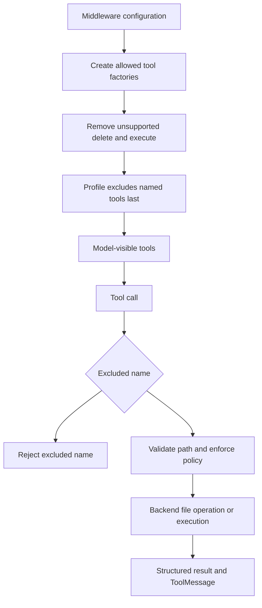
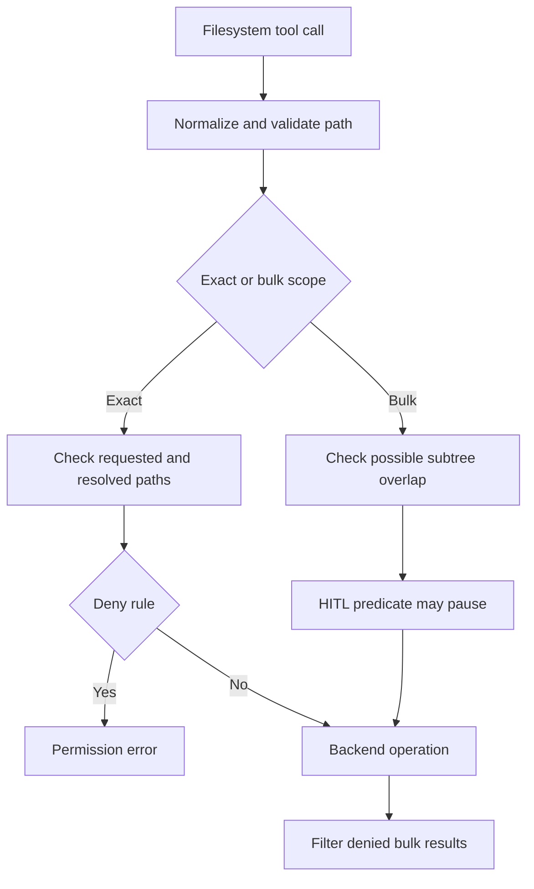
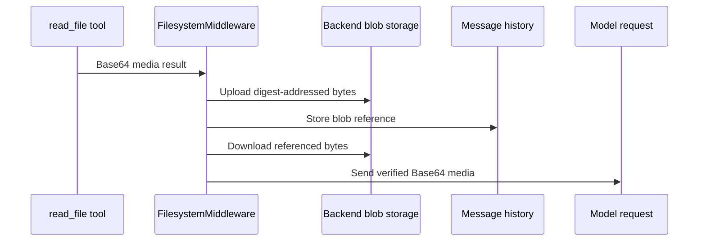

# Tool Surface and Filesystem Policy

`FilesystemMiddleware` is the model-facing adapter over an initialized `BackendProtocol`: it creates tools, validates and formats their results, applies middleware-owned filesystem policy, and manages large or binary message content. The backend owns storage and operation implementation. A visible tool is not a guarantee that the backend implements it, and neither a tool allowlist nor a profile exclusion is an authorization boundary. See [Backends](backends.md) for storage and routing, and [Permissions & HITL](permissions-hitl.md) for approval configuration.

## Tool surface and request boundary

The built-in vocabulary is `ls`, `read_file`, `write_file`, `edit_file`, `delete`, `glob`, `grep`, and `execute`. `tools=None` and `tools="all"` build all of them; an explicit list must include `read_file`, and tools absent from that list are not registered with the dispatchable tool node. At model-request time, filesystem middleware removes `delete` when the backend does not implement the optional operation and removes `execute` unless the backend is execution capable. It also adjusts the `grep` and `execute` descriptions to the remaining visible tools.

A harness profile's `excluded_tools` is a later, independent model-surface control. Graph construction appends `_ToolExclusionMiddleware` after profile and caller middleware so it removes named tools after all injection has happened; it also rejects a model call that still names an excluded tool. This makes the advertised and executable surfaces agree for that agent/profile, but it is explicitly not a security control. It is distinct from an absent construction-time tool, capability filtering, a filesystem permission denial, and a HITL interruption.

```mermaid
flowchart TD
    Config["Middleware configuration"] --> Factories["Create allowed tool factories"]
    Factories --> Capability["Remove unsupported delete and execute"]
    Capability --> Exclusion["Profile excludes named tools last"]
    Exclusion --> Model["Model-visible tools"]
    Model --> Call["Tool call"]
    Call --> Check{"Excluded name"}
    Check --> Reject["Reject excluded name"]
    Check --> Guard["Validate path and enforce policy"]
    Guard --> Backend["Backend file operation or execution"]
    Backend --> Result["Structured result and ToolMessage"]
```

This flow separates construction-time registration, request-time capability and profile filtering, tool-call exclusion rejection, per-call policy, and backend behavior.

`BackendProtocol` returns structured results rather than presentation strings. `ReadResult` rejects incoherent pagination metadata; the middleware owns line-number formatting and long-line continuation rows. `grep` and `glob` can be successful yet incomplete, so `truncated=True` means absence from returned matches is not proof of absence from storage. The agent-facing `grep` is literal, not regex; its configured default total cap is 1,000 matches, and a positive per-call `max_count` can override it. Set `grep_max_count=None` when constructing the middleware to disable the default cap.

## Composite routes are a path namespace, not a shell namespace

`CompositeBackend` chooses the longest matching route prefix for a file path. It strips that prefix before delegating to the routed backend and restores it on path-bearing results, while unmatched paths go to the default backend. A listing of `/` combines the default root with synthetic route directories. This lets one model-visible tree span state, persistent, local, or remote backends without exposing each backend's internal root.

Search has deliberate cross-route semantics. With `path` omitted or `/`, `grep` searches the default and routes under one global match budget, remapping route result paths; if an earlier backend fills the budget, later routes are skipped and the result is conservatively marked truncated. `glob` also merges and remaps results, but rewrites a route-targeting anchored pattern relative to that route, forwards a bare pattern into every route, and skips routes for a root-anchored pattern that cannot match beneath their prefix. An error from any searched backend is surfaced rather than represented as a successful partial glob. These details matter when interpreting an empty or truncated search result.

File operations route individually, but `execute` does not: a composite always delegates execution to its default backend. Consequently, a route prefix is a file-tool addressing mechanism, not evidence that the default shell can access the same path.

## Direct filesystem access and permission policy

`FilesystemBackend` reads and writes the host filesystem directly. Its default `virtual_mode=True` treats `root_dir` (or the process working directory) as a virtual root: `/x` maps below that root, relative inputs are normalized into that virtual namespace, and traversal through `..` or `~` is refused. Resolved paths must remain under the root; agent-visible paths use virtual absolute form and do not reveal the host root. `virtual_mode` provides stable path semantics—especially when `CompositeBackend` strips a route prefix before forwarding a path—but is not a sandbox or process-isolation boundary. With `virtual_mode=False`, absolute paths are used as-is and relative paths can escape `root_dir`.

`FilesystemPermission` rules classify operations as `read` or `write` and have `allow`, `deny`, or `interrupt` mode. Patterns must be absolute and may not contain `..` or `~`. For ordinary exact operations, declaration order is significant: the first matching rule decides. Middleware checks both the requested normalized path and, for `FilesystemBackend` including routed composites, its symlink-resolved target; an unresolved target is refused when rules are configured. List and search results filter denied entries, including aliases that resolve to denied targets.

`interrupt` is not enforced inside a filesystem tool. During `create_deep_agent` assembly, `_fs_interrupt` turns interrupt rules into `HumanInTheLoopMiddleware` predicates. Exact tools (`read_file`, `write_file`, `edit_file`) prompt only for matching paths unless a matching deny wins. Bulk tools (`ls`, `glob`, `grep`, and `delete`) prompt if their target subtree could overlap an interrupt rule; an omitted path or current-directory alias is treated as root. The glob predicate also examines absolute patterns and conservatively prompts for relative patterns containing `..`, preventing a benign `path` argument from bypassing a protected target.

```mermaid
flowchart TD
    Call["Filesystem tool call"] --> Validate["Normalize and validate path"]
    Validate --> Scope{"Exact or bulk scope"}
    Scope -->|Exact| Match["Check requested and resolved paths"]
    Scope -->|Bulk| Overlap["Check possible subtree overlap"]
    Overlap --> Interrupt["HITL predicate may pause"]
    Match --> Deny{"Deny rule"}
    Deny -->|Yes| Refuse["Permission error"]
    Deny -->|No| Operation["Backend operation"]
    Interrupt --> Operation
    Operation --> Filter["Filter denied bulk results"]
```

This policy flow shows the boundary: graph assembly owns approval predicates, while filesystem middleware denies calls and filters results. A recursive or ambiguous delete is stricter: it fails closed if a deny-write pattern could overlap its subtree, while a confirmed leaf uses the normal first-match rule.

## Execution is a separate trust boundary

`execute` requires `SandboxBackendProtocol`; for a composite, only the default backend supplies execution. The middleware validates a supplied timeout against its positive `max_execute_timeout` setting (default 3,600 seconds) and whether the backend accepts per-command overrides. A command invocation that completes gets a successful tool message and an exit-code artifact even if the command exits nonzero; callers must inspect that exit code. Capture-capable sandbox execution can write oversized command output at the source; otherwise generic message eviction applies.

Filesystem permission patterns do not parse or constrain command syntax. Therefore, middleware rejects permissions combined with an execution-capable backend unless every permission pattern is scoped beneath a `CompositeBackend` route; that exception separates governed file-tool routes from the default executor but does not authorize or confine shell commands. A `LocalShellBackend` runs `shell=True` on the host as the current user, with no isolation, and its virtual paths restrict only inherited file operations—not commands. Use an isolated sandbox and HITL for untrusted work.

When execution is active, middleware adds route-to-host mapping guidance only for composite routes that share a local `LocalShellBackend` filesystem. Remote, sandbox, and store-backed routes have no shell mapping and must be accessed through file tools. It does not rewrite commands.

## Read media and content lifecycle

For text, `read_file` produces a paginated line-numbered result. For backend-declared base64, it emits a multimodal block selected from the extension (`image`, `audio`, `video`, or generic `file`) rather than line-numbered text, retaining the validated source path and MIME type in metadata. Video decoding, when optional dependencies are available, samples frames into a synthetic `HumanMessage`; middleware moves that message after the entire preceding `ToolMessage` batch to satisfy provider ordering.

`UnsupportedContentMiddleware`, placed after the core, memory, and HITL stack before later profile/caller stack shaping, copies model-request messages and replaces only blocks the active model explicitly cannot accept with a `read_file` path placeholder. Persisted message history remains unchanged. As a fallback, filesystem middleware retries once after a `ModelInvalidRequestError` only when the latest tool turn contains multimodal `read_file` material; it replaces that material with an unsupported-content notice and re-raises unrelated request errors.

Large text and binary payloads have separate lifecycles:

- **Text eviction:** oversized human text and ordinary tool text are written under backend artifact paths with a preview for the model request. Filesystem tools are excluded from generic tool-result eviction because their output is already paginated, bounded, or compact. An artifact-write failure leaves the original content intact.
- **Binary offload:** with `offload_binary_content=True`, valid inline base64 from `read_file` results and eligible human media are SHA-256-addressed under `blobs/`; history stores a reference instead of bytes, and the model request receives rehydrated media. Offload is disabled with a warning if the blob path routes to `StateBackend`, because that would preserve bytes in checkpoint state.

```mermaid
sequenceDiagram
    participant Tool as read_file tool
    participant MW as FilesystemMiddleware
    participant Store as Backend blob storage
    participant History as Message history
    participant Model as Model request
    Tool->>MW: Base64 media result
    MW->>Store: Upload digest-addressed bytes
    MW->>History: Store blob reference
    MW->>Store: Download referenced bytes
    MW->>Model: Send verified Base64 media
```

The binary lifecycle stores references in history but restores verified payloads only for a model request. Binary offload is best effort: failed uploads keep inline content. Rehydration uses an in-run untracked cache when possible and verifies every downloaded payload against its digest because blobs are agent-writable. Missing, malformed, failed, or digest-mismatched references become a text notice rather than untrusted media.

## Operational guidance

Keep `read_file` in explicit tool lists, and treat missing `delete` or `execute` as a backend capability issue rather than an allowlist issue. Use a harness profile exclusion to suppress a tool for a particular agent surface, not to authorize storage or isolate execution. Treat composite search truncation as incomplete output and do not assume file-tool route paths are shell paths. Configure binary offload only when the blob route supports upload/download outside checkpoint state. For direct host backends, keep virtual mode enabled unless trusted local workflows explicitly need host paths; do not mistake it for sandboxing.

When changing this area, exercise the focused behavior rather than only tool registration: virtual-root containment and symlink resolution; composite routing and merged search errors/truncation; request-time capability filtering and excluded-call rejection; permission first-match, recursive-delete, and bulk HITL cases; execution timeout/exit-code behavior; and offload upload, digest verification, and state-backed-route disablement.

## Related pages

- [Backends](backends.md) — storage, routing, and execution-capable implementations.
- [Middleware catalog](middleware-catalog.md) — composition and request/tool wrappers.
- [Permissions & HITL](permissions-hitl.md) — policy and approval configuration.
- [Sandbox partners](../integrations/sandbox-partners.md) — isolated execution integrations.
- [Security](../operations/security.md) — operational threat model and safeguards.
