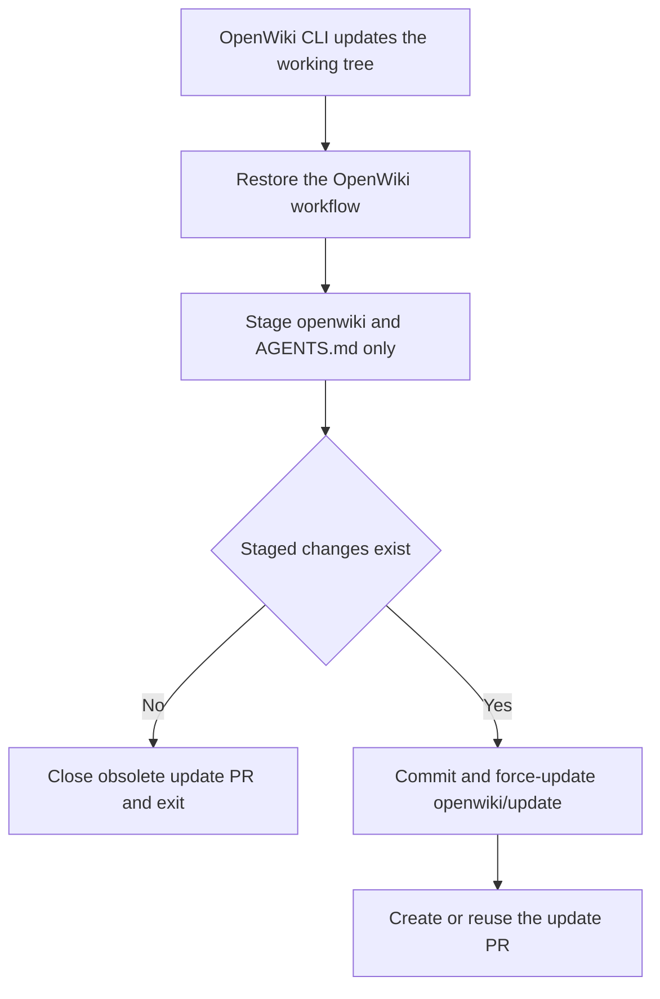

# Development operations, testing, integrations, and source map

This is the operational companion to [Runtime and package architecture](../architecture/overview.md). It gives engineers a package-local development loop, maps integration boundaries, and points to the CI/release workflows that validate changes.

## Standard development loop

Use `uv` for environments and dependency operations. Each package owns its interpreter constraints, lockfile, Makefile, tests, and release version; do not create an assumed global environment or operate from a root project file.

```bash
cd libs/<affected-package>
uv sync --all-groups
make test
make lint
```

Common targets (confirm with `make help` in the actual package):

| Command | Purpose |
| --- | --- |
| `make test` | Unit tests, generally with network/socket restrictions. |
| `make test TEST_FILE=tests/unit_tests/test_foo.py` | Targeted test file. |
| `make integration_test` | Integration tests; network is permitted. |
| `make lint` | Ruff checks plus Ty type checking. |
| `make format` | Formatting and safe Ruff fixes. |
| `make type` | Type checking only. |
| `make coverage` | Package-specific coverage output where supported. |

From `libs/`, use fan-out commands such as `make lint`, `make format`, and `make lock-check`. Pre-commit hooks perform formatting/lint/lockfile and Conventional Commit checks for changed packages. Repository conventions in `AGENTS.md` require scoped Conventional Commit titles, unit coverage for feature/fix work, stable public interfaces, and approved issue/discussion context for external PRs.

## Test selection by change area

| Change area | Start with | Then consider |
| --- | --- | --- |
| Core SDK middleware/backends/profiles | `libs/deepagents/tests/unit_tests/` and `libs/deepagents/Makefile` | Integration tests for networked backend/provider behavior; preserve public export/signature compatibility. |
| Deep Agents Code UI/server/approval/MCP | `libs/code/tests/unit_tests/`; `make check` is the full local package suite | `tests/integration_tests/test_auto_approve_remote.py` for remote approval behavior; read [Deep Agents Code](../workflows/deep-agents-code.md) for fail-closed requirements. |
| ACP adapter | `libs/acp/tests/` and its Makefile | ACP event/HITL/model-selection behavior; free-form interrupts and audio have known adapter limitations. |
| Deployment CLI | `libs/cli/tests/unit_tests/`, particularly deploy coverage | Networked integration tests require the documented LangSmith setup. |
| Evals, reporter, Harbor scripts | `libs/evals/tests/unit_tests/`; `make lint` verifies catalog generation | Targeted live model/evaluation only when credentials/cost are intended; see [Evaluation and release](../workflows/evaluation-and-release.md). |
| GitHub Action | `.github/scripts/test_github_action.py` plus action/workflow tests | Treat `response` as raw unfiltered output and avoid exposing it downstream. |

Do not read or expose `.env` files; sample `.env.example` files can explain configuration shape, but credentials should only be supplied through the documented environment/secret mechanisms.

## Integration map

- **LangChain / LangGraph:** the SDK depends on LangChain’s agent builder and LangGraph persistence/execution. Changes to SDK graph construction propagate into Deep Agents Code and ACP consumers. See [Runtime and package architecture](../architecture/overview.md).
- **LangSmith:** SDK tracing/sandboxes, managed deployment CLI interactions, real evaluations, and Harbor runs all integrate with LangSmith in different ways. Evaluation tracing requires LangSmith credentials; do not conflate it with offline unit testing.
- **MCP:** `libs/code` supports stdio/HTTP/SSE servers and project/user configuration precedence. Project config is treated as a trust boundary; use its explicit trust flow rather than bypassing it. Details are in [Deep Agents Code](../workflows/deep-agents-code.md).
- **ACP:** `libs/acp` converts compiled graph events to Agent Client Protocol for editor integration. It supports selected HITL interactions but not arbitrary free-form LangGraph interrupts.
- **Managed deployments:** `libs/cli` handles project init/deploy, agent operations, and MCP server registration. The inspected parser/README does not show the interactive dcode runtime here; route terminal-agent questions to `libs/code`.
- **GitHub Action:** root `action.yml` invokes dcode non-interactively, forwarding model, allowed shell commands, timeout, memory, MCP, sandbox, and other headless options. `ACTION.md` documents inputs/outputs and warns that output is raw.

## CI and release runbook

`.github/workflows/ci.yml` performs changed-package detection and reusable lint/unit-test calls on PRs, merge groups, and main. The reusable workflows set `UV_FROZEN=true` and check that tests did not dirty the worktree. CI includes controls beyond unit tests: commit/PR lint, lockfile freshness, version/extras consistency, dependency release checks, and SDK pins.

Release automation is intentionally package-scoped: release-please prepares conventional package releases from main; `release.yml` builds and validates a specific package/release SHA, checks wheels, publishes via trusted publishing, and creates the GitHub release/tag. For release semantics and the important distinction between unit and live evaluations, follow [Evaluation and release](../workflows/evaluation-and-release.md).

## Generated OpenWiki maintenance

Consult this section when changing the scheduled documentation job, its credentials/environment, the paths it may publish, or the OpenWiki maintainer guidance in `AGENTS.md`. This is repository automation, not part of an agent runtime: it refreshes the navigational material linked from [Quickstart](../quickstart.md), while the source and tests described in [Runtime and package architecture](../architecture/overview.md) remain the evidence authority.

`.github/workflows/openwiki-update.yml` defines one `update` job. It is manually dispatchable and scheduled for `08:00` UTC daily. The job runs in the dedicated `openwiki` GitHub environment, checks out the repository, sets up Node.js 26, installs `openwiki@0.3.3`, and executes `openwiki code --update --print`. Tracing is explicitly disabled so the job does not attempt unconfigured LangSmith trace uploads; credentials are supplied through GitHub configuration rather than documentation or checked-in files.

The publish phase is the critical lifecycle boundary:



This flow shows how the workflow constrains the generated-commit surface and handles an empty update.

Restoring the workflow before staging means a generated run cannot publish a modification to the workflow that launched it. The staging allowlist limits its commit surface to generated wiki material and the bounded OpenWiki block in `AGENTS.md`; do not broaden it casually. The script uses a fixed update-branch name and force-pushes that branch, so it is intentionally a single replaceable documentation PR rather than a history-preserving collaboration branch.

### Change and validation guidance

- Keep the job-level `environment: openwiki`; `.github/scripts/tests/workflows/test_workflow_secret_scoping.py::test_openwiki_uses_dedicated_environment` parses the YAML and asserts that boundary.
- If changing the update command, runtime version, staging logic, or PR lifecycle, review the entire shell step for the restore → stage → empty-diff → publish ordering. A green CLI invocation alone does not prove the generated-commit boundary.
- The narrow source-backed check is:

  ```bash
  uv run --directory libs/deepagents --group test pytest -q .github/scripts/tests/workflows/test_workflow_secret_scoping.py
  ```

  Run broader workflow/package checks only when a change also touches their assertions or a package runtime. Do not run the scheduled workflow merely to validate documentation prose, and never place credentials in the wiki or test output.

## Source map: where to begin

```text
Product intent/security                  README.md
Contributor rules / compatibility        AGENTS.md
Monorepo setup / common commands         libs/DEVELOPMENT.md
SDK layering / maintainer architecture   libs/ARCHITECTURE.md
Core graph assembly                      libs/deepagents/deepagents/graph.py
Core extensions                          libs/deepagents/deepagents/{middleware,backends,profiles}/
Terminal agent entry/server/assembly     libs/code/deepagents_code/{main,server_graph,agent}.py
Approval / Auto / MCP policy             libs/code/deepagents_code/{approval_mode,auto_mode,mcp_tools}.py
Managed deployment CLI                   libs/cli/deepagents_cli/main.py and deploy/
ACP adapter                              libs/acp/deepagents_acp/server.py
Evals and catalogs                       libs/evals/{README.md,EVAL_CATALOG.md,UNIFIED_EVALS.md}
Harbor prep and aggregation              .github/scripts/evals/{unified_prep,aggregate_unified}.py
CI / reusable Harbor / release           .github/workflows/{ci,_harbor_run,unified_evals,release,release-please}.yml
Generated OpenWiki update                .github/workflows/openwiki-update.yml
Workflow secret-scope guard              .github/scripts/tests/workflows/test_workflow_secret_scoping.py
```

When unsure where a behavior belongs, follow the runtime relationship first: core graph assembly → package-specific adapter/consumer → tests → CI workflow. That approach avoids placing a policy in the UI when it must be enforced in middleware or sandbox/backend code.
