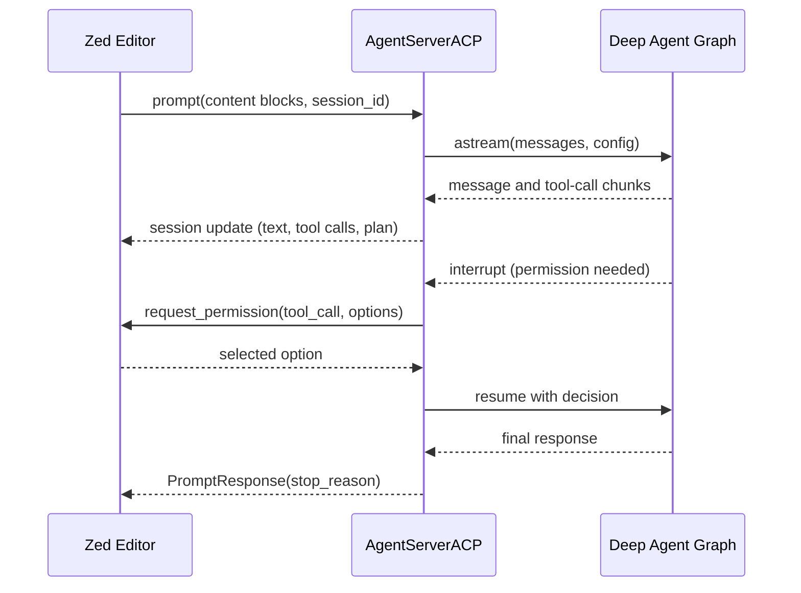

# ACP (Agent Client Protocol) Integration

The [Agent Client Protocol (ACP)](https://agentclientprotocol.com/overview/introduction)
lets an editor such as [Zed](https://zed.dev/) talk to an external agent process
over stdio. The `deepagents-acp` package (in `libs/acp`) is the connector that
turns a Python [Deep Agent](https://docs.langchain.com/oss/python/deepagents/overview)
into an ACP server, so you can drive the agent from the editor's agent panel
instead of a terminal.

There are two ways to run a Deep Agent in an ACP editor:

1. **A custom / bare Deep Agent** — wrap your own `create_deep_agent(...)` graph
   with `AgentServerACP` and launch it as an ACP server.
2. **The prebuilt `dcode` coding agent** — run `dcode --acp` to expose the full
   Deep Agents Code agent (filesystem tools, shell, MCP, subagents) as an ACP
   server with no custom code.

For the agent that `dcode --acp` exposes, see
[Code Agent architecture](/openwiki/architecture/code-agent.md). For MCP tool
wiring that the ACP server forwards, see [MCP integration](/openwiki/integrations/mcp.md).
To build the kind of Deep Agent you would wrap in path 1, see
[Build a Deep Agent](/openwiki/workflows/build-a-deep-agent.md).

## Environment and configuration

The bare-agent quickstart uses Anthropic's Claude models. Copy
`libs/acp/.env.example` to `.env` and set `ANTHROPIC_API_KEY`; the same file
carries optional LangSmith tracing variables (`LANGSMITH_TRACING`,
`LANGSMITH_API_KEY`, `LANGSMITH_PROJECT`), all commented out by default.

Zed launches the agent by running a command declared in its `settings.json`
under `agent_servers`. The bare example points at `run_demo_agent.sh`, a wrapper
that runs `examples/demo_agent.py` with the project's own dependencies while
preserving the editor's current working directory.

For `dcode --acp`, provider API keys are read from the environment exactly as in
the terminal (e.g. `ANTHROPIC_API_KEY`), and the model is selected with
`--model` in `provider:model-name` form.

## The ACP server (`AgentServerACP`)

`AgentServerACP` subclasses the ACP `Agent` interface and is the bridge between
the protocol and a LangGraph Deep Agent. It is constructed with either a
compiled `CompiledStateGraph` or a factory `Callable[[AgentSessionContext], ...]`
that builds a graph per session; `modes` and `models` may only be supplied when a
factory is used, and passing them with a compiled graph raises `ValueError`.

Its ACP responsibilities include:

- **`initialize`** advertises capabilities to the client: image prompt support,
  and the `load_session` capability only when `load_sessions=True`.
- **`new_session`** allocates a session id, records the editor's `cwd` and any
  MCP servers, and returns session config options (mode/model selectors) when
  configured.
- **`prompt`** converts inbound ACP content blocks into LangChain multimodal
  content, streams the Deep Agent, and relays output back to the editor.
- **`set_session_mode` / `set_config_option`** switch mode or model mid-session,
  resetting the agent graph so the change takes effect without losing history.

### Prompt streaming and the tool loop

`prompt` streams the agent with `astream(..., stream_mode=["messages", "updates"],
subgraphs=True)` and loops while the graph is interrupted. Assistant message
chunks become ACP message updates, tool-call chunks are accumulated by index and
surfaced as tool-call start/update events, and `todos` updates are relayed as an
ACP plan. When the graph interrupts for a human-in-the-loop decision, the server
calls the client's `request_permission` with approve / reject / "always allow"
options and resumes the graph with the user's decision via `Command(resume=...)`.
A `--yolo`-style cancellation returns a `PromptResponse(stop_reason="cancelled")`.



*How AgentServerACP relays a single prompt turn, including a permission round-trip.*

### Interrupt shape is constrained

ACP can only render human-in-the-loop prompts with a fixed decision set
(approve / reject / edit). If the agent raises a free-form LangGraph
`interrupt()` whose value is not a permission-style dict, the server rejects it
with a `RequestError` explaining that the agent must use
`HumanInTheLoopMiddleware`-style interrupts instead. This is a protocol
limitation, not an agent bug.

### Session persistence and replay

With `load_sessions=True`, `AgentServerACP` advertises and implements ACP's
`session/load`. The agent graph must use a checkpointer that survives process
restarts; an in-memory checkpointer works for tests but not across restarts. On
load, the server restores the LangGraph thread, verifies the persisted `cwd`
matches the requested working directory (raising `invalid_params` otherwise),
rejects unknown sessions with `resource_not_found`, and replays the stored
conversation to the client through `session/update` before returning.

### Model switching

When the server is built with a `models` list, it exposes a model selector as an
ACP session config option. Selecting a model routes through `set_config_option`,
which resets the session's agent graph so the factory rebuilds it with the new
model — conversation history is preserved because the checkpointed thread is
unchanged.

## Path 1: a custom bare Deep Agent

Wrap any `create_deep_agent(...)` graph and run it:

```python
from acp import run_agent
from deepagents import create_deep_agent
from langgraph.checkpoint.memory import MemorySaver
from deepagents_acp.server import AgentServerACP

agent = create_deep_agent(tools=[...], checkpointer=MemorySaver())
server = AgentServerACP(agent)
await run_agent(server)
```

Point Zed's `agent_servers` entry at a launcher (the repo ships
`run_demo_agent.sh` for the example). This path runs a general Deep Agent and
does not include the `dcode` coding agent.

## Path 2: the prebuilt `dcode` coding agent (`dcode --acp`)

`deepagents-code` (the `dcode` terminal coding agent) can run its prebuilt
coding agent as an ACP server over stdio. Install it with the ACP extra and
point the editor at `dcode --acp`:

```json
{
  "agent_servers": {
    "Deep Agents Code": {
      "type": "custom",
      "command": "dcode",
      "args": ["--acp", "--model", "anthropic:claude-sonnet-4-5"]
    }
  }
}
```

Under the hood, `dcode` detects `--acp` in `argv` and skips the Textual UI
dependency checks. ACP dependencies (`acp`, `deepagents-acp`) are imported
lazily; if they are missing, `dcode` prints an install hint
(`uv tool install --reinstall -U deepagents-code --with deepagents-acp`) and
exits non-zero. The ACP driver (`_run_acp_cli_async`) then:

- resolves the model with `create_model` and builds the selectable `models` list
  from recent and available models,
- loads MCP tools (honoring `--mcp-config` / `--no-mcp`), web tools, and async
  subagents,
- opens a durable checkpointer and constructs `AgentServerACP(build_agent,
  models=..., load_sessions=True)`, where `build_agent` calls `create_cli_agent`
  per session,
- and runs the server with ACP's `run_agent`.

`--no-mcp` and `--mcp-config` are mutually exclusive. YOLO approval in ACP mode
requires a prior acknowledgement in the interactive TUI, and
`--auto-classifier-model` is only valid together with Auto mode.

### The dcode-side ACP bridge

`deepagents_code/acp.py` provides a `dcode`-specific subclass of
`AgentServerACP` used for **Auto** approval mode. It wraps each session's graph
in an `_AutoGraph` that injects trusted classifier context (`CLIContextSchema`
with `ApprovalMode.AUTO`), writes the Auto approval-mode payload into the
LangGraph store before each run, and attaches per-turn user-prompt metadata so
the Auto classifier can decide which actions to auto-approve. When Auto is
enabled, `_run_acp_cli_async` selects this subclass and passes it the shared
`store`; otherwise it uses the base `AgentServerACP`.

## Operational notes

- The connector targets ACP-capable editors; Zed is the primary tested client,
  with Toad supported as an alternative launcher.
- `AgentServerACP` tolerates both older positional and newer keyword forms of
  `new_session`, and imports cleanly across ACP schema versions that did or did
  not wrap config options in `SessionConfigOption`.
- Shell command approvals can be broadened per session ("always allow" a command
  type), tracked in the server's per-session allowed-command set.
