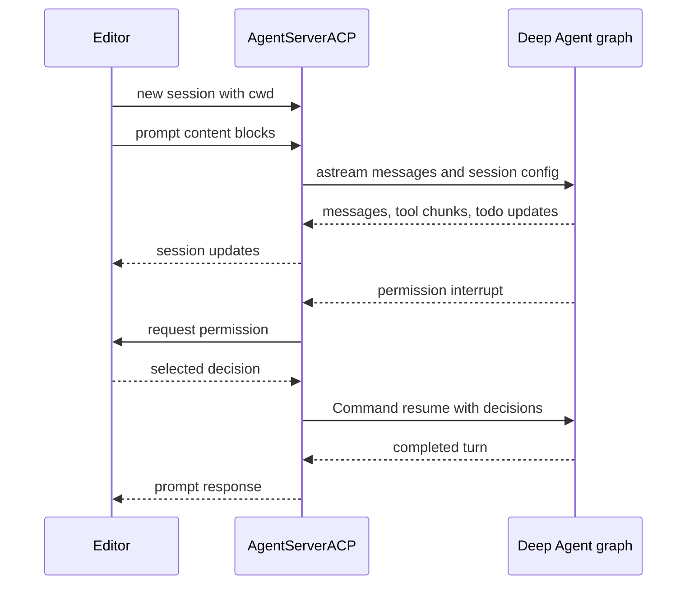

# ACP (Agent Client Protocol) Integration

[Agent Client Protocol (ACP)](https://agentclientprotocol.com/overview/introduction)
lets an ACP-capable editor such as [Zed](https://zed.dev/) drive an external
agent process over stdio. This repository has two entry paths:

1. **Custom Deep Agent bridge.** The `deepagents-acp` package wraps a Python
   Deep Agent graph in `AgentServerACP` and runs it with ACP's `run_agent`.
2. **Prebuilt coding agent.** `dcode --acp` starts the Deep Agents Code agent as
   an ACP server, including its filesystem and shell tools, configured MCP tools,
   and subagents.

The first path is a reusable protocol adapter, not the dcode agent. The second
is a CLI factory that supplies the adapter with a dcode graph per ACP session.
For the graph and tools behind the latter, see [Code Agent architecture](/openwiki/architecture/code-agent.md).
For dcode MCP configuration, see [MCP integration](/openwiki/integrations/mcp.md).

## Custom Deep Agent bridge

`AgentServerACP` subclasses ACP's `Agent` interface. Construct it with either a
compiled `CompiledStateGraph`, or a factory that receives an
`AgentSessionContext(cwd, mode, model)` and returns a graph. A factory is what
allows distinct working directories and selected models to produce distinct
session graphs. `modes` and `models` are invalid for a precompiled graph and
raise `ValueError`; they are factory-only configuration.

```python
import asyncio

from acp import run_agent
from deepagents import create_deep_agent
from langgraph.checkpoint.memory import MemorySaver

from deepagents_acp.server import AgentServerACP


async def main() -> None:
    agent = create_deep_agent(
        tools=[...],
        checkpointer=MemorySaver(),
    )
    server = AgentServerACP(agent)
    await run_agent(server)


asyncio.run(main())
```

The repository's bare example uses `run_demo_agent.sh` as Zed's
`agent_servers` command. The launcher runs the example through its own `uv`
project while intentionally preserving the editor's current working directory.
Its `.env.example` requires `ANTHROPIC_API_KEY` for the example and provides
optional `LANGSMITH_TRACING`, `LANGSMITH_API_KEY`, and `LANGSMITH_PROJECT`.

### Session setup and configuration

During `initialize`, the bridge advertises image prompt support; it advertises
`session/load` only when constructed with `load_sessions=True`. `new_session`
creates an ACP session ID, retains the editor-provided `cwd`, and returns mode
and model selectors when configured. Model and mode are then held per session
and are passed to a graph factory in `AgentSessionContext`.

The model selector is a normal ACP session config option. `set_config_option`
validates the selected mode/model, resets the session graph, and—when durable
loading is enabled—persists the revised session metadata. The LangGraph thread
ID remains the ACP session ID, so a replacement factory graph can continue the
same checkpointed conversation. Unknown config IDs, non-string option values,
and unavailable model/mode values produce an ACP invalid-parameter request
error.

The adapter supports both the older and newer ACP schema shapes: config options
are wrapped only when the installed ACP version provides
`SessionConfigOption`, and `new_session` distinguishes legacy positional MCP
server arguments from `additional_directories`.

### Prompt, streaming, and interrupt flow

The bridge turns ACP text, image, audio, resource-link, and embedded-resource
blocks into LangChain content blocks. It streams the graph with message and
state-update modes, reports assistant text and tool-call lifecycle events to
the editor, and converts `todos` updates into an ACP plan. If a graph did not
supply a checkpointer, the prompt path attaches `MemorySaver` so its LangGraph
thread can run; this fallback is not durable restart persistence.



*ACP prompt processing: the adapter relays streaming output and resumes a paused LangGraph tool decision.*

The loop checks cancellation before and during streaming; an ACP `cancel`
causes `PromptResponse(stop_reason="cancelled")`. Otherwise, after the graph
has no remaining interrupts, it returns `end_turn`. It deliberately waits until
the stream iterator closes before reading an interrupted graph's state, avoiding
a stale snapshot with persistent asynchronous checkpointers.

### ACP permission rendering is a protocol constraint

An ACP client can be asked to make a fixed permission decision. Therefore the
bridge accepts LangGraph interrupts only in the permission-style dictionary
shape used by `HumanInTheLoopMiddleware` (`action_requests` and review
configuration). A free-form `interrupt()` value is rejected as a `RequestError`
that explains ACP cannot display it; the required fix is to use
HumanInTheLoopMiddleware-style interrupts. This limitation says nothing about
which dcode tools should interrupt—it only constrains how an interrupt that
already occurred can be rendered and resumed.

For each requested action, the bridge offers **Approve**, **Reject**, and
**Always allow**. Client cancellation is treated as rejection. An always-allow
choice is maintained in server memory per ACP session: non-shell tools are
matched by tool name, while `execute` is matched by extracted command types.
A compound shell command is auto-approved only if *all* of its types were
allowed, and commands containing dangerous shell metacharacters are never
auto-approved through that allowance. The allowlist is not checkpointed, so do
not treat it as a durable authorization policy.

Plan review has special bridge behavior: a rejected `write_todos` plan is
cleared and resumes with feedback asking the agent to seek a better plan; an
approved in-progress plan can subsequently update without another request.

## Session durability and replay

`load_sessions=True` is an explicit promise to implement ACP `session/load`,
not a persistence implementation by itself. The graph needs a checkpointer that
survives process restart. `MemorySaver` is useful in unit tests, but cannot
restore a server after a process restart.

On new durable sessions, the bridge writes ACP metadata into the LangGraph
thread: an ACP-session marker, `cwd`, and selected mode/model when applicable.
On load it builds or retrieves the session graph, requires its checkpointer,
and verifies that the checkpoint bears that ACP marker. Missing or unrelated
threads are returned as `resource_not_found`; a requested `cwd` different from
the persisted one is `invalid_params`. It then restores valid saved selectors,
rebuilds a factory graph if necessary, and replays stored human and assistant
messages plus tool starts/results through ACP `session/update` before returning.

This protects the working-directory binding but has an operational consequence:
a session cannot be moved to a different editor working directory merely by
requesting `session/load`. See [State & Persistence](/openwiki/concepts/state-persistence.md) for the broader distinction between graph checkpoints and backend state.

## MCP boundary

ACP's `new_session` and `load_session` requests can carry MCP server
descriptors. The generic bridge normalizes and records those descriptors per
session, but its factory contract exposes only `cwd`, mode, and model; it does
not itself turn editor-provided descriptors into agent tools. A custom bridge
consumer must deliberately own that integration rather than assuming MCP tools
are automatically available.

`dcode --acp` instead loads MCP tools before it starts its ACP server. It uses
the normal dcode resolver with `--mcp-config`, `--no-mcp`, project trust, and
plugin-discovered MCP configurations, then closes the resulting MCP session
manager when the server exits. If the config file is absent or MCP loading
fails, the CLI prints an error and returns exit code 1. `--no-mcp` and
`--mcp-config` are mutually exclusive and fail argument validation with exit
code 2.

## Prebuilt path: `dcode --acp`

Install the prebuilt agent with its ACP dependency and point the editor to the
CLI:

```sh
uv tool install -U deepagents-code --with deepagents-acp
```

```json
{
  "agent_servers": {
    "Deep Agents Code": {
      "type": "custom",
      "command": "dcode",
      "args": ["--acp", "--model", "anthropic:claude-sonnet-4-5"]
    }
  }
}
```

`--acp` bypasses Textual UI dependency checks. The CLI imports `acp` and
`deepagents-acp` only in this branch; if unavailable it prints the reinstall
hint and exits nonzero. Provider credentials are read from the environment as
they are for terminal dcode, and `--model` takes `provider:model-name`.

### Factory and lifecycle

`_run_acp_cli_async` resolves the initial model, records it as recent on a
best-effort basis, and creates the ACP model selector from that resolved model
and the available configured models. It loads built-in web-related tools,
configured MCP tools, and async subagents. It opens dcode's checkpointer,
initializes it, and creates an `AgentServerACP(build_agent, models=models,
load_sessions=True)`.

`build_agent` receives the ACP session context. It selects the context model or
the resolved startup model, calls `create_cli_agent` with the shared
checkpointer, session `cwd`, tool set, MCP server information, subagents, and
filesystem-tool allowlist, then returns that graph. Thus ACP model switching
rebuilds dcode's graph for the selected model while the durable thread remains
available for session loading. A startup model configuration error, missing MCP
configuration, or server exception is reported to stderr and gives a nonzero
exit; `KeyboardInterrupt` is handled as shutdown and MCP cleanup still runs.

### Do not conflate ACP prompts with dcode approval policy

The generic adapter's fixed-decision rule only governs an interrupt *after* the
graph decides to interrupt. dcode independently resolves its normal approval
mode before starting ACP:

- **Manual** builds normal gated tool behavior; ACP renders resulting requests.
- **Auto** enables dcode's classifier-backed routing. In this mode dcode swaps
  in its `deepagents_code.acp.AgentServerACP` subclass. Its `_AutoGraph` writes
  trusted Auto approval state to the shared store, injects `CLIContextSchema`
  with Auto enabled, and attaches text-prompt metadata for the classifier on
  each turn. It does not make arbitrary free-form LangGraph interrupts valid in
  ACP.
- **YOLO** passes `auto_approve=True` into `create_cli_agent`, so gated tools do
  not produce human-in-the-loop interrupts for ACP to render. ACP mode refuses
  YOLO until the user has previously acknowledged it in the interactive TUI.

`--auto-classifier-model` is accepted in ACP mode only for Auto; using it in
Manual or YOLO exits with an error. For the policy and enforcement details,
see [Permissions & Human-in-the-Loop](/openwiki/concepts/permissions-hitl.md).

## Focused verification

The ACP package tests exercise text and multimodal prompt conversion, streamed
tool lifecycle updates, cancellation, protocol capability negotiation, HITL
approval, plan clearing, session replay (including tool calls and compacted
messages), cwd rejection, config restoration, and ACP-version compatibility.
Command-allowlist tests specifically distinguish command signatures such as
`python -m pytest` from `python -m pip` and require every segment of a compound
command to be allowed. The dcode integration smoke test starts `deepagents
--acp --no-mcp` as a subprocess, performs ACP initialization and `new_session`,
and verifies a session ID is returned.
