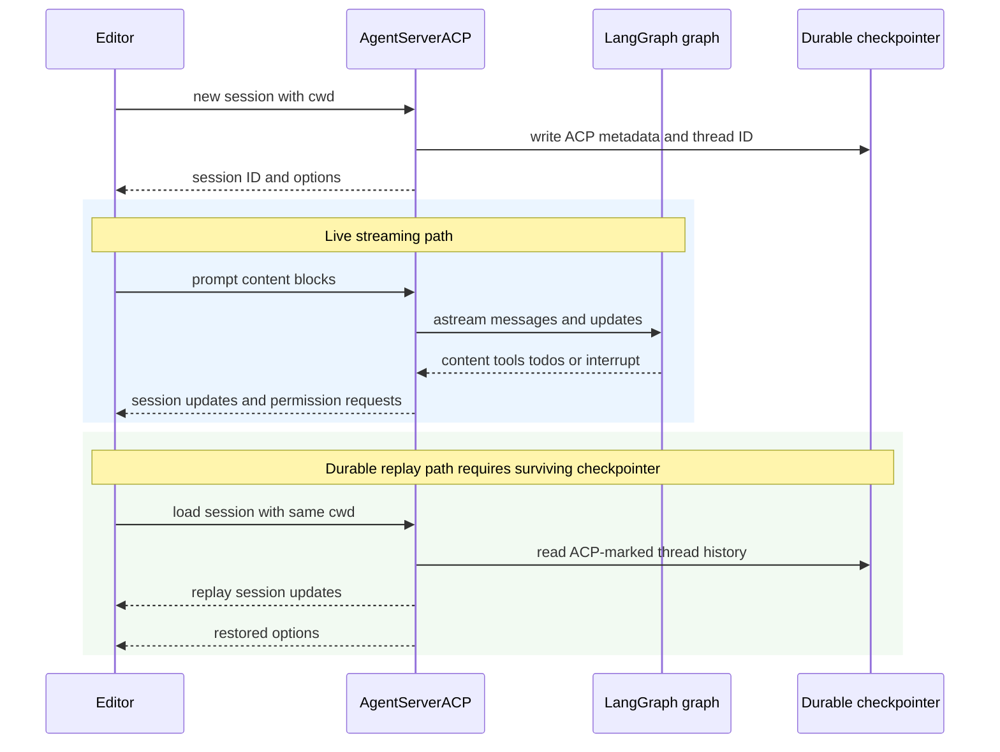

# Agent Client Protocol Integration

[Agent Client Protocol (ACP)](https://agentclientprotocol.com/overview/introduction) lets an ACP-capable editor launch and communicate with an agent process over **stdio**. This repository provides two integration layers:

- **`deepagents-acp`** supplies `AgentServerACP`, a reusable bridge from a LangGraph graph to ACP.
- **`dcode --acp`** runs that server around dcode's coding-agent factory, adding dcode tools, configured MCP tools, subagents, checkpointing, model selection, and approval policy.

`--acp` is distinct from the normal dcode UI path: it serves ACP over stdio instead of launching the Textual UI. The normal remote client lazily creates a LangGraph `RemoteGraph`. Related topics: [architecture overview](/openwiki/architecture/overview.md), [permissions and human-in-the-loop](/openwiki/concepts/permissions-hitl.md), [state persistence](/openwiki/concepts/state-persistence.md), and the [testing guide](/openwiki/testing/testing-guide.md).

## Reusable bridge and session construction

`AgentServerACP` accepts either a compiled `CompiledStateGraph` or a factory accepting `AgentSessionContext(cwd, mode, model)`. Use a factory when the editor-provided working directory or selected mode/model changes graph construction. `modes` and `models` are factory-only; passing either with a compiled graph raises `ValueError`.

```python
import asyncio

from acp import run_agent
from deepagents import create_deep_agent
from langgraph.checkpoint.memory import MemorySaver

from deepagents_acp.server import AgentServerACP


async def main() -> None:
    agent = create_deep_agent(
        tools=[...],
        checkpointer=MemorySaver(),
    )
    server = AgentServerACP(agent)
    await run_agent(server)


asyncio.run(main())
```

At `initialize`, the adapter advertises image prompt support and advertises `session/load` only when `load_sessions=True`. `new_session` creates a unique ACP session ID; records its `cwd` and supplied ACP MCP descriptors; initializes mode/model selection state; and, when loading is enabled, writes ACP session metadata to the graph checkpoint. The LangGraph `thread_id` is the ACP session ID.

The adapter keeps one active graph instance. A compiled graph is reused; a factory graph is rebuilt when a different session begins using the server or when a selector changes. The factory receives the session `cwd`, current mode, and selected model.

### Modes and models

Modes are exposed as a `mode` configuration option and models as `model` options. `set_config_option` accepts string values only, validates known choices, resets the session graph, and persists the selection when durable loading is enabled. Unknown configuration IDs and unrecognized selector values are invalid-parameter errors. The legacy `set_session_mode` path also resets and persists the graph state.

The demo agent illustrates the intended extension point: its factory derives `interrupt_on` from `context.mode`, uses `context.cwd` as the local-shell root, and passes `context.model` to `create_deep_agent`. Its three modes range from asking before edits to accepting everything.

## Prompt stream and durable replay

The same session identity is used for a live turn and, later, checkpoint replay. The following sequence distinguishes the two paths. Durable replay is possible only when `load_sessions=True` **and** the graph has a checkpointer that survives the server restart; otherwise `session/load` is not advertised or cannot restore a thread. `MemorySaver` is appropriate for tests and transient turns, not restart persistence.



*Live graph events are projected as they arrive; a later load reads the ACP-marked checkpoint thread and emits the reconstructed history before returning.*

### Input and output projection

A prompt accepts ACP text, inline images, resource links, and embedded resources. Resource-link paths are made relative to the session root. Embedded text and blobs become textual context, with blobs represented by data URIs. Input audio raises `NotImplementedError`.

The adapter streams LangGraph in `messages` and `updates` modes with subgraphs enabled, but emits only top-level assistant content and plaintext reasoning; subagent content stays internal. Normalized assistant text, image, and audio blocks have ACP equivalents, while reasoning is emitted only when the provider exposed it as plaintext. The shared content projection used by live output and replay preserves block order and does not expose redacted/encrypted reasoning.

`todos` become ACP plan updates. Assistant content from a chunk is emitted before its tool activity. Tool-call argument fragments are accumulated until they parse as JSON, then the adapter emits a tool start; a later tool message completes it. Tool kinds and presentation are specialized for common file, search, edit, and `execute` calls.

`cancel` marks only the target session as cancelled. The prompt handler checks that state before and during streaming, returning `PromptResponse(stop_reason="cancelled")` when it observes cancellation; otherwise it returns `end_turn`. When an interrupt update arrives, it exits the stream iterator before reading graph state, preventing a persistent checkpointer from yielding a stale pre-interrupt snapshot.

## Permissions and plans

ACP can display fixed permission choices, not arbitrary `interrupt()` questions. The bridge rejects a free-form LangGraph interrupt. ACP-compatible graphs should use the `action_requests` and review configuration shape produced by `HumanInTheLoopMiddleware`.

For each action request, the adapter requests **Approve**, **Reject**, or **Always allow** from the ACP client, resumes the graph with the resulting decision, and treats a cancelled permission request as rejection. For `write_todos`, rejecting or cancelling clears the plan; rejection additionally tells the agent to seek feedback and create an improved plan. Updates to an approved, incomplete plan are automatically approved.

Always-allow decisions live only in adapter memory for that ACP session; they are not durable authorization grants. Non-shell tools are remembered by tool name. For `execute`, a future compound command is auto-approved only when every extracted command signature was allowed and no dangerous shell pattern is present, including substitutions, variable expansion, redirection, control characters, process substitution, or standalone backgrounding.

## Loading invariants and MCP boundary

`load_sessions=True` enables the ACP operation, but it does not itself make state durable. The graph must have a checkpointer, and for a restart it must remain available to the new agent process. Loading checks that the graph thread has the ACP marker and that the supplied `cwd` exactly matches checkpoint metadata. A missing or non-ACP thread is `resource_not_found`; a different working directory is an invalid-parameters error.

On a valid load, the adapter restores saved mode/model choices only when they are still offered by the current server, rebuilds the factory graph if needed, and replays conversation state through `session/update` before returning. Replay includes user messages, visible assistant content and reasoning, tool starts, and tool results; it reconstructs messages from checkpoint history so compacted message history is retained. A persisted ACP session therefore cannot be moved to a different editor working directory.

The generic adapter retains ACP MCP descriptors from `new_session` and `load_session`, but `AgentSessionContext` contains only `cwd`, `mode`, and `model`. It neither passes ACP descriptors to the factory nor turns them into graph tools. Applications that want editor-provided MCP servers must implement that bridge deliberately.

## dcode as the prebuilt ACP agent

Use dcode when a ready-made coding agent is preferable to assembling a graph. Install the dcode package with ACP support and configure the editor to launch it:

```sh
uv tool install -U deepagents-code --with deepagents-acp
```

```json
{
  "agent_servers": {
    "Deep Agents Code": {
      "type": "custom",
      "command": "dcode",
      "args": ["--acp", "--model", "anthropic:claude-sonnet-5"]
    }
  }
}
```

`--acp` is detected in raw argv so dcode skips Textual dependency checks. ACP imports are lazy: if `acp` or `deepagents-acp` is unavailable, dcode prints the reinstall command and exits nonzero. Provider credentials come from the environment, and model specifications use `provider:model-name`.

### dcode construction, MCP, and policies

Startup resolves the initial model, saves/touches it as recent, and makes it plus configured available models selectable. It creates built-in web tools, resolves configuration-driven MCP tools, loads asynchronous subagents, and opens dcode's checkpointer. Its per-session factory uses the selected model (or initial model), the session cwd and project context, and the shared checkpointer to call `create_cli_agent` with tools, MCP server data, subagents, filesystem policy, recursion/retry settings, summarization model, and memory settings. The server enables session loading, so a model change rebuilds the factory graph without changing the ACP/LangGraph thread identity.

Dcode owns a separate MCP path from generic ACP descriptors. Before opening the ACP server, it resolves an explicit MCP configuration or regular configuration using project trust/context and plugin-discovered MCP configurations. Missing MCP configuration files and MCP tool-loading failures go to stderr and return exit code 1; the MCP session manager is cleaned up when the server exits.

`--no-mcp` and `--mcp-config` are mutually exclusive and produce an argument error. YOLO in ACP requires acknowledgement previously made through the interactive TUI. `--auto-classifier-model` is valid only with resolved Auto mode.

ACP presentation and dcode approval policy remain separate. Dcode passes `auto_approve=yolo` and `auto_mode_enabled=auto` into `create_cli_agent`, so ACP renders permissions only for human-gated interrupts that remain. In Auto mode, dcode substitutes its specialized `deepagents_code.acp.AgentServerACP`: the wrapper stores trusted Auto approval state, attaches text-prompt metadata, and streams the graph with a `CLIContextSchema` carrying Auto approval settings. It does not make free-form LangGraph interrupts representable by ACP.

## Setup and focused verification

For the custom-server demo, work from `libs/acp`, run `uv sync --group examples`, put `ANTHROPIC_API_KEY` in `.env`, and configure the editor to invoke executable `run_demo_agent.sh`. `LANGSMITH_TRACING`, `LANGSMITH_API_KEY`, and `LANGSMITH_PROJECT` are optional tracing settings. The README gives a Zed configuration example; the protocol is not limited to Zed.

`libs/acp/tests/test_agent.py` exercises initialization, selector restoration, multimodal conversion, ordering of content/reasoning/tool updates, target-session cancellation, permissions and plans, command allowlisting, durable replay, tool-history replay, compaction behavior, and cwd validation. The dcode smoke test launches `deepagents --acp --no-mcp`, opens ACP pipes, initializes, creates a session, and asserts that it receives a session ID.
