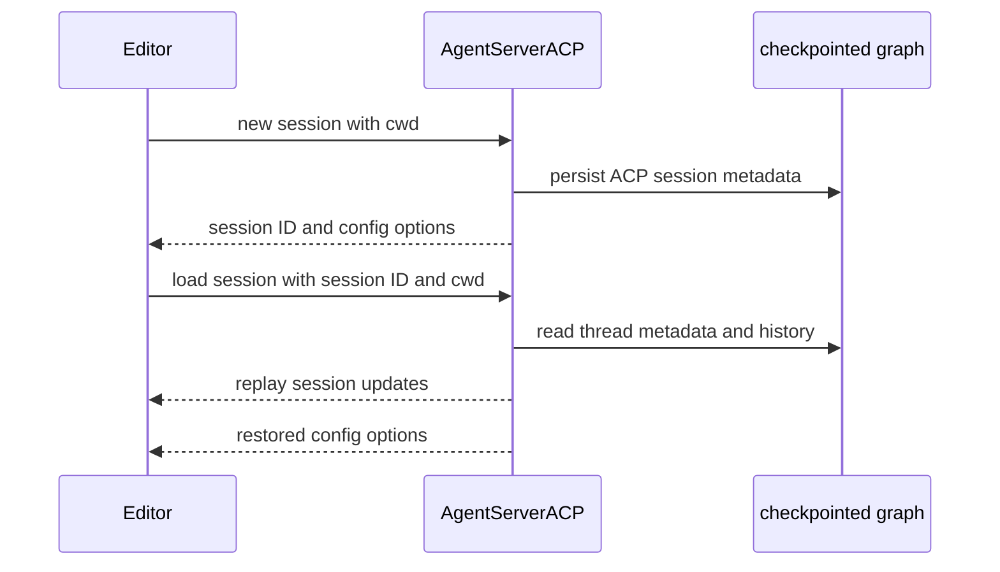

# Agent Client Protocol Integration

[Agent Client Protocol (ACP)](https://agentclientprotocol.com/overview/introduction) lets an ACP-capable editor launch and communicate with an agent process over **stdio**. This repository supplies two layers:

- **`deepagents-acp`** provides `AgentServerACP`, a reusable adapter from a LangGraph graph to ACP.
- **`dcode --acp`** runs that protocol server around dcode's coding-agent factory. It supplies dcode's tools, configured MCP tools, subagents, checkpointer, model selection, and approval policy.

`--acp` is separate from the normal dcode UI path: it selects an ACP server over stdio instead of the Textual UI. The normal remote client lazily creates a LangGraph `RemoteGraph`. See [Code Agent architecture](/openwiki/architecture/code-agent.md), [state persistence](/openwiki/concepts/state-persistence.md), [testing guide](/openwiki/testing/testing-guide.md), and [Build a Deep Agent](/openwiki/workflows/build-a-deep-agent.md).

## Use the reusable adapter

`AgentServerACP` implements ACP's agent interface. Its `agent` can be either a compiled `CompiledStateGraph` or a factory that accepts `AgentSessionContext(cwd, mode, model)`. Choose a factory when graph construction depends on the editor-provided working directory or a selected mode/model. `modes` and `models` are factory-only; providing either alongside a compiled graph raises `ValueError`.

```python
import asyncio

from acp import run_agent
from deepagents import create_deep_agent
from langgraph.checkpoint.memory import MemorySaver

from deepagents_acp.server import AgentServerACP


async def main() -> None:
    agent = create_deep_agent(
        tools=[...],
        checkpointer=MemorySaver(),
    )
    server = AgentServerACP(agent)
    await run_agent(server)


asyncio.run(main())
```

For the repository demo, work from `libs/acp`, run `uv sync --group examples`, put `ANTHROPIC_API_KEY` in `.env`, and configure the editor to run `run_demo_agent.sh`. `LANGSMITH_TRACING`, `LANGSMITH_API_KEY`, and `LANGSMITH_PROJECT` are optional tracing settings. The README includes a Zed configuration example; ACP itself is not limited to Zed.

### Session state and selectors

During `initialize`, the adapter advertises image prompt support and advertises `session/load` only when `load_sessions=True`. `new_session` makes a unique ACP session ID, records the supplied `cwd` and ACP MCP descriptors, initializes selector state, and persists session metadata when loading is enabled. The LangGraph `thread_id` is the ACP session ID.

Mode and model configuration options accept only strings and recognized choices. Changing either resets the current graph. A factory consequently receives a fresh context carrying the session's `cwd`, mode, and model; invalid configuration IDs, values, and non-string values are invalid-parameter errors. The adapter maintains one active graph instance, rebuilding a factory graph when it begins serving a different session; a supplied compiled graph is reused.



*Session creation records the identity and working directory that a later load must validate before replaying the checkpointed history.*

## Turn projection and interruption handling

For a prompt, the adapter converts ACP text, images, resource links, and embedded resources to LangChain content. Resource-link paths are made relative to the session cwd; embedded text and blobs become textual context, with blobs represented by a data URI. Input audio raises `NotImplementedError`. In the opposite direction, normalized assistant image and audio blocks can be emitted to the ACP client.

The adapter streams the graph in `messages` and `updates` modes with subgraphs enabled. It exposes only top-level assistant content and plaintext reasoning, keeping subagent content internal. It maps `todos` to ACP plan updates. It emits assistant content before tool activity from the same chunk, accumulates tool-call argument fragments until they parse as JSON, then emits the tool start and completes it when its result arrives. If the graph has no checkpointer, `prompt` attaches `MemorySaver`; that can support the turn but not restart recovery.

`cancel` sets a cancellation flag checked before and while iterating a graph stream. A detected cancellation returns `PromptResponse(stop_reason="cancelled")`; a completed turn returns `end_turn`. When an interrupt update arrives, the adapter first exits the stream iterator before reading state, avoiding a stale pre-interrupt checkpoint snapshot.

### Permission boundary

ACP renders fixed permission choices, not arbitrary `interrupt()` questions. The adapter rejects a free-form LangGraph interrupt. ACP-compatible graphs should use the `action_requests` and review configuration shape used by `HumanInTheLoopMiddleware`.

For each action request, the adapter offers **Approve**, **Reject**, and **Always allow**, then resumes the graph with the decisions. Cancelling a permission request is rejection. For `write_todos`, a rejected or cancelled request clears the plan; rejection also feeds the agent text asking it to obtain feedback and create an improved plan. Updates to an approved incomplete plan are automatically approved.

Always-allow state is in adapter memory and scoped to one ACP session, not a durable authorization grant. Non-shell tools are remembered by name. For `execute`, a future compound command is reapproved only if every extracted command signature was allowed and the command contains no dangerous shell pattern, including substitution, variable expansion, redirection, control characters, process substitution, or standalone backgrounding.

## Durable loading and cwd invariant

`load_sessions=True` merely enables and advertises ACP's loading operation. Durable recovery also needs a graph checkpointer that remains available after a process restart; `MemorySaver` is suitable for tests and ephemeral turns, not restart persistence. The adapter writes an ACP marker, cwd, and active mode/model selections to checkpoint metadata.

Loading requires a checkpointed thread with that ACP marker. Missing or unrelated threads return `resource_not_found`; a different cwd is an invalid-parameters error. On success, the adapter restores only saved mode/model values still supported by the current server, rebuilds a factory graph when necessary, and replays user messages, visible assistant content/reasoning, tool starts, and tool results as `session/update` events before returning. A persisted ACP session therefore cannot be moved to a different editor working directory.

## MCP ownership boundary

The generic adapter retains ACP MCP descriptors supplied to `new_session` or `load_session`, but `AgentSessionContext` contains only `cwd`, `mode`, and `model`. It neither passes those descriptors to the factory nor converts them into graph tools. Applications that want editor-provided MCP servers must deliberately implement that bridge.

Dcode owns a separate configuration-driven MCP path. Before it serves ACP, dcode resolves MCP tools from an explicit configuration path or normal configuration, project trust and context, and plugin-discovered MCP configurations. It captures the resulting tools and server data for each session graph, and cleans up its MCP session manager when the ACP server exits. A missing MCP configuration or tool-loading failure is reported to stderr and ends startup with exit code 1.

## Run dcode as an ACP server

Install dcode and the adapter together, then configure the editor to launch `dcode`:

```sh
uv tool install -U deepagents-code --with deepagents-acp
```

```json
{
  "agent_servers": {
    "Deep Agents Code": {
      "type": "custom",
      "command": "dcode",
      "args": ["--acp", "--model", "anthropic:claude-sonnet-4-5"]
    }
  }
}
```

`--acp` is detected in raw argv so dcode skips the Textual dependency check. ACP imports are lazy: if `acp` or `deepagents-acp` is missing, dcode prints the reinstall command and exits nonzero. Provider credentials come from the environment, and model specifications use `provider:model-name`.

### Construction, policy, and option failures

ACP startup resolves the initial model, stores/touches it as recent, and builds model selectors from available models. It constructs built-in web tools, configured MCP tools, and asynchronous subagents, then opens and sets up dcode's checkpointer. The per-session factory uses the selected model or initial model and calls `create_cli_agent` with the session cwd/project context, shared checkpointer, tools, MCP data, subagents, filesystem allowlist, recursion/retry settings, summarization model, and memory setting. The server enables session loading, so model changes rebuild the factory graph without changing the ACP/LangGraph thread identity.

`--no-mcp` and `--mcp-config` are mutually exclusive and return an argument error (exit 2). ACP permits YOLO only after an acknowledgement recorded through the interactive TUI. `--auto-classifier-model` is valid in ACP only with resolved Auto mode.

ACP presentation and dcode approval policy are separate. The dcode factory passes `auto_approve=yolo` and `auto_mode_enabled=auto` to `create_cli_agent`; YOLO removes gated tool interrupts, while ACP permission UI is used only for interrupts that remain human-gated. In Auto mode, `deepagents_code.acp.AgentServerACP` wraps each graph to write trusted Auto approval state, attach text-prompt metadata, and stream with a `CLIContextSchema` containing Auto approval settings. It does not make free-form LangGraph interrupts representable in ACP.

## Focused verification

`libs/acp/tests/test_agent.py` covers initialization, selectors and restoration, multimodal conversion, ordering of content/reasoning/tool updates, cancellation, permission and plan behavior, command allowlisting, durable replay, tool-history replay, and cwd validation. The dcode smoke test starts `deepagents --acp --no-mcp`, connects through ACP pipes, initializes a session, and asserts that a session ID is returned.
