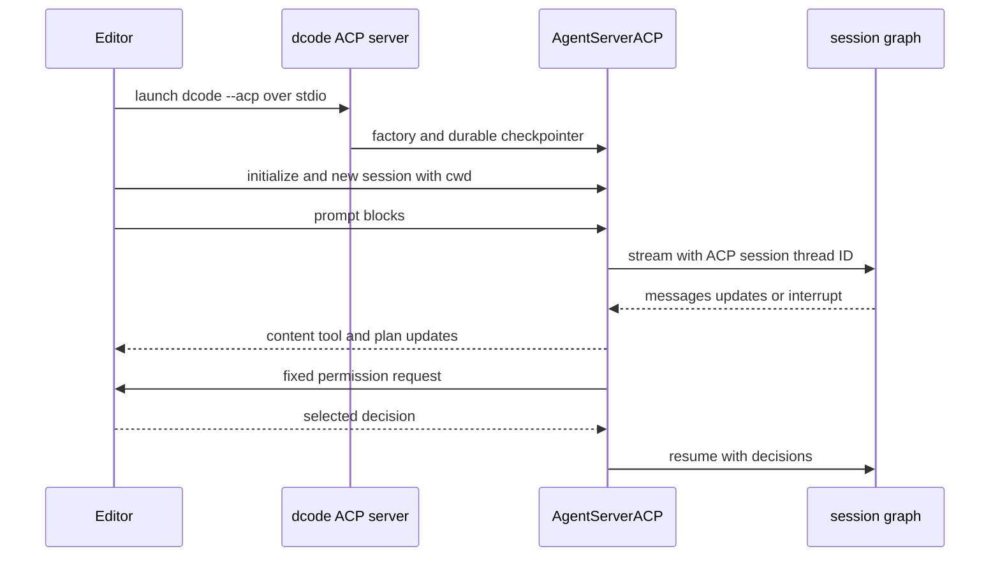

# Agent Client Protocol Integration

[Agent Client Protocol (ACP)](https://agentclientprotocol.com/overview/introduction) lets an ACP-capable editor start and communicate with an agent process over **stdio**. This repository has two layers:

- **`deepagents-acp`** provides `AgentServerACP`, a reusable adapter from a LangGraph graph to ACP.
- **`dcode --acp`** starts that protocol server around dcode's coding-agent factory, adding dcode's models, filesystem and web tools, configured MCP tools, subagents, checkpointer, and approval policy.

`--acp` is distinct from the normal dcode UI path: the CLI flag explicitly selects an ACP server over stdio rather than launching the Textual UI. The normal remote client lazily creates a LangGraph `RemoteGraph`. See [Code Agent architecture](/openwiki/architecture/code-agent.md), [configuration layering](/openwiki/concepts/config-layering.md), [state persistence](/openwiki/concepts/state-persistence.md), and [MCP integration](/openwiki/integrations/mcp.md).

## Reusable adapter

`AgentServerACP` implements ACP's agent interface. It accepts either a compiled `CompiledStateGraph` or a factory accepting `AgentSessionContext(cwd, mode, model)`. Use the factory form when the graph must be constructed for the editor-provided working directory or session-selected model/mode. `modes` and `models` are factory-only selectors; passing either with a compiled graph raises `ValueError`.

```python
import asyncio

from acp import run_agent
from deepagents import create_deep_agent
from langgraph.checkpoint.memory import MemorySaver

from deepagents_acp.server import AgentServerACP


async def main() -> None:
    agent = create_deep_agent(
        tools=[...],
        checkpointer=MemorySaver(),
    )
    server = AgentServerACP(agent)
    await run_agent(server)


asyncio.run(main())
```

For the supplied demo, work from `libs/acp`, run `uv sync --group examples`, configure `ANTHROPIC_API_KEY` in `.env`, and point the editor at `run_demo_agent.sh`. The optional `LANGSMITH_TRACING`, `LANGSMITH_API_KEY`, and `LANGSMITH_PROJECT` settings enable tracing.

### Session identity, cwd, and selectors

At initialization the adapter advertises image prompts and advertises `session/load` only when `load_sessions=True`. `new_session` generates an ACP session ID, records its `cwd` and supplied ACP MCP descriptors, initializes configured mode/model state, and—when durable loading is enabled—writes metadata to the graph checkpoint thread. The LangGraph `thread_id` is exactly that ACP session ID.

Mode and model selectors accept only strings and only configured choices. A valid change resets the current graph, so a factory receives a fresh context with the selected `cwd`, mode, and model; invalid IDs, values, or non-string values are invalid-parameter errors. The adapter retains one current graph instance and switches or rebuilds it when serving another session. A compiled graph is reused.

## Turn lifecycle and streamed projection

ACP prompt blocks are adapted to LangChain content before graph execution. Text and inline images are supported. Resource links become contextual text with paths relative to the session cwd, while embedded text or blobs become text/data-URI context. Input audio raises `NotImplementedError`, although normalized assistant image and audio blocks can be sent back to the client.

The adapter streams LangGraph with `stream_mode=["messages", "updates"]` and `subgraphs=True`. It exposes only top-level assistant content and plaintext reasoning; subagent content remains internal. It emits content before a tool call from the same chunk, accumulates tool-call arguments until they parse as JSON, then sends a tool-start update and later completes it from the matching tool result. `todos` become ACP plan updates. If a graph has no checkpointer, `prompt` attaches `MemorySaver`; that enables a turn but not restart recovery.



*An ACP dcode turn: dcode supplies the factory and durable store, while the adapter owns the ACP session, event projection, and permission-resume loop.*

`cancel` sets a flag checked before and during stream iteration; a cancelled turn returns `PromptResponse(stop_reason="cancelled")`, otherwise it ends with `end_turn`. For an interrupt update, the adapter exits the stream iterator before reading state, avoiding a stale pre-interrupt snapshot from an asynchronously persistent checkpointer.

### Permission boundary

ACP can display fixed permission choices, not arbitrary LangGraph `interrupt()` questions. The adapter rejects a free-form interrupt with a request error. ACP-compatible graphs should use the `action_requests` and review configuration shape used by `HumanInTheLoopMiddleware`.

For every action request, the adapter offers **Approve**, **Reject**, and **Always allow**, and resumes the graph with the resulting decisions. A cancelled permission request is rejection. For `write_todos`, rejection or cancellation clears the plan; rejection also returns feedback asking the agent to obtain improvements. Updates to an incomplete approved plan are automatically approved.

Always-allow is adapter memory scoped to an ACP session, not a persisted authorization grant. Non-shell tools are remembered by name. For `execute`, remembered command signatures can approve a future compound command only when every extracted signature is allowed and the command contains no dangerous shell construction, such as variable or command expansion, redirects, control characters, process substitution, or standalone backgrounding.

## Persistence and session load

`load_sessions=True` only advertises and enables the ACP operation; actual recovery requires a graph checkpointer that is still available after process restart. `MemorySaver` is useful for tests and temporary turns, not durable recovery. The adapter persists an ACP marker, cwd, and active mode/model selection in the checkpoint metadata.

Loading requires a checkpointer and a thread carrying that ACP marker. A missing or unrelated thread returns `resource_not_found`; a differing cwd is rejected as invalid parameters. On success, the adapter restores only still-supported saved mode/model choices, rebuilds a factory graph if required, and replays persisted user messages, assistant content and visible reasoning, tool starts, and tool results through `session/update` before returning. A loaded session therefore cannot be relocated to a different editor cwd.

## MCP inputs and ownership

The generic adapter retains ACP MCP descriptors from `new_session` and `load_session`, but `AgentSessionContext` has only `cwd`, `mode`, and `model`. It does not turn those descriptors into graph tools or pass them to the factory. An application that wants editor-provided dynamic MCP servers must implement that bridge itself.

Dcode has a separate, configuration-owned MCP boundary. Before serving ACP, it resolves configured MCP tools using the explicit configuration path or normal configuration, project trust, project context, and plugin-discovered MCP configurations. Those tools and MCP server information are captured for every session graph. A missing MCP configuration file or tool-loading failure writes an error to stderr and returns exit code 1. The MCP session manager is cleaned up in the server's `finally` block; cleanup failure is logged as a warning rather than replacing the run result.

## dcode ACP mode

Install the prebuilt agent and ACP adapter together, then have the editor launch `dcode`:

```sh
uv tool install -U deepagents-code --with deepagents-acp
```

```json
{
  "agent_servers": {
    "Deep Agents Code": {
      "type": "custom",
      "command": "dcode",
      "args": ["--acp", "--model", "anthropic:claude-sonnet-4-5"]
    }
  }
}
```

`--acp` is detected in raw argv so dcode skips Textual dependency checks. The ACP imports are lazy; if `acp` or `deepagents-acp` is unavailable, dcode prints the reinstall command and exits nonzero. Provider credentials come from the environment, and model specifications use `provider:model-name`.

### Construction, model changes, and failures

ACP startup resolves the initial model, stores/touches it as recent, and constructs the selector list from available models. It builds built-in web tools, MCP tools, asynchronous subagents, then opens and sets up dcode's checkpointer. Its per-session factory uses the selected model or initial model and invokes `create_cli_agent` with session cwd/project context, the shared checkpointer, tools, MCP data, subagents, filesystem allowlist, recursion and retry settings, summarization model, and memory setting. The server enables session loading, so model changes rebuild the graph without changing the ACP/LangGraph thread identity.

`--no-mcp` and `--mcp-config` are mutually exclusive and produce an argument error (exit 2). YOLO is accepted in ACP only after an acknowledgement recorded through the interactive TUI. `--auto-classifier-model` is accepted in ACP only with resolved Auto mode.

Keep ACP presentation separate from dcode approval policy. The factory passes `auto_approve=yolo` and `auto_mode_enabled=auto` to `create_cli_agent`: YOLO avoids the gated tool interrupts ACP would display, while ACP's permission UI remains relevant only for interrupts left to a human. In Auto mode, `deepagents_code.acp.AgentServerACP` wraps each graph: it writes trusted Auto approval state, attaches text prompt metadata, and supplies `CLIContextSchema` containing Auto approval settings to graph streams. It does not make free-form LangGraph interrupts displayable by ACP.

A keyboard interrupt is absorbed by ACP startup; another server exception is written to stderr, logged, and returned as exit code 1. See [Run a dcode session](/openwiki/workflows/run-dcode-session.md) for the standard terminal workflow.

## Focused verification

`libs/acp/tests/test_agent.py` exercises initialization, selector validation and restoration, multimodal conversion, ordering of text/reasoning/tool events, cancellation, HITL and plan handling, command allowlisting, durable replay, tool-history replay, and cwd validation. The dcode integration smoke test starts `deepagents --acp --no-mcp`, connects over pipes, initializes ACP, opens a session, and asserts a session ID is returned.
