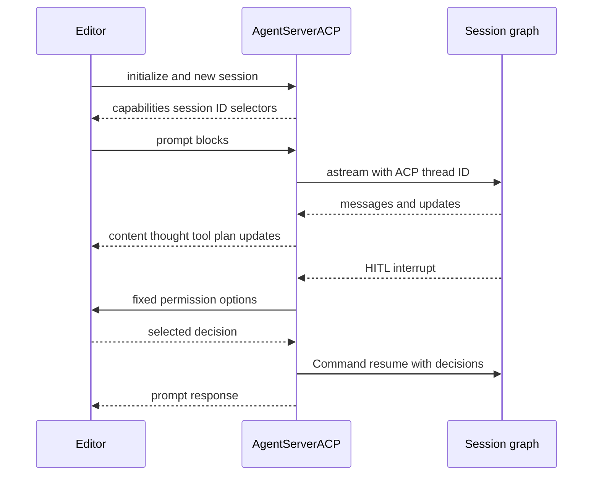

# ACP Integration

[Agent Client Protocol (ACP)](https://agentclientprotocol.com/overview/introduction) lets an ACP-capable editor launch and converse with an agent process over **stdio**. This repository has two deliberately different entry points:

- **`deepagents-acp`** is the reusable bridge. `AgentServerACP` projects a supplied LangGraph graph into ACP and does not impose a coding-agent configuration.
- **`dcode --acp`** builds dcode's coding graph behind that bridge: filesystem and shell tooling, configured MCP tooling, web tools, and subagents are assembled before the stdio server accepts editor sessions.

This is not normal dcode remote-agent operation. The Textual adapter's remote client talks to a LangGraph server through HTTP+SSE, whereas `--acp` runs an ACP server over stdio and exits before the Textual UI path. Do not describe the local graph serving done by `dcode --acp` as a loopback HTTP server. See [Code Agent architecture](/openwiki/architecture/code-agent.md), [MCP integration](/openwiki/integrations/mcp.md), and [Permissions & Human-in-the-Loop](/openwiki/concepts/permissions-hitl.md).

## Reusable `deepagents-acp` adapter

`AgentServerACP` implements ACP's `Agent` interface. Construct it with either a compiled `CompiledStateGraph`, or a factory that accepts `AgentSessionContext(cwd, mode, model)` and returns a graph. The factory is the extension boundary for per-session working-directory, model, or policy setup. `modes` and `models` are allowed only for a factory; configuring either with a compiled graph raises `ValueError`.

```python
import asyncio

from acp import run_agent
from deepagents import create_deep_agent
from langgraph.checkpoint.memory import MemorySaver

from deepagents_acp.server import AgentServerACP


async def main() -> None:
    agent = create_deep_agent(
        tools=[...],
        checkpointer=MemorySaver(),
    )
    server = AgentServerACP(agent)
    await run_agent(server)


asyncio.run(main())
```

For the bundled example, run `uv sync --group examples` in `libs/acp`, set `ANTHROPIC_API_KEY` in `.env`, and configure the editor to invoke `run_demo_agent.sh`. Optional `LANGSMITH_TRACING`, `LANGSMITH_API_KEY`, and `LANGSMITH_PROJECT` enable tracing. `python -m deepagents_acp` is a test-agent module entrypoint, not a general dcode launcher.

### Session state, factory inputs, and persistence

At `initialize`, the adapter advertises image input and advertises `session/load` only when `load_sessions=True`. `new_session` generates an ACP session ID; records its `cwd` and supplied ACP MCP descriptors; initializes selector state; and, for loadable sessions, checkpoints ACP metadata immediately. It returns mode/model config options when configured. Compatibility logic accepts both wrapped and legacy session-option shapes and legacy positional MCP-server arguments.

Mode and model selectors are session state, not global configuration. Valid string selections update the session and reset its graph. On the next reset, the factory receives the current `cwd`, selected `mode`, and selected `model`; the LangGraph `thread_id` is the ACP session ID and the metadata also records the cwd and selections. The server keeps a single active graph instance and switches/rebuilds it when a different session is served, so a factory must build a graph suitable for the supplied context rather than capture one session's directory or model. Invalid selector IDs, values, and non-string selector values are invalid-parameter errors.

`load_sessions=True` merely exposes the protocol capability. Durable recovery also needs a checkpointer available after restart; `MemorySaver` supports an in-process graph and tests, but not restart recovery. Loading requires an ACP-marked checkpoint thread and the original cwd. It restores still-supported selections, rebuilds the factory graph when needed, and replays user messages, visible assistant content/reasoning, tool calls/results, and plans as `session/update` events before returning. An absent or unrelated thread is `resource_not_found`; a different cwd is `invalid_params`. See [State & Persistence](/openwiki/concepts/state-persistence.md).

## Prompt lifecycle, stream, and interrupts

The adapter converts ACP text, image, audio, resource-link, and embedded-resource blocks to LangChain content. Resource links are contextual text relative to the session cwd, and embedded text/blob resources become text/data-URI context. Output exposes normalized top-level text, image, audio, and plaintext reasoning; subagent message and reasoning streams remain internal.



*ACP stdio turn: the adapter streams a session graph, obtains fixed permission decisions when needed, then resumes the same ACP/LangGraph thread.*

Each prompt streams with `stream_mode=["messages", "updates"]` and `subgraphs=True`. Tool-call arguments accumulate until JSON parses before a tool-start update is emitted; tool results complete that call, and `todos` updates become ACP plan updates. If a graph has no checkpointer, `prompt` assigns a `MemorySaver` so the thread can run, which is not durable persistence. `cancel` sets a server cancellation flag checked before and while streaming and returns `stop_reason="cancelled"`; otherwise a completed turn returns `end_turn`.

When an interrupt arrives, the adapter waits for the stream iterator to close before reading graph state. This is necessary for asynchronous checkpointers, whose interrupt checkpoint may not yet be visible. ACP cannot display arbitrary free-form LangGraph `interrupt()` values: such a value is rejected. ACP-compatible human review must use the `action_requests` and review configuration shape produced by `HumanInTheLoopMiddleware`.

For each action request, ACP offers **Approve**, **Reject**, and **Always allow**, then resumes the graph with the resulting decisions. A cancelled permission request becomes rejection. Rejected or cancelled `write_todos` clears the displayed plan; an approved incomplete plan permits later plan updates without another request. Always-allow state is adapter memory scoped to an ACP session, not a checkpointed grant. For `execute`, a future command is auto-approved only if every extracted command signature was allowed and it contains no dangerous expansion, substitution, redirect, control character, or standalone backgrounding.

## MCP boundary

The generic adapter retains the ACP MCP descriptors received with a new or loaded session, but `AgentSessionContext` contains only `cwd`, `mode`, and `model`. It neither turns those descriptors into graph tools nor hands them to the factory. An application that wants editor-provided MCP servers must implement that bridge itself.

Dcode has a different boundary. Before creating the ACP server it resolves MCP tools from dcode configuration, project trust, and plugin-discovered configurations, then shares the resulting tools and server information with graphs built for ACP sessions. A missing config or MCP loading failure is reported to stderr and returns exit code 1. `--no-mcp` and `--mcp-config` are mutually exclusive and produce argument error code 2.

## Prebuilt dcode ACP server

Install dcode with the ACP adapter, then configure the editor to run the stdio command:

```sh
uv tool install -U deepagents-code --with deepagents-acp
```

```json
{
  "agent_servers": {
    "Deep Agents Code": {
      "type": "custom",
      "command": "dcode",
      "args": ["--acp", "--model", "anthropic:claude-sonnet-4-5"]
    }
  }
}
```

`--acp` skips Textual dependency checks and lazily imports `acp` and `deepagents-acp`. Missing dependencies produce a reinstall hint and exit nonzero. Provider credentials come from the environment; model specifications use `provider:model-name`.

### Startup, graph factory, models, and approval policy

`_run_acp_cli_async` resolves and records the initial model, creates the available-model selector list, builds web tools, loads MCP tools, loads asynchronous subagents, and then enters `async with get_checkpointer()`. The checkpointer is set up once and shared by all graphs made while the ACP runner is active. It is deliberately scoped to the local ACP server lifetime: `run_acp_agent(server)` is awaited inside that context, so normal disconnect, interruption, or server exception leaves the context before the function returns. Whether a later dcode process can load the thread depends on the configured checkpointer backend, not on the ACP adapter alone.

The dcode factory receives the editor's per-session `context.cwd` and `context.model`. It selects the requested model (or startup model), applies model runtime state, resolves the Auto classifier for that model provider, and calls `create_cli_agent` with the shared checkpointer, tools, MCP information, subagents, filesystem allowlist, retry and memory settings, and project context rebuilt from that session cwd. A model selection resets/rebuilds that session graph while its ACP/LangGraph thread ID stays stable. Dcode passes models but no ACP mode selector: Manual, Auto, or YOLO is selected at process startup by dcode's resolved approval policy, not changed per ACP session.

Keep ACP's permission renderer separate from dcode's approval policy:

- **Manual** can leave gated actions for ACP to render when the graph interrupts.
- **Auto** replaces the base server with `deepagents_code.acp.AgentServerACP`. Its `_AutoGraph` writes trusted Auto approval state to the store, adds text-prompt classifier metadata, and supplies `CLIContextSchema` on every graph stream. It does not make free-form LangGraph interrupts compatible with ACP.
- **YOLO** passes `auto_approve=True` to `create_cli_agent`, preventing normally gated actions from producing the ACP permission interrupts. ACP mode allows YOLO only after a prior acknowledgement in the interactive TUI.

`--auto-classifier-model` is valid in ACP mode only with Auto. The factory passes `auto_approve=yolo` and `auto_mode_enabled=auto`, so ACP's fixed-decision UI is involved only when dcode policy actually leaves a human-in-the-loop interrupt.

### Failure cleanup and operations

After MCP tools have loaded, `_run_acp_cli_async` catches `KeyboardInterrupt` without treating it as a server failure; other server failures are written to stderr, logged, and return exit code 1. Its `finally` calls the MCP session manager's `cleanup()` if one exists, and logs—but does not replace the original outcome with—cleanup failure. The manager cleanup occurs after the checkpointer context has exited. Thus resources created by dcode MCP setup are cleaned when the stdio runner ends, while the generic `AgentServerACP` itself does not own dcode MCP lifecycle.

## Focused verification

Adapter tests cover capability negotiation, cross-version configuration, model switching and factory context, streamed content/reasoning ordering, media, cancellation, interrupts and plan clearing, command allowlisting, delayed checkpoint visibility, and durable replay/cwd validation. The dcode integration smoke test launches `deepagents --acp --no-mcp` as a subprocess, initializes ACP over its pipes, opens a session, and asserts a session ID; its `finally` terminates and waits for the subprocess. See [Run a dcode session](/openwiki/workflows/run-dcode-session.md) for normal terminal operation.
