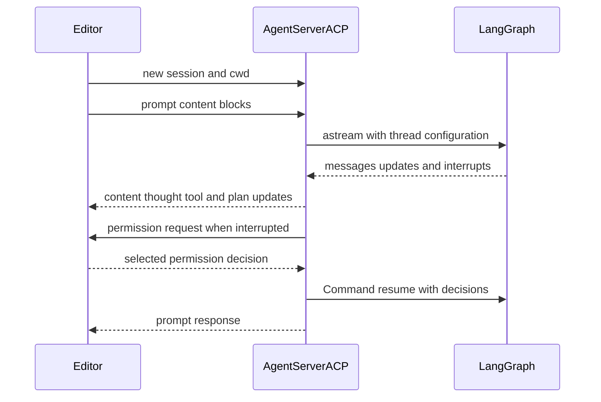

# ACP Integration

[Agent Client Protocol (ACP)](https://agentclientprotocol.com/overview/introduction) lets an ACP-capable editor such as [Zed](https://zed.dev/) launch and converse with an agent process over **stdio**. This repository supplies two intentionally distinct entry points:

- **`deepagents-acp`** is the reusable bridge. `AgentServerACP` projects a supplied LangGraph graph into ACP; it does not prescribe a coding-agent configuration.
- **`dcode --acp`** is a factory around that bridge. It constructs dcode's preconfigured coding graph per ACP session, including its filesystem and shell tools, configured MCP tools, and subagents.

This is not dcode's normal remote execution path. The ordinary Textual client uses a LangGraph `RemoteGraph` over HTTP+SSE; `--acp` instead starts an ACP stdio server and does not launch the Textual UI. See [Code Agent architecture](/openwiki/architecture/code-agent.md), [MCP integration](/openwiki/integrations/mcp.md), and [Permissions & Human-in-the-Loop](/openwiki/concepts/permissions-hitl.md) for the surrounding graph, tool, and policy models.

## Reusable `deepagents-acp` adapter

`AgentServerACP` implements ACP's `Agent` interface. Construct it with either a compiled `CompiledStateGraph`, or a factory accepting `AgentSessionContext(cwd, mode, model)` and returning a graph. The factory form is the extension point for a graph whose backend, model, or policy must be scoped to the editor's working directory and selected session configuration. `modes` and `models` are valid only with a factory; supplying either alongside a compiled graph raises `ValueError`.

```python
import asyncio

from acp import run_agent
from deepagents import create_deep_agent
from langgraph.checkpoint.memory import MemorySaver

from deepagents_acp.server import AgentServerACP


async def main() -> None:
    agent = create_deep_agent(
        tools=[...],
        checkpointer=MemorySaver(),
    )
    server = AgentServerACP(agent)
    await run_agent(server)


asyncio.run(main())
```

For the bundled demo, run `uv sync --group examples` in `libs/acp`, supply `ANTHROPIC_API_KEY` in `.env`, and configure the editor to run `run_demo_agent.sh`. The script runs with its own `uv` project but preserves the editor's working directory. `LANGSMITH_TRACING`, `LANGSMITH_API_KEY`, and `LANGSMITH_PROJECT` are optional tracing settings.

### Session construction and configuration

At `initialize`, the adapter advertises image prompt support and advertises `session/load` only when created with `load_sessions=True`. `new_session` creates an ACP session ID, records the supplied `cwd` and ACP MCP descriptors, initializes mode/model state, persists a marker when durable loading is enabled, and returns configured selectors. To remain compatible across ACP versions, it handles both the optional `SessionConfigOption` wrapper and legacy positional MCP-server arguments that predate `additional_directories`.

Mode and model are ACP session config selectors. Valid selections update session state and reset the graph so the factory receives a fresh `AgentSessionContext`; the LangGraph thread ID remains the ACP session ID. Invalid option IDs, unrecognised values, and non-string selector values are invalid-parameter errors. A compiled graph is reused, while a factory graph is rebuilt for the active session; the server holds one current graph instance and switches it when servicing another session.

## Prompt protocol: adaptation, stream, and interrupts

Inbound ACP text, image, resource-link, and embedded-resource blocks are converted to LangChain content. Resource links are rendered as contextual text with paths made relative to the session working directory; embedded text or blobs are likewise represented as text/data-URI context. Input audio is deliberately unsupported and raises `NotImplementedError`, even though audio is part of the accepted prompt schema. Conversely, normalized assistant text, image, and audio can be emitted to the editor.

The graph is streamed with `stream_mode=["messages", "updates"]` and `subgraphs=True`. Top-level text and plaintext provider reasoning become ACP message and thought updates in content-block order; subagent text and reasoning are not exposed. Tool-call arguments are accumulated until JSON parses, then an ACP tool-start is sent; matching tool results complete the call. `todos` updates become ACP plan updates. If a graph lacks a checkpointer, `prompt` attaches `MemorySaver` so the thread can run, but that fallback cannot survive a process restart.



*The source-supported ACP stdio turn: the adapter streams graph events, obtains fixed permission decisions, and resumes the graph.*

`cancel` sets a flag checked before and during stream iteration. A cancelled turn returns `PromptResponse(stop_reason="cancelled")`; a normal completed turn returns `end_turn`. On an interrupt update, the adapter first lets the stream iterator close and only then reads graph state. This ordering avoids treating an asynchronously persisted checkpoint as a stale pre-interrupt snapshot.

### Fixed-decision permissions

ACP can render a fixed set of permission options, rather than arbitrary questions. A free-form LangGraph `interrupt()` value is therefore rejected with a `RequestError`; ACP-compatible graphs must emit the `action_requests` and review configuration shape used by `HumanInTheLoopMiddleware`.

For each action request, the adapter offers **Approve**, **Reject**, and **Always allow**, then resumes LangGraph with the selected decisions. A client-cancelled permission request is treated as rejection. `write_todos` is special: rejecting or cancelling clears the ACP plan and gives the agent feedback to ask for improvements; an incomplete approved plan permits later plan updates automatically.

Always-allow state is in-memory and per ACP session, not a checkpointed authorization grant. Non-shell tools are remembered by tool name. For `execute`, the adapter stores command signatures; a later compound command is auto-approved only when every signature is already allowed and the command contains no dangerous shell construction, including expansion, substitution, redirects, control characters, or standalone backgrounding.

## Durable load and replay

`load_sessions=True` makes the server advertise `session/load`, but successful restart recovery also requires a graph checkpointer that remains available after the process restarts. `MemorySaver` is suitable for tests and temporary operation, not durable recovery. The adapter writes an ACP marker, `cwd`, and the selected mode/model into the LangGraph thread metadata.

Loading requires both a checkpointer and an ACP-marked thread. A missing or unrelated thread produces `resource_not_found`; a different `cwd` produces `invalid_params`. For a valid load, the adapter restores still-supported mode/model choices, rebuilds a factory graph if necessary, and replays persisted user messages, assistant content and visible reasoning, plus tool starts/results through `session/update` before replying. A loaded session therefore cannot be moved to a different editor working directory. See [State & Persistence](/openwiki/concepts/state-persistence.md) for the broader checkpoint model.

## MCP boundary

The generic adapter retains ACP MCP descriptors received on `new_session` or `load_session`, but `AgentSessionContext` exposes only `cwd`, `mode`, and `model`. It neither translates descriptors into tools nor passes them to the graph factory. Consumers requiring editor-provided dynamic MCP servers must explicitly implement that bridge.

Dcode deliberately uses a different boundary: before it starts the ACP server, it resolves configured MCP tools using dcode configuration, project trust, and plugin-discovered configurations. The resulting tool set and MCP server information are passed to each session graph. A missing MCP file or tool-loading failure is written to stderr and exits with code 1; the MCP session manager is cleaned up at shutdown. `--no-mcp` and `--mcp-config` are mutually exclusive and exit with argument error code 2.

## Prebuilt dcode ACP server

Install dcode with the ACP adapter, then configure the editor to launch its stdio command:

```sh
uv tool install -U deepagents-code --with deepagents-acp
```

```json
{
  "agent_servers": {
    "Deep Agents Code": {
      "type": "custom",
      "command": "dcode",
      "args": ["--acp", "--model", "anthropic:claude-sonnet-4-5"]
    }
  }
}
```

`--acp` bypasses Textual dependency checks and lazily imports `acp` and `deepagents-acp`. If those packages are unavailable, dcode prints a reinstall command and exits nonzero. Provider credentials come from the environment as in terminal dcode; model specifications use `provider:model-name`.

### Factory, models, and approval modes

`_run_acp_cli_async` resolves the startup model, records it as recent, builds a selectable list from available models, loads built-in web tools plus MCP tools and asynchronous subagents, and opens dcode's checkpointer. It then constructs `AgentServerACP(build_agent, models=models, load_sessions=True)` and passes it to the ACP runner. The factory selects the session model or startup model and calls `create_cli_agent` with the shared checkpointer, session `cwd`, tools, MCP data, subagents, filesystem allowlist, project context, retry configuration, and memory settings. Selecting a different model thus rebuilds the graph while retaining its ACP/LangGraph thread identity.

Keep ACP's fixed-decision rendering separate from dcode's approval policy:

- **Manual** leaves normally gated actions available for ACP to render when they interrupt.
- **Auto** uses `deepagents_code.acp.AgentServerACP`, which wraps each graph in `_AutoGraph`. The wrapper writes trusted Auto approval state to its store, supplies `CLIContextSchema`, and attaches text-prompt metadata for classifier evaluation. It does not make arbitrary free-form LangGraph interrupts displayable by ACP.
- **YOLO** passes `auto_approve=True` to `create_cli_agent`, so gated tools do not generate the permission interrupts ACP would display. ACP mode permits YOLO only after acknowledgement in the interactive TUI.

`--auto-classifier-model` is valid in ACP mode only with Auto. The dcode factory passes `auto_approve=yolo` and `auto_mode_enabled=auto`; ACP's permission UI is relevant only when the independently selected dcode policy leaves a human-in-the-loop interrupt to render.

## Focused verification

The adapter tests cover capability negotiation; cross-version session configuration; model switching; text, media, and visible-reasoning ordering; cancellation; fixed permission decisions and plan clearing; command allowlisting and dangerous patterns; and durable replay, including tool calls and cwd validation. The dcode smoke test launches `deepagents --acp --no-mcp` as a subprocess, initializes ACP over its pipes, opens a session, and verifies a session ID. See [Testing guide](/openwiki/testing/testing-guide.md) for repository test conventions.
