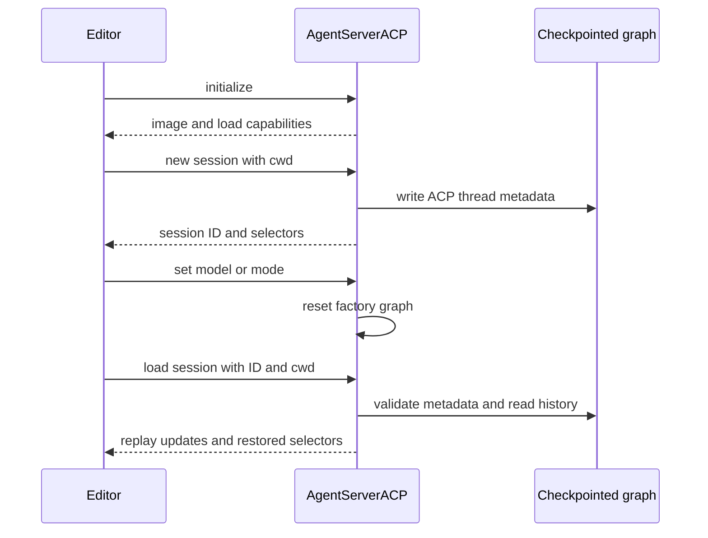
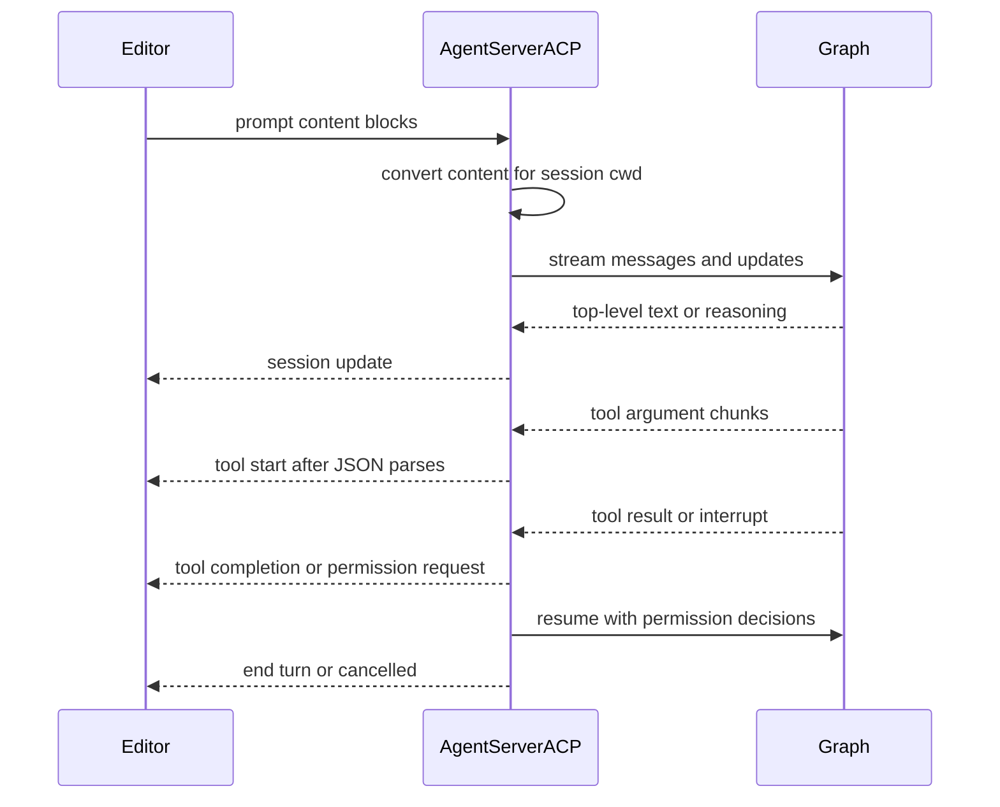

# Agent Client Protocol Integration

[Agent Client Protocol (ACP)](https://agentclientprotocol.com/overview/introduction) lets an ACP-capable editor run an agent process over **stdio**. This repository has two deliberately distinct layers:

- **`deepagents-acp`** supplies `AgentServerACP`, a reusable bridge from a LangGraph graph to ACP.
- **`dcode --acp`** starts that bridge around dcode's prebuilt coding-agent factory. It owns dcode tools, configured MCP tools, subagents, checkpointing, model choices, and approval policy.

`--acp` is not the normal dcode UI or remote-client path: it serves ACP over stdio rather than opening Textual. The ordinary remote client lazily builds a LangGraph `RemoteGraph`. For the surrounding agent design, see [Code Agent architecture](/openwiki/architecture/code-agent.md), [permissions and HITL](/openwiki/concepts/permissions-hitl.md), and [state persistence](/openwiki/concepts/state-persistence.md).

## Reusable ACP bridge

`AgentServerACP` accepts either a compiled `CompiledStateGraph` or a factory taking `AgentSessionContext(cwd, mode, model)`. Use a factory when the graph must be built for the editor-selected working directory or selector state. `modes` and `models` are factory-only; passing them with a compiled graph raises `ValueError`.

```python
import asyncio

from acp import run_agent
from deepagents import create_deep_agent
from langgraph.checkpoint.memory import MemorySaver

from deepagents_acp.server import AgentServerACP


async def main() -> None:
    agent = create_deep_agent(
        tools=[...],
        checkpointer=MemorySaver(),
    )
    server = AgentServerACP(agent)
    await run_agent(server)


asyncio.run(main())
```

The adapter accommodates ACP SDK schema evolution: with an SDK that exposes `SessionConfigOption`, selectors are wrapped; with ACP v0.9.0+ they are sent as bare select options. This is compatibility handling at the protocol edge, not a difference in graph behavior.

For the repository demo, work in `libs/acp`, run `uv sync --group examples`, add `ANTHROPIC_API_KEY` to `.env`, and configure the editor to launch the executable `run_demo_agent.sh`. `LANGSMITH_TRACING`, `LANGSMITH_API_KEY`, and `LANGSMITH_PROJECT` are optional tracing settings. The README demonstrates Zed, but the server is not Zed-specific.

### Session state and selectors

At `initialize`, the bridge advertises image input and advertises `session/load` only when `load_sessions=True`. `new_session` generates an ID, retains its `cwd` and supplied ACP MCP descriptors, initializes mode/model state, and—when loading is enabled—writes session metadata into the graph checkpoint. The LangGraph `thread_id` is that ACP session ID.

Mode and model options accept only strings and recognized values. A change resets the active graph; a factory then receives the resulting `cwd`, mode, and model. The implementation retains one active graph instance and recreates a factory graph when serving another session, whereas a supplied compiled graph is reused.



*The reusable bridge makes ACP identity and configuration durable through LangGraph metadata, while graph construction remains application-defined.*

## Prompt streaming, replay, and cancellation

For a prompt, the bridge converts text, inline images, resource links, and embedded resources to LangChain content. Resource-link paths are made relative to the session root, and embedded blobs become data URIs. Input audio raises `NotImplementedError`; normalized assistant image and audio blocks can be projected back to ACP.

The graph is streamed in `messages` and `updates` modes with subgraphs enabled. Only top-level assistant content and plaintext reasoning are visible—subagent content and reasoning stay internal. `todos` become plan updates. Content is emitted before tool activity from the same chunk; tool-call argument fragments accumulate until JSON parses, then a tool start is emitted and the later result completes it. An agent lacking a checkpointer receives `MemorySaver` for the active turn, but that does not make restart recovery durable.



*This is the reusable ACP projection flow; dcode supplies the graph and policy beneath it rather than replacing the projection protocol.*

`cancel` marks only the named session. The prompt loop checks that flag before streaming and on each stream item, returning `PromptResponse(stop_reason="cancelled")` when observed. When an interrupt update arrives, it exits the stream iterator before reading graph state so a persistent checkpointer cannot expose a stale pre-interrupt snapshot.

### Permission boundary

ACP can present fixed permission decisions, not arbitrary LangGraph `interrupt()` questions. A free-form interrupt is rejected; compatible graphs should produce the `action_requests`/review configuration shape used by `HumanInTheLoopMiddleware`.

For each action request, the bridge presents **Approve**, **Reject**, and **Always allow**, then resumes the graph with the selected decisions. A cancelled permission request is rejection. Rejected or cancelled `write_todos` clears the plan; rejection additionally tells the agent to request feedback and produce an improved plan. Updates to an approved, incomplete plan are automatically approved.

Always-allow is adapter memory scoped to one ACP session, not a persisted authorization grant. Non-shell tools are remembered by name. For `execute`, reapproval requires every extracted command signature to have been allowed and rejects commands containing dangerous shell constructs such as substitution, variable expansion, redirection, control characters, process substitution, or standalone backgrounding.

## Durable loading and MCP boundary

`load_sessions=True` only exposes the ACP operation. Restart recovery additionally needs a checkpointer that survives process restart; `MemorySaver` is appropriate for tests and ephemeral sessions, not durable recovery. The bridge stores an ACP marker, original cwd, and active mode/model selections in checkpoint metadata.

Loading requires a checkpointed thread bearing that ACP marker and the original cwd. Missing or unrelated threads return `resource_not_found`; a changed cwd is an invalid-parameters error. The bridge restores only still-supported saved selector values, rebuilds a factory graph if required, and replays user messages, visible assistant content/reasoning, tool starts, and tool results as `session/update` events before it returns. A session therefore cannot be loaded under another editor working directory.

The generic bridge retains the ACP MCP descriptors delivered during new/load session, but `AgentSessionContext` contains only `cwd`, `mode`, and `model`; descriptors are neither passed to the factory nor converted into tools. Applications wanting editor-provided MCP servers must explicitly implement that connection.

## dcode ACP mode

Install the prebuilt agent and ACP bridge together:

```sh
uv tool install -U deepagents-code --with deepagents-acp
```

For example, an editor can launch:

```json
{
  "agent_servers": {
    "Deep Agents Code": {
      "type": "custom",
      "command": "dcode",
      "args": ["--acp", "--model", "anthropic:claude-sonnet-4-5"]
    }
  }
}
```

Dcode detects `--acp` in raw argv to avoid Textual dependency checks, then lazily imports ACP dependencies. If `acp` or `deepagents-acp` is missing, it writes an install hint and exits nonzero. Model specifications use `provider:model-name`; provider credentials come from the environment.

Before serving, dcode resolves an initial model and model selectors, builds web tools, resolves its own configuration-driven MCP tools, loads subagents, and opens its checkpointer. Its factory creates a graph for each ACP session using the session cwd and selected model, and the dcode server enables session loading. This differs from generic ACP descriptors: dcode obtains MCP tools from explicit or normal configuration, project trust/context, and plugin MCP configurations, then cleans up its MCP manager on exit. Missing configuration or MCP tool-loading errors go to stderr and exit 1 before the server opens.

`--no-mcp` and `--mcp-config` are mutually exclusive. YOLO ACP use requires an acknowledgement previously recorded in the interactive TUI, and `--auto-classifier-model` requires Auto mode. The dcode factory passes `auto_approve=yolo` and `auto_mode_enabled=auto`; ACP renders permissions only if that independently selected policy still leaves a HITL interrupt.

In Auto mode, `deepagents_code.acp.AgentServerACP` wraps the graph: it writes trusted Auto approval state, annotates the final human prompt with classifier metadata, and streams using `CLIContextSchema` carrying Auto approval settings. It is a dcode-specific graph wrapper, not an alternative ACP transport or a way to represent free-form interrupts.

## Focused verification

`libs/acp/tests/test_agent.py` exercises streaming order and visible reasoning, multimodal conversion, per-session cancellation, HITL decisions and plan behavior, command allowlisting, delayed checkpoint interrupt handling, selector compatibility/restoration, durable replay including tool history, and cwd validation. The dcode smoke test launches the CLI with `--acp --no-mcp`, connects ACP pipes, initializes, opens a session, and checks that a session ID is returned. See the [testing guide](/openwiki/testing/testing-guide.md) for repository-wide test practice.
